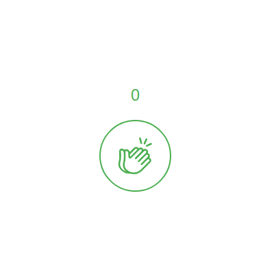

Clap Button was a SaaS that offered a Medium like clap button widget for blogs. The widget allowed readers to share their appreciation for a blog post by clicking on it to "clap" 1 to 50 times. The more a user liked the post, the more they would clap in response. The widget had several animations to make it feel more lively and enjoyable. Clapbutton.com was the admin panel to manage the widget.

## Features

- Animated widget that users could click to clap for a post
- Website that allowed users to track their claps on posts

## Why I Built It

I wanted to create a micro-SaaS that I could bring to market. I also wanted to practice making a lightweight MVP (minimum viable product) as quickly as possible. The product took 2 months to produce with some extra time spent learning how to deploy it using Docker.

## Tech Stack

The website itself was written in Vue.js, and the backend was an ASP.NET Core Web API. The widget was written in vanilla JavaScript and CSS.
