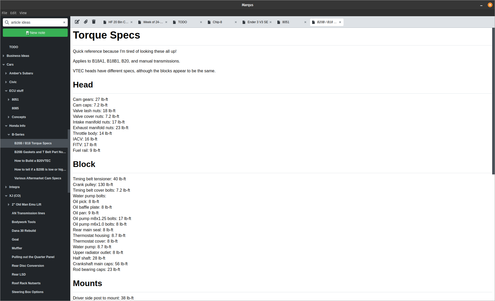

[Marqus](https://github.com/EddieAbbondanzio/marqus) is a desktop note taking app that allows users to organize and maintain their knowledge base. The app has support for custom keyboard shortcuts for power users and also keeps track of state so each time you open the app you can pick right up where you last left off.

## Features

- Infinitely nestable notes
- Full keyboard shortcut support
- Can have multiple note tabs active for easy switching back and forth

## Why I Built It

I wanted to scratch my own itch. I had been previously using Notable which is a pretty solid note taking app but I found it was struggling to keep up as I approached 1,000 notes and it was also difficult to bounce back and forth between notes since it didn't support tabs.

## Tech Stack

- Electron.js
- React
- TypeScript
- Monaco editor

It's an electron app that uses React and stores files locally in markdown / json. The text editor itself is powered by Monaco. 
