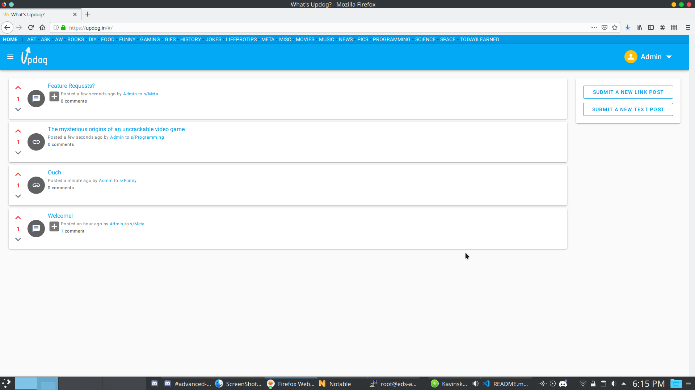

[Updog](https://github.com/EddieAbbondanzio/Updog.in) was a Reddit clone where users could share links, and create text posts. Users could submit comments to posts, or reply to other comments. A voting system was implemented to allow users to upvote or downvote posts they liked or disliked. Posts could be shared to any of the sub spaces that were topic specific. The home page of the site aggregated all posts into a list ordered by most recent.

## Features

- Users could create, edit, and delete posts
- Users could comment on posts, or reply to other comments
- Users could upvote / downvote posts they liked / disliked
- Sub-forums for niche topics

## Why I Built It

This project started as a fun challenge to see what it takes to create a Reddit clone. It took 3 months to accomplish, and I had to learn a few new technologies along the way. This project helped me learn about caching in the front end, and recursive database queries (nested comments are difficult).

## Tech Stack

The frontend was written in Vue.js and used Vuex for state management. The backend was written in ASP.NET Core, and used a PostgreSQL database for persistance. Dapper was used as an ORM. Everything was deployed to a Linux server running Ubuntu 18.04.
