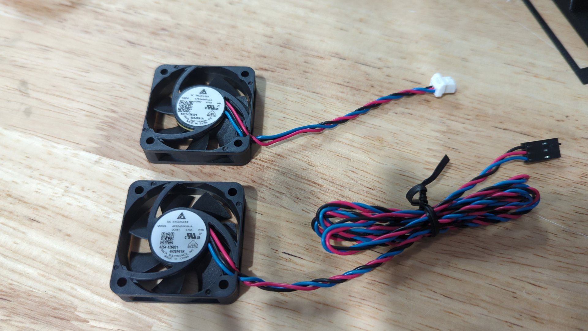

The Prusa MK3.5S is a great printer but it's definitely picky about it's fans. I figured I'd write up some of the tricks I learned while tuning mine.

# Hotend Fan

If the hotend fan is failing calibration it's very likely the fan is either worn out, or incorrect. The [Prusa MK3S hotend fan](https://www.prusa3d.com/product/hotend-fan-mk3-s/) fits and is the correct model to purchase but because of how Prusa used two different manufacturers for it (Noctua and Delta) it's possible you'll get an incompatible fan.

Noctua fan on left, Delta on right.

The Noctua fan is quieter but it's not as strong as the Delta so it'll fail calibration on your MK3.5S.

I'm not sure which of the two fans is the newer revision but I've ordered 3 fans and all 3 were Noctuas so I think the Delta fan is the older unit and may have been phased out.

The good news is that you can order a [Prusa MINI fan](https://www.prusa3d.com/product/hotend-fan-mini/) and it's a perfect replacement. It's made by Delta and has the correct length cord / connector.

If your in a pinch you could also use a Prusa XL hotend fan but you'll need to solder on a longer cord. (XL fan on top, MINI on bottom)

With the new fan installed your printer should pass the fan test without issue.

# Parts Fan

If your parts fan is failing try running the test with it removed from the fan shroud to see if that helps. There's something about the shroud (it may be slightly restrictive) that causes the test to fail even for new fans.

When ordering replacements only use [OEM Prusa MK3S fans](https://www.prusa3d.com/product/print-fan-mk3-s-mini/). I tried a couple aftermarket options and none could pass the test.
