The exhaust on my new to me 88 Integra was beyond saving with several holes in the resonator and the muffler having turned questionably brittle. As this is suppose to be a summer daily driver that's pleasant to drive I decided to splurge and build a stainless exhaust setup to save my ears and retain my sanity.

So much room for activities in the rear.

Since this would be the first stainless exhaust I've ever built, it took me a few hours of research to figure things out. My welder is a trusty little Lincoln Power Mig 140c and up until now I've only ever used it to weld mild steel with L56 wire.

I totally could have welded everything up with the L56 wire but I didn't want the new welds to rust so I opted to switch to a stainless wire (309L) and tri-mix gas.

I'd be lying if I said I wasn't embarrassed with how the welds came out but we all start somewhere.

Before I could even weld up the exhaust though, I needed something to cut the pipe with. I've been wanting a band saw for sometime now but didn't want to get an overly large one. So I opted to go the DIY route.

Built from random scrap metal I had laying around. I used the portaband to cut all of this.

Straight enough for everything I'll be building.

Making the cutting table took some serious time. I made it using just an angle grinder, drill, and file.

Table is easy to remove so I can swap blades on the fly.

Done.

## Materials Used

There isn't many off the shelf options for the first gen Integra so I decided to go the custom route. To make life a little easier I tried to find a setup that was moderately similar that could be made to fit with a few well placed cuts. In the end I settled on using a 88-91 EF Civic catback exhaust and some various exhaust parts off Ebay / Summit.

### Parts

- Yonaka 1988 - 1991 Honda Civic Hatchback Catback Exhaust\*\*
- 2 1/4" 304 Stainless Exhaust Kit (Summit SUM-670245)
- 18" 304 Resonator (Summit SUM-630441)
- (5) 8" 3/8" 304 Stainless hangers (Random Ebay seller)
- (5) Round Rubber Insulators (Walker WLK-35119)
- Random 8" 2 1/4" chrome tip off Ebay

\*\*Yonaka was selling the catback as an open box unit that was missing the resonator pipe which was perfect since I didn't need it and also helped reduce the price.

Not really sure where to start I opted to begin in the middle.
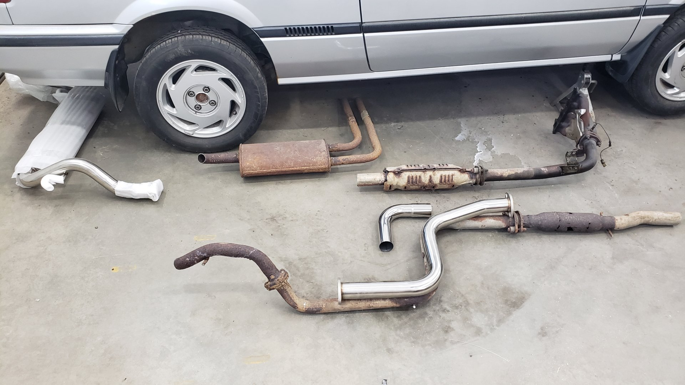

All of the various parts. This ended up being way to many bends for what I needed. I plan on using the leftovers to build another exhaust for my other vehicle.
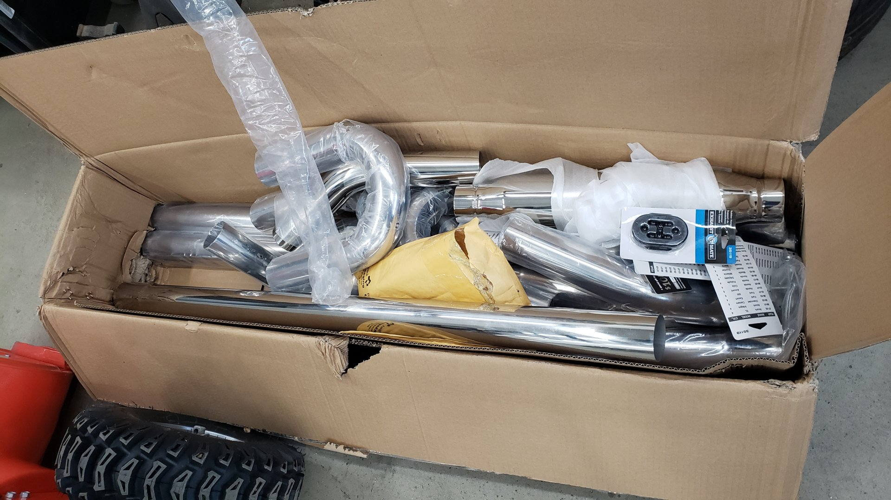

Maybe if I just make a bunch of random cuts it'll look like I know what I'm doing.

Felt a little bad cutting the tip off the yonaka exhaust but it interfered with the bumper and was way too big.
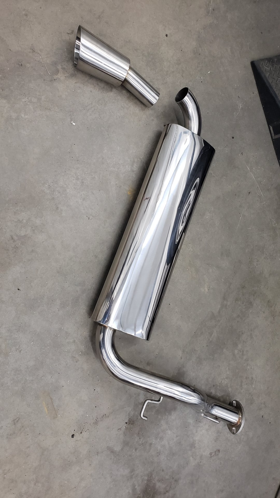

Now were getting somewhere.

The OEM pipe looks larger because it's dual wall.
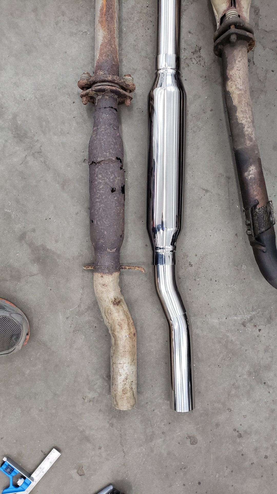

First hanger welded on.

Mocked up in position and 2 more hangers welded on.
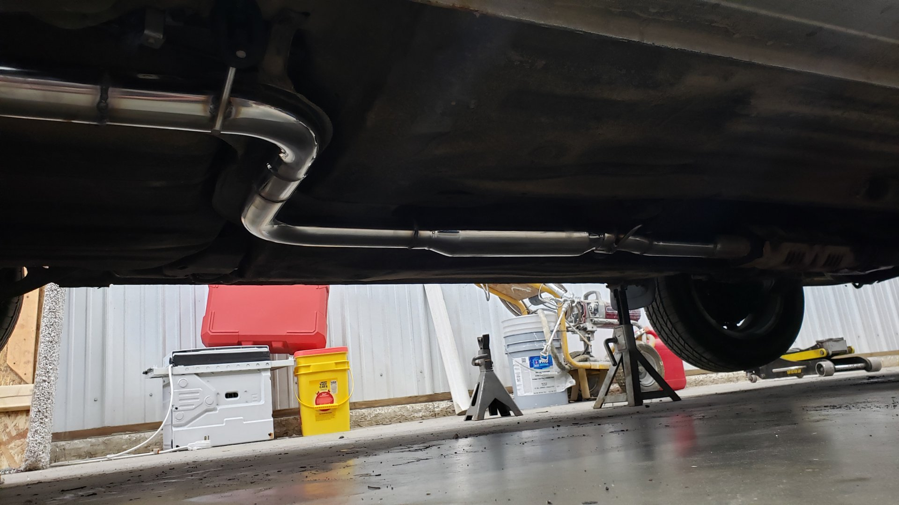

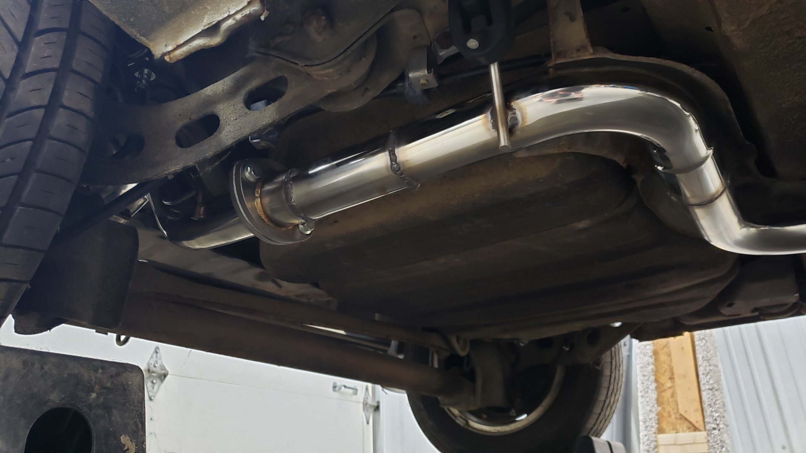

Some of the welds are embarrassingly bad.
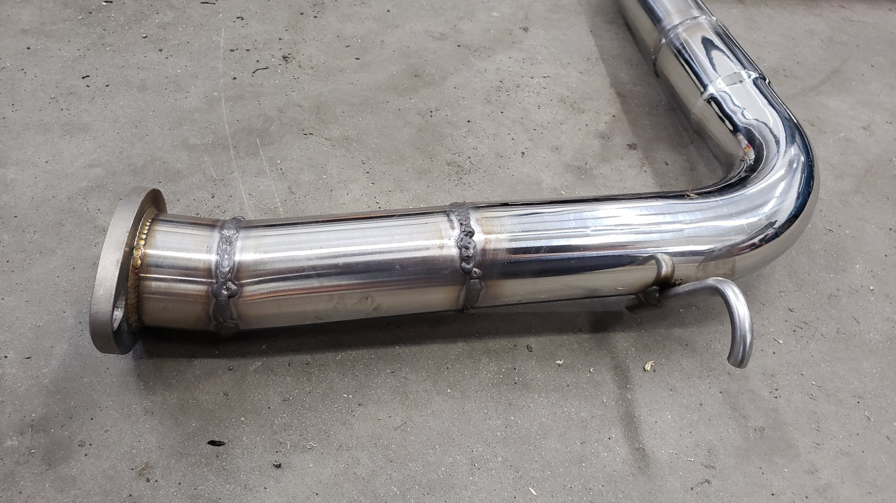

But it's just a daily driver and not a show car so I can live with them.
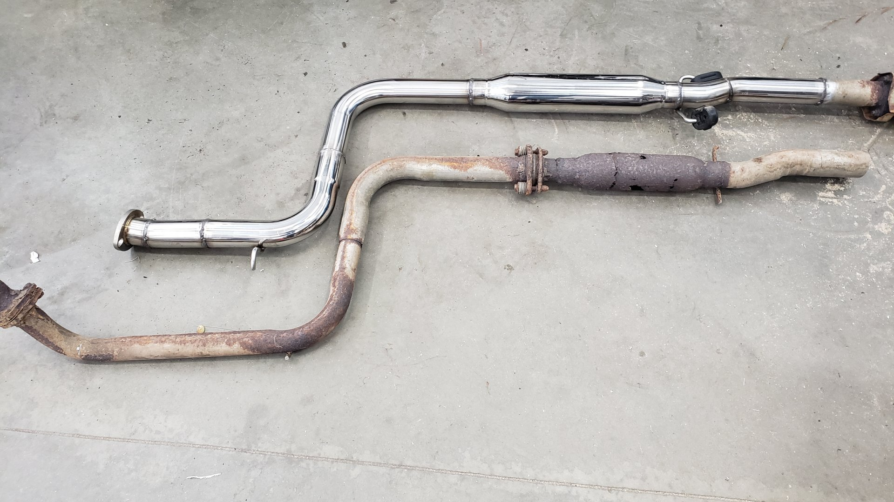

Old setup vs new setup.
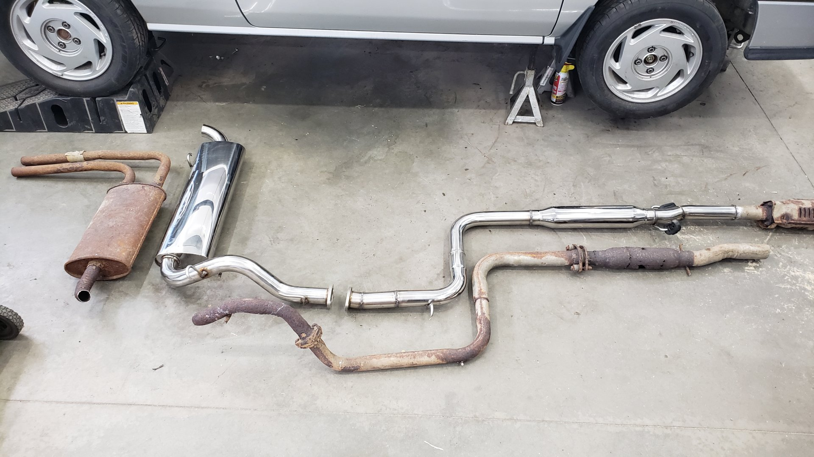

Took a few cuts to get the EF muffler to fit.

Not too bad at all.

My work setup. If I could do things over I'd get more jackstands or some kind of lift.

Engine bay looking fresh. Even still has the OG heatshield on the exhaust manifold.
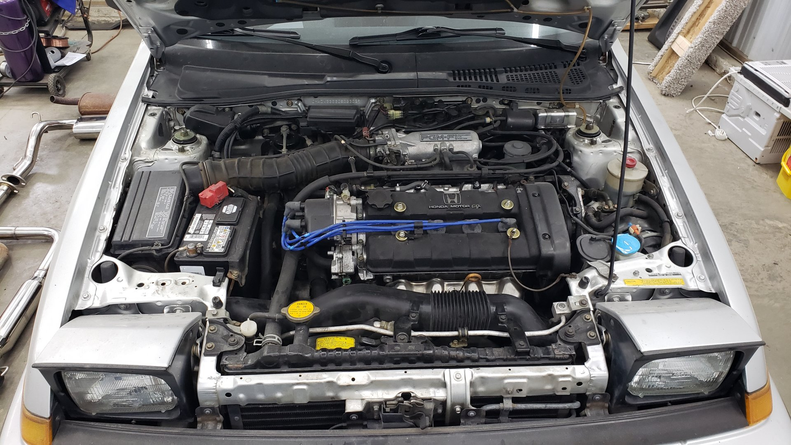
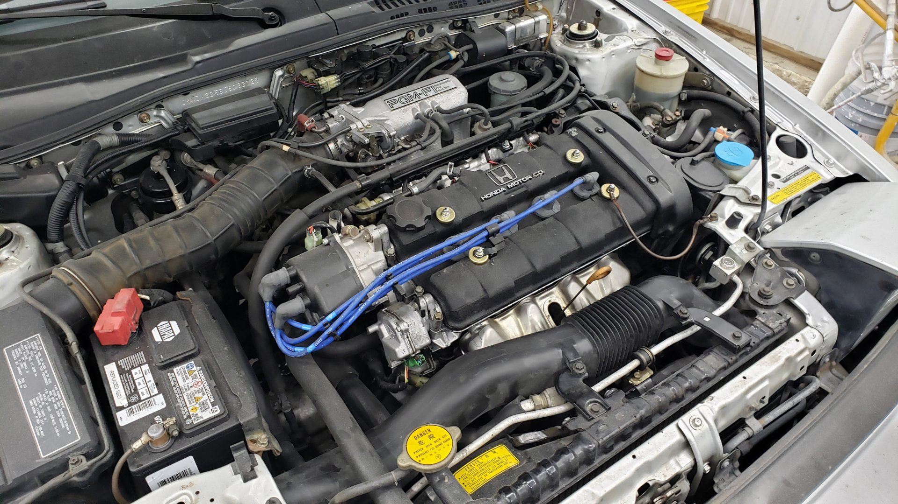

[Next post]()
