Last year I ran the Integra in almost 20 events and had a great time. Plus with all the seat time I feel like I've gained a bunch of valuable experience and really improved as a driver.

While I've still got a lot more to learn and practice, I feel the Integra is ready to graduate from H street and move on up to STS as it won 1st place in H Street for the local club I race with last season, and has begun to raw time some of the Miatas in STS.

Everyone loves seeing the Integra on the course because of how much body roll it has.
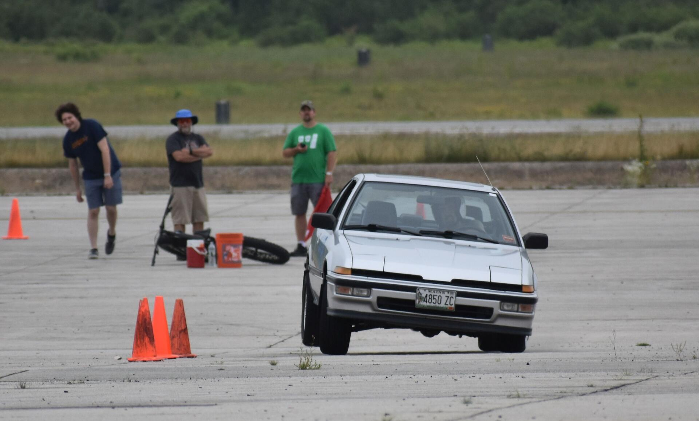
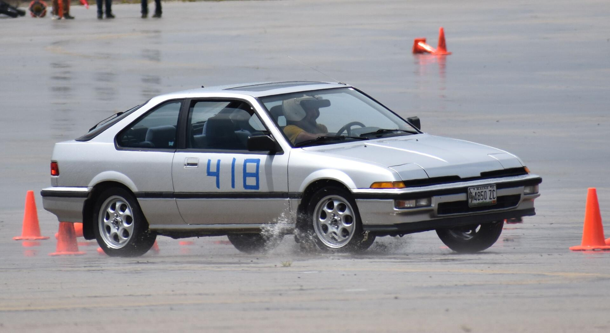

It almost always has at least one rear wheel up in the air and I've been told while weaving through slaloms it's constantly switching which wheel is airborne.
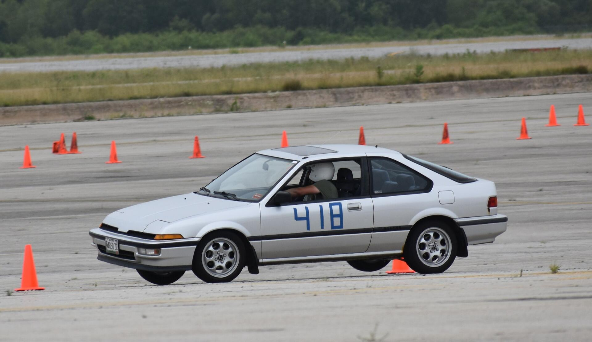

# The Current State and Future Plans

Moving up to STS opens up a few more mods I can make on the car such as an intake, exhaust header, aftermarket springs and more. Since I like making changes one at a time so I can get an idea of the impact each change made I decided to start off by modifying the suspension and later on I'll explore wider rims / tires followed by whatever extra performance I can squeeze out of the motor.

There isn't much aftermarket support still out there for the 1st gens so my options are fairly limited unless I go custom but I figure getting stiffer front torsion bars, and rear coils would be a good first start.

Before beginning on the mods I felt it'd be good to double checked everything and make a to do list of all the outstanding issues on the Integra that I still need to address.

## Too much Rust

The biggest issue I need to deal with is the rust. The Integra is in great shape for it's age since it sat in a garage for 10 years, but it still has the typical rust creeping out from the edge of the rear wheel wells. The passenger side isn't terrible, but the driver side is pretty bad.
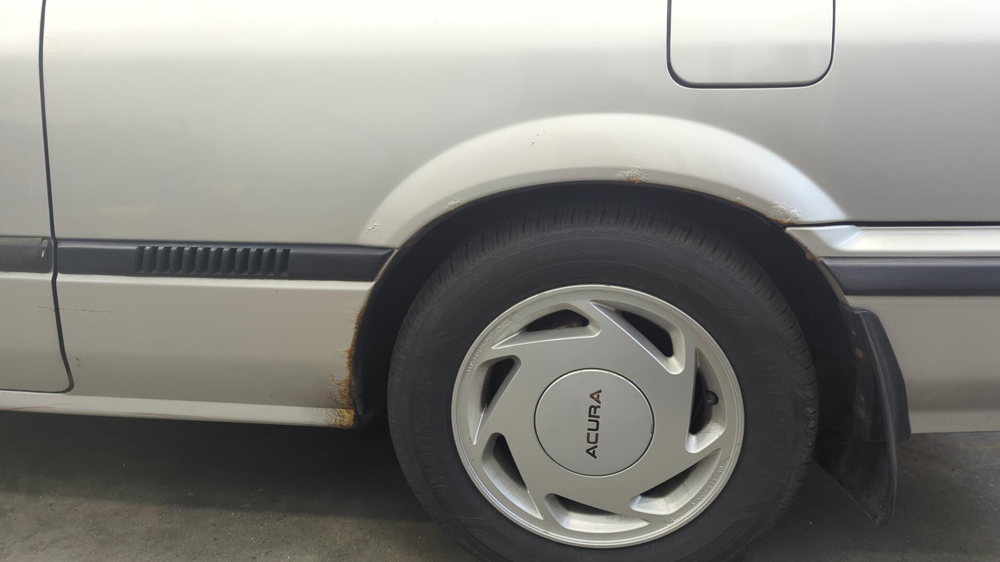

I haven't decided exactly when I'll tackle the rust but I really would like to start on it this year.
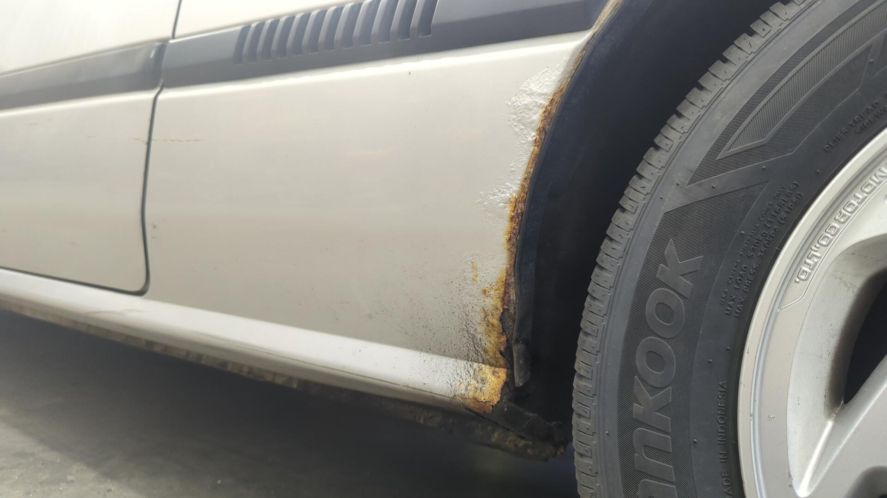

There's a small hole below the driver taillight now.

The rear panel has two rust spots as well but those should be super easy to fix.

## The Rubber Foot Rest Fell Off

I don't believe I've ever seen this happen before but the little rubber mat that is attached to the carpet below the pedals came off.
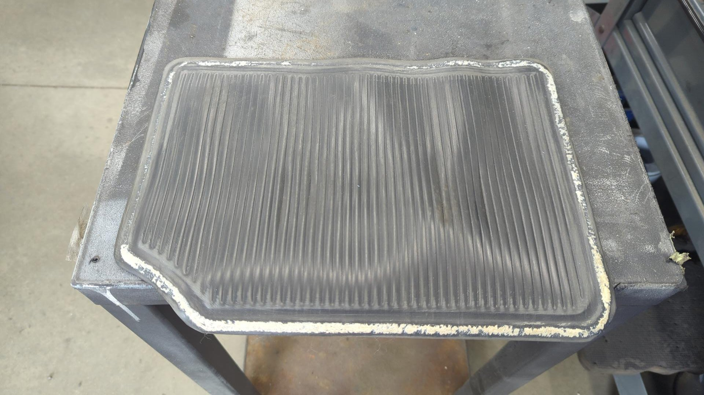

This was a pretty easy fix as I already had some Weldwood contact cement laying around from when I did my Jeep's headliner so I decided to quickly take care of it.

I sprayed both pieces, let them tack up for a bit, then plopped the mat back down.

Good as new.

## The Other Issues

The Integra has some other issues that I need to address but aren't easy to photograph. The worst of which are all the oil leaks.

The power steering rack is leaking on both ends, the PS pump is leaking and has a noisy bearing, the transmission is leaking from both axle seals, and shifter rod, and the engine is leaking at the cam seals, the TDC sensor, and potentially the rear main seal as well.

I likely won't be able to address all the leaks this year but I do plan on rebuilding the PS rack very soon and also fixing some of the transmission leaks as those are the two worst areas right now.

The Integra also has a lingering hard start when warm issue that I haven't been able to nail down yet.

# Planning out the new Suspension

My main goals for the new suspension setup is to reduce how much body roll the Integra has, and also introduce some camber to help with turning and keep the tires lasting a little longer.

Like I mentioned above there isn't strong aftermarket support for the 1st gen Integra, but [Tein does offer torsion bars and rear coilovers](https://www.heeltoeauto.com/suspension-combo-package/medieval-pro-v2-suspension-combo-1984-87-honda-civic-coilovers-torsion-bars-panhard-bar-med.sp-as1.html) for these cars that'll work if you swap out the front torsion tubes with 1st gen CRX ones.

Since I want to keep this car fairly reasonable on the street I opted to go with 27mm front torsion bars and 6k springs in the rear. The 27mm torsion bars work out to about 5.5k so this leaves the car with a moderately balanced setup with some rear bias that should hopefully help induce some oversteer.

I also picked up a set of [camber plates from Cheddas Auto](https://www.cheddasauto.com/product-page/civic-crx-integra-camber-plates-1). I believe these should let me get about 2\* of camber in the front. (I still haven't decided what I want for rear camber yet)

## Starting With the Front Suspension

Lowering the front sounded a lot harder than the rear so I figured I should start there.

The first step was getting the car up on jack stands.

One last look at stock height.

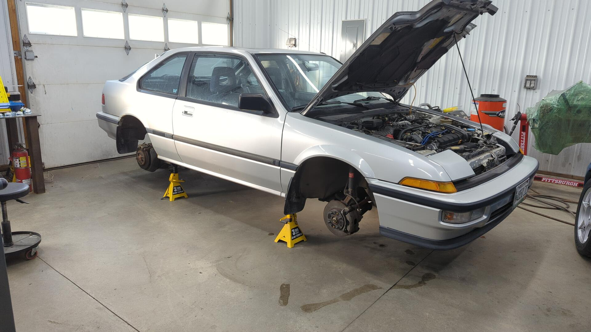

Swapping the front struts and installing the camber plates was pretty easy.
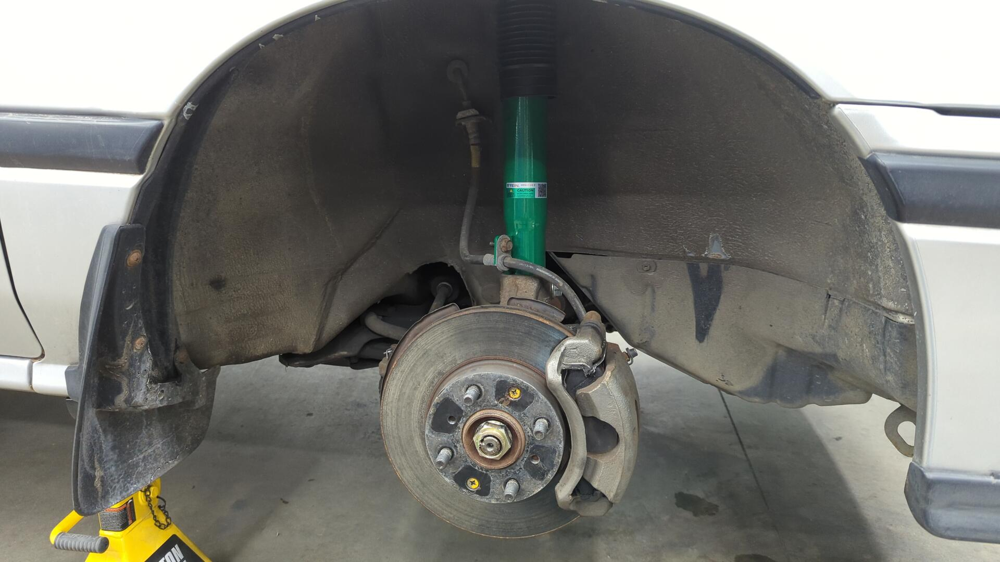

I've got the camber plates maxed out. These actually allow for adjusting caster too but I left that untouched for now.

The torsion bars is where things started to get a little complicated. I've never actually worked with torsion bars before so this was a learning experience for me.
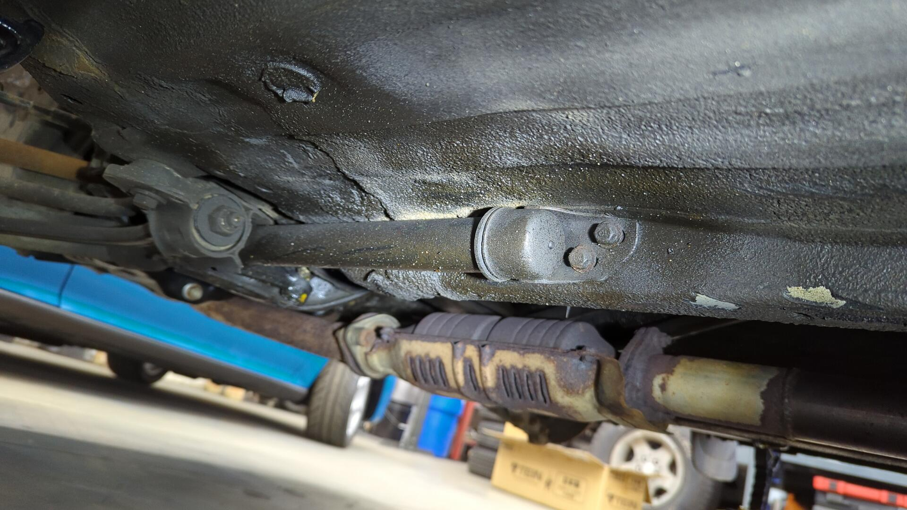

The first step to remove the torsion bars is to remove the rear cap, and remove the snap ring holding the torsion bar in place.
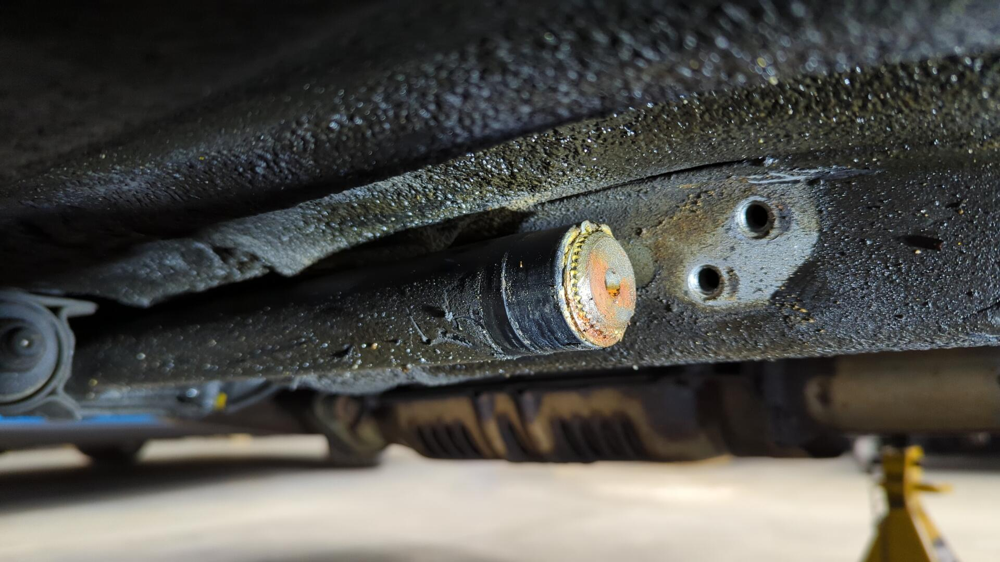

Then you need to pop the rubber cover off the front of the torsion bar and tap the bar forward to expose the c clip on the front side that needs to be removed.

I used a small piece of wood in front of my hammer to prevent the end of the torsion bar from getting damaged while tapping it forward with my hammer.
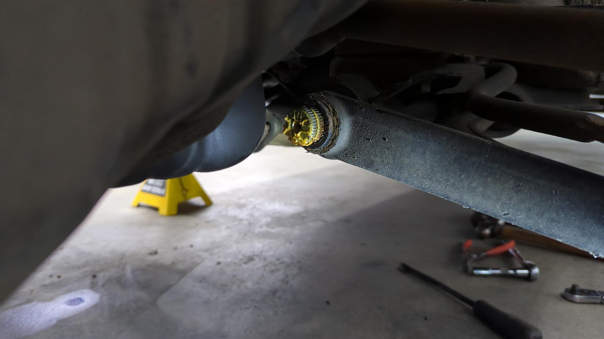

Once the front clip is removed all you need to do is tap the torsion bar out the back. You need to make sure there's no tension on the torsion bar when doing this and most likely will need to remove the strut to do so. (I didn't realize this when I installed my front struts earlier on)
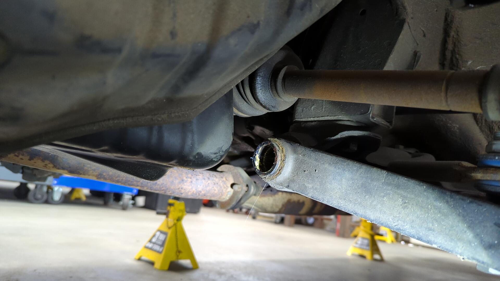

From there the bar should pop right out the back and can be safely removed.

With the torsion bar removed the next step was to remove the Integra torsion tube so I could swap it with a shorter CRX torsion tube. Sourcing the 1st gen CRX torsion tubes is pretty difficult, but required since all the aftermarket torsion bars are shorter since they're meant for CRXs.

Top is the OG Integra tube, and bottom is a CRX torsion tube I sandblasted and painted.

Comparison of the OG torsion bar (top) vs the new aftermarket bar (bottom)

[The OEM bar is 21mm thick and works out to a spring rate of about 2k.](https://www.heeltoeauto.com/pitboard/tech-whats-the-spring-rate-of-my-torsion-bars-torsionbarhondas-content-inside/)
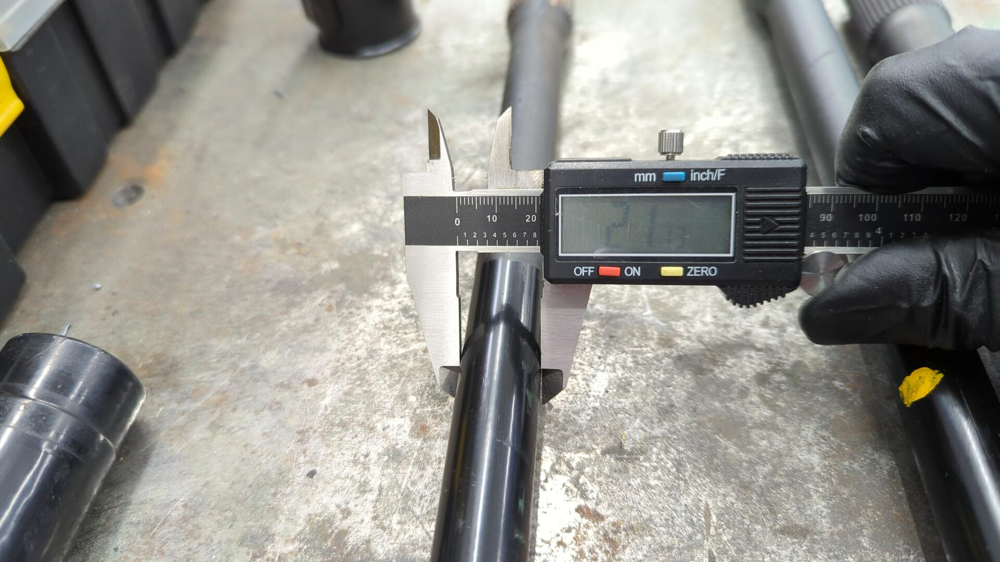

I had to swap cut off the tube seals from the Integra tubes to reuse them on the CRX tubes since they were missing.

I used 3m weatherstripping adhesive to secure them. This is some pretty strong stuff and should be considered permanent if used.
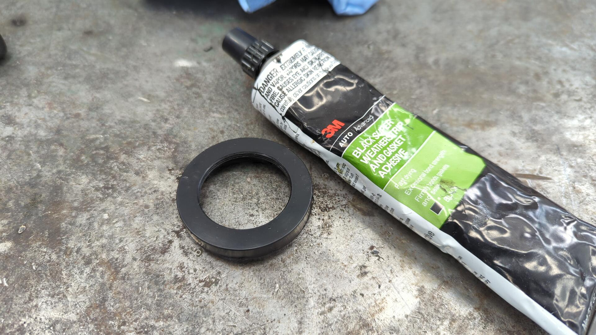

With the torsion tubes ready to go I marked the index on them so I could find it when working underneath the car and popped them back into place.

The nut that holds the tube in place also acts a height adjuster so I set them with about 5/16" thread sticking out to allow for fine tuning if needed.

Then I did a test fit of the torsion bar so I could mark which tooth on the bar I needed to cut since these don't come indexed.
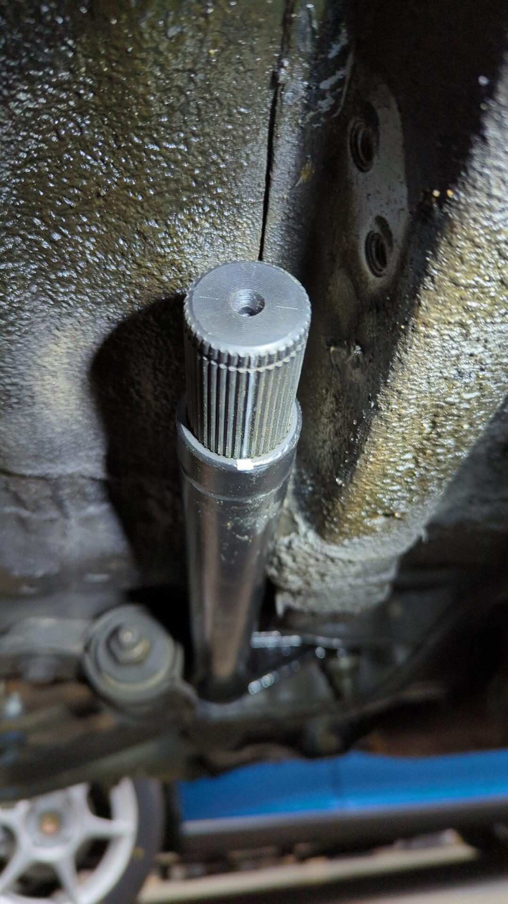

You'll need to this for both ends but I forgot to snap a picture of the other end. [I followed HeelToe's video for instructions.](https://www.youtube.com/watch?v=qlKpQWRVlPg)

Once the bar was fully indexed both ends were given a copious amount of grease and the bar was installed.
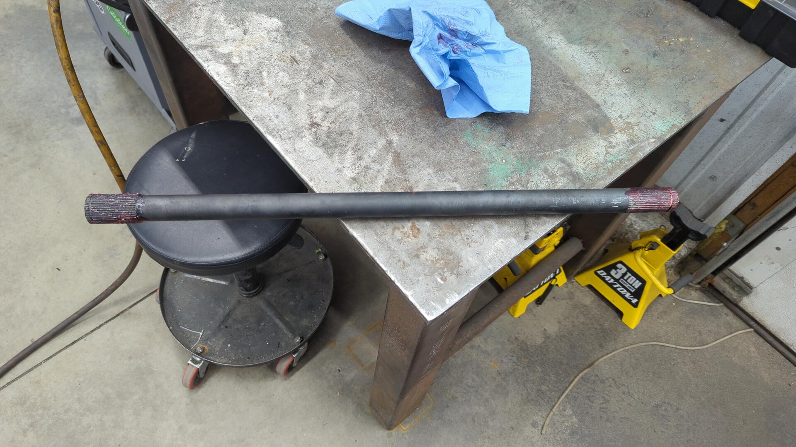

It can be a little tricky to get the bar to slip into position at first. I found lighter taps with the hammer worked better than harder ones.

### Custom Torsion Bar Caps

While the 1st gen CRX torsion tubes bolt right up on the Integra they don't work with the Integra torsion tube caps due to being significantly shorter. In order to work around this you can use the Integra tube ends and drill new mounting holes into the car, or extend the caps to work with the existing mounting holes.

I opted to try and extend the caps so I wouldn't need to drill any new holes into the car. (plus this keeps me STS legal since the suspension mounting points haven't changed)

I bent up some 16 gauge steel I had on hand to make the extensions.
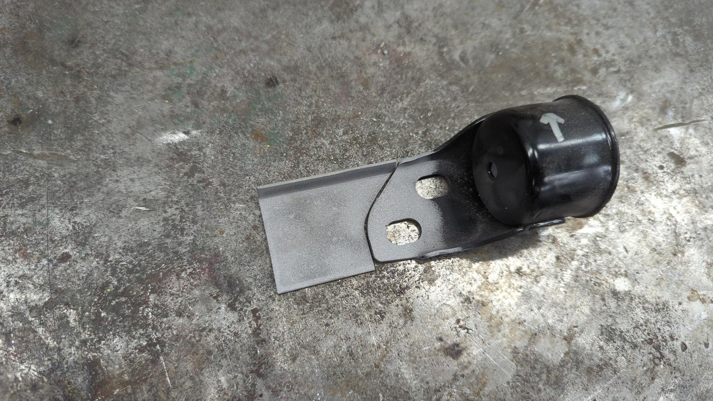

Welded up.
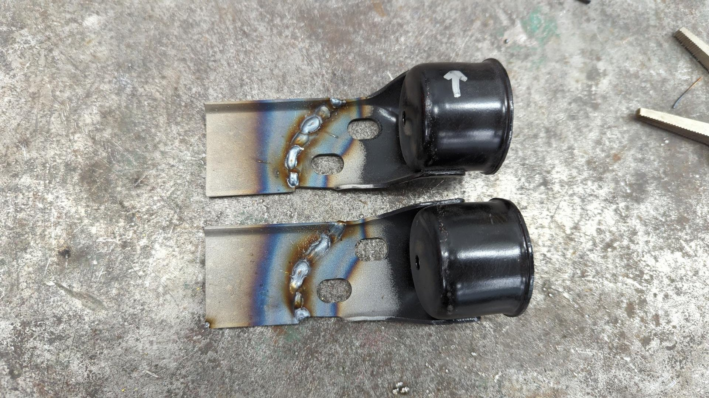

Some grinding and paint later and they looked pretty decent.

Success!

Front suspension all done.
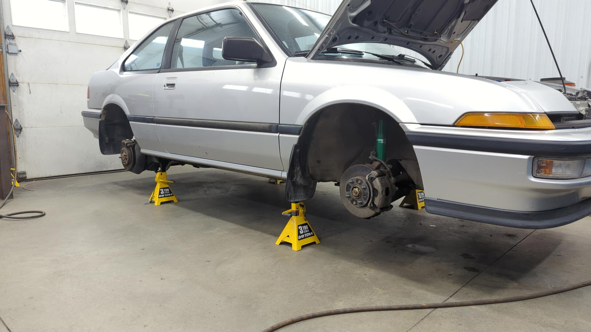

## Moving on to the Rear Coils and Panhard Bar

With the front good to go I was ready to move on to the rear. The rear suspension of the 1st gen Integra is closer to that of the golden era Hondas since it uses coil springs but it does have a solid axle in the rear instead of independent suspension so it requires an adjustable panhard bar to keep the axle centered.

OG suspension removed.
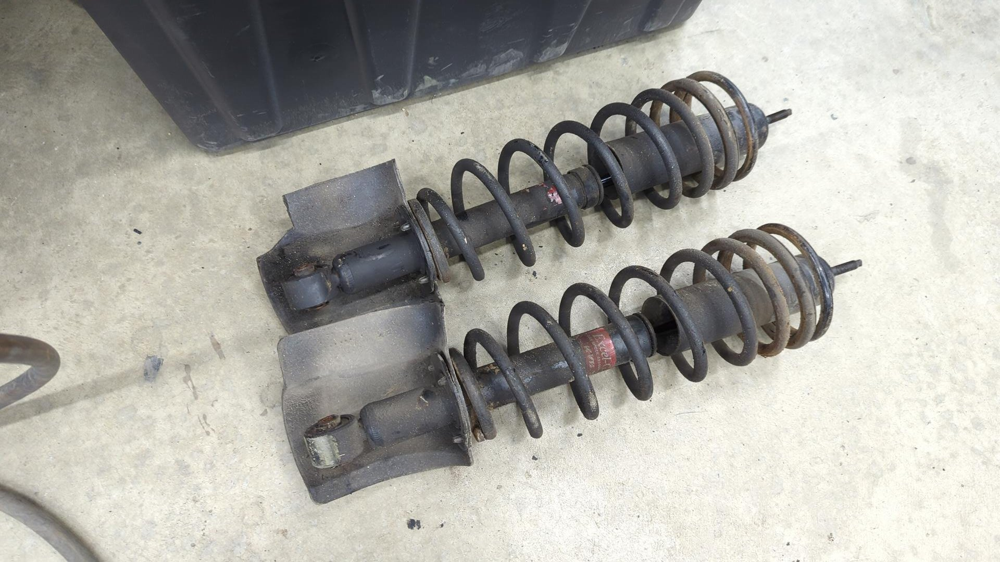

Prior to install I adjusted the panhard bar to be close to the OEM length so I could fine tune it once installed.
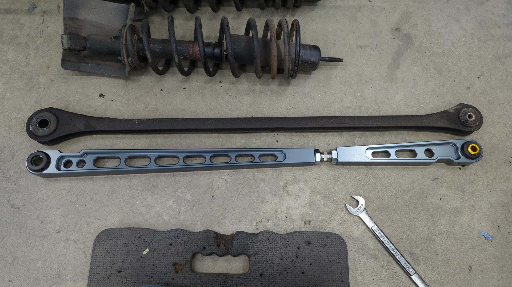

Something that was pretty unexpected was the new panhard bar wanted a larger bolt than the OEM bar on the chassis side. The OEM bolt is m8 but the new panhard bar wanted an m10 bolt so I ended up having to grind the welded nut off the body and drilling out the hole to fit the larger bolt.
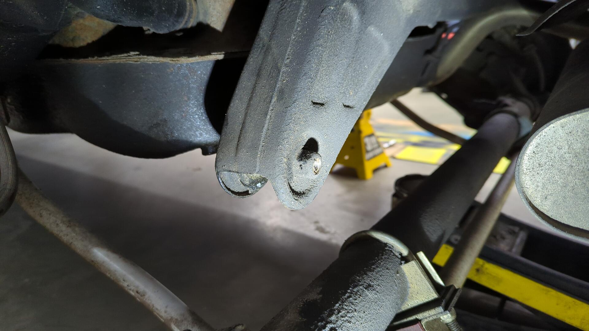

New bolt / panhard bar installed.

New rear coilovers installed as well.
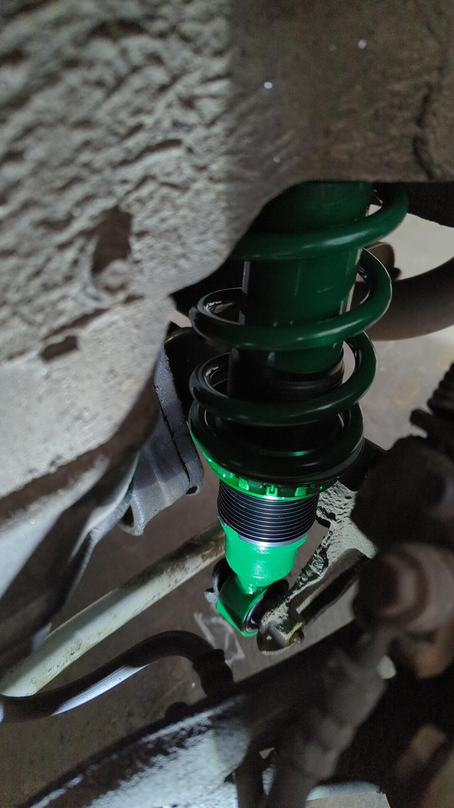
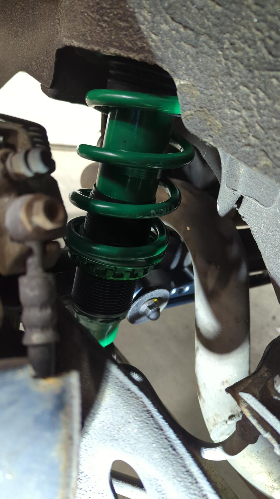

It's hard to get a good photo of the rear setup since the axle sits fairly tucked up in the car now but it looks pretty cool.
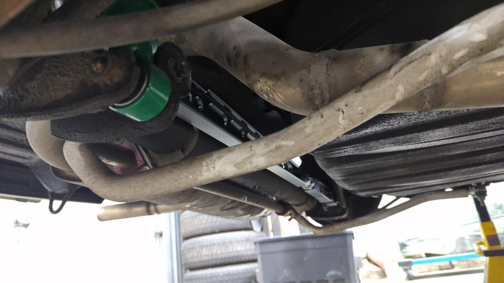

# Success

All in all I'm super happy with how the Integra came out.

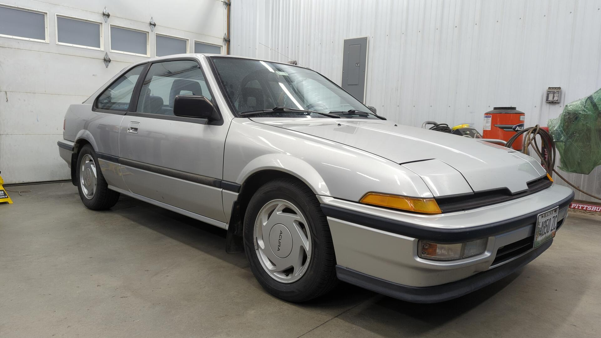

The new setup lowered the car about 2" all around and I really like how it still looks stockish.

The suspension is definitely stiffer but at the same time it's not over the top so it's still pleasant to drive on the road.

I won't be able to really test things out until it's ready for an Auto X event but I'm pretty optimistic it'll be an improvement.

# Looking Ahead

In terms of next steps, there's still a lot of maintenance needed to be done on the Integra. I suspect the next big project I'll be tackling on the Integra is rebuilding the PS rack with new seals and after that I may go after the other oil leaks or start some rust repair.

[Next post]()
