At the last auto-x event I ran in, I managed to get the Integra up on two wheels not once, but twice. While kinda fun, I don't wanna risk rolling the car and I figured it was time to take advantage of the last mod H Street permits and add a rear sway bar to try to dial down the absurd levels of body roll.

Action shot of it on 3 wheels
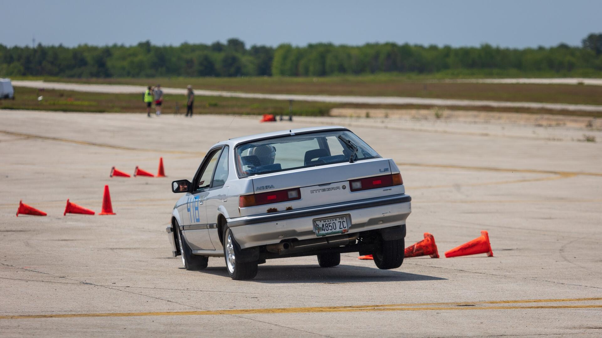
Photo taken by Kevin Nguyen.

Sourcing a rear sway bar ended up being harder than anticipated. 1st gen Integras have next to no aftermarket support and the best option tends to be sourcing performance parts for 1st gen CRXs or 3rd gen Civics. During my research I found that the only company still producing sway bars for the 1st gen Integra is ST Suspension.

I was a little hesitant to order from them though because I couldn't find any exact product photos and no one had ever posted up photos of one installed.

Trying to find some other options I ended up trawling through Ebay and stumbled across a new old stock listing for a set of front and rear sway bars made by Quickor for a 1st gen CRX from 1984. From what I understand the 1st gen Integra and CRX share a lot of the suspension so I figured it'd most likely fit and decided to buy it.

The rear sway bar is thicker than the ST Suspension unit as well as it measures in at a whopping 25mm.

The sway bar mounts to the rear trailing arms via a small custom bracket that comes with the kit. I had to remove the rear trailing arm bolts to add the bracket and I was incredibly impressed with how easy it was to remove the bolts since they likely hadn't been touched since the car was manufactured. I ended up adding a little anti-seize to them during re-install because I like to play it safe.
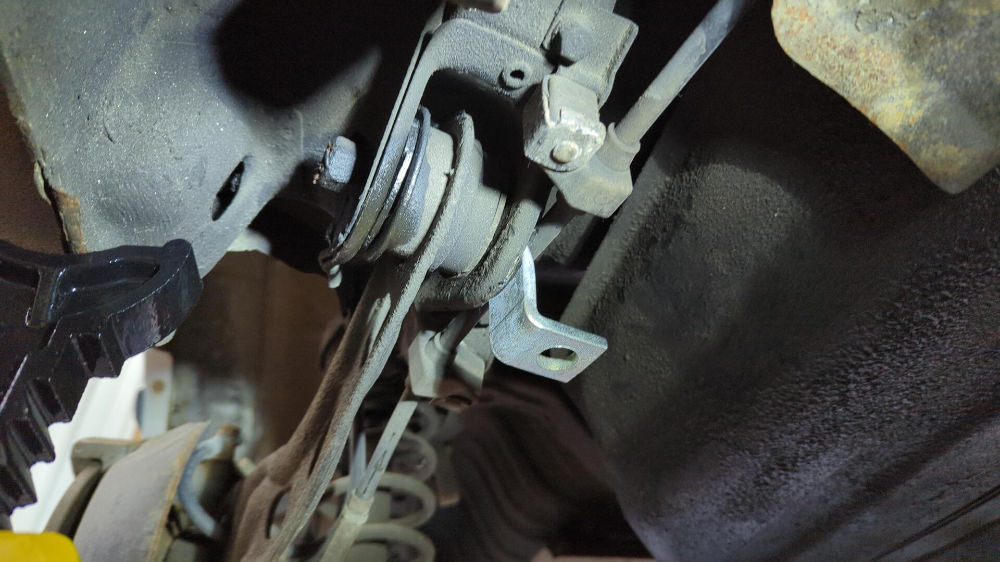

# Not Quite Bolt-On

After getting the mounting brackets into position and bolting up the sway bar to the rear axle I quickly found out this wouldn't be as easy of an install as a I imagined.

It turns out the bar was about ~3" too long.
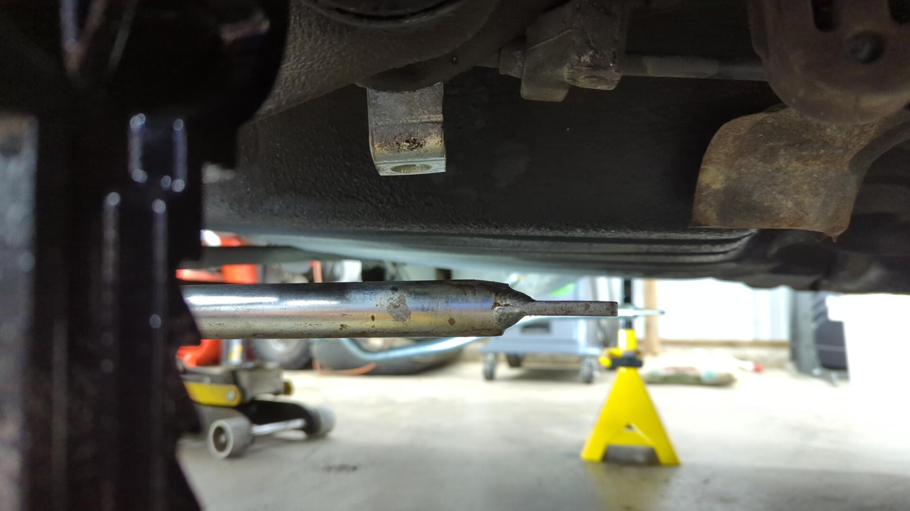

(I purposely angled the sway bar mounts towards the rear of the car to try to help improve the ground clearance.)

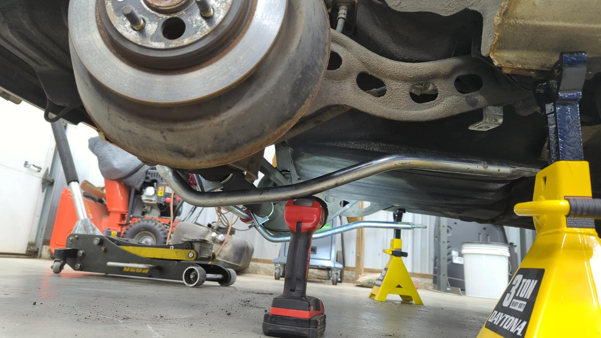

I decided to take a gamble and chop up the sway bar a bit.

Salvaging the tabs for re-use.

I also switched out the sway bar links that came with the kit and used my spare set of front sway bar links I had laying around. The ones that came with the kit looked too small and I was worried about snapping them.

Test fit to figure out where to weld the tab.

# Welded Up

I ran my welder extra hot to make sure I had sufficient penetration.
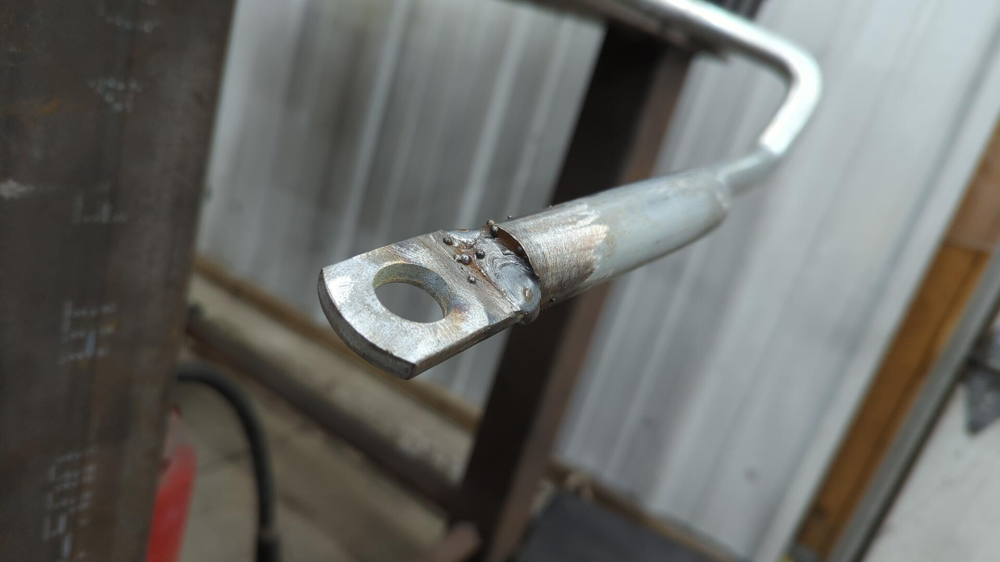

I wish my bench was a bit longer. It was hard to keep the bar from wanting to slide off it.
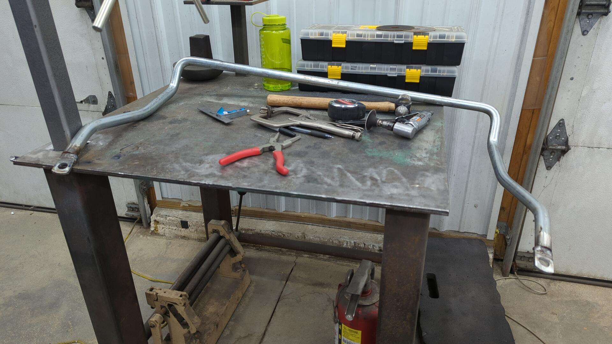

# One Last Test Fit Before Paint

The new length of each arm is just about perfect.

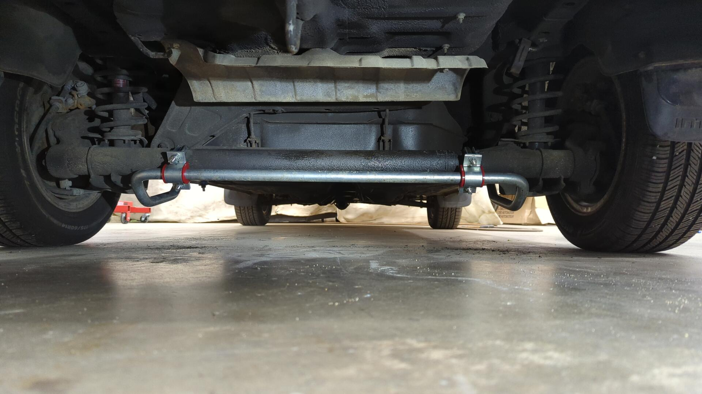

# Final Install

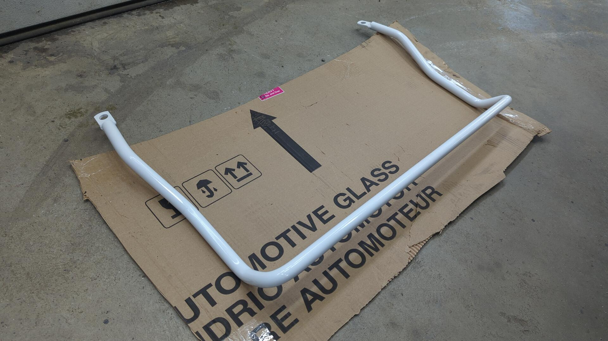

I upgraded the sway bar links to thicker bolts (m10x1.5x90) as that's the same thickness I run in the front.

# Revising the Exhaust

The exhaust was directly in the way of where the sway bar would mount on the passenger side so I had to temporarily remove it.

My exhaust is custom so I'm not sure if this was just a one off thing since I may have unknowingly routed it differently or if this would be an issue for the stock setup too.

The problematic section of pipe I had to remove (the small section below the muffler):
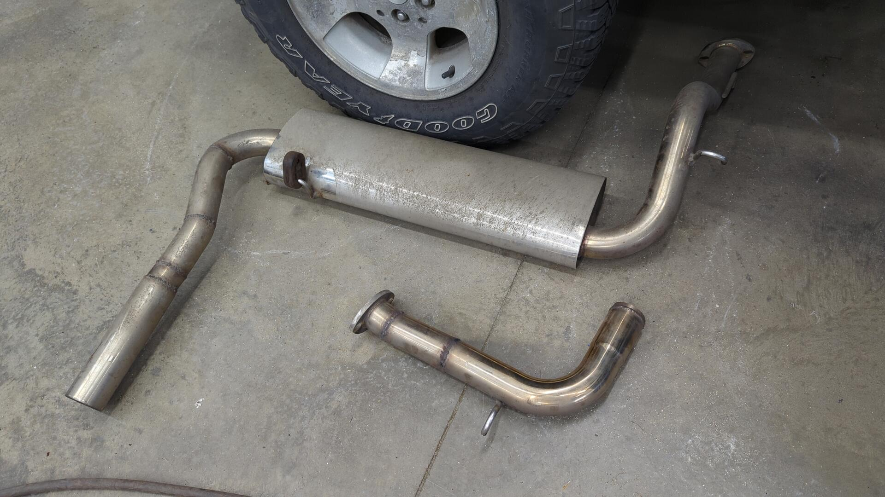

Slightly new setup all done. It sits closer to the gas tank to leave enough space for the sway bar.
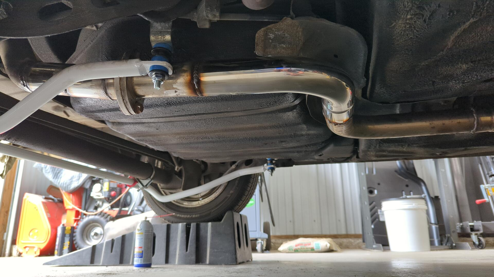

But it's still a super tight fit.
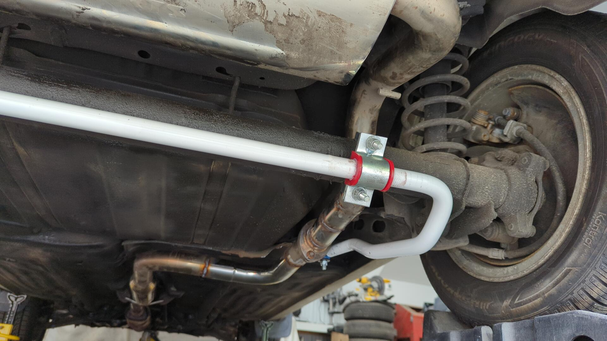

I may switch to a v-band flange and try to find a better position for it.
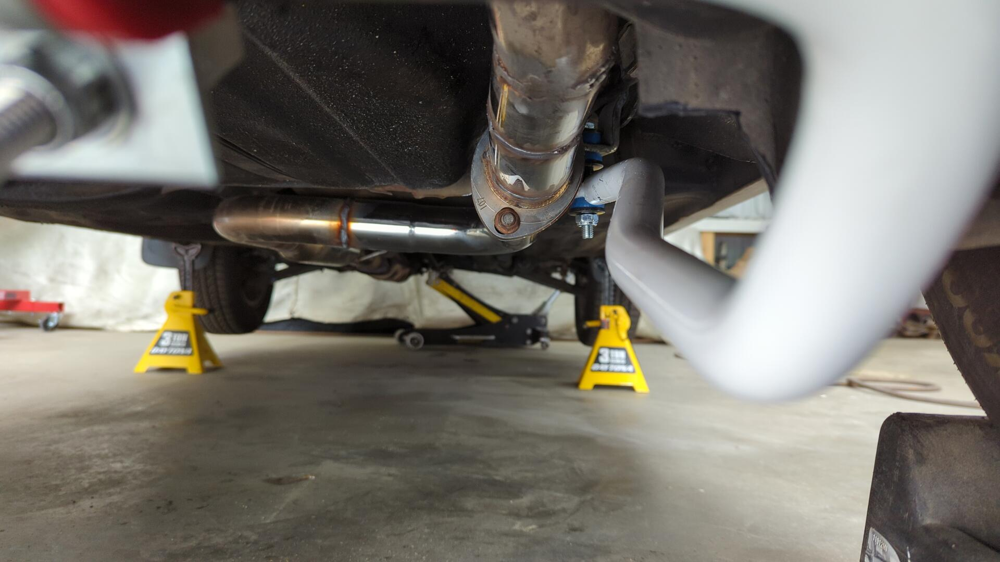

That's it for now.

# My Thoughts

All in all I'm excited to see how the car handles with the new bar. I wished the install would have been a little easier as it ended up being a bigger project than I hoped for, but it should be worth it.

And of course I installed the sticker it came with.

