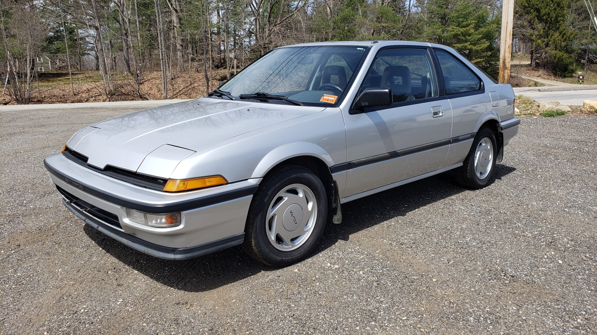
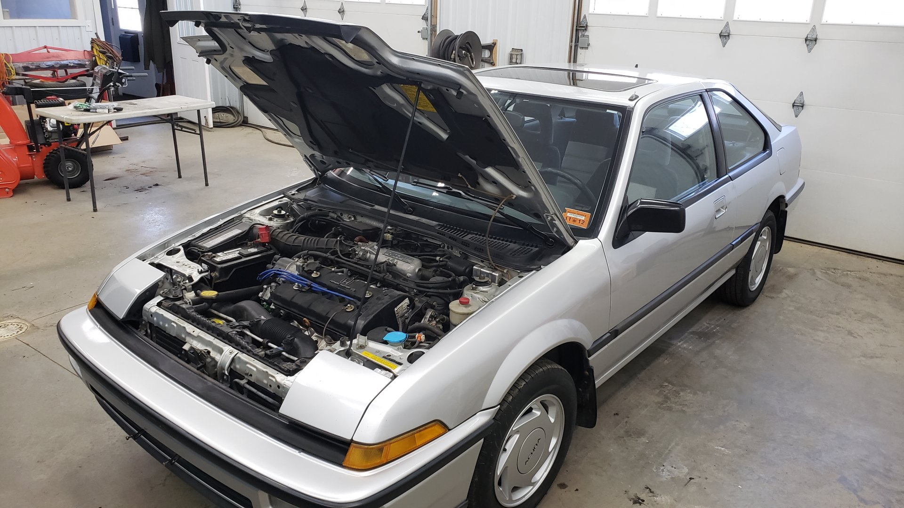
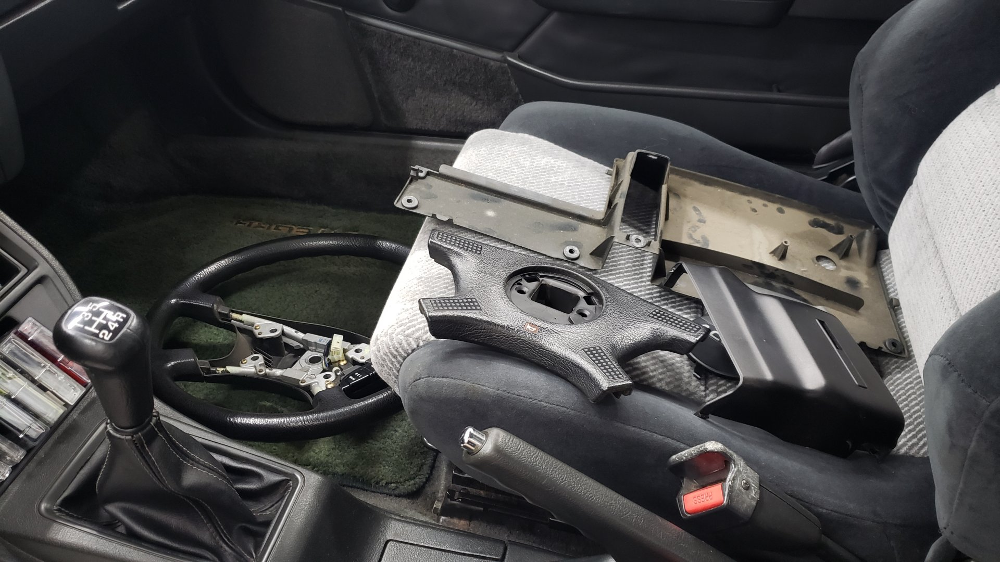
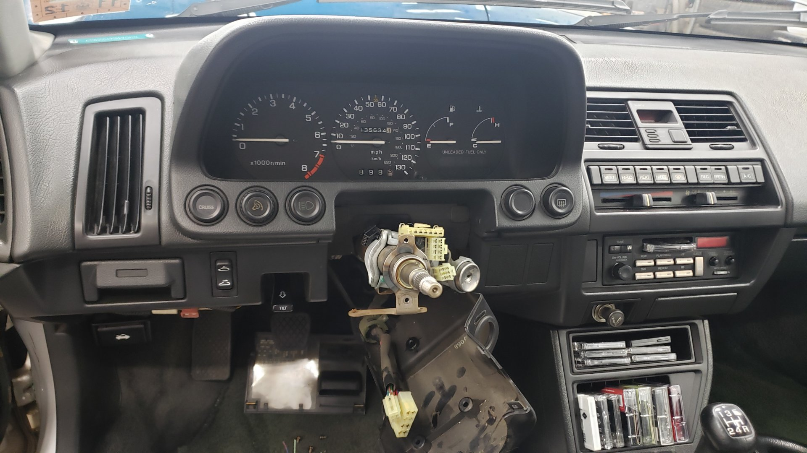

Wrapping up a project isn't always the funnest. The "last 10%" tends to take up significantly more time than anticipated because it involves addressing all the difficult parts that you've been putting off.

Overall the Integra was at the point where all the major issues had been resolved but it still had a few minor ones that would affect the driveability.

A couple of electrical gremlins had cropped up when testing everything where I found the hazards didn't work, the blinkers were intermittent, and the sunroof got stuck open.

It also had tires that were old enough to vote, the alignment was out of whack from me swapping the outer tie rods and not measuring anything, and the car was also still dirty from having sat for 10 years.

But it ran like a dream.

Bask in the mighty 1.6 liters of pure power.

# A Well Deserved Detail

Before diving into the electrical issues, I decided to take the time to detail the interior as it felt like the car deserved a good cleaning after sitting for so long. Honestly though, the interior was in pretty good shape with no majors stains in the seats or carpet. It just had a large amount of dust and dirt in the upholstery.

All of the vinyl needed a good wiping down too, and the windows were dirty, but all in all I managed to finish detailing the interior in just under 2 hours.

I'm debating replacing the floor mats or maybe dying them since they've faded to a blackish green.

The rear seats are a little sun faded from age.

But it still has the original cargo cover!

# Fixing the Blinkers

Like I mentioned earlier, I found that the blinkers wouldn't always work when you engaged them.

Every so often when you'd turn them on the dash indicator would begin to blink rapidly but no lights would come on outside of the car. The dash indicator would flash fast like a bulb was burnt out yet toggling the blinkers would get them to work again.

At first I suspected it was the blinker relay so I swapped it with a known good one (from my 93 Civic) but the problem still occurred.

A bit more testing and fiddling with things and I found that if you wiggled the blinker stalk itself when the blinkers were acting up, they would magically begin to work. This basically confirmed my suspicions that it was the blinker stalk itself.

In order to remove the blinker stalk you need to take off the steering wheel though.

I made sure to mark the steering wheels position prior to removal so upon re-assembly I could ensure I had the wheel centered.

There's really not that many parts to the steering wheel. All in all it was no more than 10 nuts and a few wires that had to be removed.

I was lucky to snag a full replacement unit for the blinker stalk, wiper controls, hazard switch, and even a clock spring off Ebay. I didn't need all of these parts but I figured spares couldn't hurt.

With everything removed the steering column looks so bare.

Back together.

I forgot to snag some progress pictures but I didn't end up needing to replace the blinker stalk. I took the original unit apart and found that two of the switches contacts were dirty and needed to be cleaned. Using a wire brush I removed all the buildup and finalized the repair with a fresh dab of dielectric grease on each contact. This was enough to get the blinkers working 100% again.

I did end up replacing the hazard switch because the one on the car was completely in-op so the replacement units I bought didn't go to waste after all.

# New Tires

The tires on the car had plenty of tread left on them but looking at the DOT date stamp revealed they were 18 years old! Not wanting to trust rubber that old I picked up a set of new Hankook tires. There's not many options for 195/60/14s so I figured some mid grade ones would be more than sufficient.

They're Hankook Kinergy STs. Overall not too bad, no real complaints but nothing to brag about because they're just the standard run of the mill all season tires.

I do plan on auto-crossing the Integra and will eventually pick up a better set of tires but I figure it's best to start basic and work my way up as I get better with auto-x.

# Officially Road Legal

There's not many pictures for this section because I paid a mechanic to install the tires and do an alignment. I don't have the proper machines to mount / balance tires so it's one of the few jobs I pay someone else to do.

I'd love to get my hands on a used tire machine someday but the prices are just a little too high to justify that right now.

I can also happily report she passed her first safety inspection in 10 years!

I should mention the paint looks so shiny because I ran my buffer across it. I went with the tried and true HD Speed polish with a white Lake Country pad and topcoated it with Wolfgangs deep gloss paint sealant which should last about 6 months.

And driving this thing around has been a lot of fun. It's not the fastest car out there by any means but it's fun to row through the gears and it even pulls 33mpg which is hard to beat given the current gas prices.

The hatch comes in super handy for hauling stuff too. I already used it to pick up a mega sized AC.

In the first week of it being on the road I've already put 600 miles on it. Best of all no issues have popped up yet (knock on wood) other than some of my cassettes getting jammed in the radio.

Yes, I bought cassettes. I've got a random assortment of no name 90s hip-hop artists but I do have a few good ones like Watching Movies with the Sound Off by Mac Miller, Teenage Riot by Sonic Youth, and Regulators by Warren G.

# What's Next?

Honestly my plans for this car are just about done. I built it to be my daily and I fully intend to use it as one. It'll never see snow or road salt but I'll be driving it full time during the summer.

I'll continue to do some small mods like better speakers for the stereo, and fix the AC, but it'll always just be things to improve the overall driving experience. Nothing cosmetic.

If the D16A1 under the hood ever gives up I _may_ yoink the B20B out of my Civic and swap it into this but that's just a pipe dream at the moment.

[Next post]()
