With the headgasket and timing belt swap fully completed it feels like the rest of this project will be a piece of cake. Fabricating a custom exhaust is the last major task on the list and I'm looking forward to it because that means I have an excuse to break out my welder.

From atop the engine look cleans as can be. But if you look a bit closer down towards the bottom of the engine block you'll see a huge oily mess.
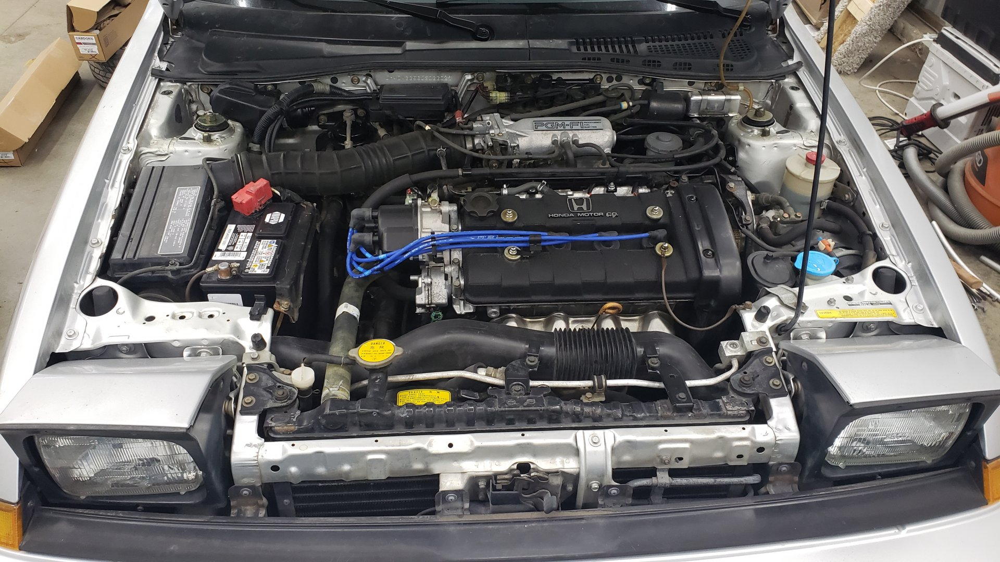
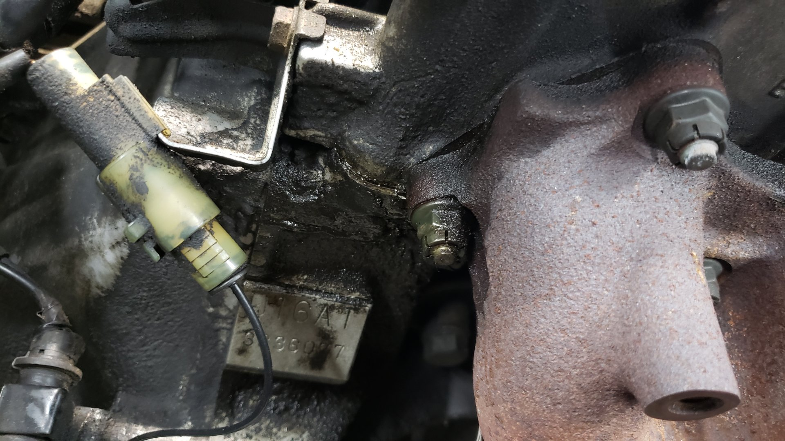

The headgasket and oil pan have been leaking oil for years and there's a thick coating of oily grime stuck to everything.
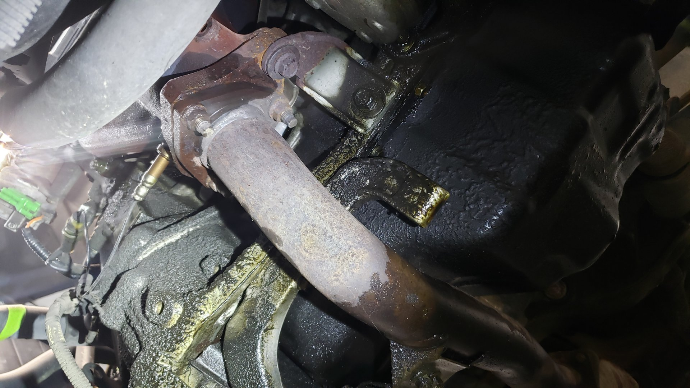

Since replacing the headgasket is a pretty major job I tried to time it up to where I had a three day weekend that way I could knock out as much of the job as possible before I'd forgot how everything was assembled.

I started off by removing the larger, easier to remove components such as the exhaust header.

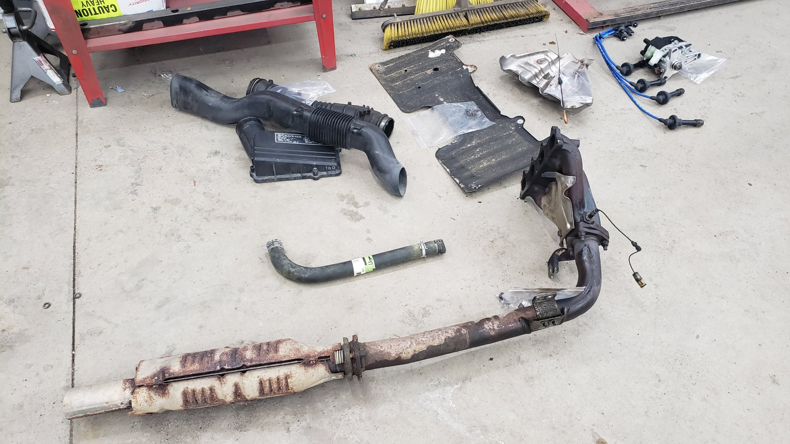

I also decided to stay on the cautious side and took the time to label all of the hoses within the engine bay as I was removing them.

The late 80s to early 90s may not have had many electrical components under the hood but they sure made up for it with vacuum lines.

Label wise I started with the letter A and worked through the alphabet until I ran out of hoses to remove. I almost made it completely through...
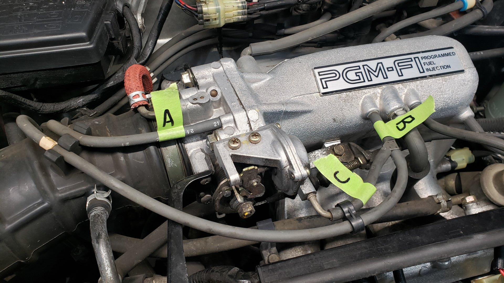

Even though I only disconnected about 5 - 6 electrical connectors I took the time to label them.
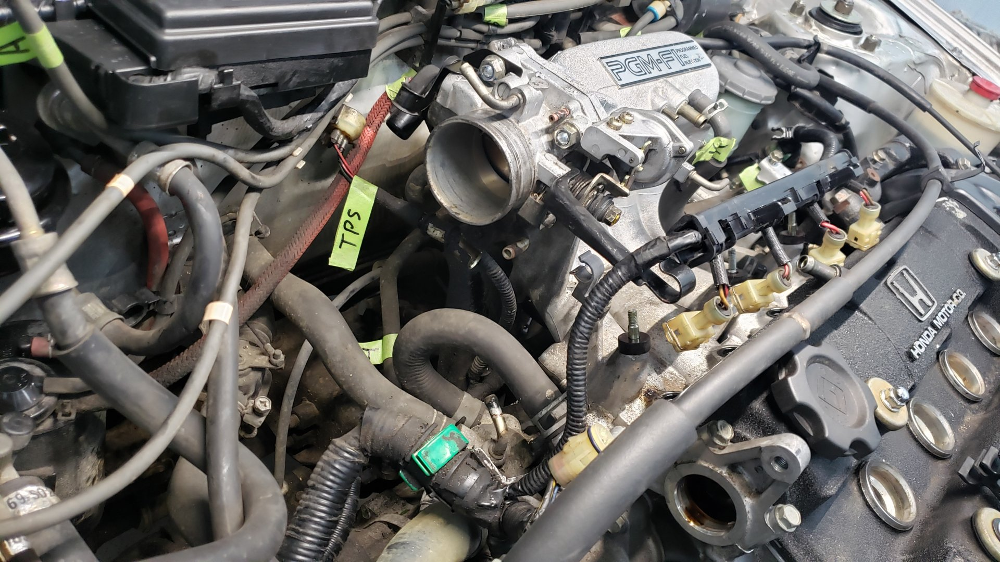

Once I had worked through labeling and disconnecting all of the hoses and wires I started focusing on some of the harder tasks.

Which of course includes removing the crank pulley.

Hondas of these years are well known for having hard to remove crank pulleys. It's not really the pulley itself that is difficult to remove but instead the bolt holding it in. I think it's related to how D and B series motors rotate backwards and it causes the bolt to naturally tighten over time but I have no evidence to back this up.

There's a tool you can buy for some Hondas that helps hold the pulley in place but this crank pulley isn't designed to work with it.

And since the 1/2 impact that I have access to wouldn't touch the damn thing I had to get creative.

The bolt was so stuck that I needed to make an extremely long socket extension so I could use a massive breaker bar to get some serious leverage on the bolt.

I came up with the idea of welding a socket on each end of a steel tube to act like my socket extension.

I used that steel tube on the floor in the background for leverage. It's close to 6' long!

The jack stank underneath it was used to ensure I stayed perfectly straight. I didn't want to risk stripping the bolt head.

To keep the crank pulley from spinning I wedge a bolt on the end of some steel channel into one of the pulley's holes. This held the pulley nicely but also destroyed it.

I was lucky enough to snag a new pulley off of Ebay. I'm honestly amazed I found someone actually selling one.

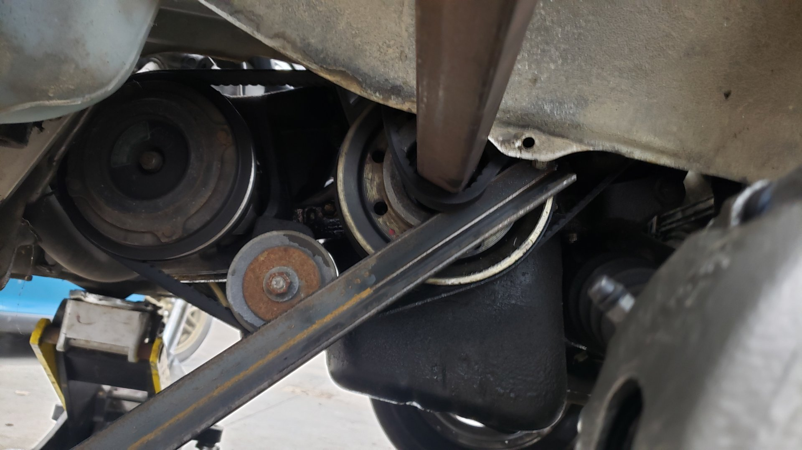

All of the accessory belts removed.

With the crank pulley free I felt it would be a good time to bring the motor to top dead center (TDC). I opted to wait till after loosening up the crank pulley because I didn't want to risk the engine rotating while removing the pulley causing me to mess up the timing.

I used the ole dipstick in cylinder 1 trick to find TDC. I also made sure I felt air being pushed out of the spark tube as it was approaching TDC to ensure I was on the compression stroke.

The power steering pump was in the way so I took the time to remove it. This is actually the first time I've done a timing belt without removing the engine.
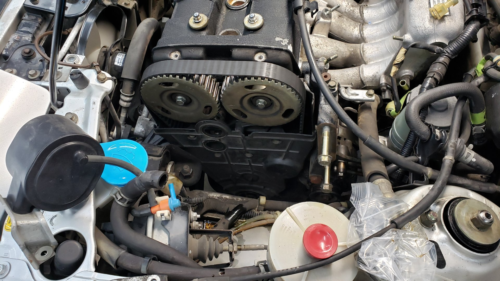

Timing belt fully exposed.
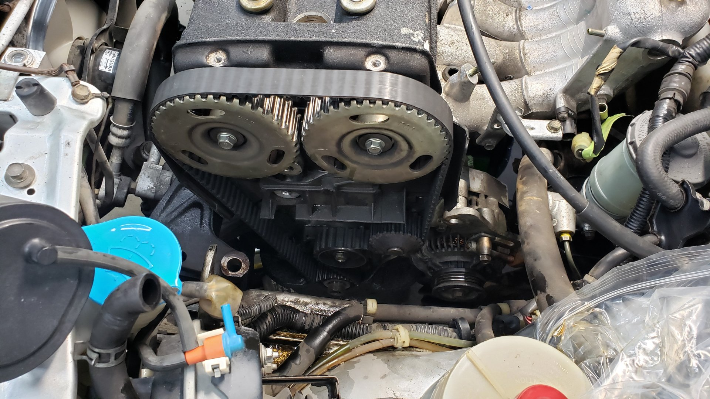

Past the point of no return now. Timing belt is off.

To remove the head you have to pull the cams and remove all of the head internals.
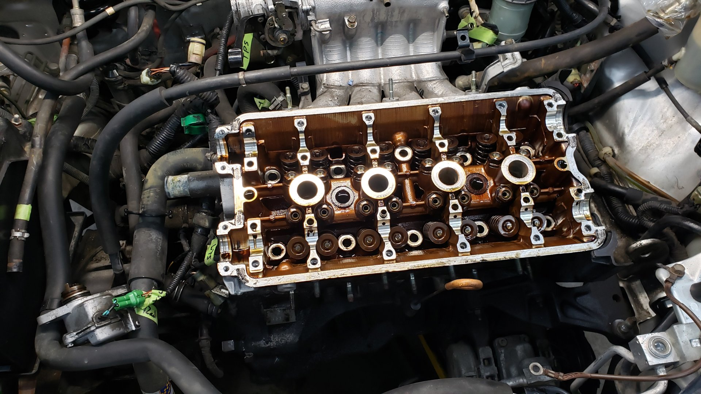

I labeled everything to make sure I didn't mess up and re-install things in the wrong spot.

The head bolts were also loosened in reverse torque sequence and only turned 1/3 of a turn at a time as requested by the factory service manual.

For the most part the head actually looked pretty good. Lots of old gasket that needs to be removed but the only reason I'm swapping the headgasket was to fix the oil leak that was weeping oil on the bottom left corner. It was purely an external leak.

Some of the head bolt holes had some serious gunk built up in them. I was concerned about the head bolts binding on re-install so I used a paint gun cleaning brush, brake clean, and compressed air to scrub them out.

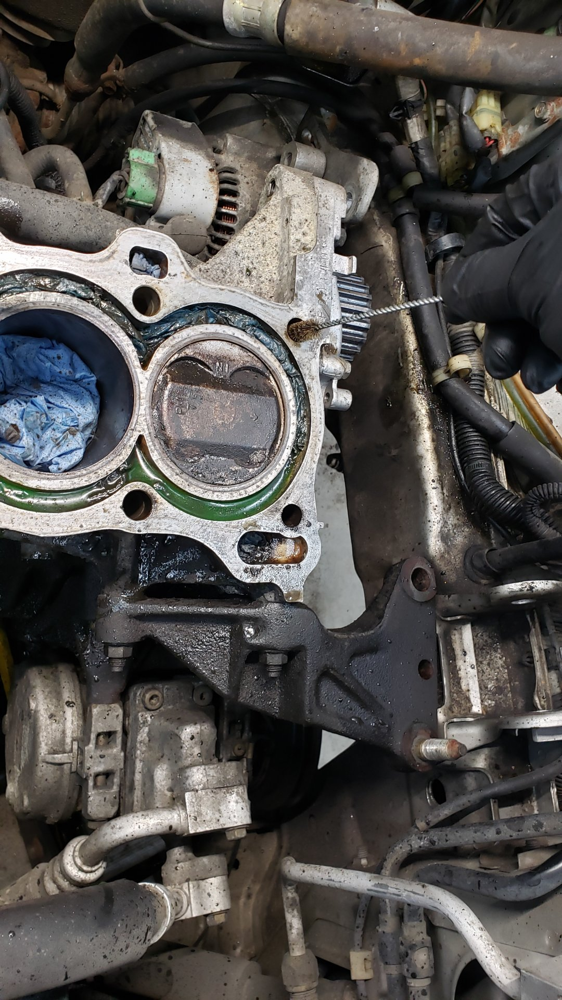

It took close to 4 hours to clean the entire gasket mating surface. I used as many plastic razors as needed and a mix of brake clean and a solvent. The old gasket left behind some stains but the head felt smooth as could be.

I guess these marks are quite common for composite headgaskets.
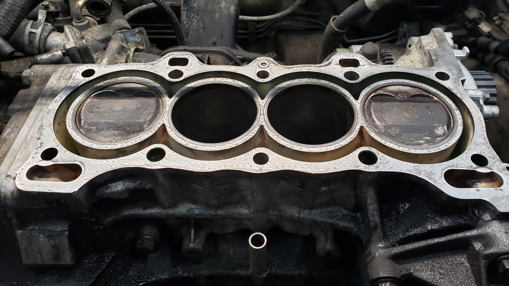

Something pretty important to point out is that it's possible to re-install the headgasket in the wrong orientation.

There's two extra coolant holes on one side of the gasket that **MUST** be placed on the driver side of the block. If you don't you could potentially have overheating issues.

I came super close to installing this backwards.

I opted to go with a composite headgasket because I wasn't planning on sending this head to the machine shop to be resurfaced. Multi layer steel (MLS) headgaskets are technically better and will last longer but they also need an extremely flat surface to ensure they properly seal.

This isn't going to be a race car, and I figured if the original composite headgasket made it 33 years this I'd be pretty content even if the next one only lasted half as long.

I also opted to re-use the head bolts since they are not torque to yield (TTY). There's been a lot of debates over the years about this over the years in the forums but the factory service manual didn't say to replace them so I feel confident in my decision.
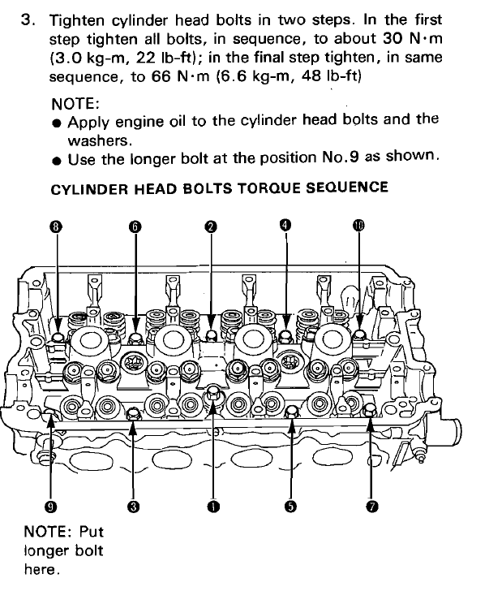

Head back on along with the cams.
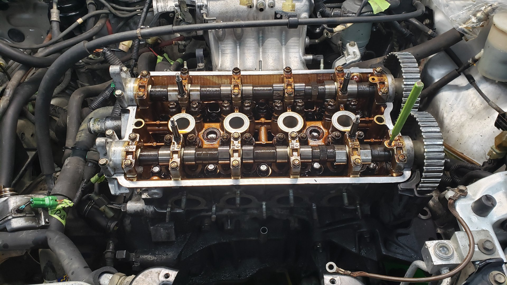

Timing belt re-installed. It took me two tries to time it up correctly. The first time it looked almost perfect but the lines on the cam gears wouldn't quite line up right. It turns out I had one of the cam gears off by a single tooth.
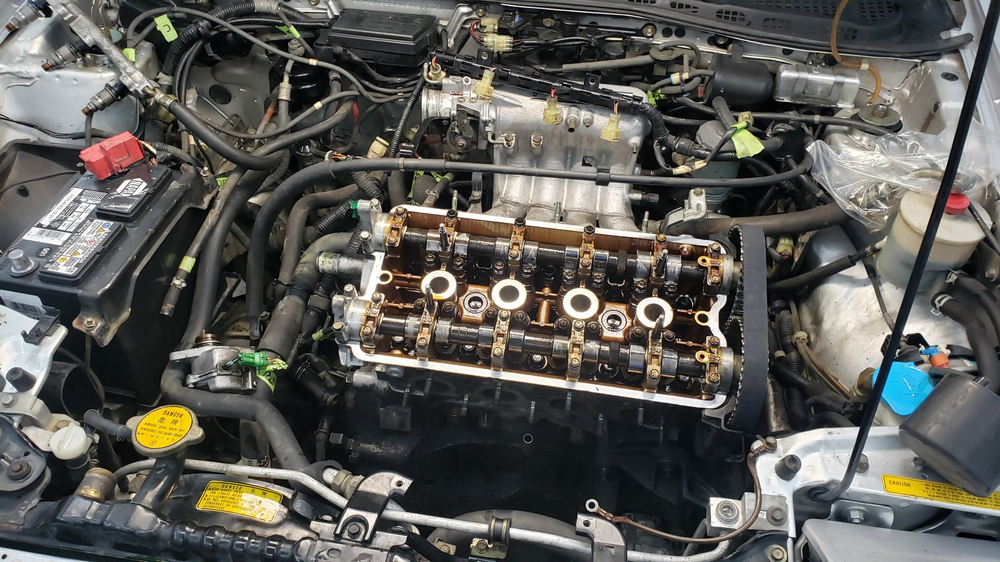

Reconnecting some of the hoses was a total pain in the ass. By far the worse was the PCV hose that connects to the breather box below the intake manifold on the backside of the engine.

There's not a lot of space between the firewall and engine on this car so attempting to work back there is extremely hard. It also didn't help that I left the intake manifold on the head since I didn't want to deal with cleaning the gasket mating surface.

She almost looks normal again!
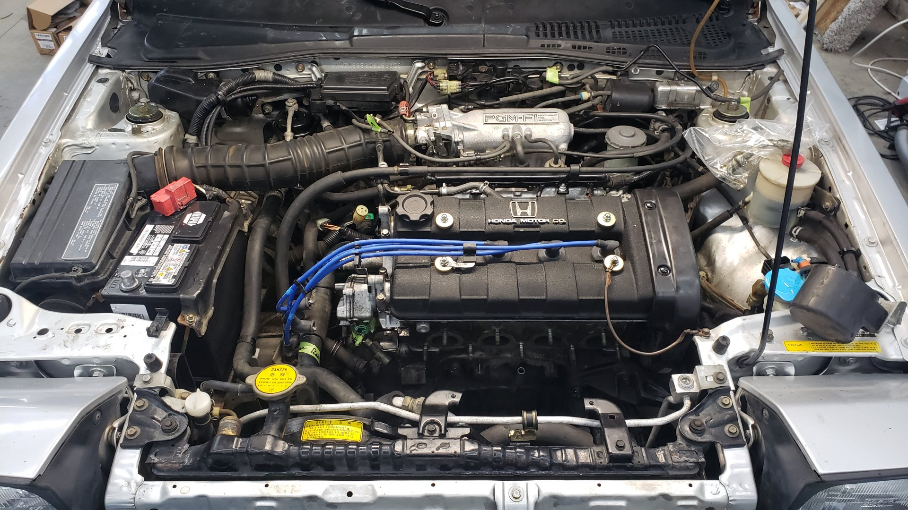
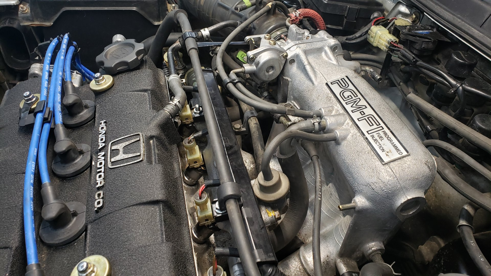

I also made sure to reattach the intake manifold to it's brace (two bolts not pictured). This is the view of looking up from underneath the car.
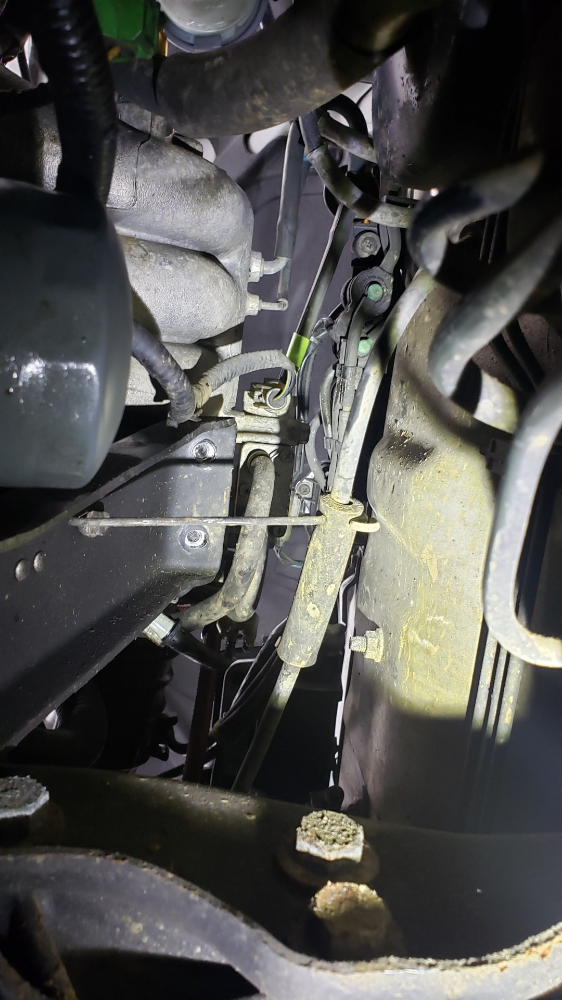

A couple of vacuum hoses were damaged due to them being stuck and breaking upon removal. I had to replace those ones.

An interesting quirk about this car is how the power steering pump is mounted. It's actually rotated 180 degrees relative to the engine.

And with the headgasket finally replaced I figured it was time to replace the leaky oil pan gasket.
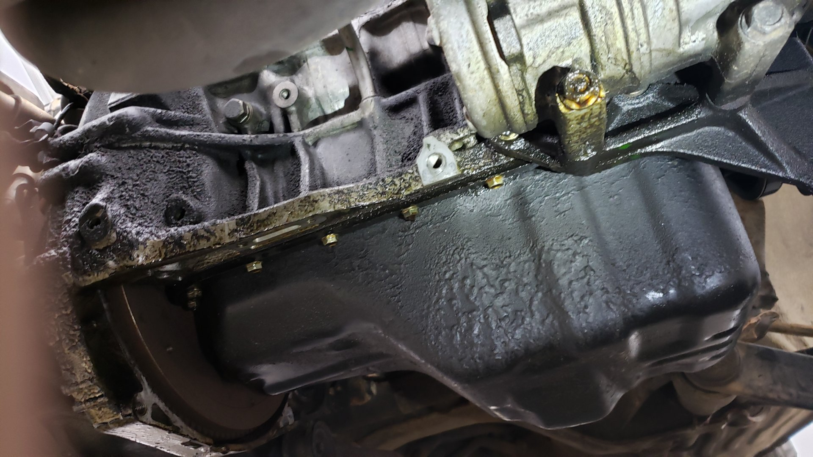
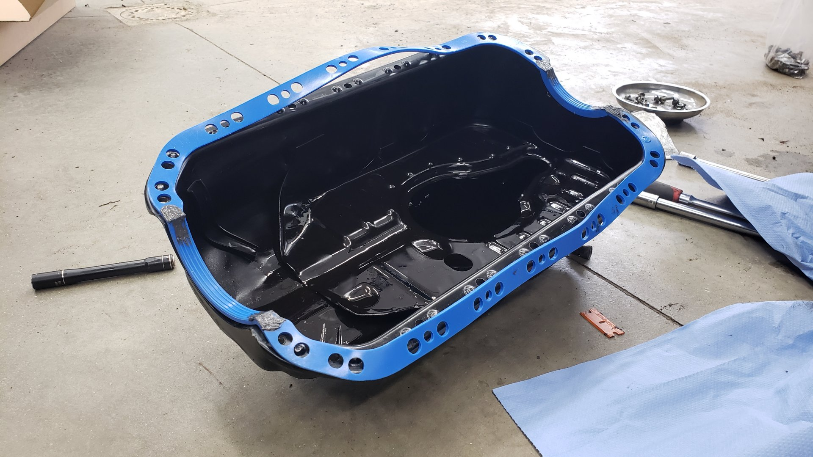

Much better. I scrubbed most of the grime and oil off of the block using a bunch of small wire brushes.

Reattached the engine stiffener thing. Make sure you follow the torque sequence of bolting down the transmission bolt first.

Hey you can actually read the engine code.

Now if only I had an exhaust I could really finish this thing.

[Next post]()
