I've officially put 2,000 miles on the Integra in the past 3 months and have been having a blast driving it around. I even attended my first auto-cross event with it and had a great time throwing it through the turns. I didn't take home any trophies (nor did I anticipate it lol) but I was able to come in second last officially beating 1 other car's time.

With that said a few issues have popped up, which is basically to be expected given the car sat for 10 years but I never anticipated the clutch being one of them.

# Random No Start When Hot

# Intermittent stuttering on acceleration

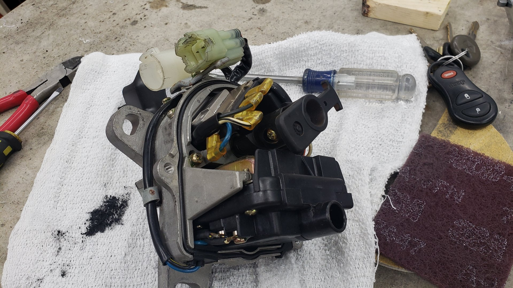
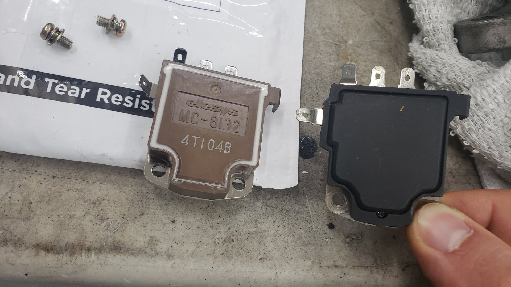
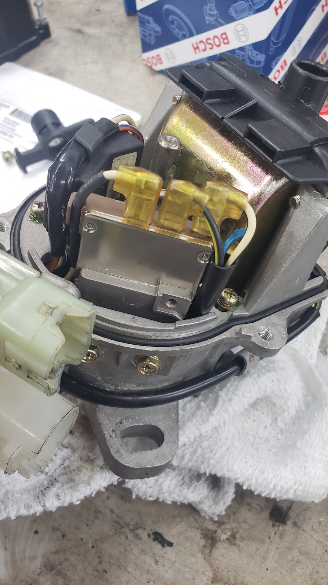

# Clutch Decided to no longer disengage

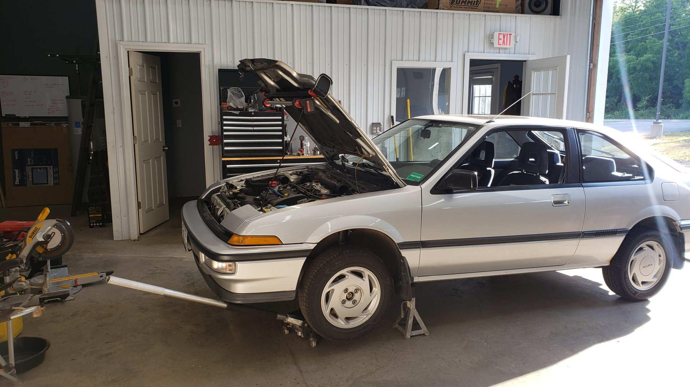

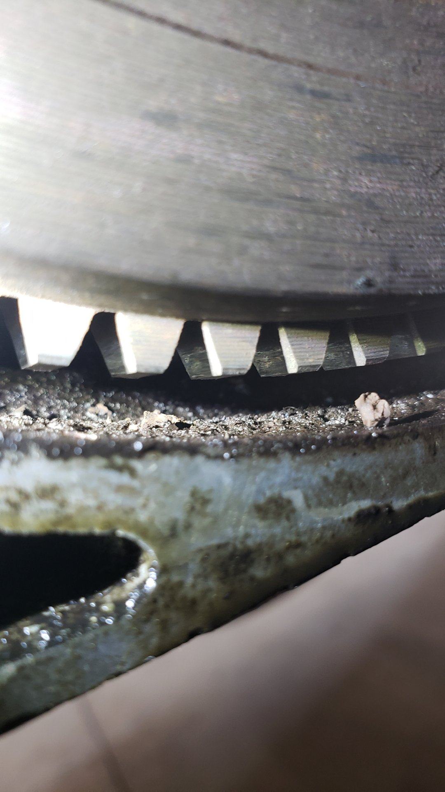
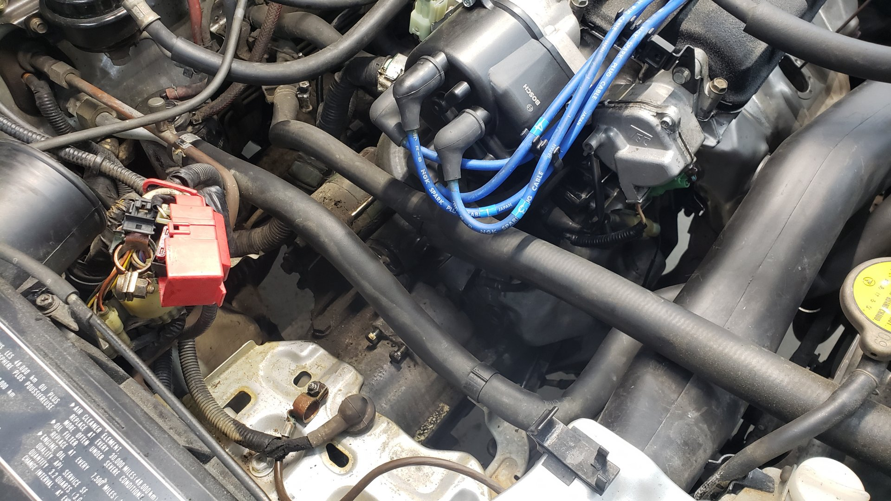
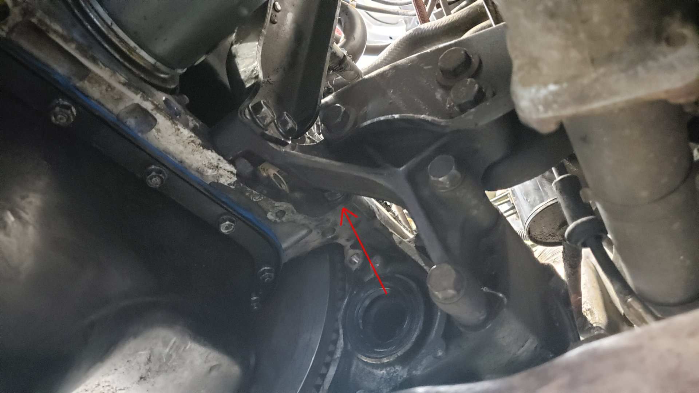

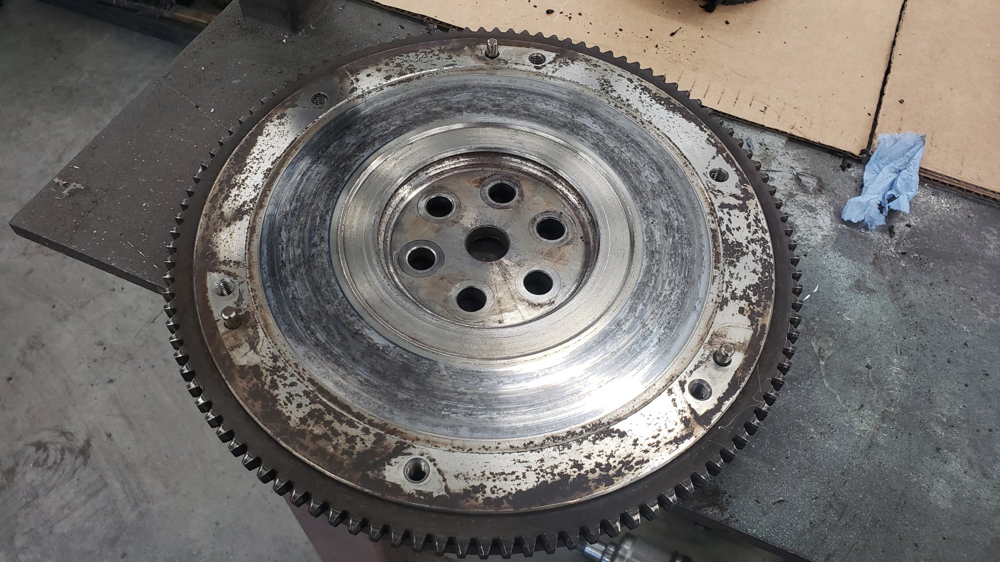

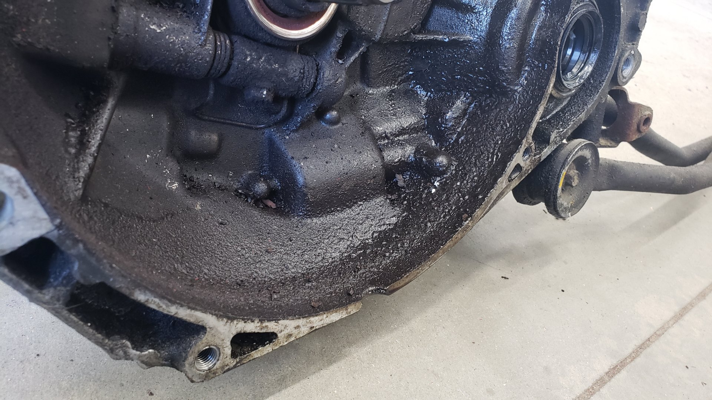

# Fixing the Rear Main Seal While I'm at it

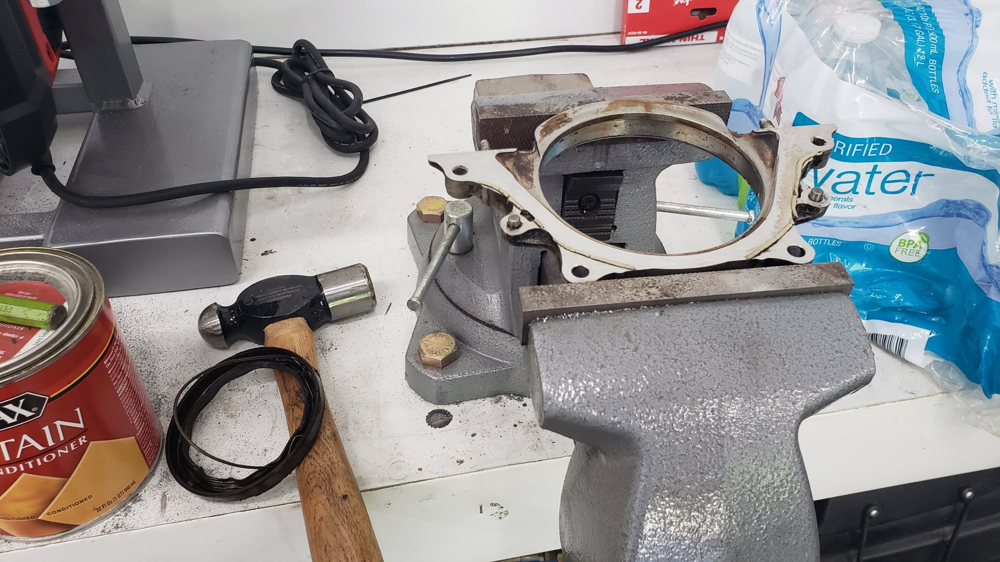

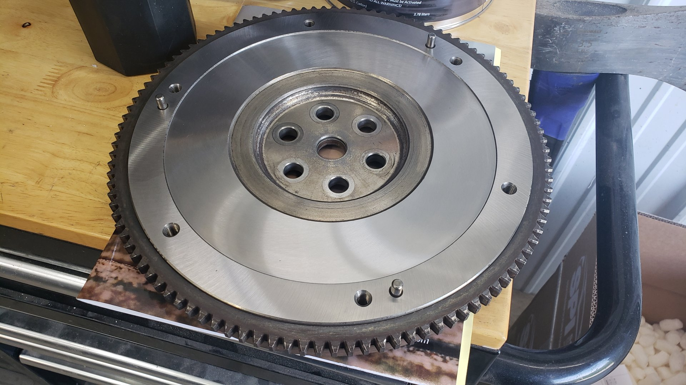

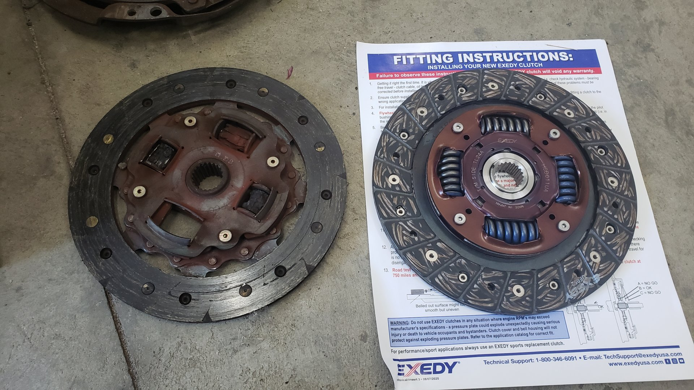

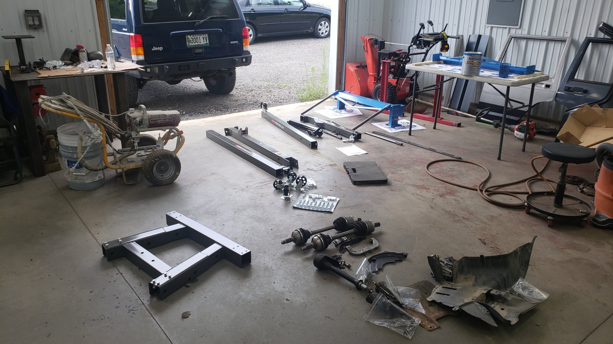
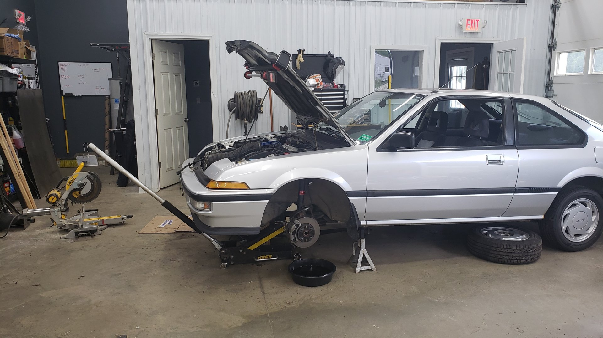

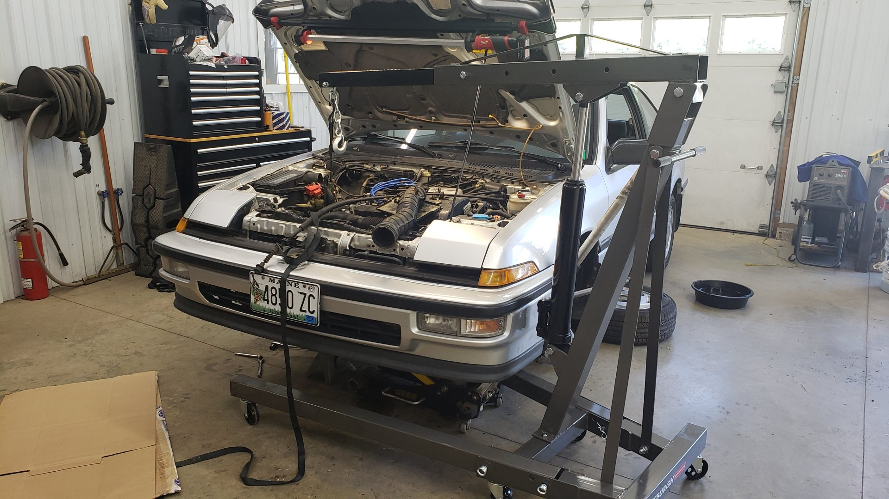
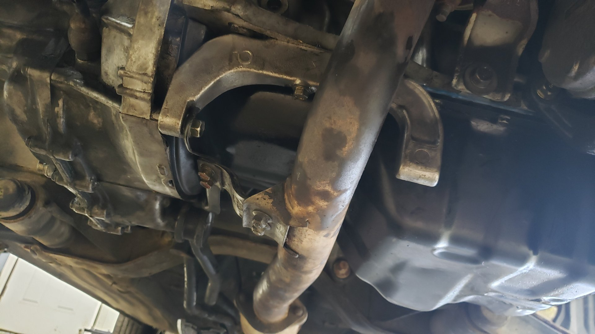

