Having driven over 2,500 miles and raced in 2 auto cross events, the Integra has had a few issues pop up along the way, but is still holding strong.

For what it's worth though, the car's never left me stranded and even when the clutch failed I was still able to limp it home.

# Random No Start When Hot

One hot day back in June I made a quick trip up to Home Depot to grab something for a project I was working on. The drive up was uneventful, but upon leaving the store and hopping back into the car, I couldn't get it to start. The engine just cranked and cranked. This isn't the first Honda I've experienced this issue on so I immediately suspected it was the main relay.

Listening closely I couldn't hear the fuel pump prime, nor was the check engine light turning on / off when the key was first turned. These symptoms basically confirmed my suspicion that the main relay was on the fritz.

Since I didn't have a spare main relay on me I flipped the key back and forth from off to ignition several times until I heard the fuel pump finally engage. The car started right up, and I was able to get it home safely.

Since the OEM main relay has long been out of stock for this model and it's a slightly different connector than other Hondas I figured the best bet would be to reflow the solder joints within it. Using my solder iron and a solder sucker I removed as much of the original solder as possible from all the joints on the main relay and then reflowed each joint with new solder.

The issue hasn't returned since.

# Intermittent stuttering on Acceleration

Occasionally when accelerating, the car would randomly stutter or cut power as if you were lifting your foot of the throttle. My first guess was it was something within the distributor was failing causing the engine to loose spark, and feeling over confident in my guess I decided to order a new ignition coil, ignitor, cap, and rotor without doing any diagnostic tests first.

OEM ignitor on the left, cheap aftermarket unit on the right that I removed from the car.

Well as fate would have it, none of those parts fixed the issue because as soon as I took off on a test drive the issue re-appeared. Thinking about the issue a bit more I realized it was more likely to be something cutting fuel because when the issue occurred the car would never backfire afterwards or smell like it was running rich.

Thinking back I remembered that a few month's earlier while doing the headgasket I had accidentally kinked the O2 sensor wire while removing the exhaust header. The wire looked fine on the outside but I opted on the side of caution and ordered a spare O2 sensor since I figured it'd be good to have. I never installed it though because again the wire looked okay and I figured I'd only bother to replace it if the check engine light came on.

Even though there was no CEL, I decided to go for broke and replace the 02 sensor since I already had it on the shelf. Lo and behold, the issue was resolved.

# The Clutch Won't Disengage

The day after my first autocross event, my girlfriend and I decided to run some errands. We shot off in the Integra and all was well until about halfway there when the car started to shift hard and wouldn't easily switch gears anymore. The shifting was so difficult that I even stalled the vehicle in the road while attempting to turn left because I couldn't get the car into first.

I was able to force it to shift gears by being harder than I liked on the shifter though and with some rev matching we managed to limp it home.

My hope was that the clutch cable need to be adjusted.

Sitting in the driveway I played around with loosening and tightening the clutch cable a bit, but couldn't find a good adjustment for it. The clutch would work fine a few times and then randomly not want to disengage anymore. I'd hop out the of the car, adjust the cable again and repeat the test only to get the same exact results. After a few rounds of trial and error, when I was testing the last adjustment I had made, I shifted gears and heard a clunk and suddenly the clutch wouldn't disengage anymore. Uh oh.

With how things were looking, I had no choice but to drop the transmission to get a better idea of what was going on.

Before going to deep into it I popped off the inspection plate to see if I could see anything in the bell housing.

That's not good, I wasn't expecting to see chunks in there.

A few hours later and after having disassembled most of the front end to drop the transmission I discovered the issue. One of the rubber dampeners on the clutch disc had completely disintegrated! There was pieces of it and some metal jammed up in the pressure plate which is why the clutch wouldn't disengage.

That clunk I heard earlier when making clutch cable adjustments was the dampener exploding.

Not much meat left to the clutch disc so maybe it was a good thing after all.
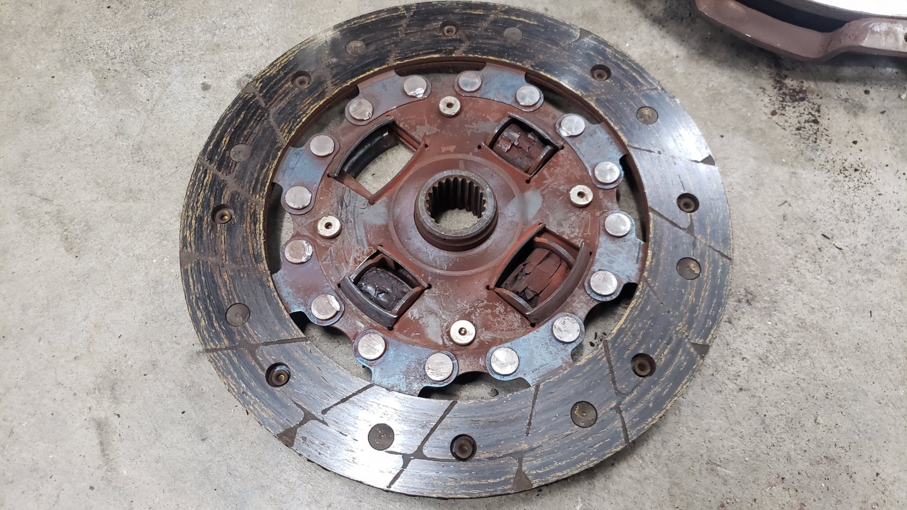

I plan on sending the flywheel out to be resurfaced.
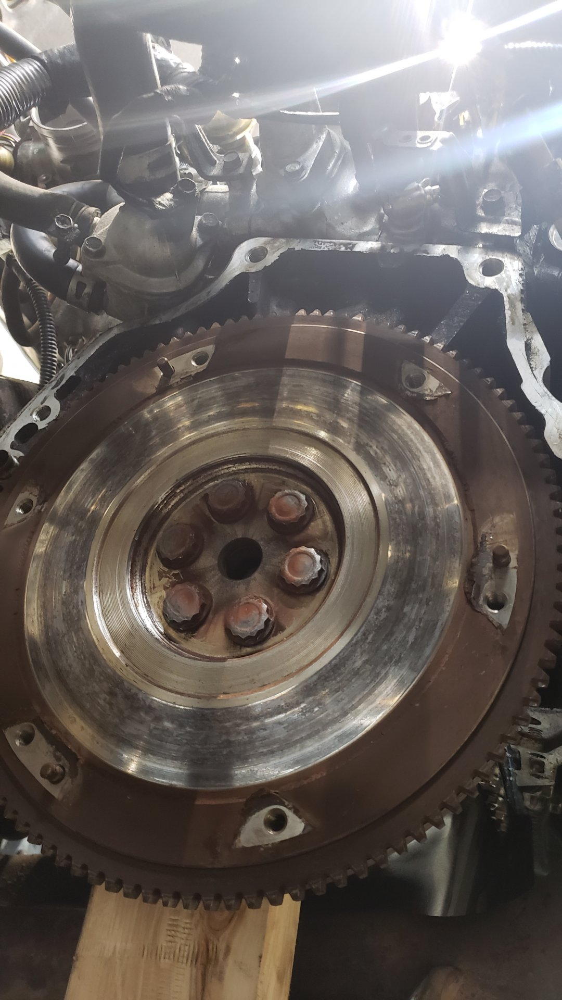

Betcha didn't know there's no pilot bearing on these!
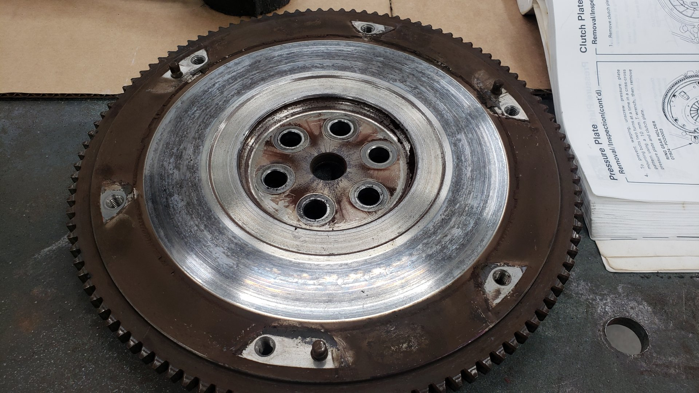

From atop the engine bay doesn't really appear to be missing much. Underneath is a whole different story. I had to remove the skid plate, passenger side inner wheel well, drain the transmission, remove both cv axles along with the half shaft, unbolt two engine mounts, and also remove the battery and air intake tube for easier access from atop.
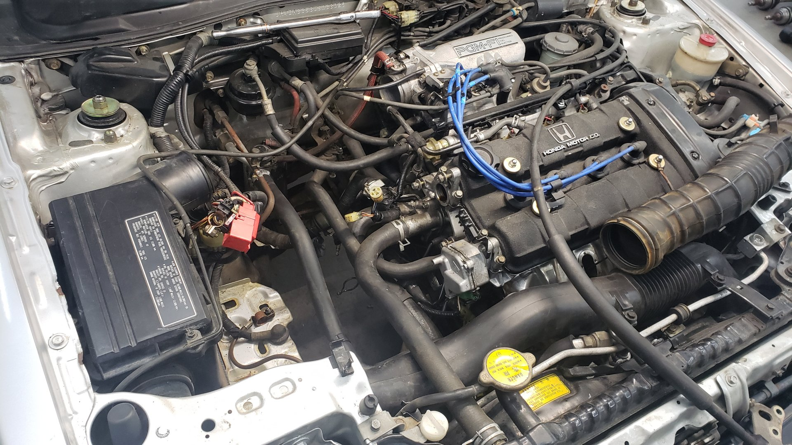

The engine is held up with the jack but I didn't trust leaving it overnight so I opted to add a 2x4 for extra support. Not the safest, but it was the best option I had available.
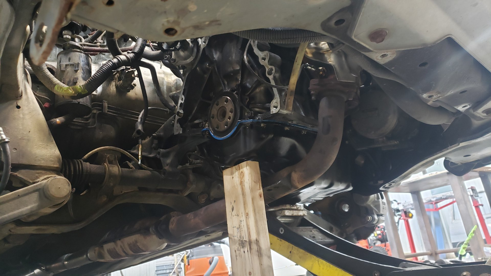

I always leave a wheel under the rocker panel when I put a car on jackstands as a safe guard in case the car fell. It'd scuff up the rim pretty good but I'd prefer that over injuries had I been under the car.

I try to work neat when possible. Most bolts get bagged and labeled, but sometimes I leave them in piles next to the parts they belong to.
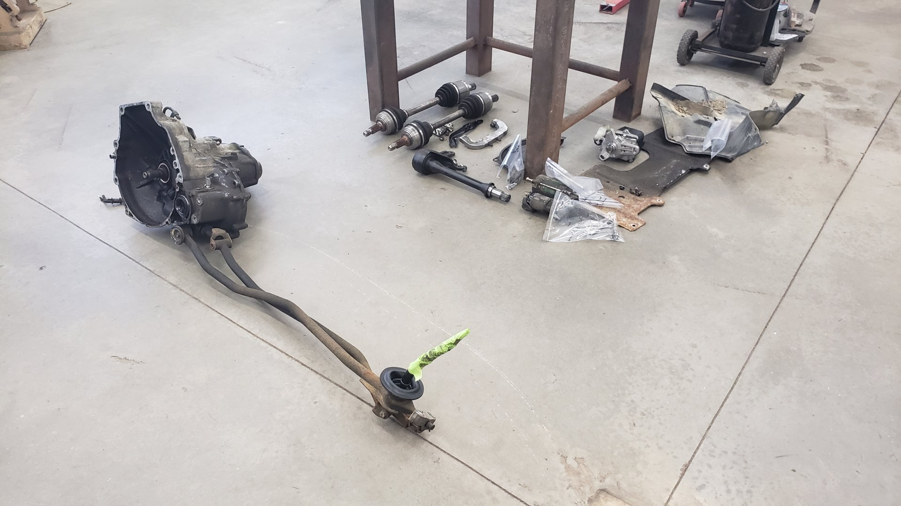

Gave the flywheel a quick wipe down before dropping it off at a local machine shop the same day.

The inside of the transmission was completely covered in oil. Gross.

Very thick on the bottom.

Using a small brush and some degreaser I was able to clean up the transmission a bit.
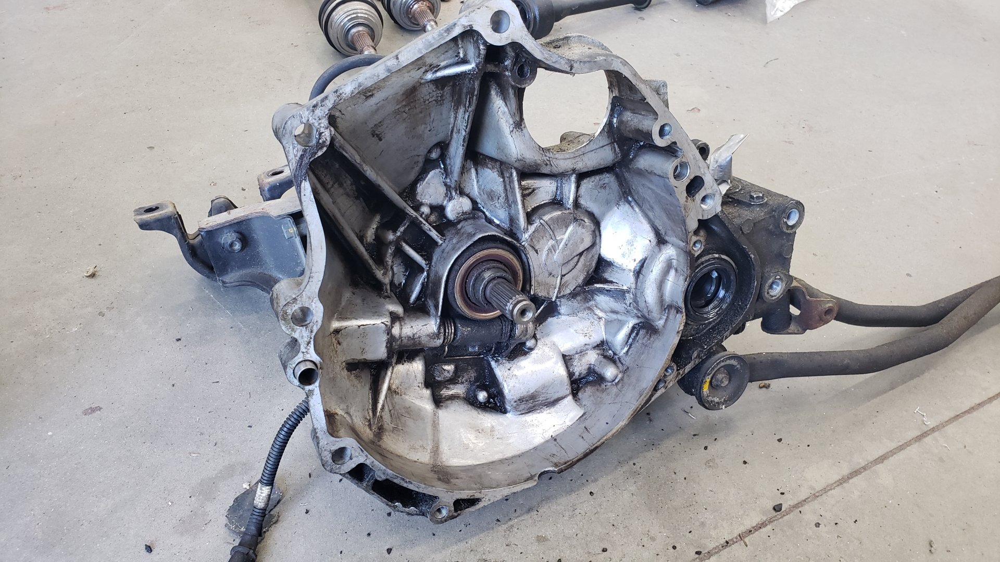

# Fixing the Rear Main Seal While I'm at it

The rear main seal didn't have a major leak to it, but it was weeping and not wanting to have to drop the transmission twice I figured it'd be better to hit two birds with one stone and take care of it at the same time.

For some reason the seal was almost completely stuck in place and I had to use a punch and hammer to knock it out.

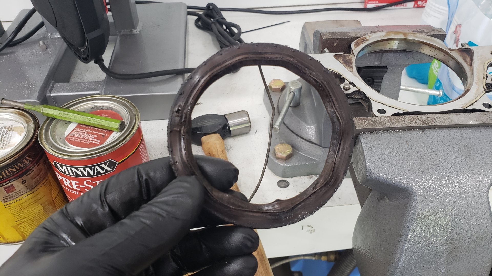

Before re-installing the gasket and it's mounting plate I took the time to clean the mating surface and also the backside of the engine.
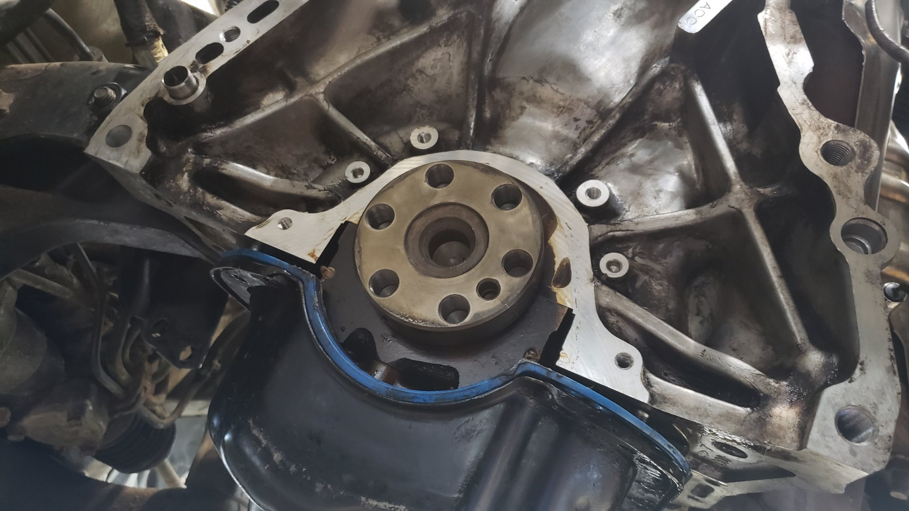

Fun fact: Honda uses different size bearings on their engines to ensure tolerances are within spec. You can find the sizes of the bearing on the backside by the bellhousing.
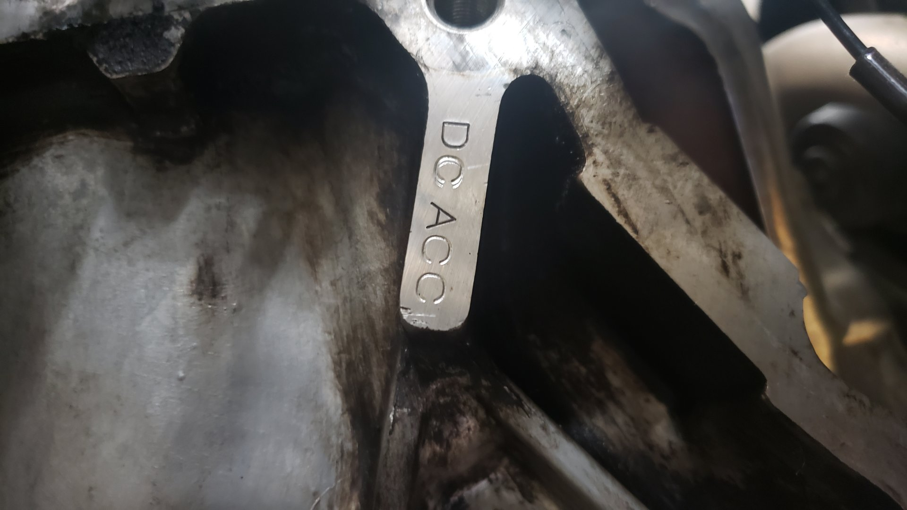

Two days after dropping off my flywheel at a machine shop they gave me a ring to let me know it was ready for pick up. They did an excellent job refinishing it!

New rear main seal installed.
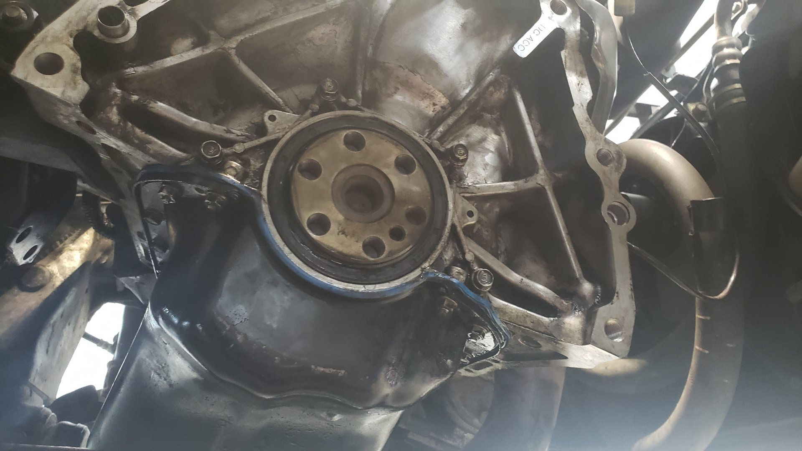

I don't have one of those fancy flywheel holders to help with torquing down the flywheel bolts so I ended up using a neat trick I learnt off the internet during my last motor swap about how to hold it in place with just a wrench and one of the bellhousing bolts.

Old clutch vs new clutch. Hard to tell the difference!

A few bolts later and the clutch / pressure plate were reinstalled.

At this point I was basically ready to mount the transmission back up to the engine. Unfortunately I didn't have any way to lift said transmission and decided to opt for a slightly overkill solution. I ended up picking up the Harbor Freight 2 ton engine hoist because I needed an engine hoist for my next project, and also because I didn't think I'd utilize a transmission jack enough to justify the cost and it taking up space.

Hopefully it can lift the 90lb transmission.

I over engineered my first attempt to lift in place. This attempt wasn't successful because I couldn't angle the transmission just right so it'd mate up. No matter what I tried it felt like it was slightly off angle.

Maybe I really should have bought a transmission jack, but alas I'm stubborn and ended up finding a solution that worked. I repositioned the engine hoist so it was off to the same side as the jack that was holding up the engine. This allowed me to go underneath and help position the transmission manually. This thankfully did the trick.

With a bit of reassembly later, I had everything back to normal.

If you noticed in my pics that I didn't remove the shifter linkage, and had also covered the shifter in painters tape heres why. I've had notoriously bad luck in the past attempting to remove the pin that connects the linkage to the transmission so I tend to lean on the side leaving it alone when possible.

The last time I did a transmission like this I ended up scratching the shifter when pushing it back up through the hole in the floor. Not wanting to damage another one I covered it in tape so it wouldn't get any blemishes while I did all this work.

Good as new.

# Oil Leaking Everywhere

This issue was totally my own fault. After swapping the clutch and rear main seal, the car began to leak a bunch of oil the very next day. I thought I might've not tightened the oil pan enough (I had lowered the pan to remove the rear main seal) so I thought the best course of action would be to attempt to tighten the bolts a bit more.

Well that did nothing but make the leak **even worse**.

It turns out what had really happened was that I had over tightened the oil pan initially to the point where the gasket was bulging out in one corner, and by tightening it even more I cracked the gasket.

Can you spot the crack?
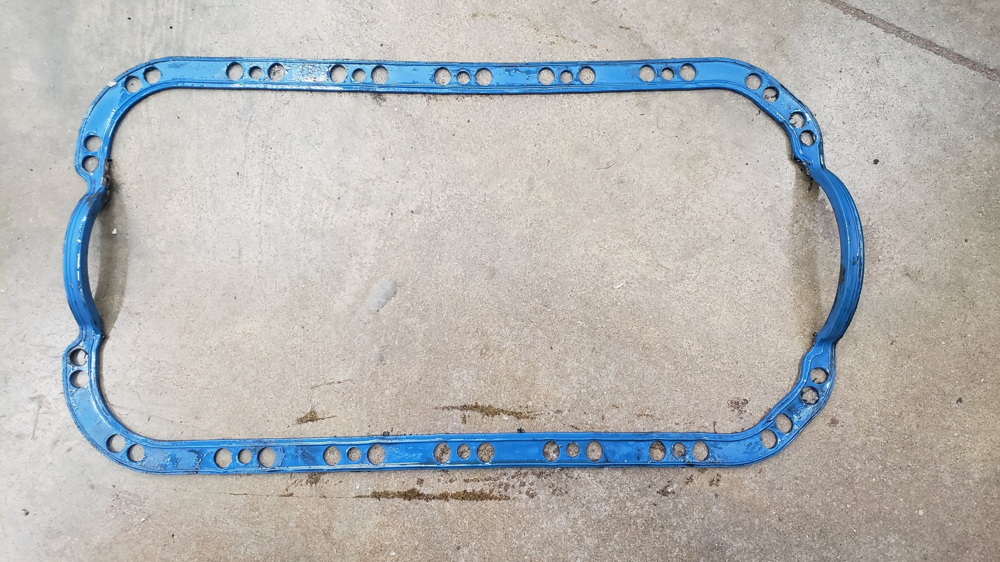

It's hard to see but it was in the bottom right corner.
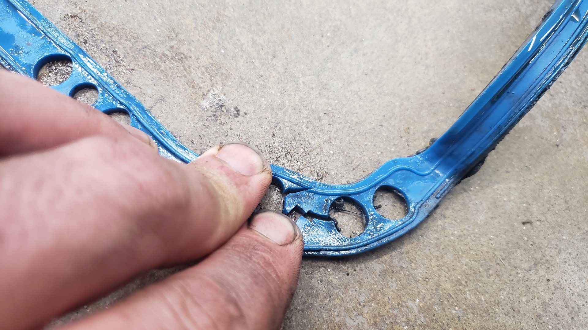

The leak was so bad that the car lost 1/2 quart of oil in under a week. The oil was even dripping on the exhaust causing it to smoke and burn off on the catalytic converter.

Not wanting to fail tech inspection for an autocross event that was the very next day (I didn't realize the severity of the oil leak until the night before) I stayed up till 1AM pulling the oil pan. Nothing went smooth during the tear down (probably from being so tired) and even included me getting drenched with transmission fluid while laying underneath it when I removed the half shaft from the transmission because I forgot to drain the transmission fluid first.

In the morning I shot out to the parts store and picked up a replacement gasket. I was even able to reassembly everything before starting work.

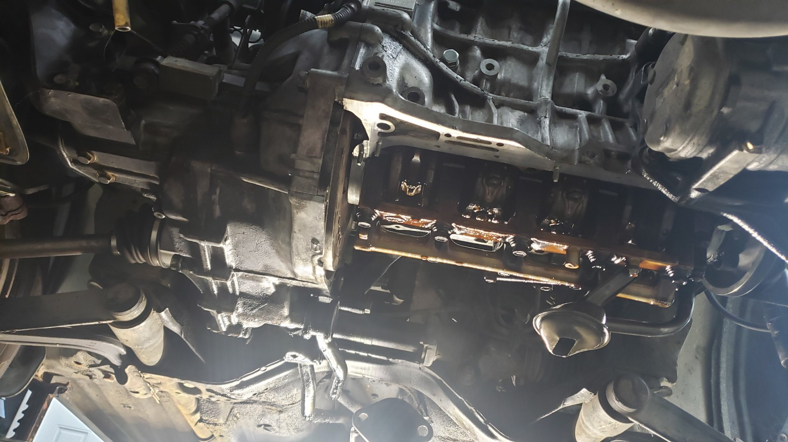

This is about half the parts you have to drop to remove the oil pan.
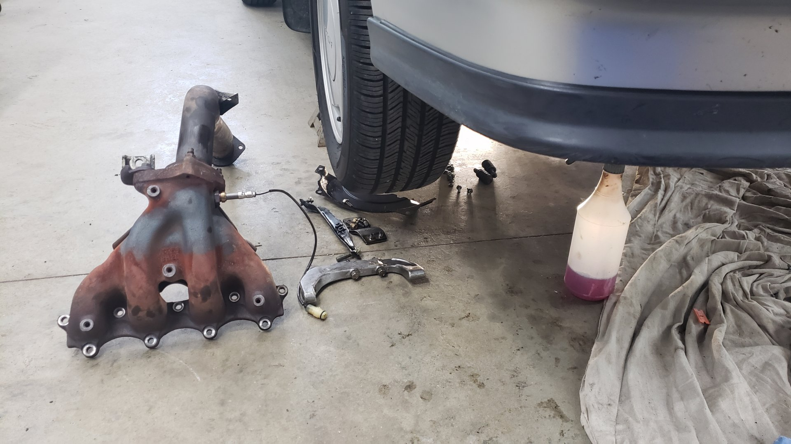

Of course I never remember to take pictures of the completed job.

# The Current State of Affairs

Since fixing all of these issues the Integra's been running smooth. It's pretty common for some issues to pop up after completing any large project so overall I'm pretty pleased with how it's holding up. I've got one more autocross event for the year lined up and I'm looking forward to it!
