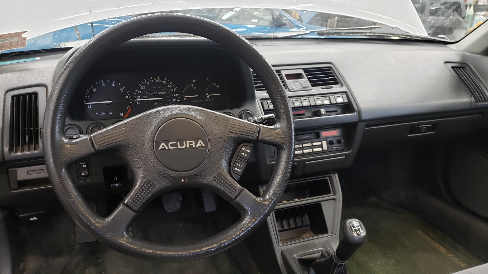
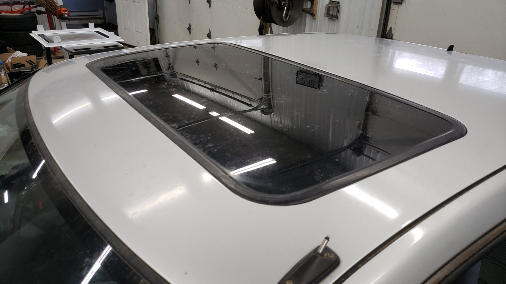
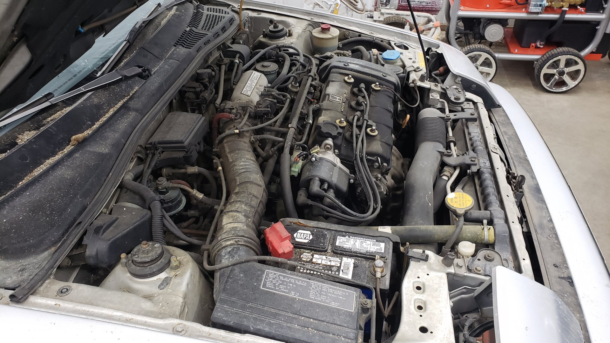
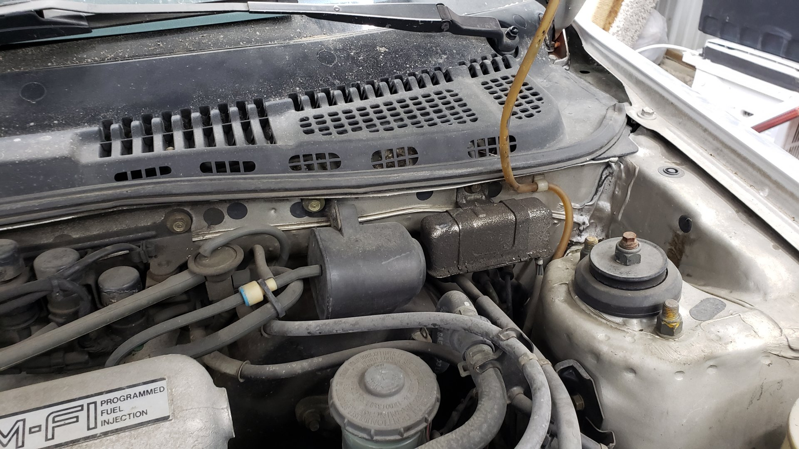
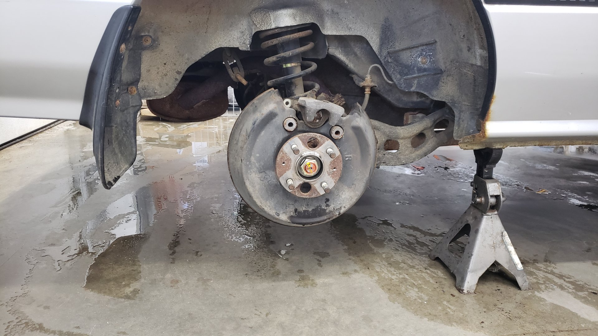

Last weekend I had the opportunity to purchase a _bone stock_ 1988 Acura Integra from it's original owner. The previous owner is a family friend of ours and has had this sitting in his garage for over 9 years now. There was no way I could pass it up.

I should mention this was a spontaneous purchase of mine and not something I had been planning. A few months earlier I joked with my girlfriend that I wanted to pick up something old and boxy because vehicles from the late 80s - early 90s are now becoming popular due to nostalgia but I never figured I'd end up with this.

I'm very happy I was able to get it.

With just a hair over 135k miles on the odometer it's held up extremely well for a car that's about to celebrate its 34th birthday.

The body does have a few rust spots but there's almost no dents or damage on any of the panels. The paint is a little dull from sitting but I'm fully confident I can make it shine like new with just a pass or two of my buffer. The interior has also held up great with only a bit of sun fading on the seats.

It even has a fully working oem sun roof.

The engine bay is a little dirty as it's had a couple of oil leaks for several years

The motor is a d16a1 (1.6 liter) paired to a 5 speed transmission. It may not have much for displacement but with how light the car is, it can hold its own.

It hasn't seen the road since 2012.

And it might be a bit overdue for it's next oil change.

But it's got a ton of potential.

# Shooting for a First Start

I couldn't resist trying to get it to start as soon as I had it towed home.

I don't know how old the battery in it was but the years have not been kind to it. A test with the multi-meter picked up 0.244 volts. A healthy battery should put out ~12v...

After checking that it had oil and coolant I decided to perform a quick compression test on it. I've lost the paper that I wrote the results on but each cylinder had somewhere between 165 - 185psi which is right within spec.

I'm glad I opted to do the compression test first because when removing the plug wires to take out the spark plugs I found that the wires for cylinder 1 and 2 were broken. I ended up ordering new NGK wires with plugs since the previous set of plugs were rusting and I wasn't sure of their age.

And amazingly with a new battery the ole girl started up!

It took a bit of cranking to get it to go the first time but now it fires right up no problem. It's worth mentioning this is with gas that has sat for **over 8 years**.

The valve cover gasket is due for replacing.

I've found signs of a mouse or two living within the engine bay. I was a little concerned at first that they might have found their way into the interior but after looking underneath the seats and everywhere I can't find any signs that they got in there.

I plan on removing the windshield wiper cowl to clean underneath it and check for mouse nests.

You can see some chew marks on the wiper fluid cap.

Lots of caked on oil and dirt.

Before going any further I opted to wash out the engine bay with degreaser.

I've got a lot of handy brushes for reaching into tight spots. I used Purple Power diluted at about 1:1 and some elbow grease.

I absolutely love how the valve cover is still in great shape. It's incredibly common to see the paint on them flake off.

Sitting for so many years hasn't been easy on all the hoses and rubber bits. I plan on replacing all of the hoses, belts, and some of the seals.

Pop up headlights! I found a button on the dash that lets you raise them without turning the lights on.

All of the stickers on the underside of the hood are still in good shape. The noise insulation mat doesn't have any signs of a mouse living behind it either!

Having gotten the vehicle to start I decided to put it up on jack stands so I could start to assess the condition of the brakes and attempt to remove the old gas from it.

By removing the drain bolt on the bottom of the tank I was able to remove about 90% of the old gas from it. I wasn't able to get of all the bad gas out but I added 5 gallons of fresh gas and will add some octane booster just to help dilute out any remaining bad gas.

I also have a new fuel filter waiting to be installed and will purge out the fuel lines before installing the new one. All 4 of the injectors are leaking fuel so I'll be replacing all the o-rings on them too.

The rear brakes were in better shape than anticipated. I'm extremely grateful this car came with rear disc brakes as I can't stand dealing with drum brakes. The rotors and pads are shot but the caliper pistons aren't seized and the caliper slide pins can still move freely.

I've noticed the e-brake doesn't stop the wheels from spinning but I suspect it just needs an adjustment.

Next steps will be to replace the rotors and pads all around and continue to look for any potential safety concerns.

With the new battery installed I started playing around with testing the electrical features. So far the only odd quirk I’ve found is that the hazard switch does not work. The blinkers work but if you flip the hazard switch on and off all the blinkers stop working until the key is removed and reinserted.

[Next post]()
