With February quickly approaching, I'm starting to feel like I'm running short on time to get my [recently acquired 1988 Acura Integra]() road ready. My current goal is to have this vehicle on the road for spring and it's been harder to make progress on it than anticipated.

While it may have taken me almost two months I finally completed replacing all four brake calipers, rotors with pads, and both parking brake cables. I also spruced up the fuel system, repainted some of the trim pieces, and took it on my first test drive.

# Fixing the Fuel Leaks and Bad Gas

Like I mentioned in my first post this car sat in a garage for about 8 years. While the garage may have kept it out of the elements, sitting around for that long is just hard on a car. Most of the gaskets on the engine are showing signs of leaking and pretty much every consumable part needs to be replaced.

One of the issues I needed to figure out was how to clean out the fuel system since it's had bad gas sitting in it for so many years.

I started off by draining the gas tank via it's drain bolt to get as much of the bad gas as I possibly could out. All in all, I managed to remove about 6 gallons from it and I added 5 gallons of fresh gas to replace it. I also added some fuel injector cleaner for good luck.

And just to be on the safe side, I replaced the fuel filter.
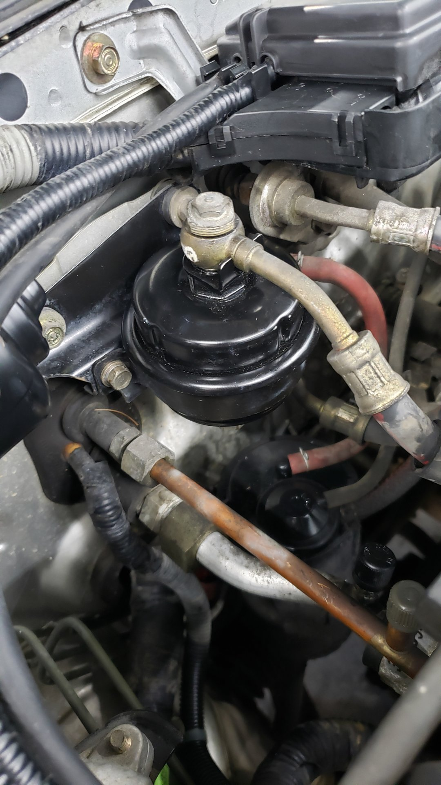

All 4 fuel injectors were leaking at the seals so I replaced the upper and lower seals. They were also given a quick cleaning to remove all the gunk from the tips.

The injector seats themselves didn't requiring any cleaning.

Prior to re-installing the injectors a bit of wd-40 was lightly wiped on their o-rings and seals just to ensure they'd slide right into place.

Each injector was lined up with the little triangles on the fuel rail as per the service manual and then the rail was torqued to spec.

Just to be sure there wasn't any more leaks I gave the vehicle a quick start and closely looked everything over.

# A "New" Air Filter

The air filter in the car looked a bit worn out so I ended up picking up a replacement.
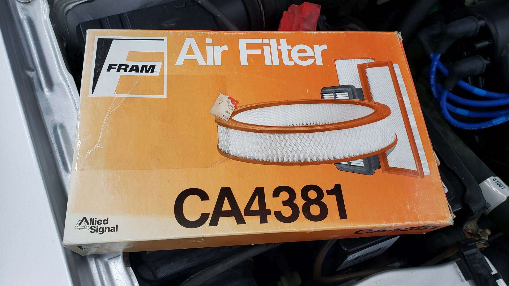

Based off the copyright date on the box my new air filter appears to be older than me! I think it sat on a shelf forgotten somewhere for a long time.
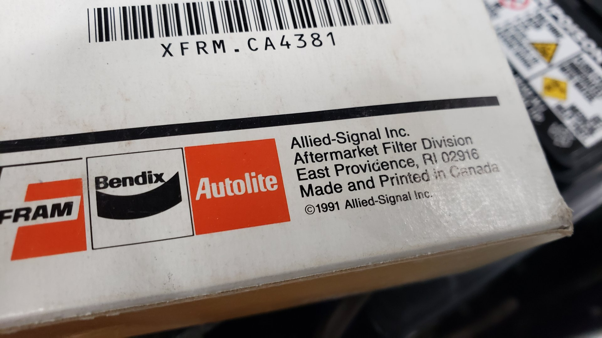

# Repainting Window Trim

Some of the trim pieces on the car around the windows had paint flaking off. I forgot to snap a picture of them before removing them but these pieces sit below each rear quarter window.

They had almost no paint left on them.
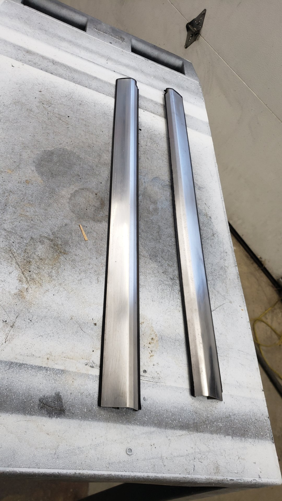

I also removed all 3 wiper arms so I could repaint them. (I forgot to snap a picture of the rear wiper arm)

And the trim that sits above the door windows.
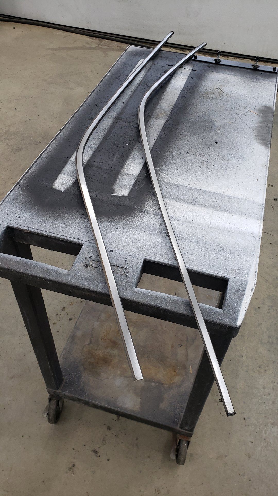

A couple coats of SEM satin black trim paint on everything later we had things looking perfect.
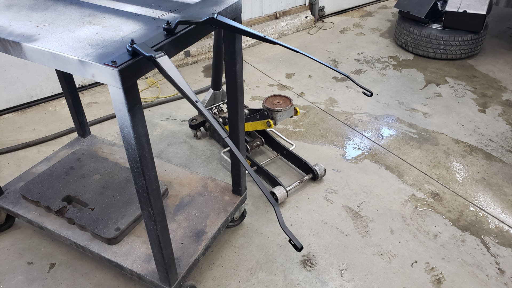

All 3 wipers were replaced as well with brand new 18" Tricos.

All the trim looks good as new!

While I had the wiper arms off I also took the time to remove the wiper cowl and clean out underneath it. I mostly did this because I wanted to check for any mice nests.

Cleaned up.

Even down in the blower motor area things looked clean. I was certain I'd find a mouse nest in here.

Two of the caps covering the wiper cowl bolts were damaged due to me prying them off so I had to order some replacements from an Acura dealer. I'm amazed they still stocked them.

# Deleting the Exhaust (for now)

With the outside looking pretty good I decided to focus on working underneath the car. I needed to remove just about all of the exhaust from the car because it was rusted beyond saving.

Plus it was in the way of the parking brake cables that I'd need to get to.
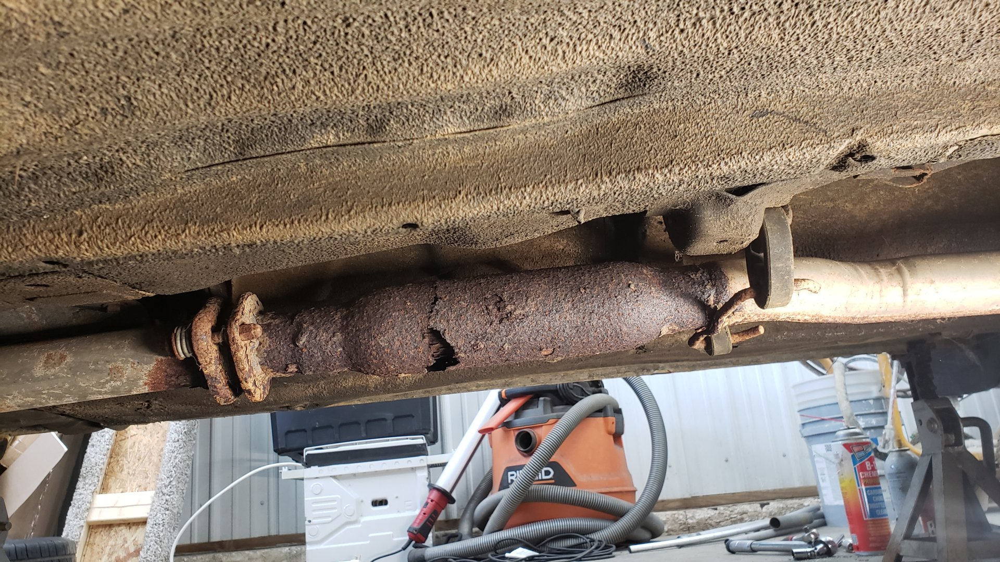
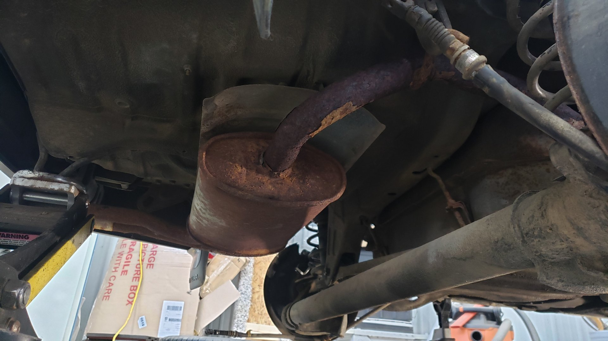

Nothing worth salvaging here so a few cuts with the sawzall later and I had everything removed. That pile of rust is all from the exhaust.

My plans to fix this are to build a new custom stainless set up. It'll likely be the last thing I do so it won't be for another month or two.

I'm hoping to find a fairly quiet muffler for it that is barely louder than stock becuase I want to keep things very subtle.

# Addressing the Brakes

The brakes were completely shot. All 4 calipers were seized, the parking brake was in-op, and everything needed to go.

Comparison of the new rear rotors vs the ones I removed.

Before I found out the front calipers were seized I was planning on salvaging them.
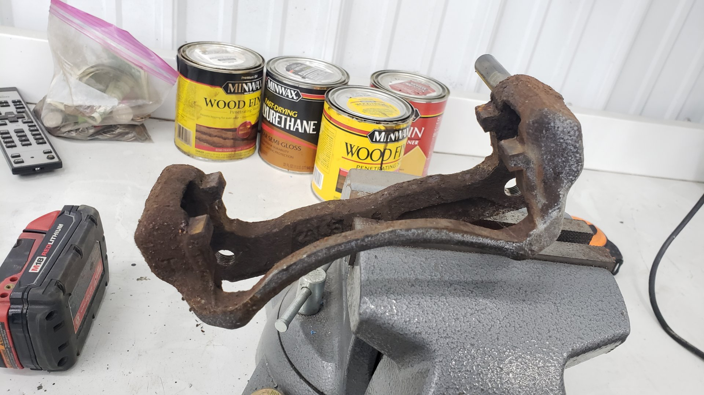

Everything was fairly easy to remove. Being on the cautious side I gave every bolt a quick shot of pb blaster but I'm not sure that was needed.

The only parts I was a little concerned about removing were the rubber brake hoses since the s were rusty and I didn't want to have to replace the hard brake lines.

Front caliper. Completely seized.

After sourcing all 4 new calipers I took the time to paint them. This car will never be a show car but I figured a bit of extra time now would keep the brakes looking good for the next 5 to 10 years.

I opted to stick with a very bland color (Duplicolor Cast Aluminum) because I wanted them to look factory. Each caliper was given 2 coats of primer followed by 3 coats of color.

The calipers were prepped for paint by scuffing with a red scotch-brite pad and I treated one of them with phosphoric acid because it had some minor rust pitting.

That's an old one in the background.

While assembling them I was torquing everything to spec and accidentally used the wrong torque spec for one of the parking brake bracket bolts which promptly stripped out the threads on my brand new caliper.

I had to use a heli-coil to save it.
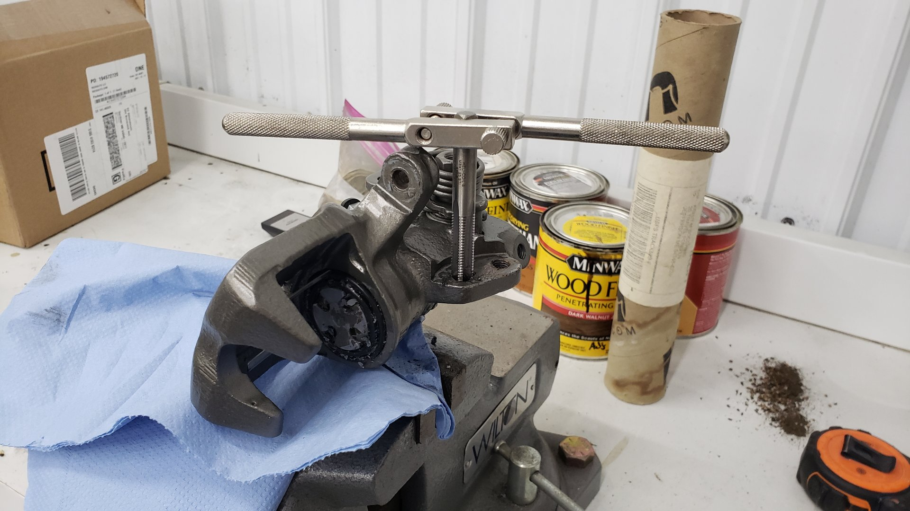
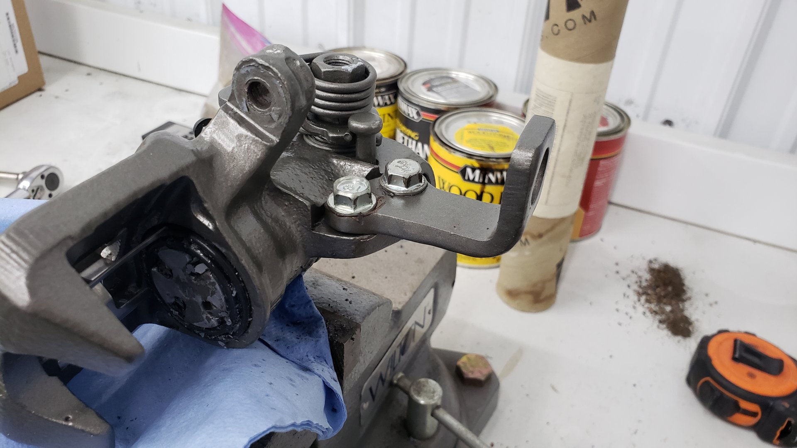

Side by side comparison of a painted front caliper (left) vs non painted (right). The paint is merely to prevent them from rusting.

After painting the other front caliper.

# Parking Brake Cable Woes

One of the issues the previous owner mentioned was that the parking brake didn't work. To try and investigate why I popped the center console off to take a peek at the tensioner underneath. The tensioner itself looked fine but it's a bit suspicious why the adjuster nut is fully tightened yet the parking brake isn't engaged even with the lever fully pulled.

It looks like the cables themselves stretched out from age and due to the rear calipers being seized. I was hoping I could just adjust them but it looks like I'll have to replace the cables.

To remove the cables you need to go underneath the car and remove an exhaust heat shield.
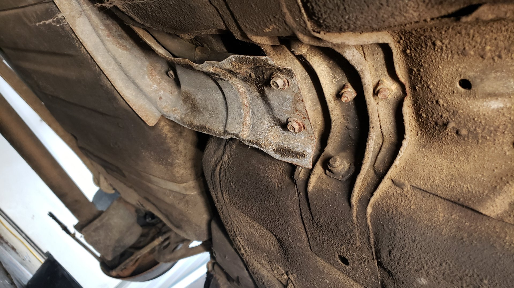

Then after you've disconnected the cable ends from the equalizer inside the car you can pull both ends of the cable down and out from underneath.

Finding the right cables was not easy. There's 1 more cable not pictured as it was already installed on the car.
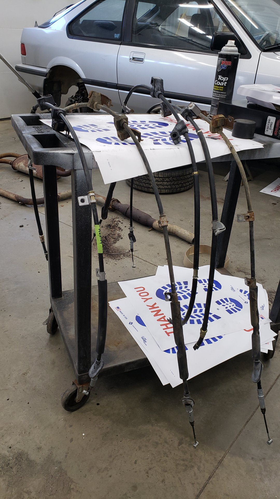

The first passenger side cable I ordered fit like a charm but I couldn't find a driver side cable that would work. The 1st gen Integra comes in a 3 door or 5 door version and each of them has a different wheelbase by about 2 inches.

Most of the parts between the different bodies are identical but the parking brake cables are not. The 5 door model parking brake cables are about 2 inches longer and although the part manufacturer's claim the cables will work in either body style I've found that to be untrue.

Unfortunately the 3 door driver side cable has been discontinued and the only driver side cable I could get was for the 5 door.

It's hard to compare the length as they won't sit straight but you can see one is slightly longer.

Since I couldn't get a driver side cable, but I could get a passenger side cable I decided to come up with a bit of a work around by buying a second passenger side cable (Ray Bestos BC94397) and swapping driver side brackets onto it.

The cables for each side are identical in length. The only differences are that the mounting brackets are mirrored.

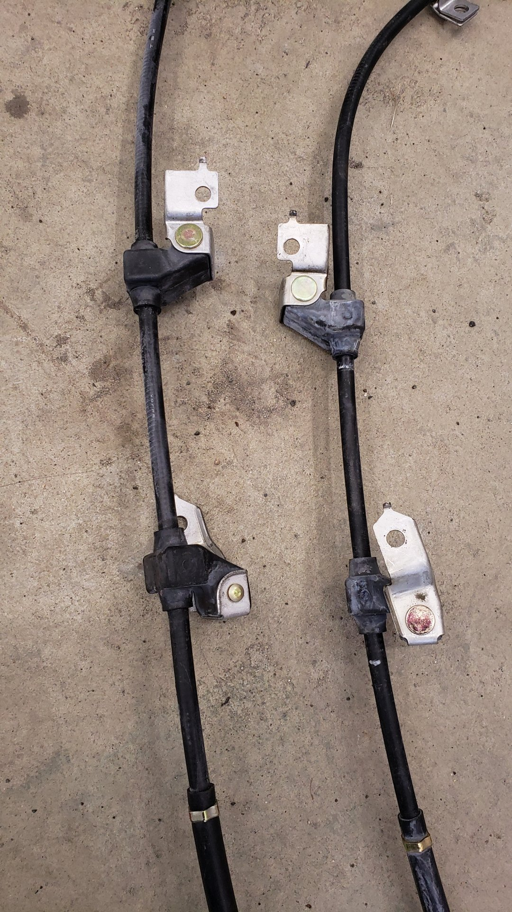

2 of the brackets were riveted on but I figured out I could grind one side off and hammer out the rivet with a punch.

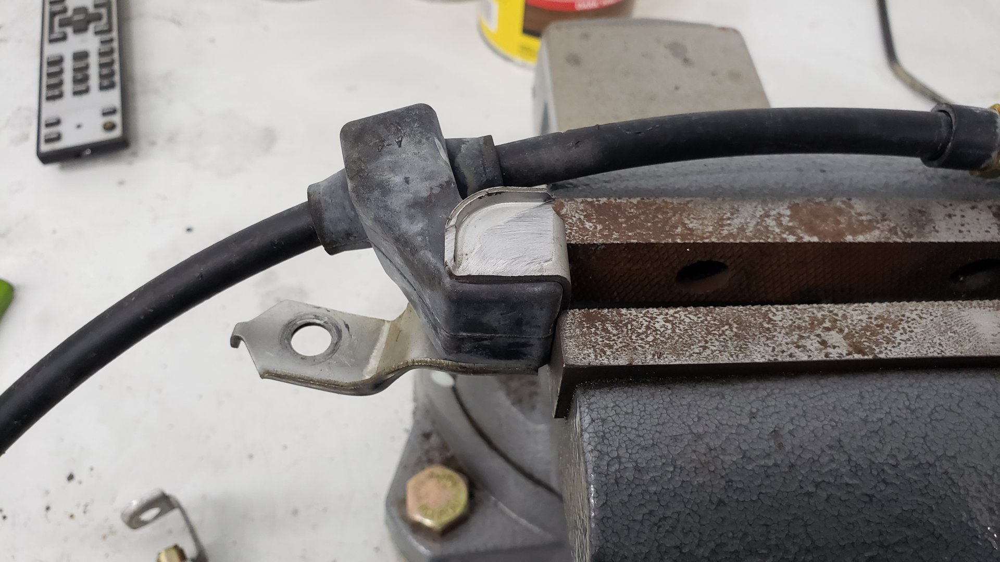

Then I swapped the driver side brackets onto my bare passenger side cable.
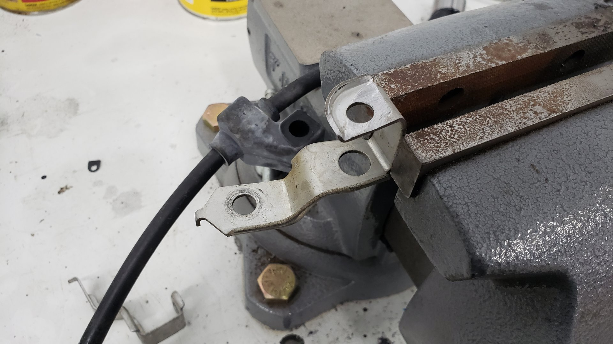

To secure the brackets I welded a few tacks. This proved to be more difficult than anticipated due to the heat from welding burning the rubber behind them. All of the welds were covered with paint to protect from rust.

After that I installed my new "driver-side" cable onto the car and connected the the cables to each rear caliper.

# All New Brake Hoses

I opted to replace the rubber brake hoses since the original ones were over 33 years old.
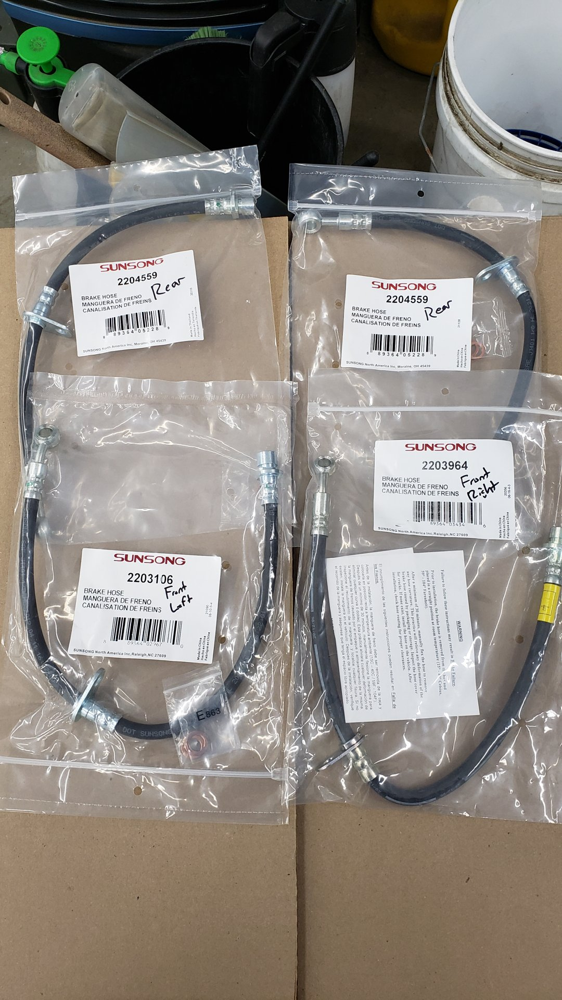

I've ordered a new set of front shocks since I'm fairly certain the ones currently in the car aren't the correct ones. There's no way to properly bolt the brake hoses to them.

# Bleeding the Brakes

While I was busy trying to figure out the parking brake cable situation I left the brake calipers disconnected for almost a month and let all the fluid drain out from the lines. I did this as a lazy way to clean out the brake lines and because I didn't see any harm in it.

Something I didn't account for though was that it would let the brake master cylinder run dry. And anytime the master cylinder runs dry it means you need to bench bleed it.

It's not overly difficult to bench bleed a master cylinder because all you need to do is loop both brake lines back into the reservoir so you can pump the brake pedal to remove all the air from it. Dorman sells a cheap kit to do it (buy 2 of them!)

The only part that was somewhat challenging was removing the two brake lines from the master cylinder due to everything in the way.

Once the master cylinder was bled I used a mity-vac hand pump to bleed the brake lines.

I made sure to follow the bleeding sequence from the factory service manual because the brake lines on this car are routed a little differently than most vehicles.

To test out the brakes I snuck it out of my shop and took it on my very first test drive. I can happily report the brake pedal feels nice and firm and the brakes stop it with no issue. The parking brake works great too!

Repainting the window trim really turned the cars appearance around. The body itself isn't perfect as it has some rust on the driver side quarter panel and rear hatch but I think it's mint as is. Like I've said before this is not a show car.

The stock rims are in great shape too. (I have the center caps sitting inside it)

# Next Steps

I'm currently awaiting a bunch of new suspension bits to arrive and hopefully will start on that next weekend.

While giving the engine bay a good once over I noticed the head gasket is weeping oil in a couple spots. A compression test showed each cylinder is right in spec and I don't see any signs of oil or coolant mixing so I suspect it's a purely external leak.

The leaks are big enough though that I feel it needs to be addressed and since I already need to do the timing belt I may as well do both at the same time.

[Next post]()
