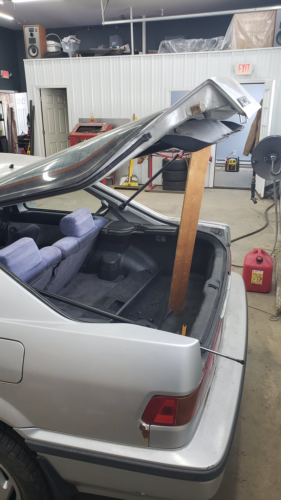
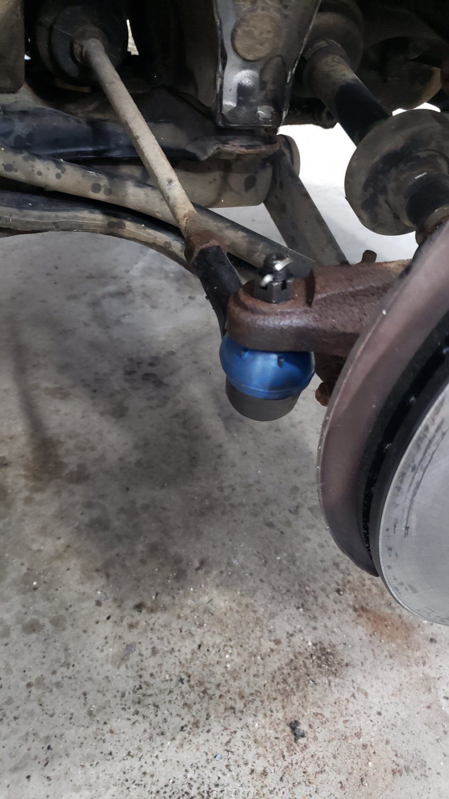
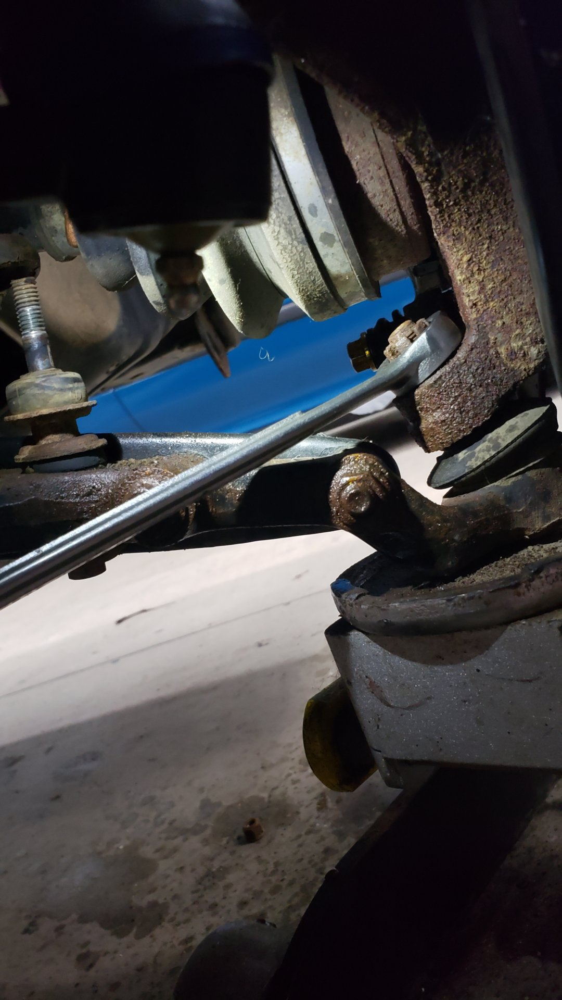
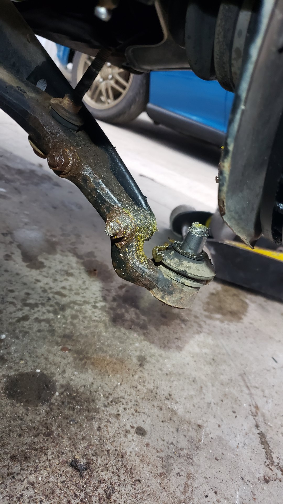
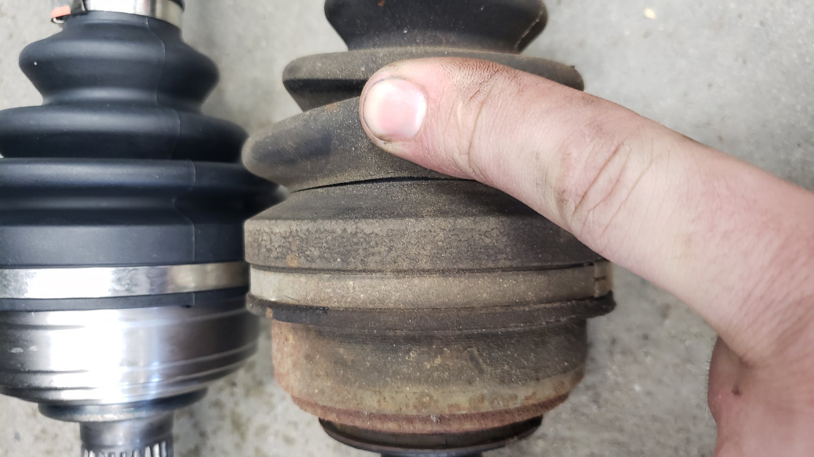
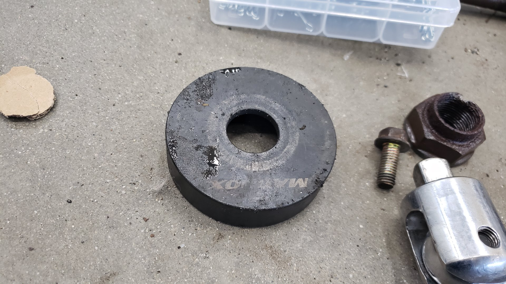

It's been just under a month since my last post about fixing up this Integra and I've made a ton of progress. I've successfully completed replacing most of the suspension including all four shocks, outer tie rods, ball joints, sway bar bushings, cv axles, and front lower control arms.

Honestly, the most amazing part has been that I haven't snapped a single bolt.

Even the lower bolts on the rear shocks came out with no issue. (They are notorious for rusting in their bushings and I had to cut them apart on my 1993 Civic when swapping in coilovers.)

Almost every bolt or nut that I've reinstalled was given a healthy dab of anti-seize. I don't anticipate ever replacing most of the components I've swapped in but I figured a little extra work now would pay off massively down the road for future me.

The body has a bit of an AE86 vibe to it.

I'm putting a lot of effort into making this a very pleasant vehicle to drive. My goal is to fix all of the small quirks in it and add some quality of life mods to it. I really want this to be a car I can trust to take on a road trip.

One of the minor issues it's had was that the rear hatch struts were worn out. The previous owner included a free piece of wood that could be used to prop up the hatch.

While it's not a major safety issue I've had a falling hatch hit me in the head before and it's quite unpleasant.

Much better.

# New Shocks

Just because of how old this car is, there's a lot of things on it that are worn out. None of the shocks were leaking any fluid but I found they didn't work like they should.

The shocks in the picture below are off different lengths because I compressed the original one I removed from the vehicle to see if it would slowly expand back to it's original length.

It did not.

I'm fairly certain the front shocks that were previously on it were for the wrong vehicle. There was no way to properly attach the brake lines to the shock.

Front bump stops were basically non-existent.

Much better. I used some spare bolts (m8x1.25) I had laying around to mount the brake lines.

Tie rods were looking a little questionable.

I also decided I wanted to replace the lower ball joints as a preemptive safety measure. Unfortunately on this car it means you have to replace the complete lower arms though because they cannot be pressed out.

At the time when I was replacing the lower arms I tried to do so without removing the CV axles. (I hadn't noticed the CV boots were rotted yet and due for replacing.)

There isn't much space down there but you can just barely fit a 19mm wrench on the nut.

Sadly the nut got stuck and the entire ball joint stud started to spin. I ended up having to sawzall the ball joint stud in half since I couldn't free up the nut.

Old vs new. The new ones are just stock spec.

# New CV Axles

Like mentioned above when I was working through the front suspension I noticed the CV axle boots were dry rotted and starting to crack.

Replacing the axles isn't overly complicated but I was pretty concerned about freeing up the axle nuts.

I ended up having to use a 4 foot breaker bar to break them loose. The nuts were on so tight that the brakes on the car had to be engaged otherwise the car was sliding across my garage floor when I was yanking on the breaker bar.

They made quite the pop when they finally busted free.

Passenger side axle came out nice and easy.

Old vs new. I'm pretty positive the axles in the car were original.

If you look closely at the boots you can see the cracks starting to form. I didn't think they'd last long once this thing hits the road.

With the CV axles out it was the perfect time to replace the axle seals.

I used an adapter from a wheel bearing tool kit to gently tap them in.

Before installing the axle I applied some grease to the axle and the axle seal itself so it'd be properly lubricated and wouldn't leak.

Passenger side axle re-installed.

Since the lower control arm was new I figured it'd be best to replace the sway bar links at the same time.

To replace the driver side axle seal you have to temporarily remove the half shaft. It's held in place via 3 14mm bolts on the backside of the engine right by the oil filter.

Driver side ball joint came right apart easily.

I had a **hell** of a time removing the driver side axle. The axle was completely stuck in the steering knuckle. I sprayed it multiple times with PB blaster and pounded on the thing with a sledge hammer for close to 10 minutes before it started to budge.

I almost thought it was going to take a press or torch to break it free.

When re-installing the new axle I made sure to use some anti-seize on it.

So many new parts

The only components still original on each side are the knuckles and the wheel bearings.

Fun fact: There's no coil springs on the front of this vehicle because it uses torsion bars.

Next up is the timing belt and head gasket!

[Next post]()
