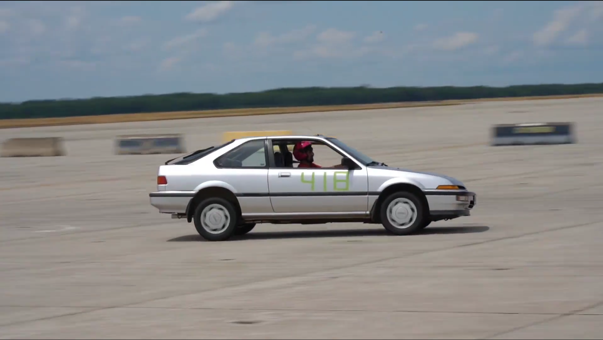
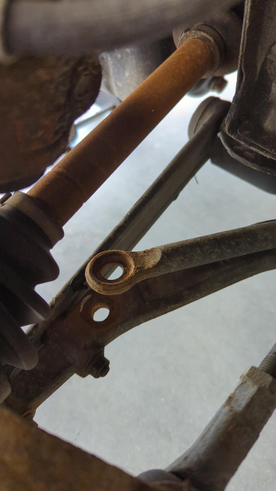
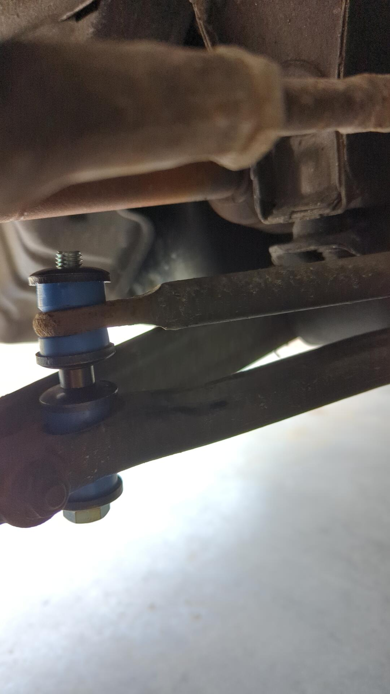
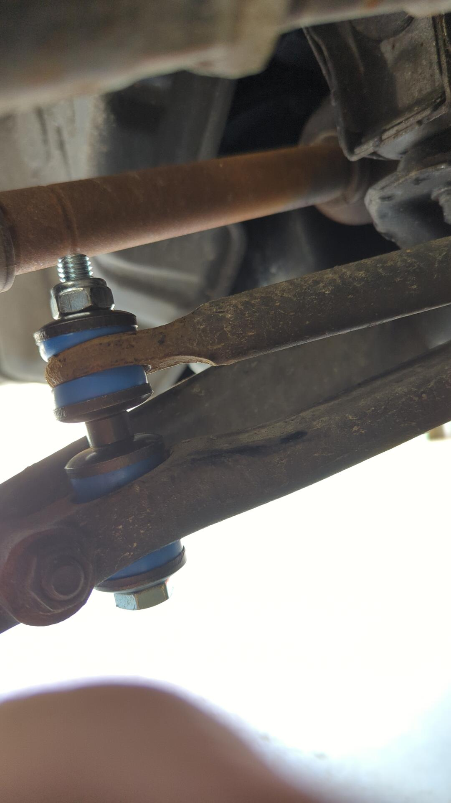
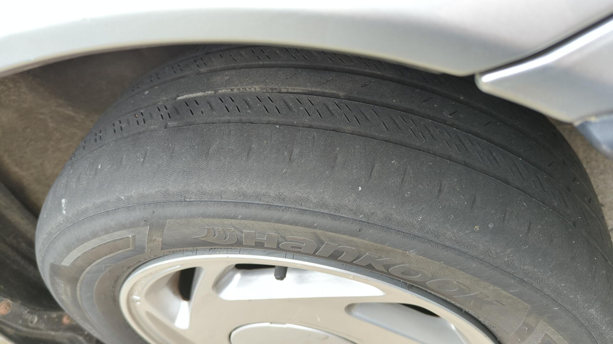
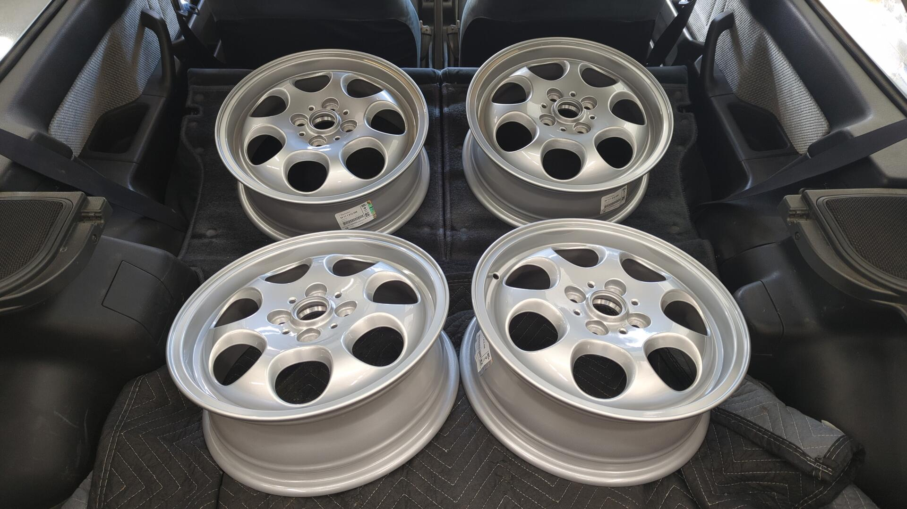
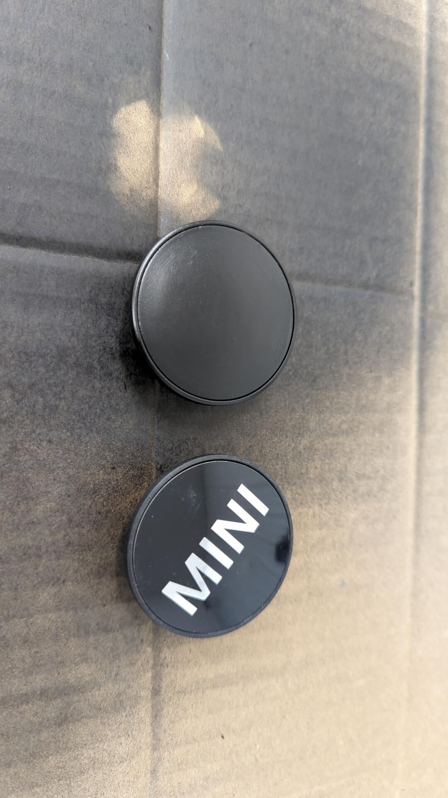
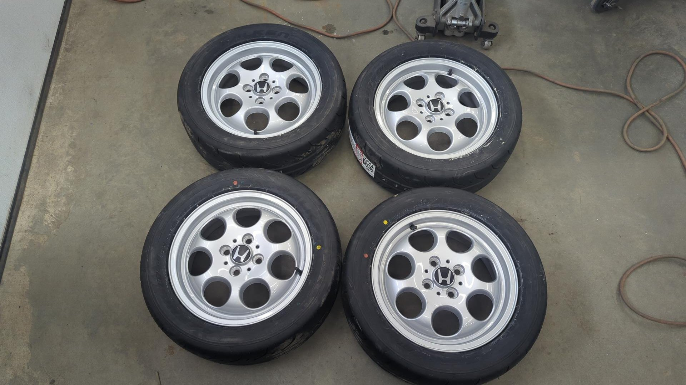
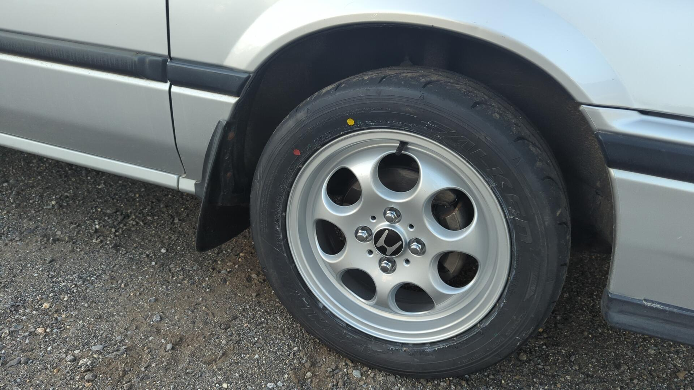

I've been having a blast auto crossing the Integra. It doesn't have the most power, and it's got enough body roll to lift a rear tire when making tight turns but I feel like I'm learning a ton and slowly getting better too!

This was from my first event last year before I had my own helmet. All of the loaner helmets the club had were pink.

And here's the car during my third event last year. It's running a mismatched rear tire because I had a tire damaged during the second event and was really lazy about getting the tire fixed in time.

The spare was off my Civic and while it was a full size tire it was narrower and had less grip. It gave the car a tendency to want to oversteer when going into right hand turns which made things interesting.

I did not take either of the above photos and can't find the original posters in the Facebook group. Apologies for no credits.

# I Keep Snapping Sway Bar Links

[Other than blowing the clutch the day after my first auto cross event]() the only other components on the car that has broke from racing is the front sway bar links. I was running Mevotechs which I thought were on the higher end but they don't appear to last more than a race or two.

I snapped the passenger side front sway bar link last year during the second event and decided to upgrade it to a stronger bolt. At the time I bought two bolts and intended to replace the driver side one, but never got around to it...

Well the driver side one finally snapped a month ago when I was attending the novice school event the local club was hosting.

I honestly don't notice much of a difference in how the car handles when the front sway bar is working or not. I'm sure it makes a difference but with so much body roll it's hard to tell.

M10x1.5x110mm bolts make for perfect replacements. A 100mm bolt would be long enough but it's easier to start threading the nut on with a bit of extra length.

# Finished Off My All Seasons

I've officially managed to wear out the new tires I installed on the Integra last year. The rears still have some good tread but the fronts are completely done for.

Some of the wear is from my poorly eyeballed alignment but a lot of it is from the tires rolling in on themselves on hard turns. I was also driving the car harder than I should have at times on the course and I could feel the tires spinning a lot.

# Time for 200TW Tires

Not wanting to burn through all season tires every year I decided it was time to pick up a second set of rims so I could run some 200tw tires for extra grip.

I'm racing the Integra in H Street which is a very restrictive class. It doesn't allow for many mods but it does allow for stickier tires, and a slight change in rim size.

The OEM wheels are 14x5.5 with a 40mm offset. It took a lot of research to figure this out.

SCCA solo rules for H Street allow me to jump up 1" in diameter, but width must remain the same. Offset must also be within 7mm of the original wheels offset too.

A 5.5" wide rim isn't very common anymore so that didn't leave many choices.

My main goals for the new rims were they needed to be reasonable priced, would look relatively natural on the car and not overly sporty, and also work with a common tire size so I'd have more tire options available.

I ended up settling on a set of Mini R81 Imola rims.

They've got the exact same hub bore (56.1mm) so there's no need for hub centric rings and are 15x5.5 which is perfect since 15" tires are super common. The only real difference between them and Honda rims is that they use an acorn style lug nut with an angled seat whereas Honda lug nuts have a curved seat. This isn't a big issue by any means since it's super easy to find m12x1.5 lug nuts. (I bought 4 sets of Dorman 711301)

It was pretty difficult to find blank center caps for them so I ended up scuffing up the OEM center caps and painting them black.

For tires I decided to go with 205/50/15 Falken RT660s. I've heard nothing but good about the RT660s so it seemed like a perfect first choice to try. 205s are pretty wide for a 5.5" wide rim but the sidewalls are only a little pinched.

Interestingly enough the new tires / wheel weight 1.2lbs less than the OEM rims + 195/60/14s.

The RT660s + R81 Rims weight in at 33.2lbs whereas the OEM rims with all seasons were 34.4lbs each.

They look pretty nice on the car too. I really wish I could reduce the massive wheel gap without being thrown into a much higher auto cross class.

The first two events with the new wheels were a huge success.

Above was taken by Cooper Boardman

Overall it felt like my times were better and I managed to beat a few higher classed cars but I still need to work on my driving skills. I'm not going to mod the car any further until I get more seat time in and feel confident I'm maxing out what the car's capable of.

When I reach that point I plan on adding a rear sway bar to try to tame some of the body roll and help keep the front wheels planted.

[Next post]()
