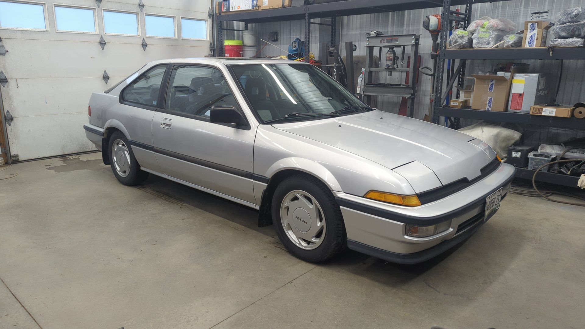
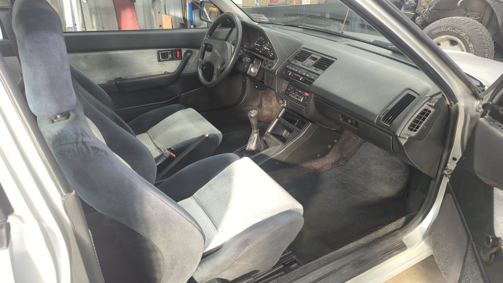
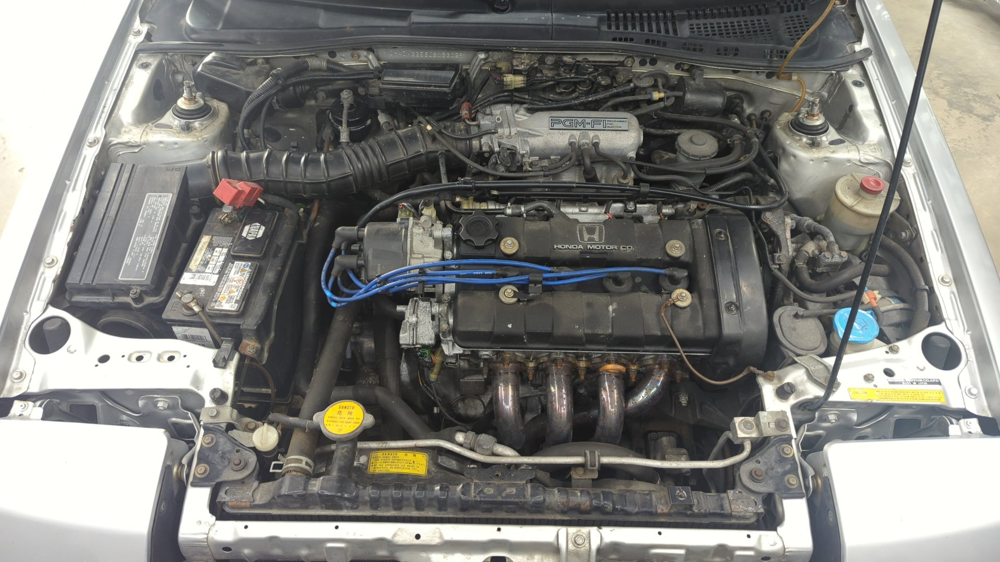
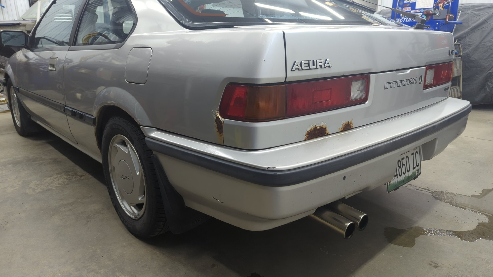
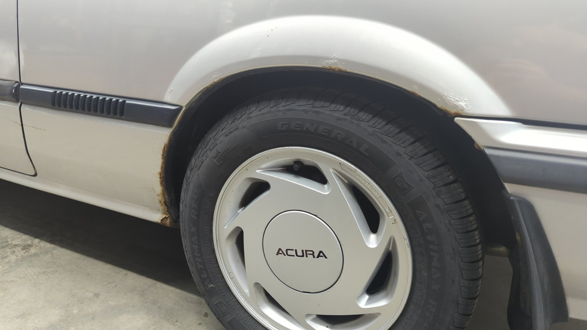

The Integra has been a fun project but after 4 years of ownership I decided it was time to sell and as of last weekend it's no longer mine. For the past several months it hasn't seen much use and I don't see that changing as my XJ from Colorado is my new daily. 

The Integra was in solid shape other than some rust on the backside but I already have too many projects so I figured I should sell it to someone else who could enjoy it and fix it up more.

How it looked when I sold it.

The rust on the back.

All in all it was a fun car and I had a blast auto crossing it. I hope the new owner enjoy its too.