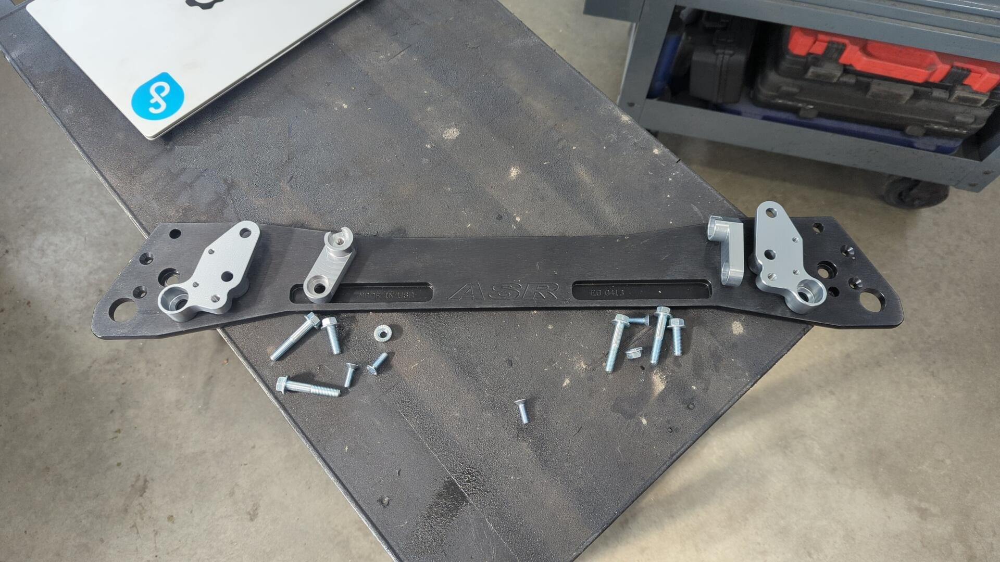
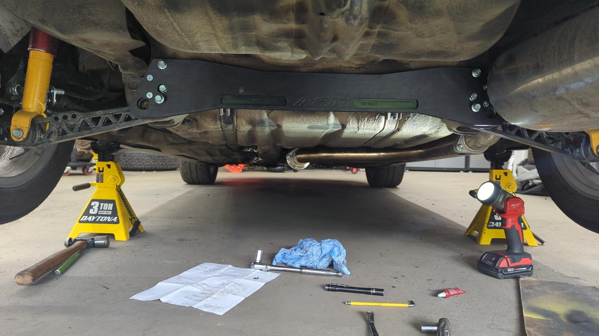
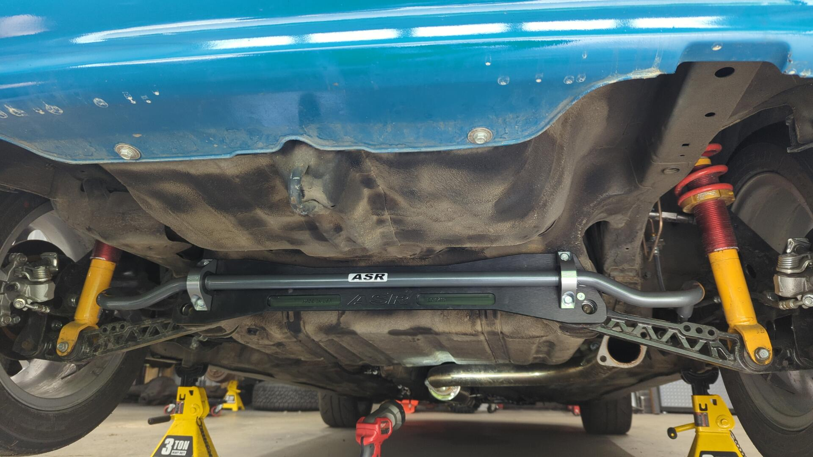
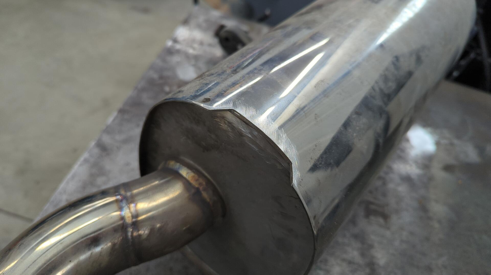
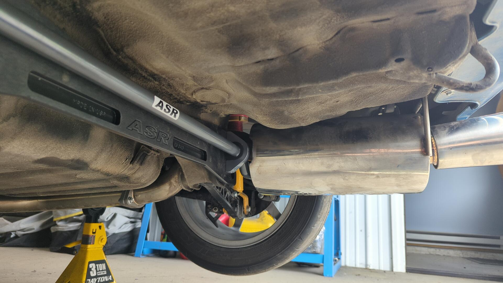
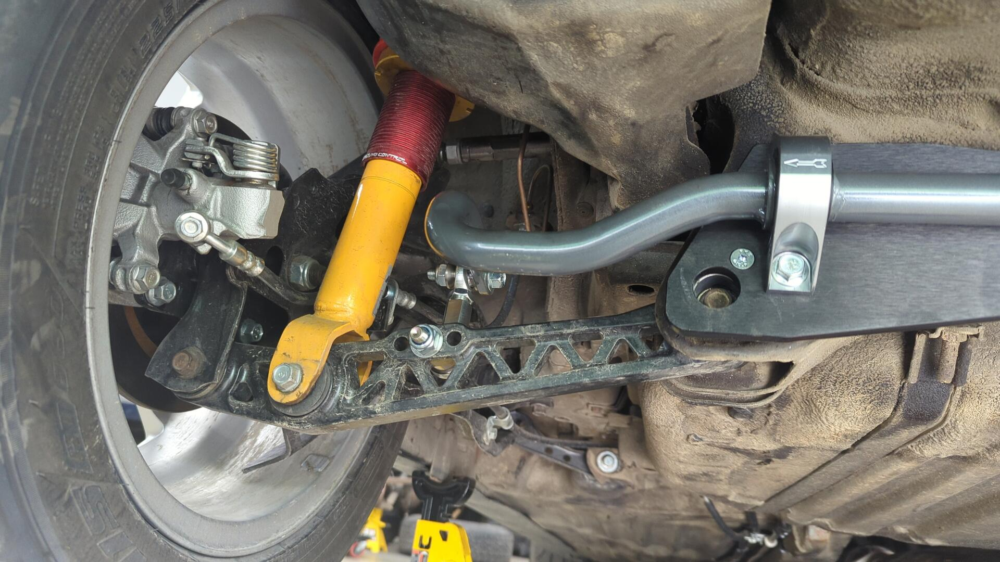
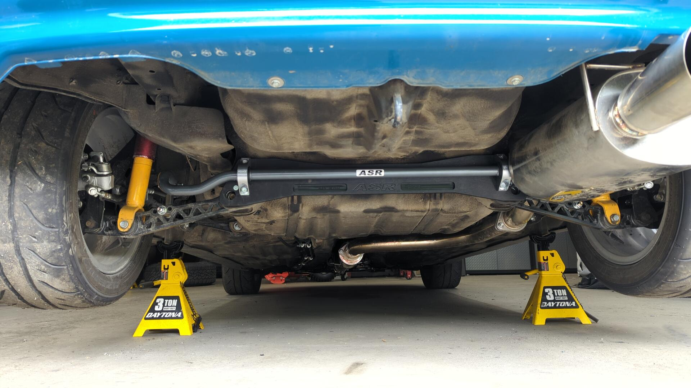

After having ran several autocross events with the Civic, I felt it was time to add a rear sway bar. The Civic was handling good on the course but I didn't care for the understeer it had and adding a rear sway bar would be the easiest way to take care of that.

My Civic was originally a DX which means no front or rear sway bar but it's also already running a set of OG Function7 rear lower control arms that have sway bar link mounting holes so it wouldn't take much work to add a rear bar.

In terms of sway bars I ended up going with the 24mm sway bar / brace kit that ASR sells. I liked that it had some adjustability to it, and also that it was a proven setup. I went with the brace because a 24mm bar is fairly large and there's been several documented instances of EG civic rear subframes tearing due to a large rear sway bar. (Factory setup was a 13mm rear bar so the sheet metal was never designed to handle a larger one)

## Installing the Subframe Brace

There's a lot of space in the back of an EG so it's fairly straight forward to add the brace. You pretty much unbolt the rear LCAs, pop on the frame with some new bolts and then reinstall the rear LCA bolts.

Normally adding the sway bar is just as easy but it turns out my Yonaka muffler is in the way of the passenger side mounting bracket so I had to remove the muffler. This was unexpected because prior to purchasing the setup I double checked if anyone else had ran into fitment issues and didn't see anything.

## Notching my Muffler

The muffler and the rear sway bar bracket were only interfering with each other by about 1/4" so I was able to clearance the muffler by cutting a notch in it's rear seam.

I used 308L wire so the welds won't rust. They're mig welds so nothing pretty.

Just enough space now.

## The Links

Links installed. I went with the middle hole (medium stiffness) on the LCA and furthest hole (softest) on the bar. (Update 2024-08: switched to the inner bar hole for more stiffness)

## Final Results

I'm pretty happy with the setup. I like how the black is nice and subtle and it looks a lot nicer than the OEM setup. We'll see how it performs on the course soon.

