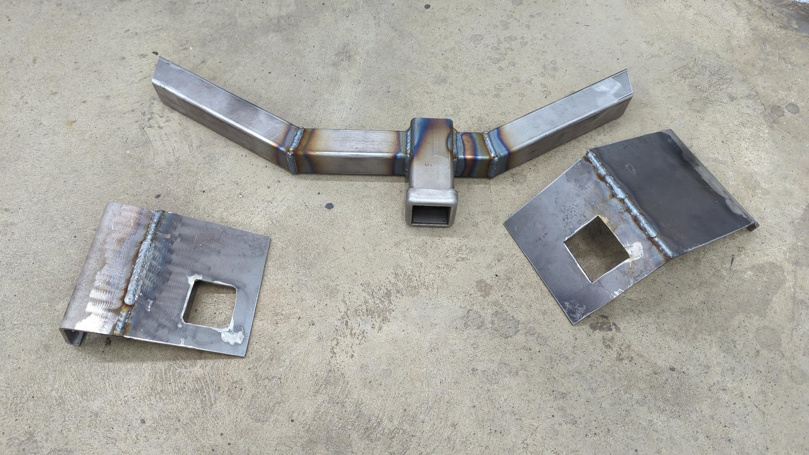
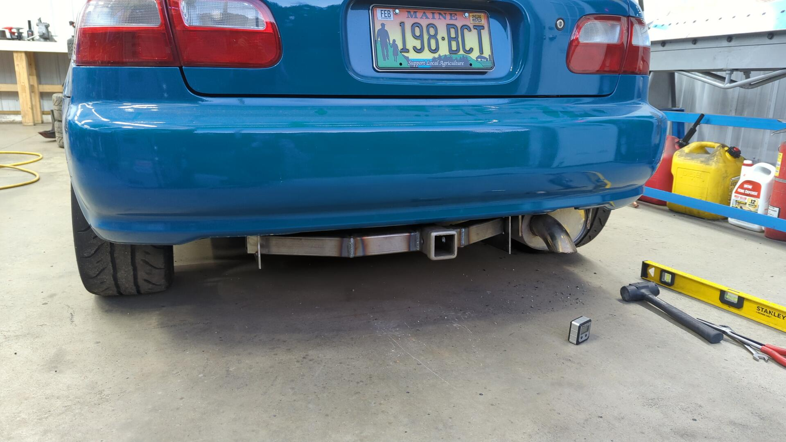
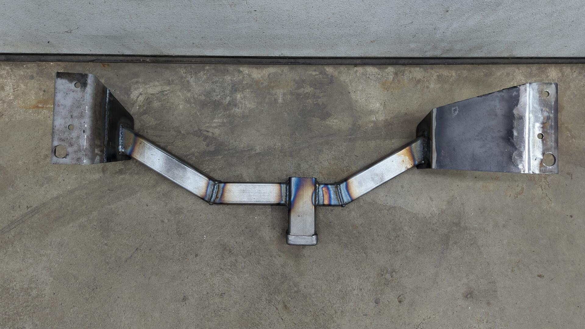
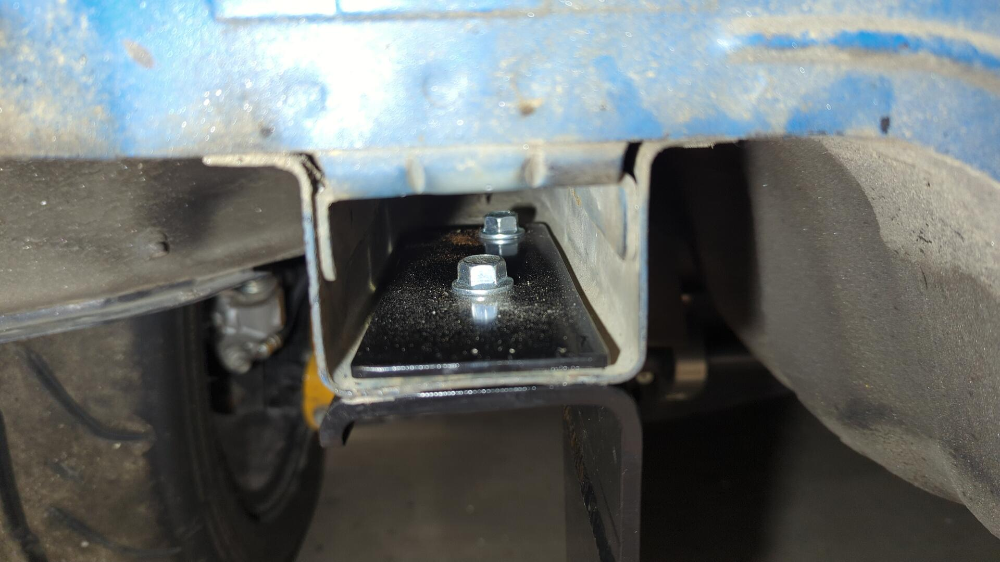
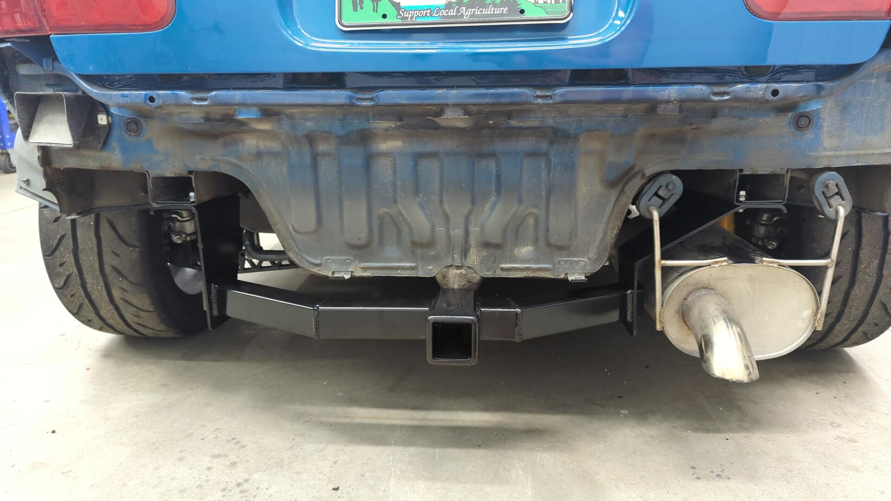
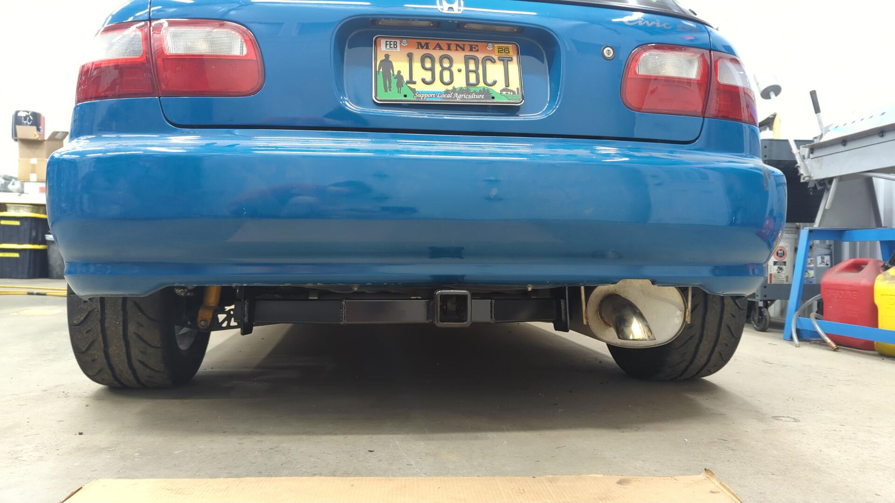
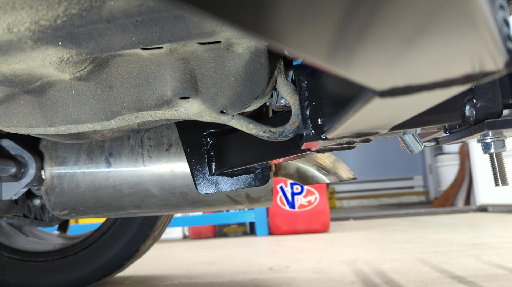
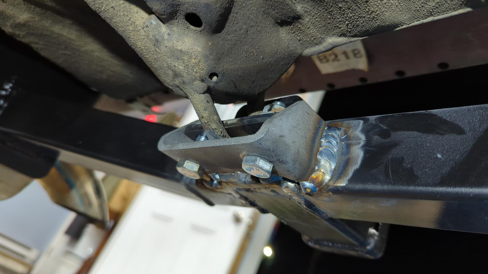
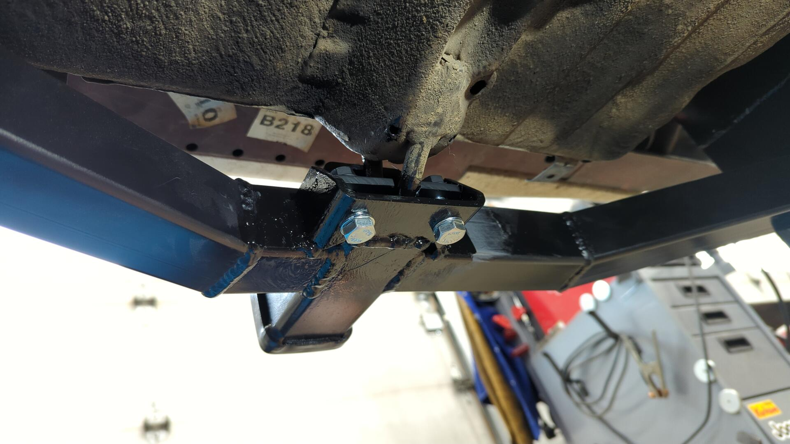

I recently built a [mini bike]() and needed a way to haul it around with my 93 Civic hatch. Even though the bike is small enough that it'd fit inside the Civic, I'd have to lay it sideways and I didn't like that because it could potentially leak oil or gas so I figured my best option would be to use a hitch cargo tray.

My Civic doesn't have a hitch receiver but companies like Reese or Drawtite sell receivers that are designed to work with 92-95 Civics sedans so I figured I could just order one of those and modify it to fit. Getting a seller to actually ship me one of these units ended up being a lot harder than expected. I attempted to order a receiver off Amazon but after waiting a week with no updates on the order I ended up cancelling it and tried order from an Ebay seller. The Ebay order also fell through and I eventually cancelled it after no updates due to being tired of waiting.

At this point I figured my best bet would be to build a custom receiver. A custom setup would be a lot more work but it'd also be cheaper, I'd be able to design my receiver to work with 2" hitches instead of the 1-1/4" hitches that the off the shelf units use and ensure it ties into the unibody nicely to handle the tongue weight of the bike / cargo tray.

After fiddling with some drawings to come up with a rough idea of what I wanted I began by cutting up some 3x4 3/16" tube to use as mounts on the unibody frame rails.

Each mount uses two pre-existing frame holes and two m10 bolts so I didn't have to modify the body in any way.

Then using a prefabbed 2" receiver tube as my starting point I slowly built it into a fully blown receiver using some 2" 1/8" tube and 3/16" plate I had on hand. This was trickier than it sounds and took a lot of test fitting because I needed to work around my exhaust and also ensure the receiver tube was centered with the car.

Once it was all properly positioned I tack welded the pieces together and did a bumper fitment test.

The receiver looked perfect with the bumper and I was also able to still reach the two lower mounting bolts for the bumper that sit just above the receiver.

Then the receiver was pulled off the car again so it could be welded up.

Even though it's built from 1/8" tube and 3/16" plate the entire setup only weighs 19.8lbs.

Some paint later. The additional plates sitting in front of the receiver are 1/8" thick and will be installed inside of the Civics frame rails. The frame rails are so thin (~18awg) that I was worried that too much weigh on the receiver would rip the bolts out.

Installed.

It looks awesome.

## Adding One More Mounting Point

With the receiver all done I did a test fit with the cargo tray and although it felt secure I noticed the receiver was moving ~1/4" downwards when you applied a moderate amount of weight on the tray. The receiver was solid so I suspect it was the body of the Civic flexing.

I wasn't a fan of the flexing since it could eventually fatigue the unibody and cause it to crack so I opted to add an additional mounting point for the receiver by the factory tow hook like the off the shelf units do.

Welded up. I wish I done all of this before painting the receiver.

Painted again. I didn't want to take the receiver off the car anymore so I ended up brushing on the paint.

With the third mounting point the receiver felt significantly firmer and no longer flexed. At this point I felt much more confident in it and am very happy with how it came out.

A few days later the hitch handled a 9 hour round trip with my mini bike and 2.5 gallons of gas (roughly 100lbs of tongue weight) without issue. It worked perfectly.

