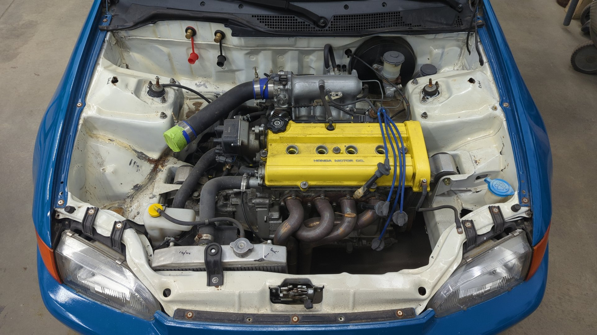
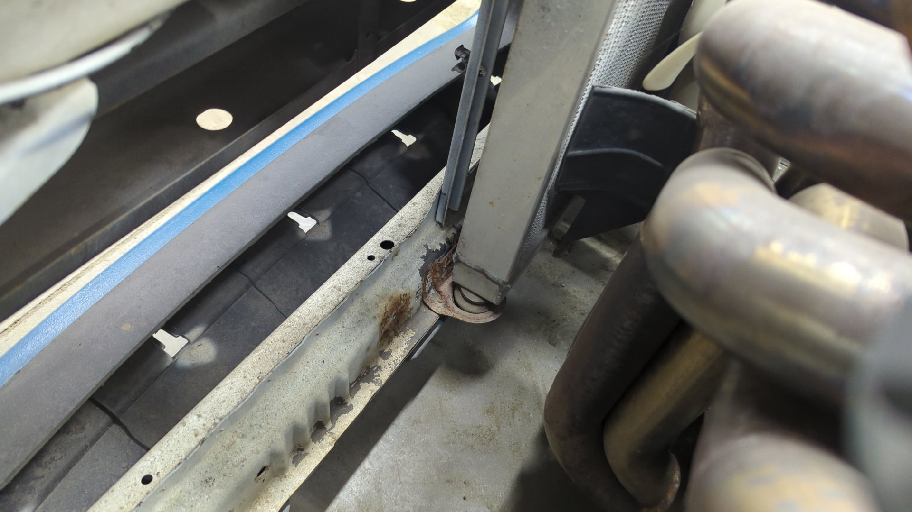
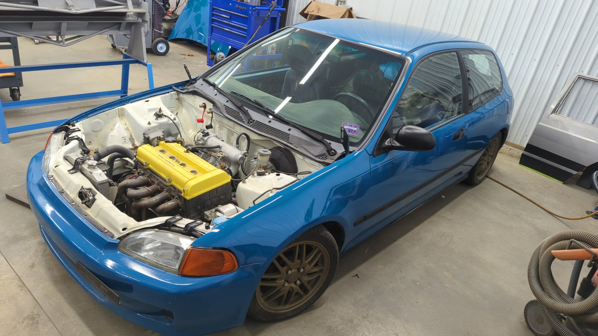
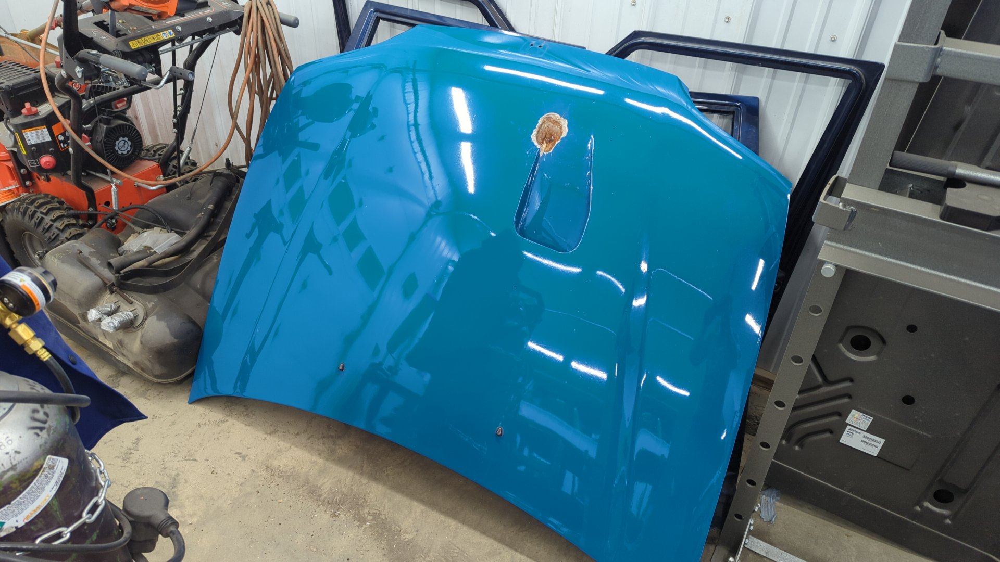
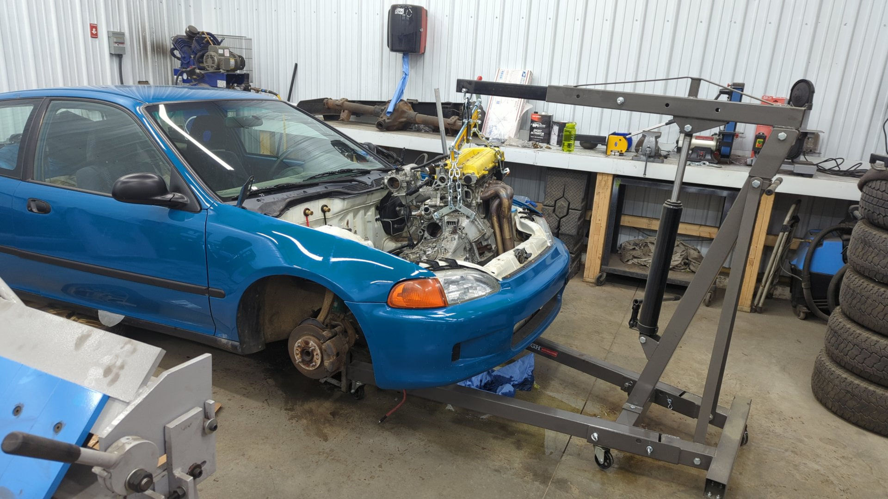
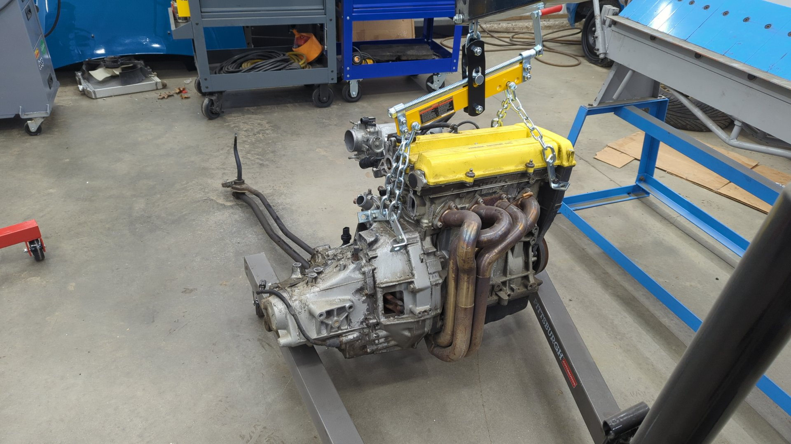
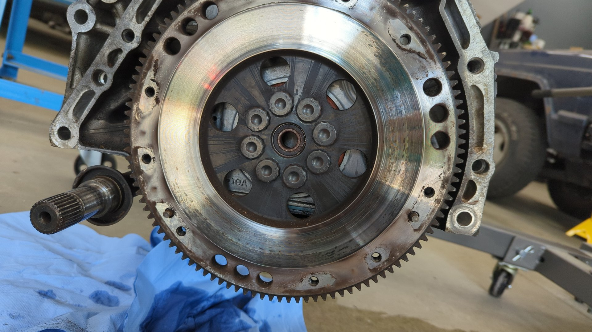
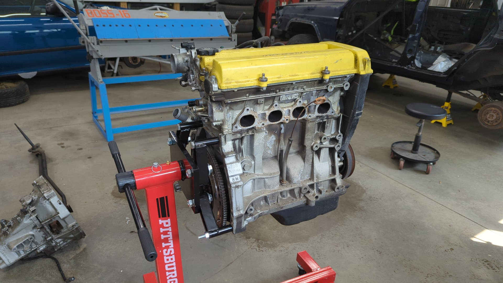
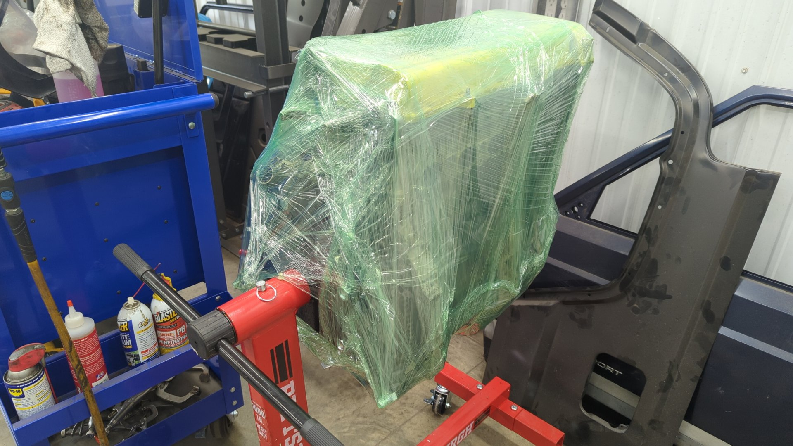

I've owned my 1993 Civic Hatch for about 8 years now but it's sat neglected in my shop for the last 3. It was my first real project car, and the car I learned how to do almost everything on.

While the car hasn't seen the road in 3 years there's nothing majorly wrong with it. I parked it because it has a massive laundry list of smaller issues that desperately need addressing. Some of the problems are just from age (so many worn out suspension bushings), but others are the results of my novice work not holding up well.

I never really had the money or time to fix it 3 years ago so I had to set it aside for awhile. I still don't really have the time I'd like to dedicate towards it as I've got a massive repair project going on with my XJ, but I can't take seeing it sit any longer. I desperately want to get it back on the road so I can give it a try auto crossing it again.

# A Quick Recap of 8 Years

It started it's life as a gray 1993 Honda Civic DX with a D15B7 and automatic tranmission when I first bought it in 2015. At the time it had a blown motor and 101k on it.

6 months later it was back on the road with a new heart and a manual transmission conversion.

Then it was lowered on coilovers.

Some of the wiring in the engine bay was tucked.

Rota grids were added along with some summer tires.

It's first car meet.

Torn apart for a new paint job.

Repainted with Laguna Seca Blue.

Still rocking a D15B7 but with a Y8 Vtec head.

Getting ready for some more power with a B20B.

The new heart all buttoned up.

Post B20B swap.

The engine bay looked awesome.

But hasn't held up great with time.

# Future Plans

To avoid rushing on this project I'm intentionally not setting a hard deadline for when it should be back on the road by. My ultimate dream is to be able to drive it at least once before the snow flies this year but worst case it may not see the road till spring next year.

My current plans for the car are:

- Repaint the engine / transmission with proper engine enamel
- Fix up the engine bay bodywork and paint it to match the exterior
- Redo the exhaust with a quieter setup
- Add an LSD to the transmission
- Upgrade front brakes to EX calipers, and swap the rear drums for calipers
- Redo any question electrical work
- Replace any mismatched bolt or nut with OEM hardware
- Fully refresh the suspension (new struts / springs / bushings / ball joints)

Once it's on the road I'll work on polishing up the exterior and button up the interior.

# Getting Started on the Engine Bay

I estimate that the majority of time fixing up the Civic will be spent in the engine bay. There a lot of rusty spots that need to be addressed along with other issues such as stripped threads, or worn out components.

The worst of the rust spots is the body seam above the passenger side frame rail. It has a lot of rust in it because I left exposed metal underneath seam sealer. Oops!

Both strut towers have holes in the tops of them from the upper control arms bashing into them due to the car being lowered. I'll be making strut tower extensions to give the upper control arms more space.

The radiator brackets are rusty from age. I'll be switching to a full size radiator and making custom mounts.

Some more rust on the driver side engine mount bracket.

A nice rust mark below the brake booster.

## Yanking out the Motor

In order to get full access to the engine bay I decided to start off by pulling the motor.

I normally leave the hood on when pulling the motor but decided to remove it since I'm planning on swapping the hood anyways.

Up on jack stands so I could drain the fluids and pull the axles.

A few hours later I had disconnected everything to the motor and finally had it free.

So empty.

I also ended up pulling the exhaust since I plan on replacing it. Something I hadn't noticed till now was that the cat had a big hole in it. It looks like I bottomed out hard on it one time and ripped the weld seam open.

A questionable repair I made on the exhaust flange behind the resonator years ago lol. Look at those welds.

The outside of the transmission is looking rough. I used regular paint instead of engine enamel so it all flaked off due to heat. The threads of the three bolt holes for the upper mount are basically ruined too.

Splitting the engine and transmission apart revealed a surprisingly rough flywheel. I'm really not sure what went wrong here but it's heavily spotted and will need to be refinished or replaced.

The outside of the motor has held up decently but I plan on repainting it with better enamel and switching the valve cover to a more OEM look.

It'll be a month or two before I start on the motor so I wrapped it up to keep it safe.

Using just compressed air I was able to knock almost all the paint of the transmission. In the next two weeks I'll be installed and LSD and replacing all the seals on it.

I already fixed up the mount bolt holes by helicoiling all 3 of them.

Stay tuned!
