Before dropping in the motor, I wanted to make sure there wouldn't be any surprises during re-assembly so I went through the engine bay and cleaned up every bolt / access hole. I found that a lot of the holes had paint built up in them so I used a couple taps and a deburring tool to clean everything up.

## Rivet Nut Woes

While testing the rivet nuts on the firewall I discovered two of them were loose and would spin with little to no effort. Ugh.

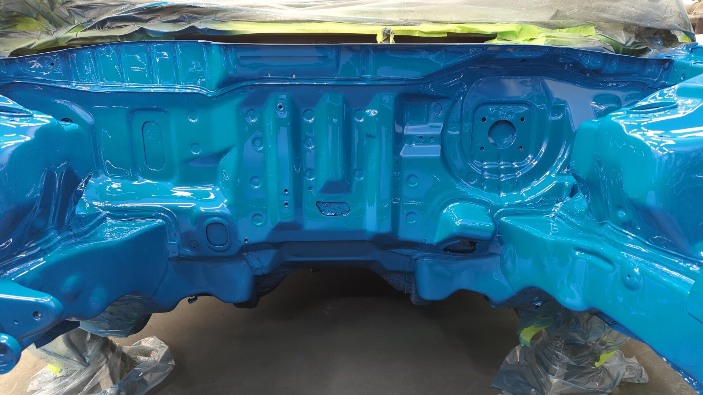

At first I thought it was just a bad install so I ground out the old rivet nuts and pressed in two new ones but the new rivet nuts once again spun almost immediately.

It turns out the surface sealing rivet nuts I was using on the firewall were having a hard time gripping the firewall metal (maybe due to how thin it is?) and none of the regular rivet nuts I had used elsewhere were having trouble.

At this point though the firewall holes were getting pretty rough and were too big for the rivet nuts.
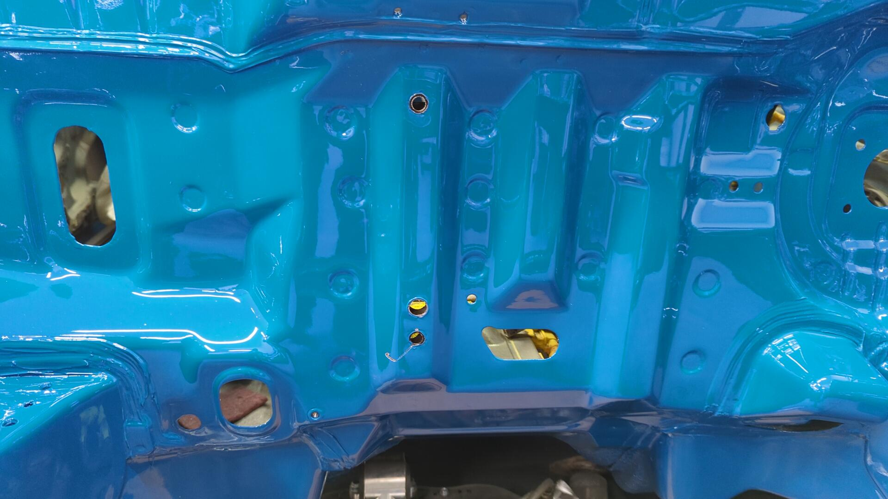

Worst of all I slipped with the grinder and ruined my brand new paint.
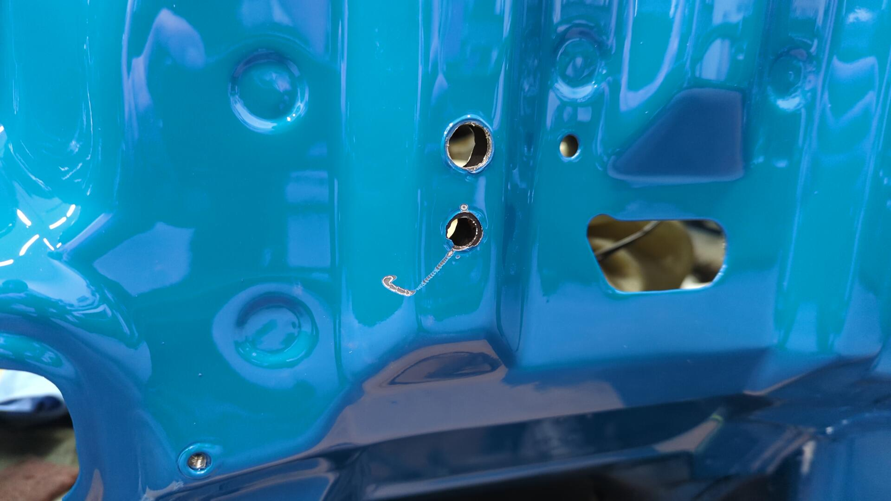

I had to come up with a plan B and was pretty limited in options since I really didn't want to have to repaint the entire firewall which meant I couldn't do any welding / grinding.

Weighing my options I figured the best bet would be to make patches that attach on top of the existing holes to hide the mistakes.

Yeah I'm using rivet nuts on the patches but these are the normal kind and I haven't had any trouble with them. Hopefully they don't let water through.

Patches all sandblasted. The patches are going to be secured via a long bolt that runs through the firewall and secures against a plate on the backside. The end of the bolt sticking out the front is going to act as the mounting stud.
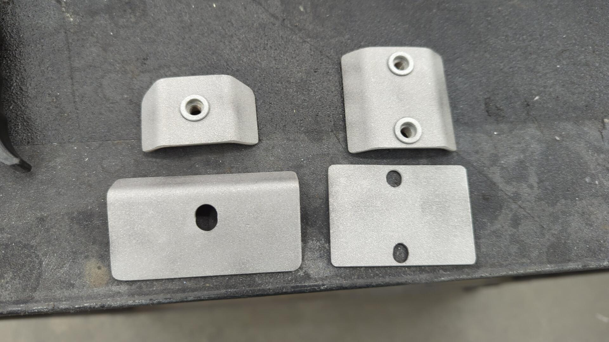

Epoxied.

Test fitting the patches to make sure the backing plates work.

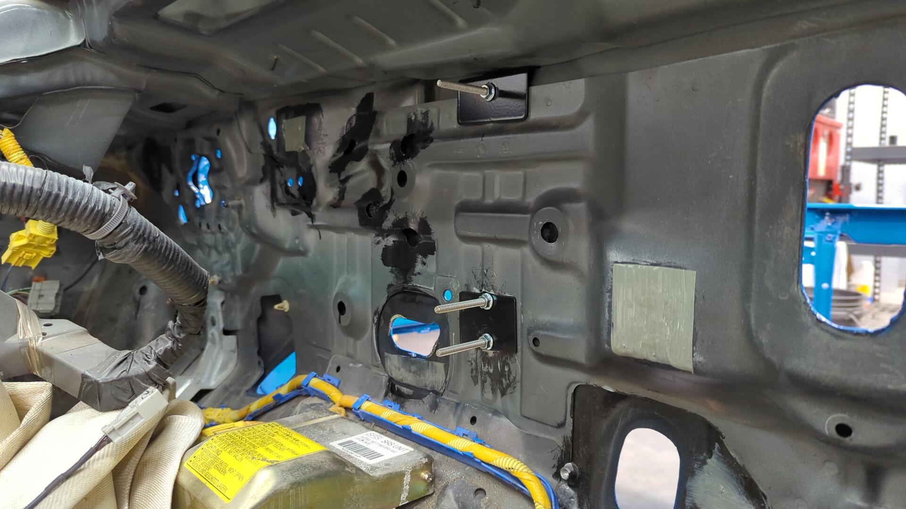

With everything looking good I wet-sanded the outer patches with 400 grit to prep for a reduced coat of epoxy.
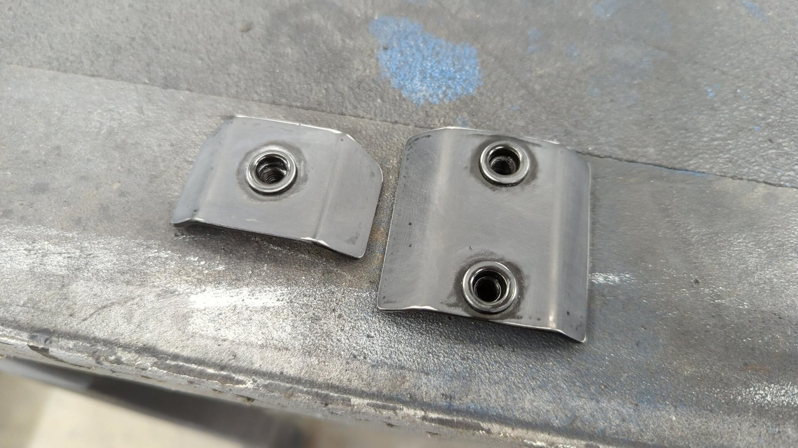

They don't need to be perfect, but I wanted them to be reasonably smooth.

Prepping the firewall for seam sealer.

Seam sealed. Prior to slipping the patch on I seam sealed the backside too so they shouldn't leak.

(It wasn't pictured but I touched up all the bare metal on the edges with primer prior to seam sealer)

Prepped for paint.
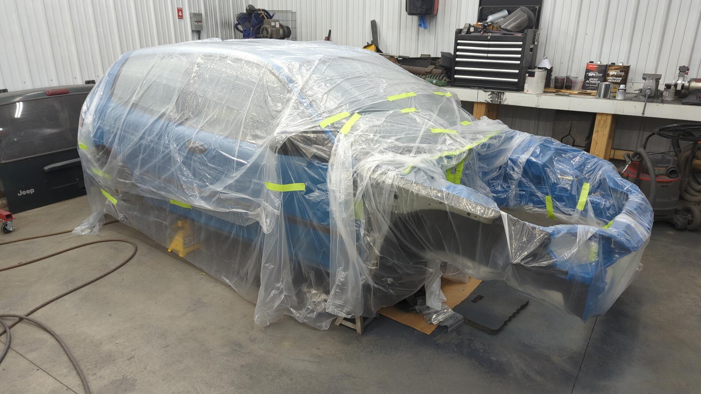

It felt so silly doing all that prep work to spray two tiny spots. Each coat took less than 30 seconds to spray.

The next day they looked pretty decent. I'm not 100% sold on how they look but with everything mounted up on the firewall I imagine they'll be pretty well hidden.

The bay looks good again.
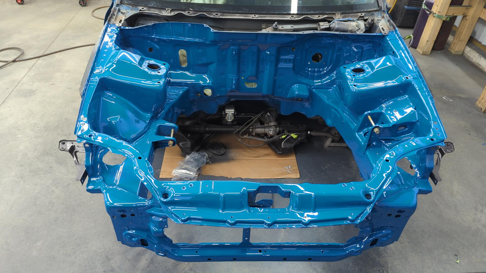

# Don't Get Paint Where It Doesn't Belong

When trying to install the hood prop holder it didn't want to fit so I used too much force and pushed it in.

This ended up being a horrible idea as the hole had too much paint in it and all the surrounding paint immediately chipped.

Oof.

Doing the best I could I feathered down the edges with 320 grit and touched up the paint.

Good enough!

# Prepping the Motor and Trans For Install

Hopefully this doesn't come back to bite me in the butt but I _did not_ replace the rear main seal while the engine and trans were apart.

This seal was already replaced 4 years ago and isn't leaking and I prefer to live by the don't fix it if it's not broken mantra.

When it came to picking out the new clutch / flywheel I spent way too long debating what flywheel I wanted. Eventually I settled on an 8lb Fidanza 191681. My previous flywheel was a 12lb Competition Clutch and overall I liked it but wanted to try something different this time around.

The green looks cool, but like the sticker said it has to be removed prior to installing the clutch. I think it's some kind of anti-corrosion coating for storage.

Flywheel bolts are ARP 208-2802.

I don't know what happened to all the bell housing bolt holes but the threads were smoked.
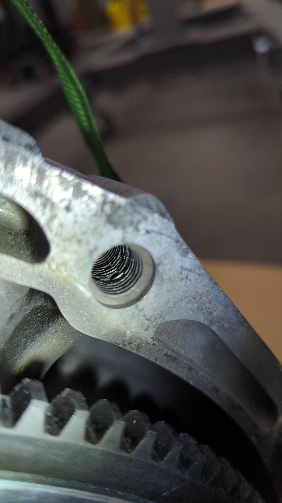

I had to fix all of them with a helicoil.
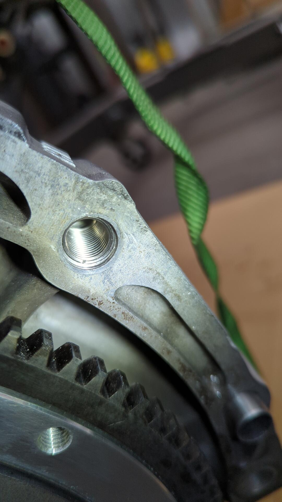

Clutch is an OEM spec Exedy KHC05. I don't expect the stock B20B to put out enough power to warrant a stage I clutch.

Hoisted up to get it in position for the transmission.

Not wanting the clutch to squeak like it used to, I lubed everything up with some OEM Honda grease.
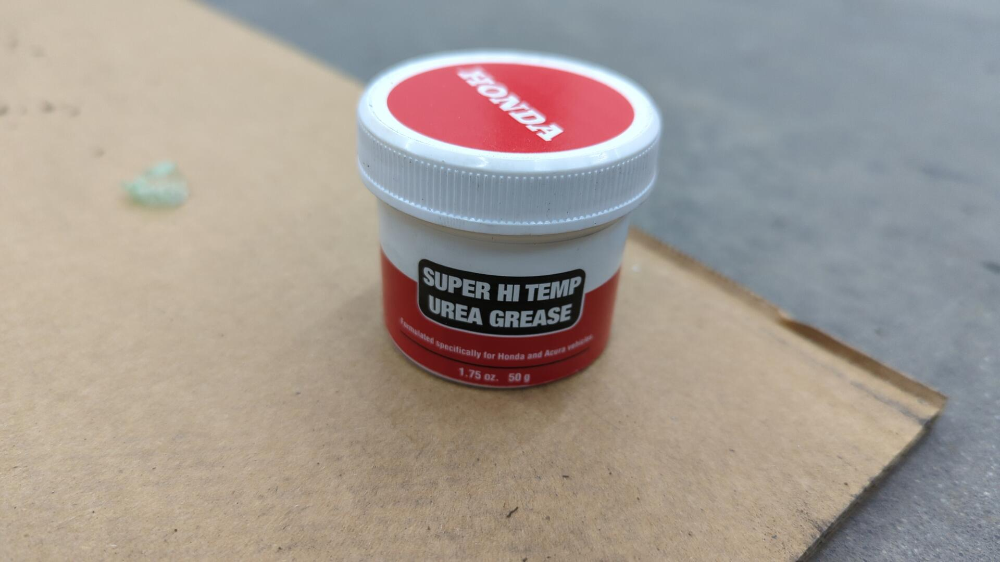
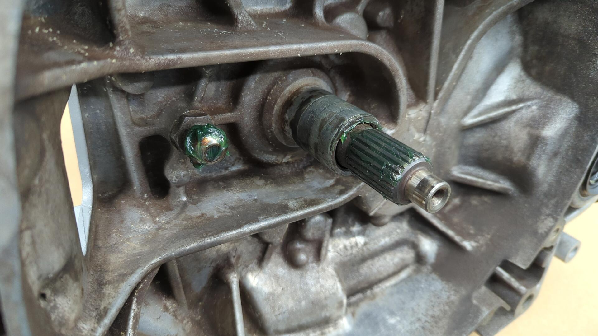
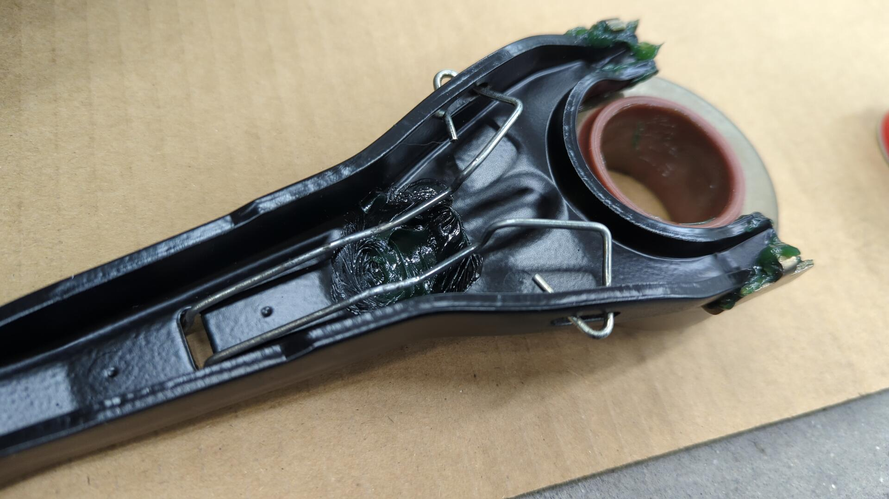

Boom!
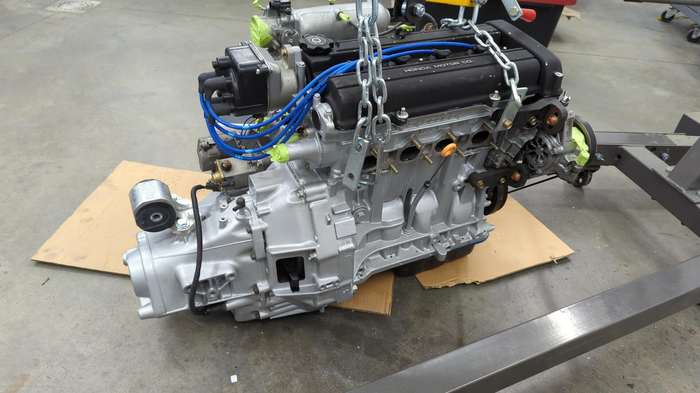

Basically all ready to go. I've always installed the motor and trans bare but I wanted to try installing it with all the accessories mounted this time. I figured they probably wouldn't get in the way and it'd make life a lot easier than trying to install them once it was in the engine bay.
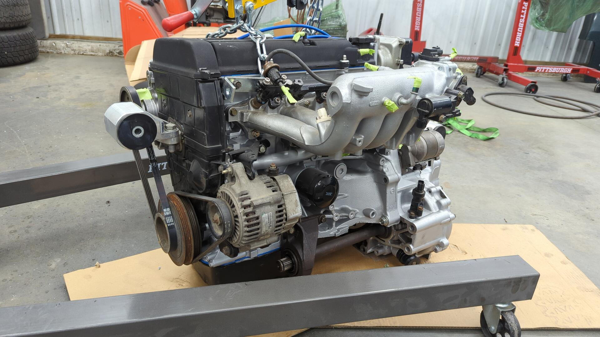

Fun fact: That's the original alternator from the the D15B7 it was shipped out of the factory with. I think it's one of two original OEM parts still left in the engine bay.

Had to pop in the subframe real quick. It's super easy to install them as it only takes 4 bolts.

# Dropping The Motor In

It was a bit of a squeeze to pop the motor in.

I ended up having to temporarily remove the upper trans mount to make it easier to fit the motor underneath the passenger frame rail but other than that it wasn't too bad.
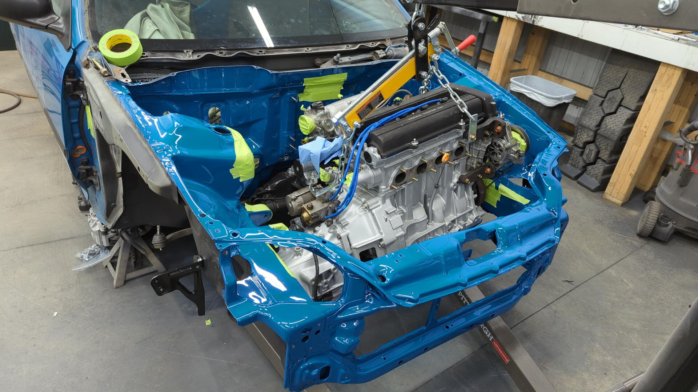

I'm very glad I taped up all the dangerous spots on the engine bay to help prevent scratches. The alternator pulley bumped the driver side shock tower and thankfully the paint escaped unscatched thanks to the tape.
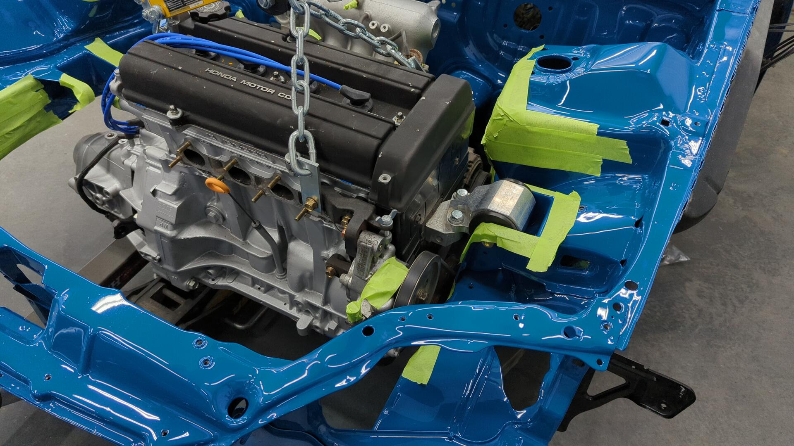

This is how close the alternator was to the driver side subframe while I was trying to get the mounts bolted up.
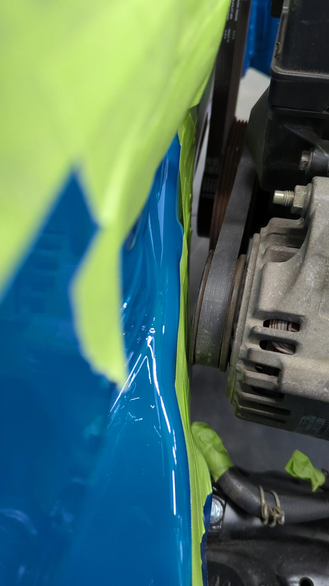

Two out of three mounts done!
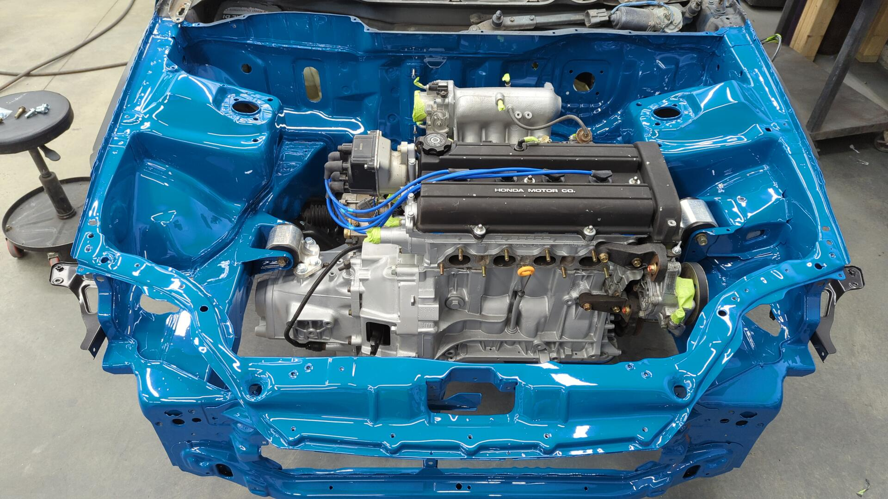

Turns out I needed some longer bolts for the rear mount though so I had to hold off installing it. Thankfully the motor is more than secure with just the two side mounts for now.

[Continue on to Part 11]()
