I couldn't resist splurging and picking up a set of Denji headlights for the hatch.
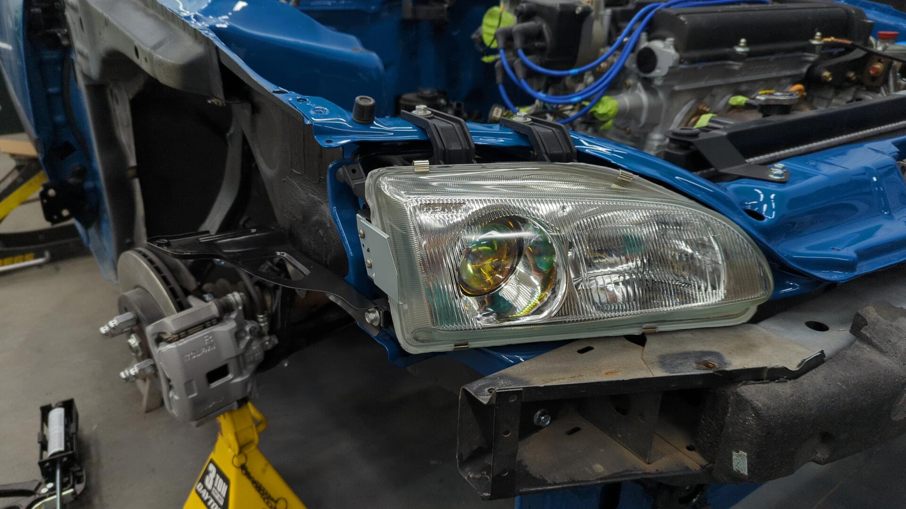

The OEM headlights aren't that bad with their light output for halogen units, but I wanted a set of Denji's because I plan on eventually doing a HID projector retrofit with a set of RX-330 projectors I've had laying around for years and Denji's are perfect for that.

I likely won't be doing the projector retrofit until after the car is back on the road so for now I'll be rocking them as-is.

It was a bit of a bummer, but one of my headlights arrived with a broken tab. I had ordered these directly from the [manufacturer](https://www.denji.com/index.php/en/headlamp-projector/item/28-civic-92-95-projector-headlamp) and didn't want to pay return shipping to send them back overseas so I settled on using some JB weld to fix it.
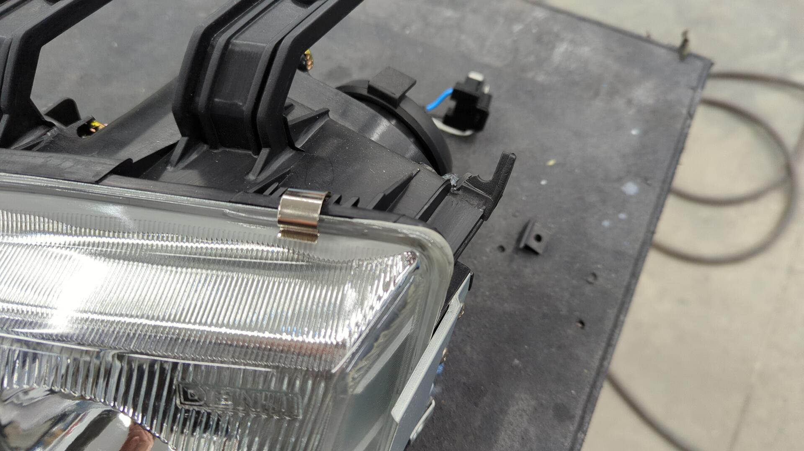
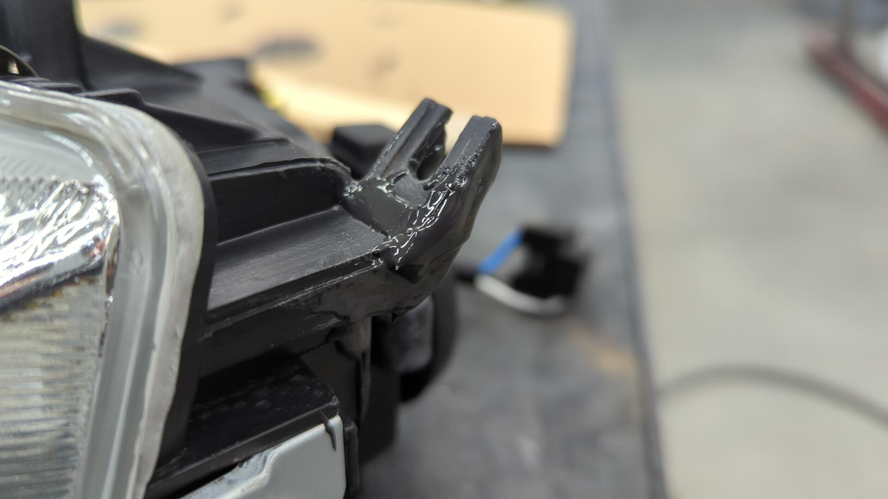

I'm pretty optimistic it'll hold, but if it doesn't I may explore 3d printing a custom bracket to repair it more properly.

I also ended up having to source [2 new nuts](https://belmetric.com/m3-m10-stainless-spin-washer-flange-tension-lock/?) to use on the inner mounts as the original ones on my old headlights we're seized and I wasn't able to remove them.

# Building a Custom Fan Shroud

Since I'm using a custom fan, I decided to build my own fan shroud instead of buying one online.
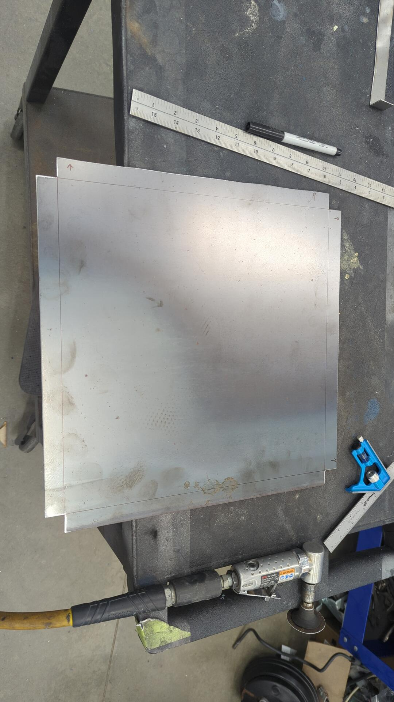

This was also the first time I bent up a pan with my metal brake so it was fun to get some practice.
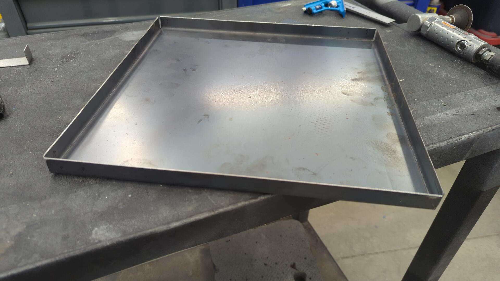

Test fit.
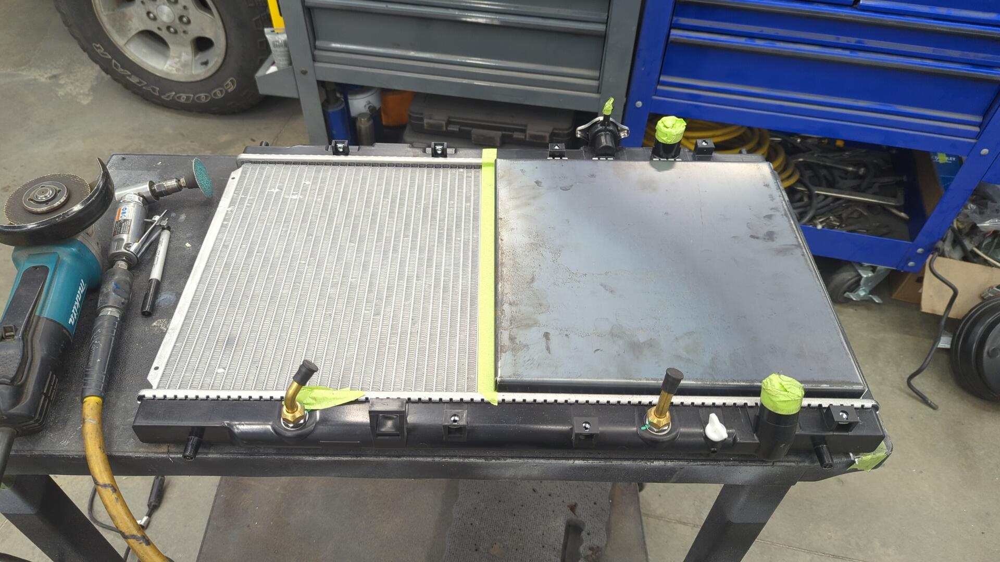

The fan just barely fits lol. It's a 12" Spal 30101522.
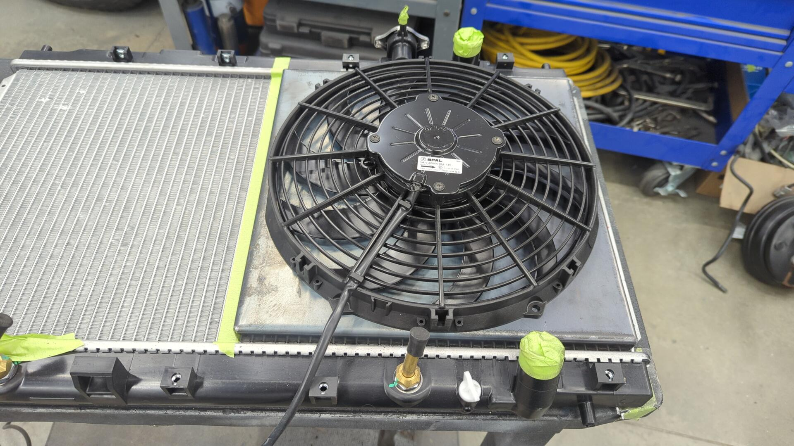

The shroud is roughly 3/4" tall, and the fan sticks out about another 2".
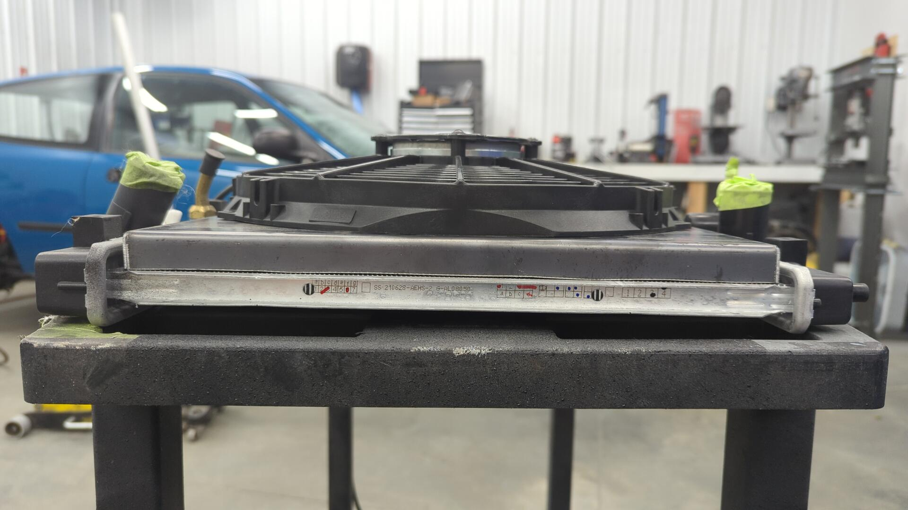

Cutting out the fan hole took some time. If I had a plasma cutter this would have been super easy but all I had to work with was my angle grinder, and die grinder.

Once I was ready to start designing mounting tabs for the shroud I spaced it 1/16" away from the radiator so it wouldn't be rubbing up against it.

I made the tabs by cutting up some 1 1/2" tube.

All 4 mounting holes on the radiator are positioned at different spots for some reason.
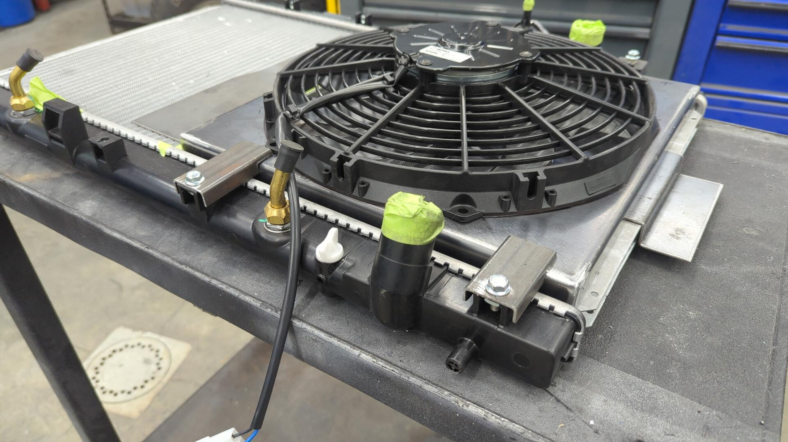

Test fit in the car.

The fan sits closer to the header than I'd like, but there's still clearance thankfully.

All that was left at this point was to design a way to hold the coolant reservoir.

I took a pretty lazy approach to it and really need to go back and revise it eventually.
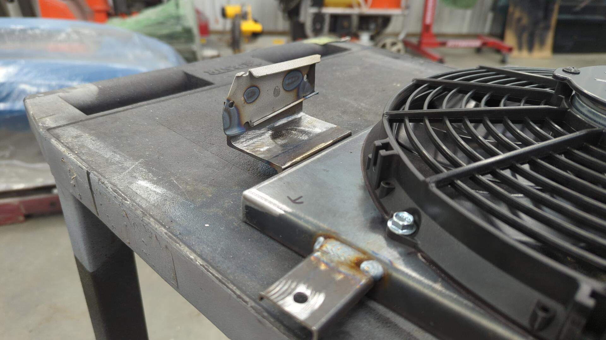

But it works so that's good enough for now!

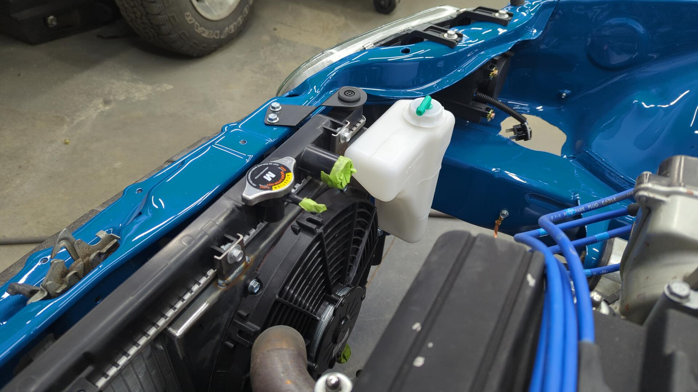

After that I painted the fan shroud black but forget to take a picture of it prior to installing it in the car so heres a shot with all the hoses mocked up.

No ring worm hose clamps anymore. I've decided to go back to constant tension clamps.

I've never had any major issues with ring worm clamps but I've read that constant tension clamps work better in climates that have wide temperature swings since they'll automatically adjust to the change in size of the hose.

At this point the coolant system is almost complete! All that's left is to hook up the heater core now.
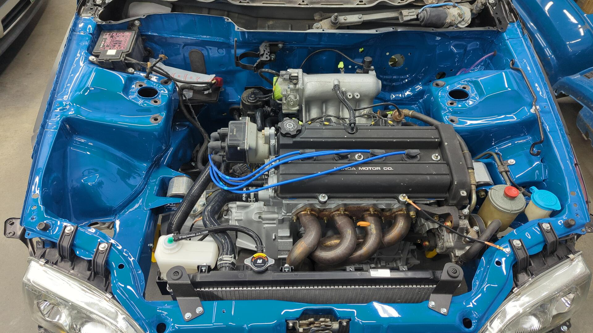

# Wrapping the Exhaust Header Just in Case

Maybe it's me being over paranoid, but the exhaust header being so close to the radiator fan wasn't sitting right with me.

As a preventive measure I opted to wrap the header to try and reduce how much heat it'd give off. This should also help with the carbon hood too since those don't like heat but only time will tell.
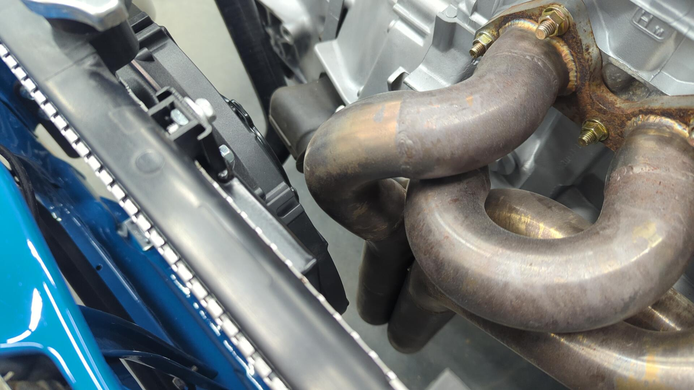

I ordered 50' of 2" wide wrap from DEI. This ended up being the perfect amount as I had roughly 5' left to spare.
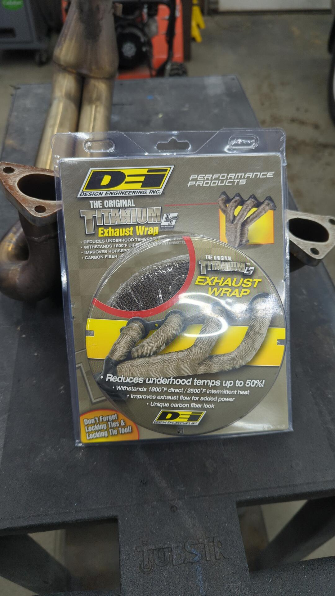

The design of this header made it pretty difficult to wrap given how close all the tubes are.

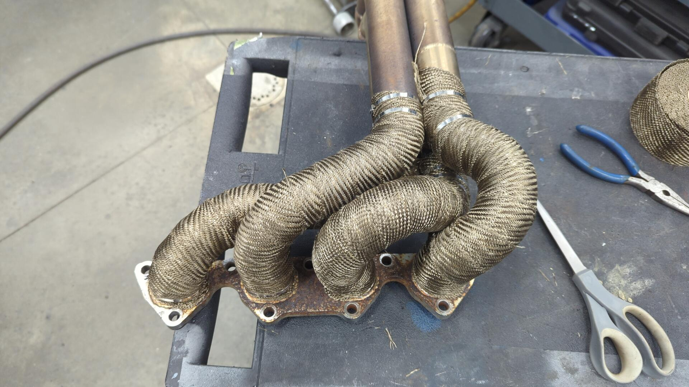

The bottom of the header looks a little silly since it's so squarish now but there's no way you could wrap the individual headers down there if you tried.

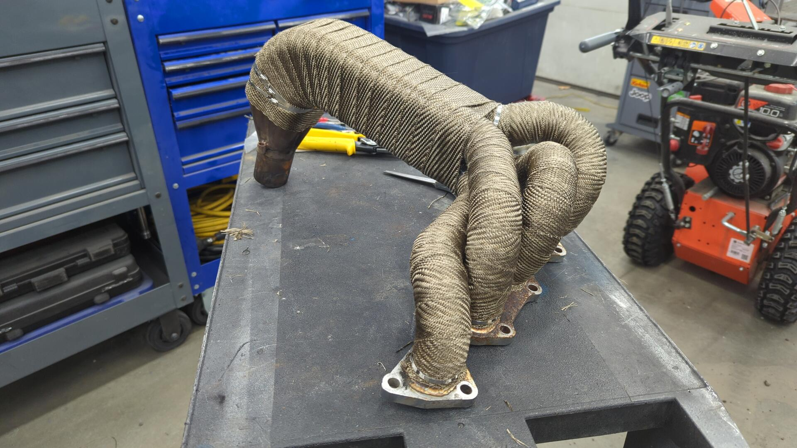

Re-installed.
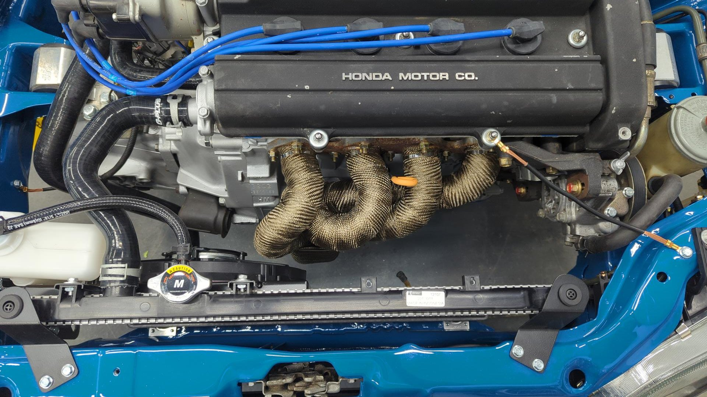

Engine bay looks pretty cool.

# Giving the Airbag Vent New Life

Since I'm currently waiting on parts I decided to work on cleaning up some of the smaller items on the hatch. Something I've wanted to work on was the air bag vent in the back since it was covered in over spray, and the foam gasket on it was leaking.

Using some solvent and a bunch of plastic razors I was able to pick off all the over spray.

Then I removed the rubber flap and soaked it in 303 Aerospace overnight to try and rejuvenate the rubber.
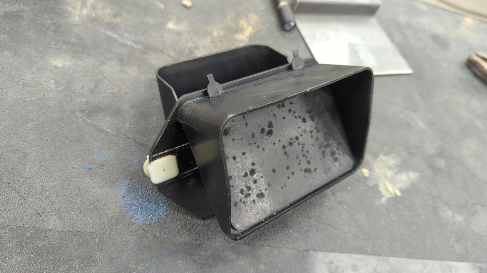

Last but not least I added a new foam gasket since the old one was worn out.

Re-installed. I know no-one will ever see it, but it's nice knowing it's all refreshed.

I also went through and cleaned up any grommets that had over spray on them as well.

[Continue on to Part 14]()
