It's a relief having finished up all the bodywork on the Civic but I'm starting to feel short on time with the beginning of the race seasoning looming closer and closer. The project is approaching the finish line, but at a high level I still need to:

- Run new brake lines
- Install shift linkage / shifter + redo the manual conversion shifter bracket I made
- Run new fuel lines and address some issues with the injectors
- Exhaust (everything header back is missing)
- Clutch master cylinder, line and slave
- Electrical (need to make new fender harnesses, power door conversion, and more)
- Steering rack needs to be centered and outer tie rods need to be installed.
- Wheels / alignment
- Various exterior bits (new spoiler, finish the windshield cowl, and more)
- Entire interior needs to be installed, or at least install the dash + carpet for now

All in all I've definitely got my work cut out for me. It won't be the end of the world if the Civic misses the first few events of the season as I can race my Integra, but I've been itching to race the Civic for a couple years now and really want to see it back on the road.

# The New Integra Master Cylinder

Since the Civic is running Integra calipers all around I figured I should step up to a larger master cylinder and brake booster as well.

It's off a 96 Integra that had ABS which means it has the 1" master cylinder.

I'm not actually going to run the 1" master cylinder though as this one is leaking, and is too large of a bore for my setup. I plan on stepping down to a 15/16" master cylinder as it should have a better pedal feel for my calipers as too large of a MC can make the brakes prone to locking up too easy.
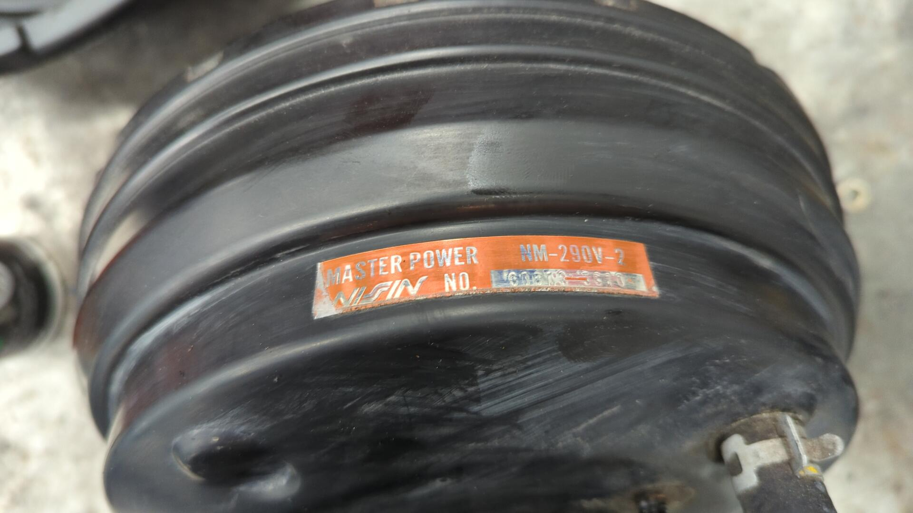

I was a little bummed when it arrived because the ad hid all of the rust, but I can work with it.
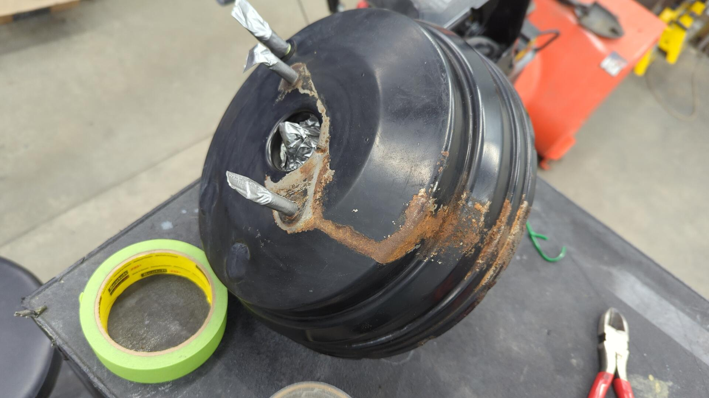

After carefully taping up all the holes and sandblasting the booster, I gave it two coats of reduced epoxy to refinish it.

All in all it came out looking good as new!

There's some minor pitting on the bottom half but it should be completely unnoticeable once everything is all re-assembled.

Bolted back into position.
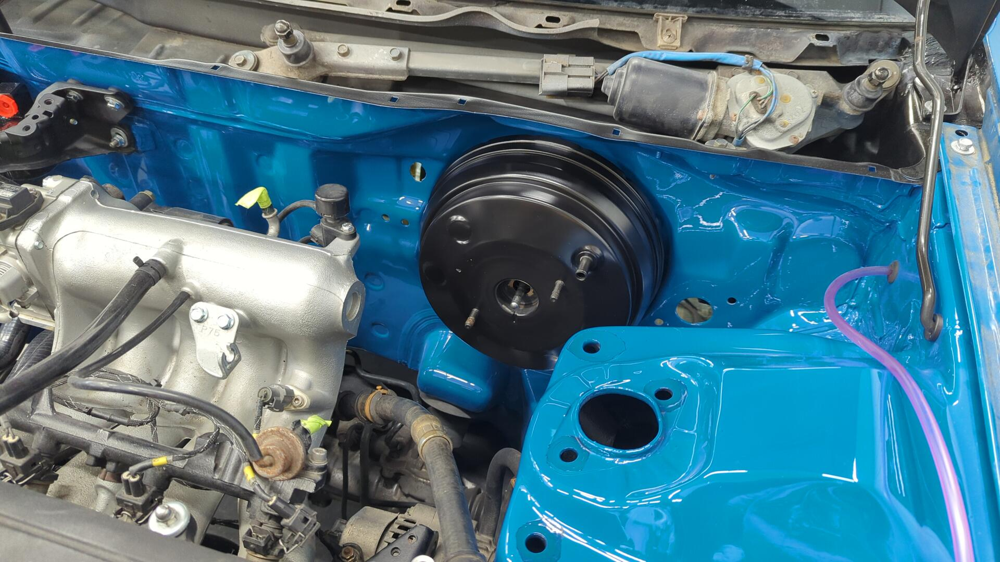

# Saying Goodbye to the Automatic D Series Throttle Cable

Back when I first engine swapped the car I bought a throttle cable adapter bracket that let me use the original D15B7 throttle cable with my B20B.

The custom setup worked fine for my needs but with how the cable was starting to show it's age I decided to pick up a new LS cable with the original bracket.

The install went nice and smooth on the engine side.
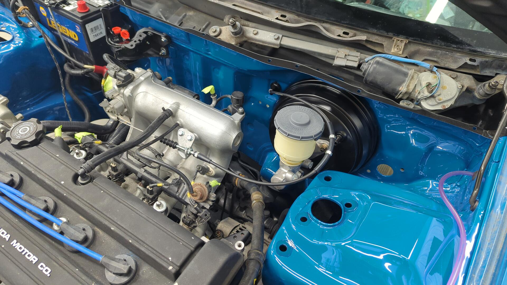

Other than realizing I was missing the firewall cable seal (part # 17921-SA4-730) and had to order one.
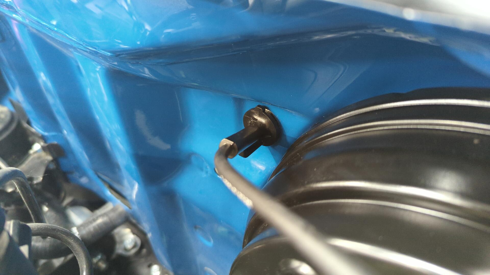

But on the inside I couldn't get the new throttle cable to attach to the pedal.

Can you spot the difference between these two pedal assemblies? Left one is a new unit I had to order, right one came off my car.
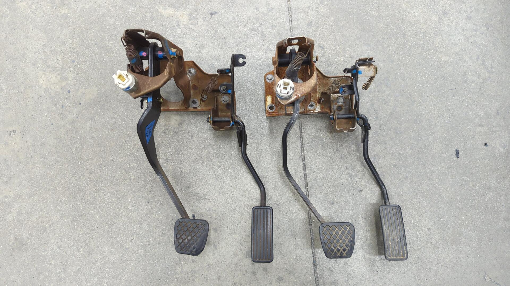

The cable end of the gas pedal is completely different. Years ago when I first converted my car from an automatic to manual I had pulled a shortcut when swapping the pedal assembly and only swapped the brake pedal.

I went this route because back when I did the conversion I never removed the dash and by only swapping the brake pedal I was able to avoid having to do the extra work.

Automatic gas pedal:
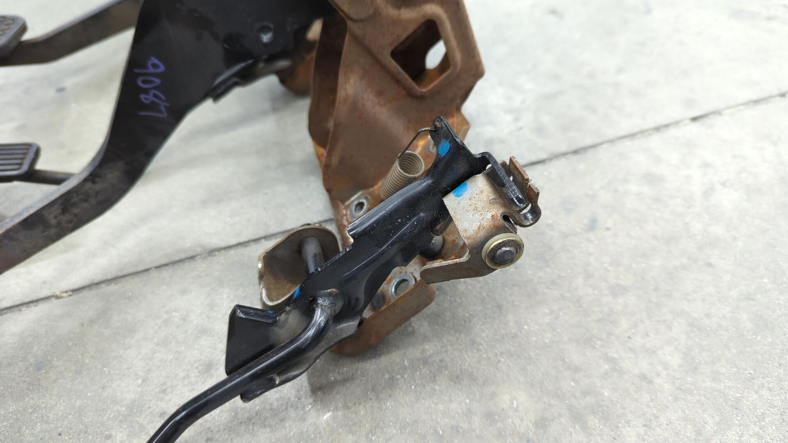

Manual gas pedal:

This wasn't too difficult of an issue to resolve as sourcing another manual pedal assembly was easy enough but I wish I had just done it proper the first time.

# A Slightly Nerve Wracking Re-Install of the Front Suspension

Normally bolting up the front upper control arms and shocks isn't an overly daunting task, but given I had just finished respraying around the bolt holes due to ripping up the paint the first time I torqued all the nuts I was worried about seeing the paint get ripped up again.

Everything went surprisingly smooth this time though and I didn't run into any issues.

The touch up paint wasn't an exact match but I'm perfectly happy with it.

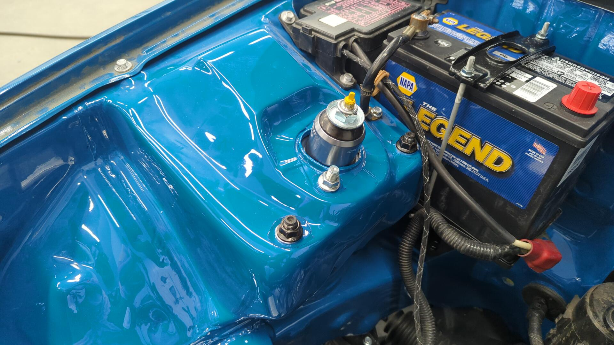

With the front suspension bolted back up I was even able to finally install my custom brake line brackets I had made.

They came out pretty nice and hold the brake lines snug to the shocks.
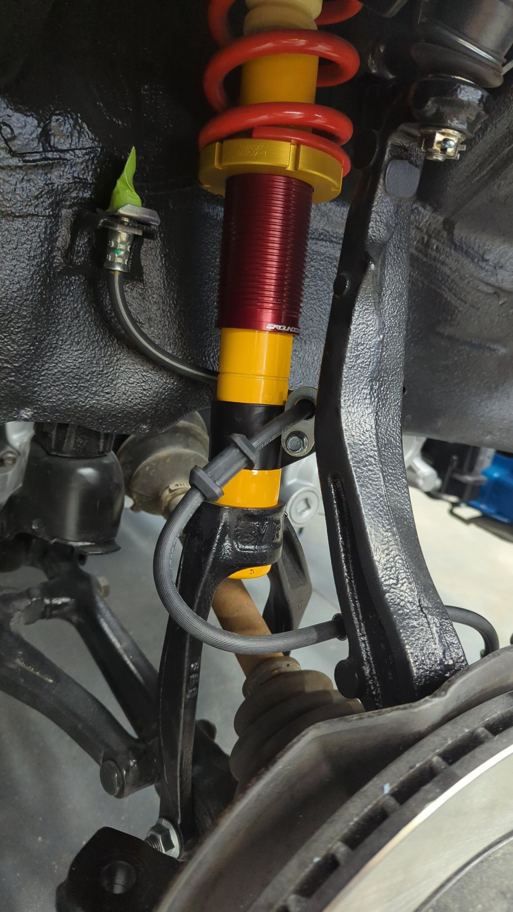

I can't wait until I get the brakes finished up so I can put the car back on wheels and take it off the jack stands.

# Restoring the Rear Hatch Glass Hinges

The bottom sides of the glass hinges were super rusty for some reason. I suspect some water had gotten trapped underneath them and rusted the metal.
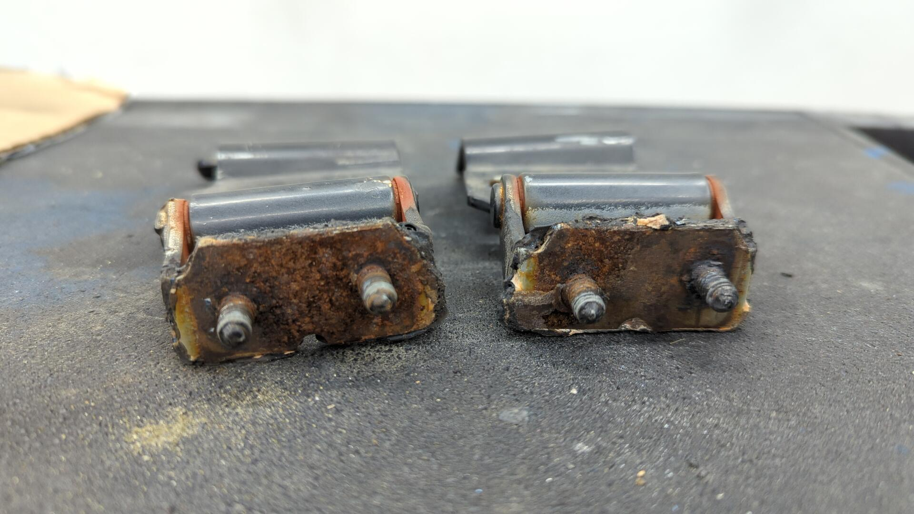

My sandblaster made pretty quick work of the rust.
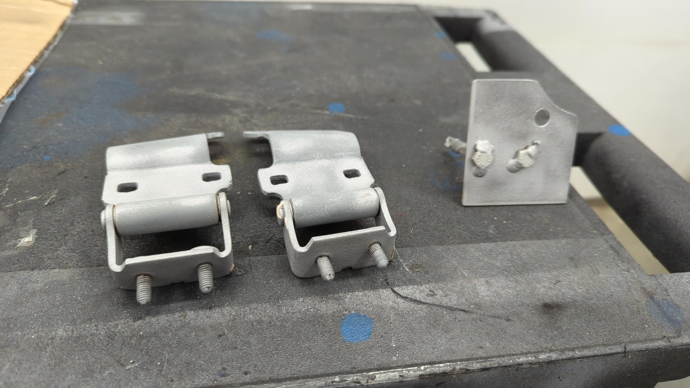

And a bit of paint later I had them looking good as new.

The bottom of the OEM nuts were fairly rusty too so I used some spare nuts from BelMetric that I had laying around. (these are the same nuts as I used on my headlights)

Test fit. I left the nuts somewhat loose since I'd need to adjust the position of the hinges while aligning the glass.

Getting the glass to align was actually somewhat tricky because the support shocks wanted to push it outwards. I found wiggling the glass when it was fully up was the easiest way to change it's position.

All done.

Now I just need a spoiler.

# Adding the Missing Windshield Trim With New Clips

The windshield trim has always been pretty loose on my car. It turns out it was because I was missing the orange clips they attach to.
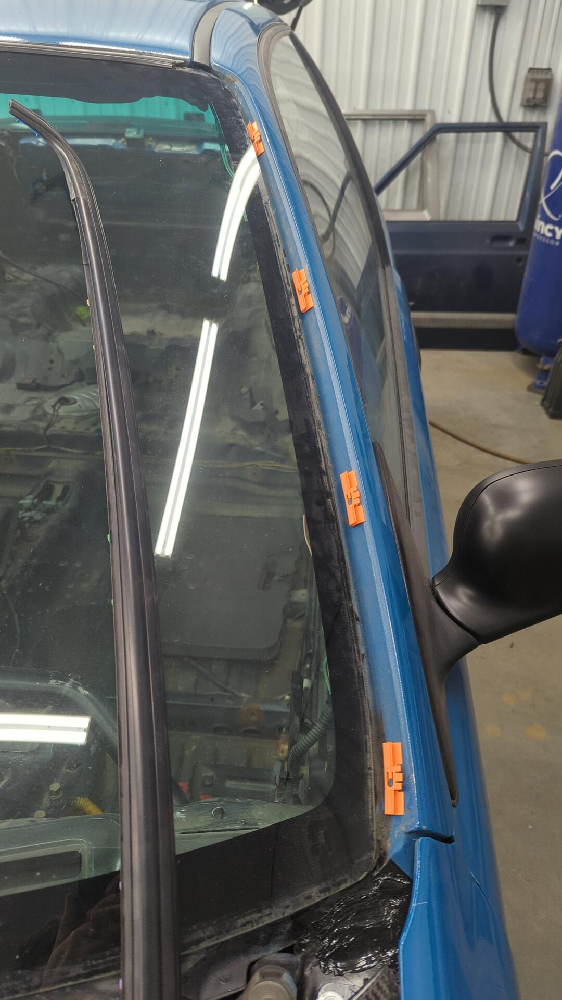

Part number is 91511-SR3-003. The car needs 8 total (4 per side).
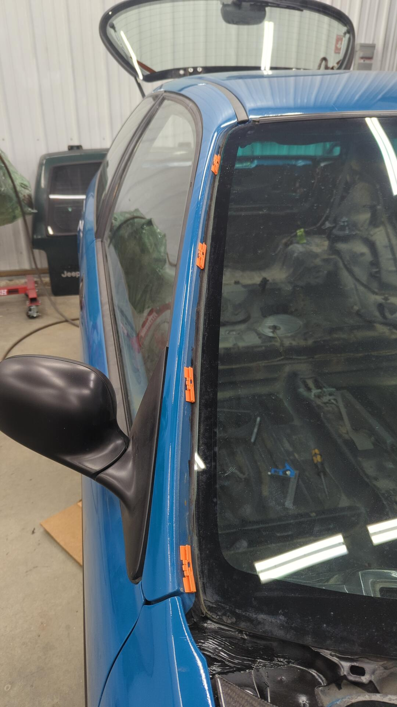

Windshield trim re-installed and all nice and secure.

Pro tip: Get the bottom of the trim in position before the top otherwise you risk scratching your fender.

[Continue on to Part 16]()
