The cabin harness has been giving me some grief because there's too much wiring underneath where the dash will sit and it's preventing the HVAC system from fitting. The main issue is that since the engine is wired up via a standalone engine harness there's a lot of unused connectors and wires sitting inside the cabin.

The only options I have here are to either to reduce how much wiring is under the dash, or not have heat in the car and having previously driven the car without heat for half a year I really don't want to do that again.

I won't lie, it makes me a bit nervous to remove a bunch of wires from the harness given I could accidentally cause problems and I haven't done extensive harness work before before but I'm pretty confident I can do it. I've got the original factory service manual for the car along with the factory electrical troubleshooting manual that has even more info so I should be able to figure out what every last wire does.

# Cutting Into the Harness

For ease of access I decided to pull the harness out of the car. This was fairly straight forward as there's next to nothing in the interior right now.
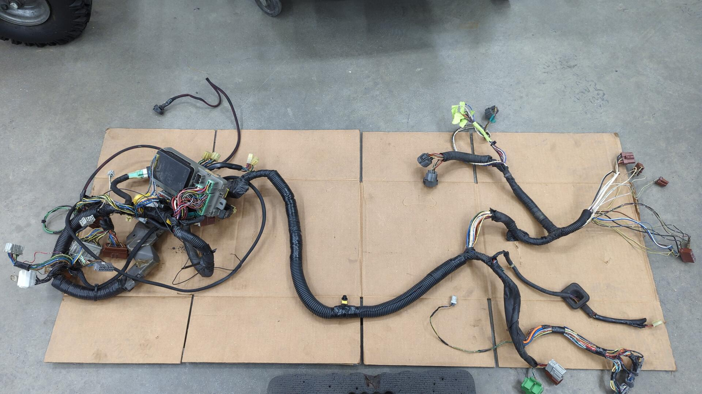

Removing all the tape / loom was a bit of a pain. It left the wiring all sticky and gooey so I had to wipe everything down with some solvent to get the old adhesive off.

I mainly needed to focus on the passenger side of the harness as it still had the old shock tower connectors, and ECU connectors (my standalone engine harness has it's own ECU connectors) taking up a lot of space.

Skipping ahead several hours of me slowly tracing every wire and figuring out what's safe to remove I ended up with this.
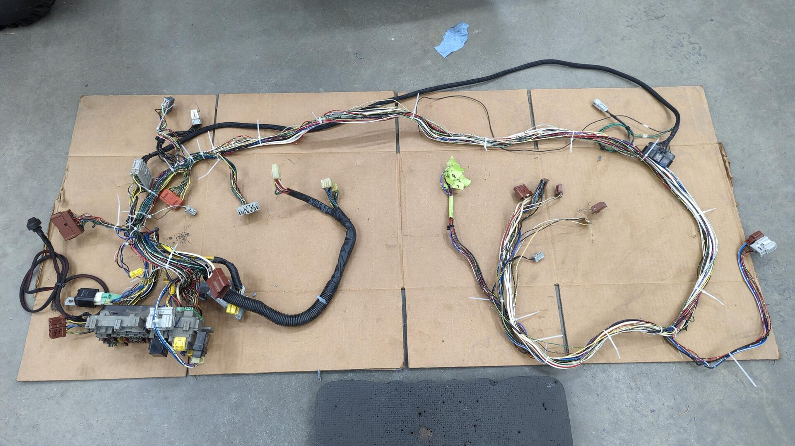

I plan on rewrapping it with new loom soon but I need to add the power door wiring in first.

And this is all the wiring I removed.
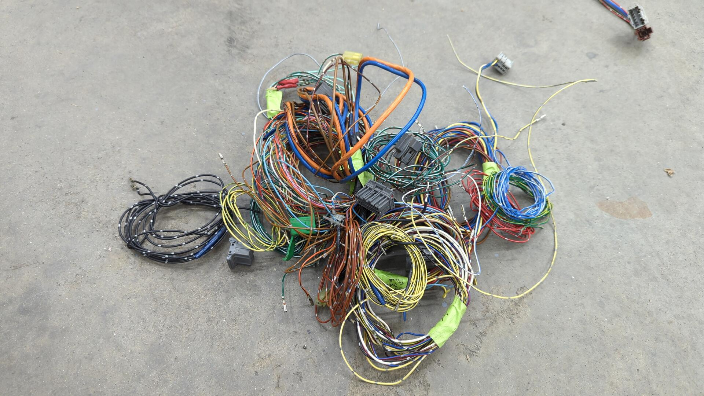

Almost all of it except for 4 or 5 wires wasn't connected to anything.

After that I was safe to pop the harness back in the car, and I'm very pleased with how much cleaner the wiring is now.

The bundle of cut wires with green tape on them is the remnants of the old passenger side fender harness. Back when I first started the revival project I had to cut the wires in order to remove the cabin harness as there was no connector to unplug.

To fix that mess and save myself some trouble in the future next time I need to remove the harness, I decided to install a connector that I had laying around.

Prepped for the new connector.

All done!
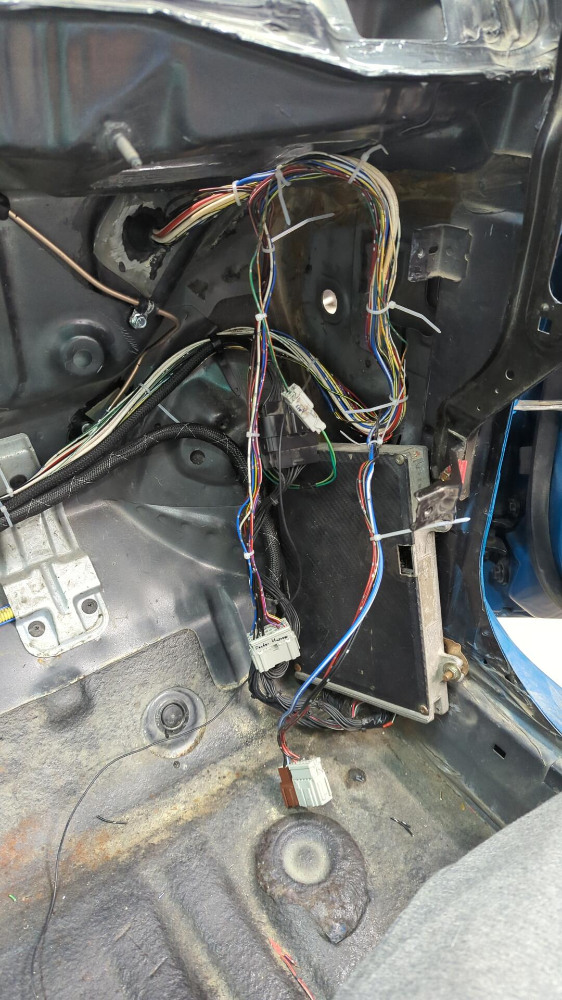

# A New Header Back Exhaust

There wasn't anything salvageable on my old exhaust setup besides the header so I had to source all new parts.

I was also tired of driving around with a loud muffler so I opted to go with a much quieter setup this time.

Given my 1st gen Integra is currently running a Yonaka muffler that is nice and quiet with a decent sound it felt like a no brainer to go with Yonaka for the EG too.

The catalytic converter is a Magnaflow 22636 which I'm not the most impressed with. I bought it because it was a direct bolt up solution and also because the manufacturer claimed it was stainless but it looks like it's actually made of aluminized steel and my magnet sticks to it.

I'm not fully versed on all the grades of stainless and I know some are magnetic so _maybe_ it really is stainless, but if it starts to rust I'll be dissapointed.

I will say everything bolted up nicely. I used thread locker on the bolts so none of them come loose.

All that's left for the exhaust is to hook up an o2 sensor now.

# Adding Some Insulation To Help Protect the Carbon Hood

I've read that the two things that kill carbon fiber body panels are heat and the sun. I'm unable to do anything about the sun, but I can reduce how much heat the hood absorbs from the engine so I decided to pick up some thermal insulation.
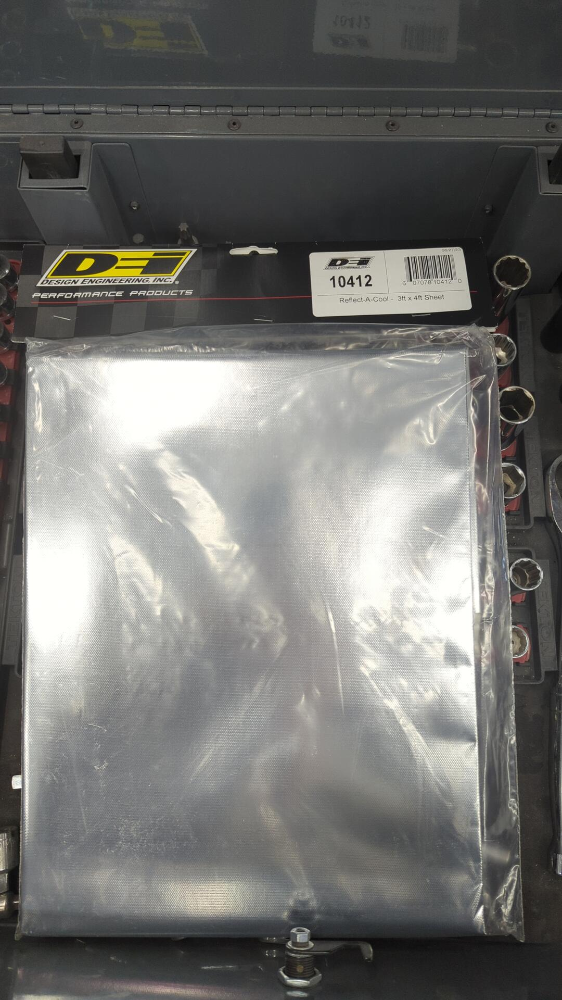

Realizing how long it was going to take to install the insulation on the underside of the hood I decided to pop the hood off the car and save my back from bending over the engine bay for an hour or two.
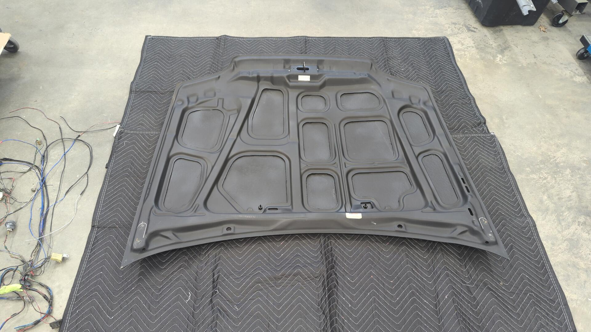
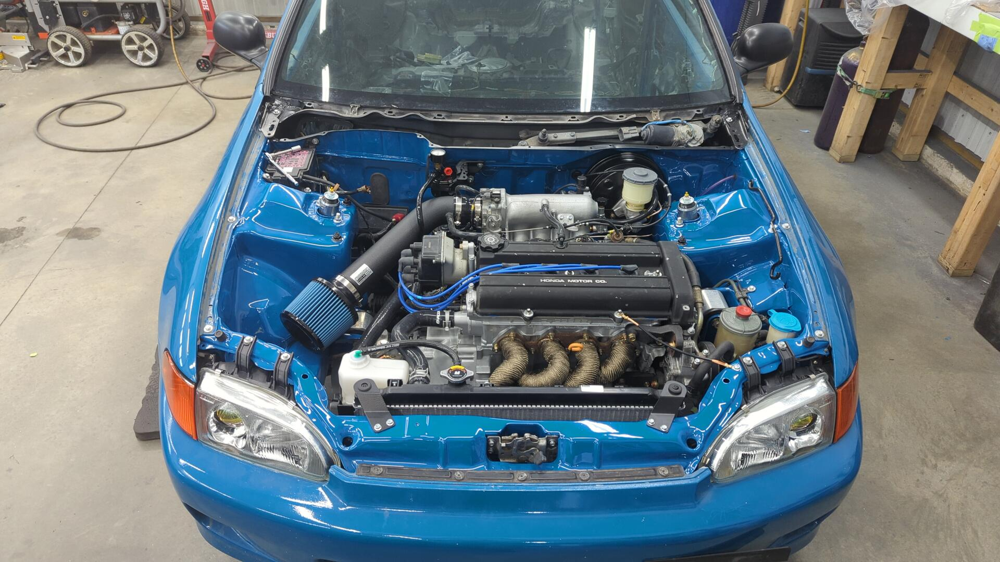

A lot of tedious cutting and trimming later I had the hood all done.
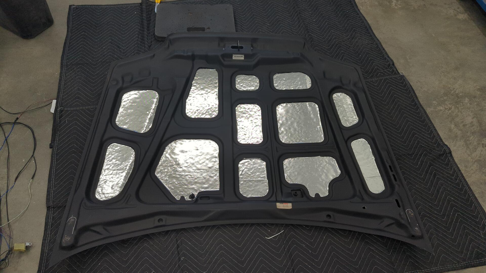

The underside of the carbon hood is kinda bumpy and that shows through the insulation but I'm cool with it.

Re-installed!
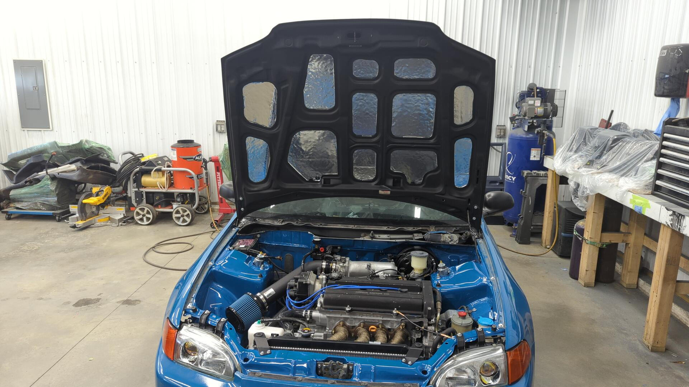

# Installing some Hood Pins

Seibon requires the use of hood pins for their hoods for safety so I decided to pick up a set of Aerocatch hood pins. I went with the [120-2000 above panel set](https://aerocatch.com/product/120-2000-above-panel/).

Aerocatch also sells hood pins with locks built in, but since I'm still keeping the OEM latch mechanism it didn't feel necessary to get the locking ones.

After drilling some holes to install the hood pins in I used the grease technique to mark the bottom side of the hood so I'd know where to drill.

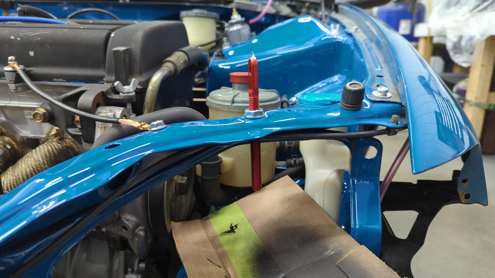
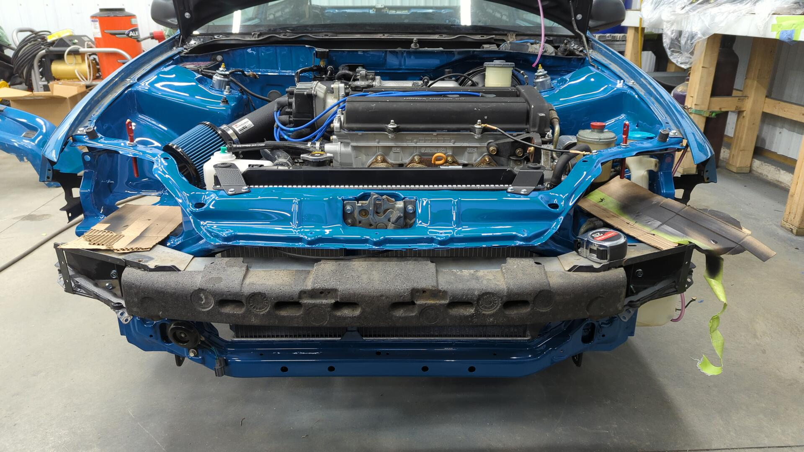

It feels pretty sketchy drilling holes in a brand new hood. Thankfully I was right on point.

After that I played around with the angle of how I wanted to position the hood pins until I liked how they looked. I did my best to make them parallel to the edge of the hood above the headlights.

I used an air saw to make the initial cuts on the hood and then fine tuned the openings with a die grinder until the latches fit nicely.
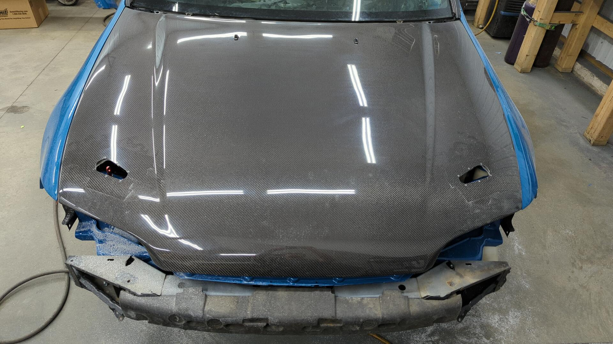
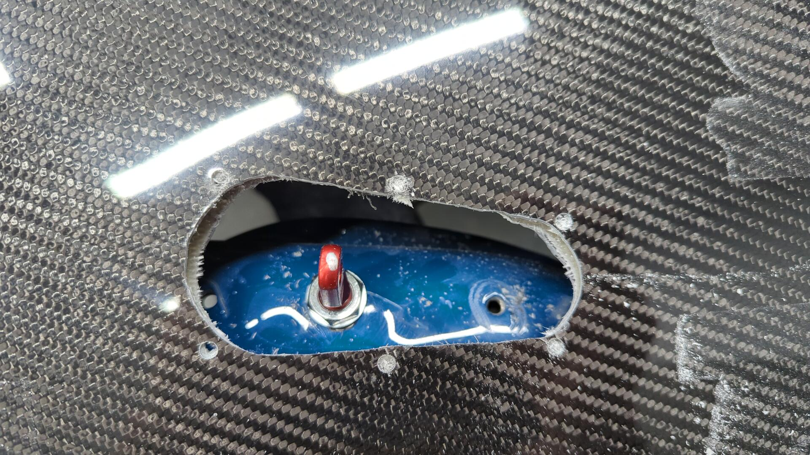

I'd recommend wearing a mask when cutting a carbon hood. It made a lot of dust.
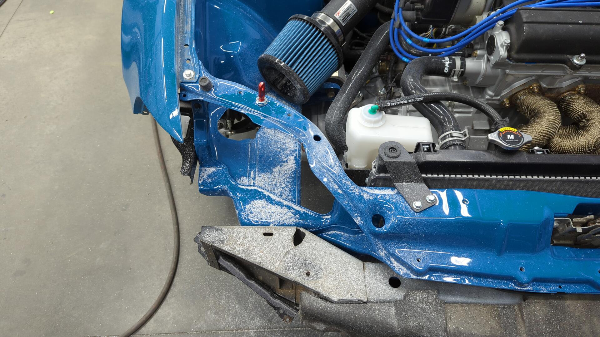

As fate would have it though I realized I had to remove the hood again. Seibon hoods are dual layer and since the Aerocatch hood pins have a mounting plate that goes underneath the hood I had to enlarge the underside of the hole to fit the plates. You could probably do this with the hood still on the car, but I figured this way would be significantly easier.

Lots of careful cutting later and I finally had the opening big enough to fit the mounting bracket.
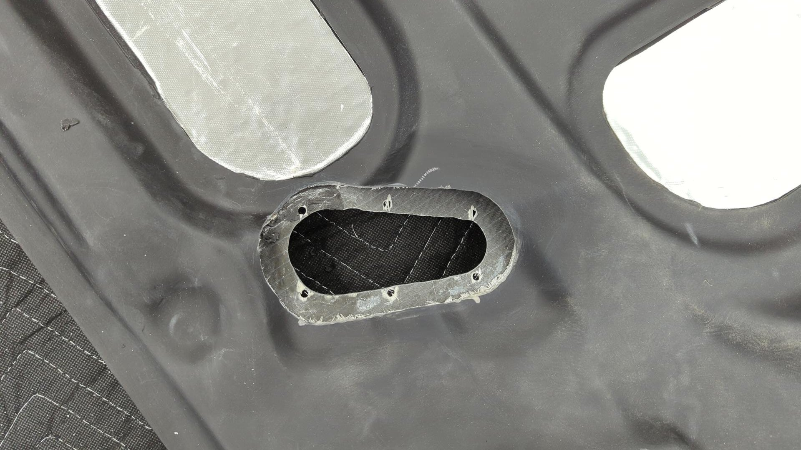

Once both sides were done I bolted in the latches and once again re-installed the hood on the car.

I also had to shorten up the hood pins so they wouldn't block the headlights from fitting.

All done and looking sharp.

