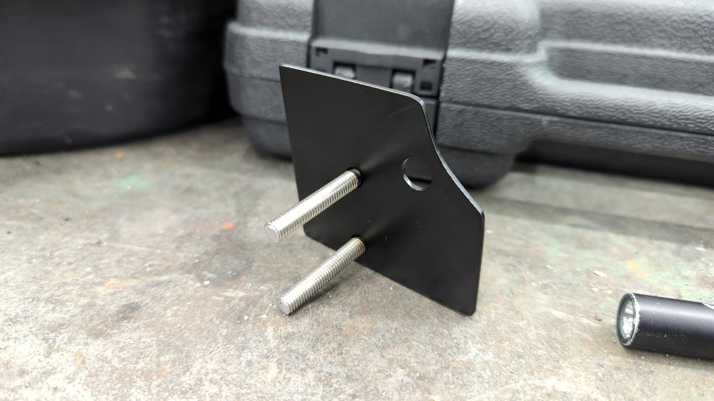
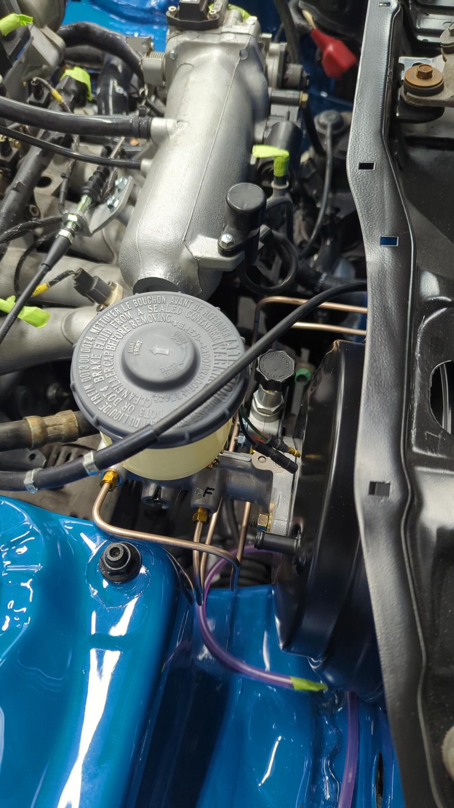
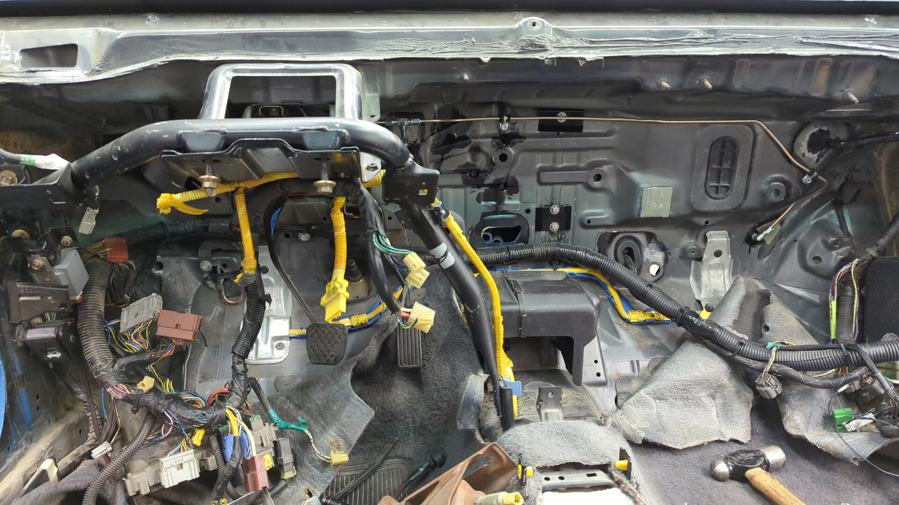
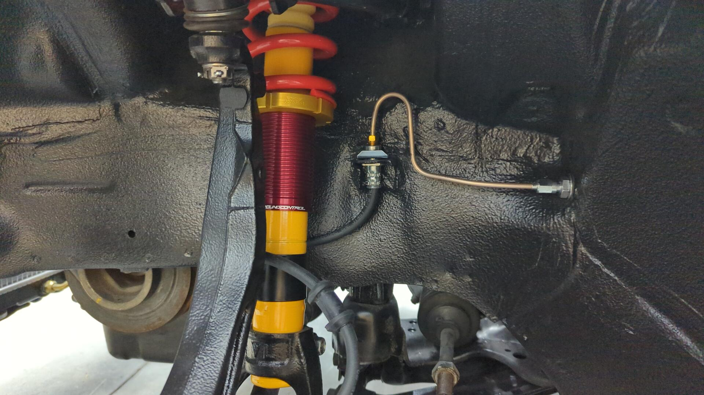
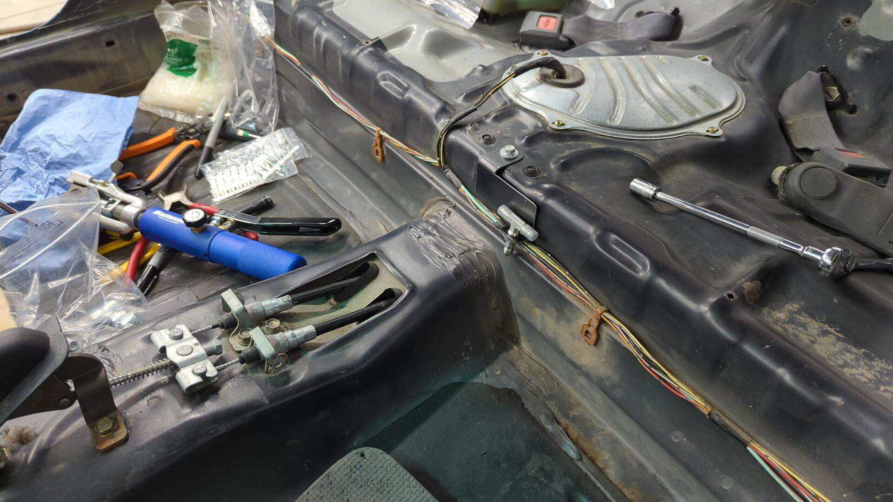
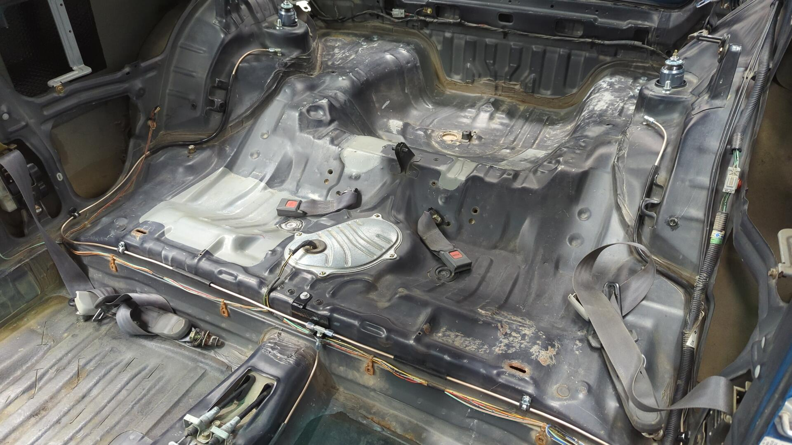
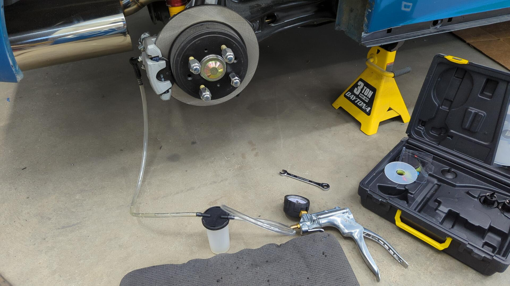

The brakes are officially finished on the car and I figured it was time to post up an overview of them. Previously the car had DX brakes with drums in the rear that were a horrible eyesore, but since I had been wanting brakes with more oomph, it was a no brainer to switch over to a full EX / Integra setup.

# Integra Calipers All Around

Civic EX and Integra calipers are all the same but when looking up parts I wanted an easy way to remember what I was buying so I always searched for 1997 Integra GSR parts since that sounded the coolest.

For calipers I went with:

- Centric 14140074
- Centric 14140073
- Raybestos FRC10327N
- Raybestos FRC10328N
  

Not wanting to see them rust right away I stripped them down so I could paint them with some spare engine enamel I had.

Two coats later.

All done.

In terms of pads I bought some random mid grades ones as I figured I'd eventually want to upgrade them, but wasn't sure what I wanted yet.

## Adapting the Rear Drum Trailing Arms for Disks

I decided to keep my rear drum trailing arms and convert them due to the price of sourcing a new set of disk trailing.

At first I wasn't certain on how I was gonna do this, but eventually I discovered I could convert mine using a pair of Wilwood brackets.

[For the interested, I wrote up a how to doc with a ton of more details]()

# Going With An Adjustable Prop Valve

While planning my new brake setup I decided to try going with an adjustable prop valve. I figured this would be easier to plumb as I didn't enjoy routing the stock prop valve in the cabin last time, and also because if I ever upgrade to even bigger brakes someday it'll be ready to help fine tune things.

Enter the Wilwood 260-8419.

It's a little guy with one input and one output so it doesn't work with a diagonal brake system, but since Honda master cylinders are dual piston the brakes will still have two separate circuits as the fronts will be on one piston and the rears on the other.

To make sure I ordered the correct number of fittings and adapters I drew up a diagram to help.

The diagram above shows the prop valve within the cabin as I had initially planned to mount it hidden under the dash but after seeing how small it was in person I decided to mount it directly on the master cylinder.

All I had to do was make a little bracket.

And it fit perfectly on the new to me 15/16 Integra master cylinder

# Running the Brake Lines

I won't lie, it's been awhile since I've done any brake work so I made some practice bends and flares on scrap tubing. I'm glad I did because my first few flares were junk.

After that I dove in and started running new lines for the master cylinder.

The lines by the shock tower are super tight but they aren't rubbing.

Not wanting the bulkheads to leak I tried adding some rubber washers as a safety precaution.

On the inside I tried a different approach of routing the brake lines up high.

I reused some of the existing holes to secure the lines with 3/8 hose clips.

Routing the driver caliper line down between the pedals was a little tricky.

But running the lines in the front wheel wells was pretty easy.

The rear caliper lines wre a puzzle in themselves because of how I decided to route the rear lines through the interior.

It may seem odd to run the rear brake line down the interior but the lines under the car were junk and had to be removed anyways.

I figured by running them through the interior I could avoid drilling another hole in the firewall, and also wouldn't have to struggle with trying to bend new lines while under the car.

With how I've positioned the rear lines the interior panels should still fit without an issue.

I made a little custom bracket to hold the T fitting.

To run the brake line to the back of the car I decided to run it along the driver side of the center tunnel. Looking back I kind of regret this because I should have put it on the passenger side, but it should be okay given nothing will ever crush it.

Rear brake lines all done. I secured them in a couple spots with 3/8 hose clips and also used some rubber hose to cover them to reduce the chance of damage from being crushed or rubbing up against the floor.

I like how the little bracket came out.

# Bleeding the Brakes and Checking for Leaks

Bleeding the brakes was actually pretty straight forward. I started off by bench bleeding the master cylinder and then used my vacuum pump to bleed the calipers since I was doing everything solo.

I did have a couple of leaks to resolve as one of the fittings was only finger tight, and I also had a leaky banjo bolt on the rear passenger caliper but that just turned out to be a dirty mating surface that was easy to take care of.

[Continue on to Part 19]()
