In an effort to knock down the size of my TODO list I've been trying to wrap up the exterior of the car. Plus with how close the exterior is to being done I've been itching to see how the car is gonna look all buttoned up.

# Restoring the Wiper Cowl

The wiper cowl was looking pretty faded so I figured I'd give it a quick respray.
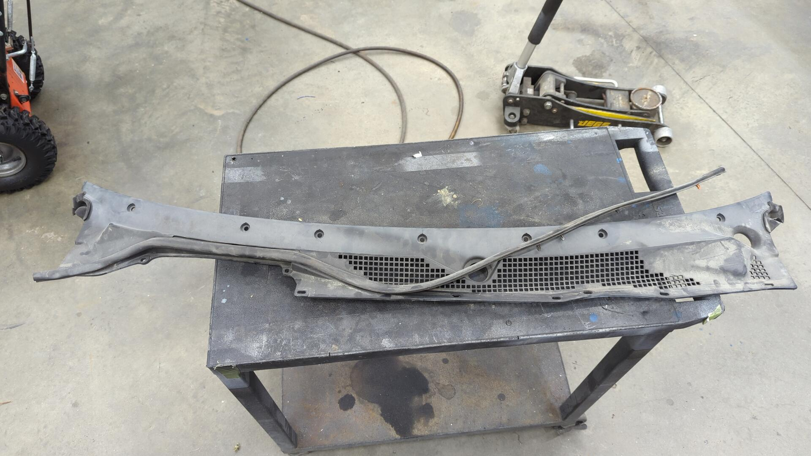

For paint I used SEM trim paint and prepped it by washing the cowl with degreaser followed by a coat of adhesion promoter.

From a distance it looks good but up close there's some spotting. I think it was because I sprayed the adhesion promoter a little too heavy as this was the same paint / adhesion promoter I used on my side mirrors and they look perfect.
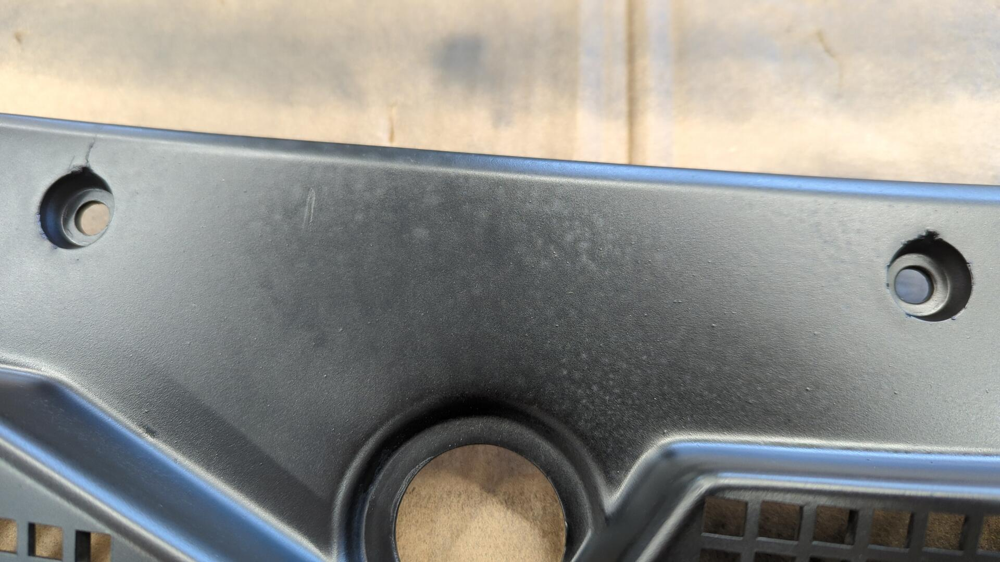

I'm not too concerned though so I proceeded to install the new rubber piece I picked up.

# Installing my New Seibon Duckbill

My new duckbill finally arrived so I couldn't resist installing it.
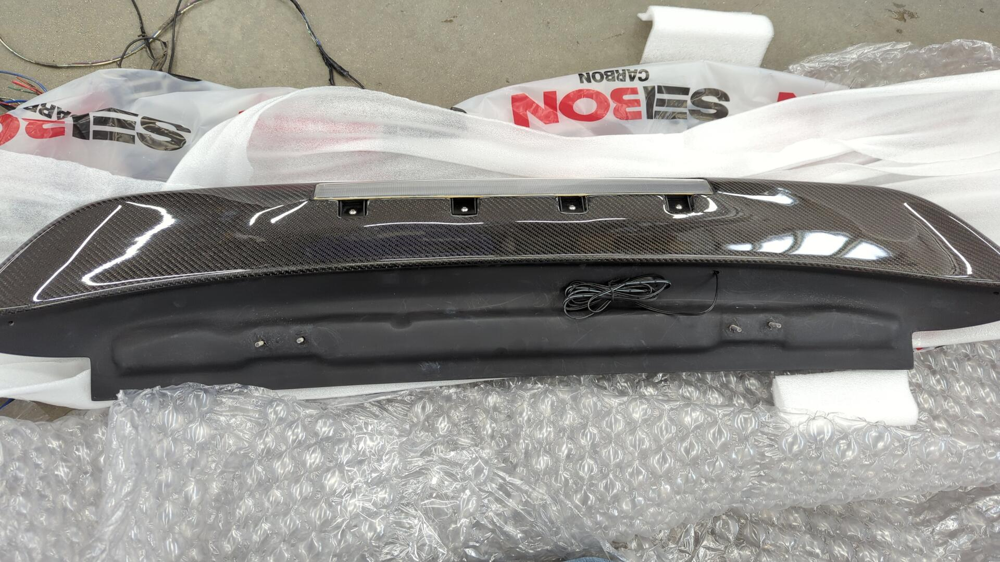

It's a Seibon RS9295HDCVHB-SP-L and it has a 3rd brake light which was pretty important for my needs since I wanted to ensure the car stayed street legal.

The only thing I was missing was a connector for the brake light wiring.

To fix that I installed a 2 pin Aptiv Metripack 150 since they're waterproof (and cheap).

While trying to test fit the spoiler I wasn't able to get one of the bolts to line up with the hatch hinges. It turns out one of the mounting studs was offset from where it needed to be due to a manufacturing defect and instead of returning the spoiler I decided to oblong the mounting hole.
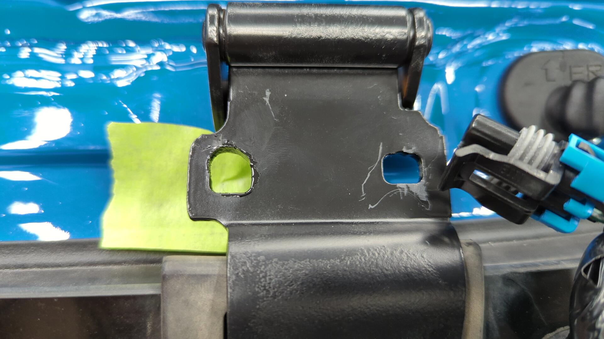

It didn't feel great hacking into my hinge but it felt like the better choice as my only other option would have been to return the spoiler and carbon body panels aren't known for having great fitment anyways.

It looks good installed though so I'm happy with it!

Fitment is pretty decent too.
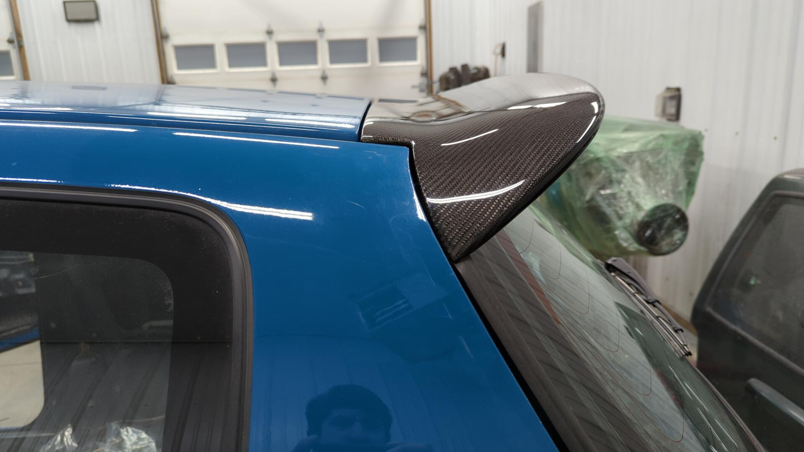

My new connector worked out perfectly. It fits right between the mounting studs / glass and doesn't touch the rubber weatherstripping.
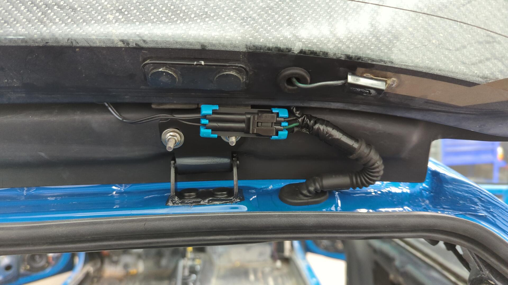

I also made sure to seam seal the upper hinges to prevent any water leaks. I had been meaning to do this for awhile now but was holding off until I could confirm the spoiler fit nicely.
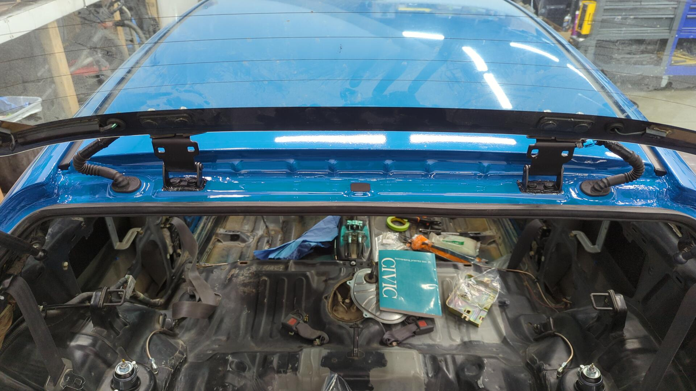

## Investigating Why The Brake Light Didn't Work

After installing the spoiler I wasn't able to get the brake light to work. At first I thought it was due to the wiring polarity being backwards so I tried swapping the wires but it still didn't light up.

Wondering what was going on I realized I probably hadn't plugged the brake light switch on the pedal back up to the harness so I took a peak and sure enough it wasn't connected.

Plugging it in would normally be an easy fix, but after looking all over the main harness I couldn't find the brake switch connector!

It stumped me at first because I really thought I was just overlooking it, but I eventually realized that back when I cleaned up the cabin harness and removed all the excess wiring I may have removed a little too much.

Digging through my spare wire bin confirmed my suspicions.
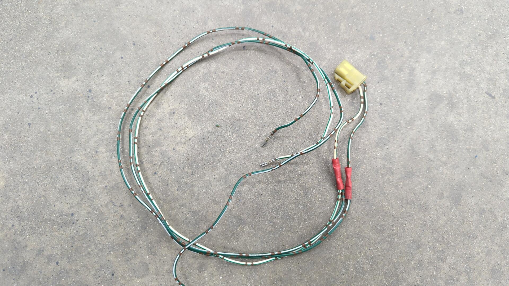

Thankfully when I did remove the connector I had followed the wires to the source and depinned them so it was pretty straight forward to re-add.

The wires connect to the orange junction connector under the dash which is kinda weird.
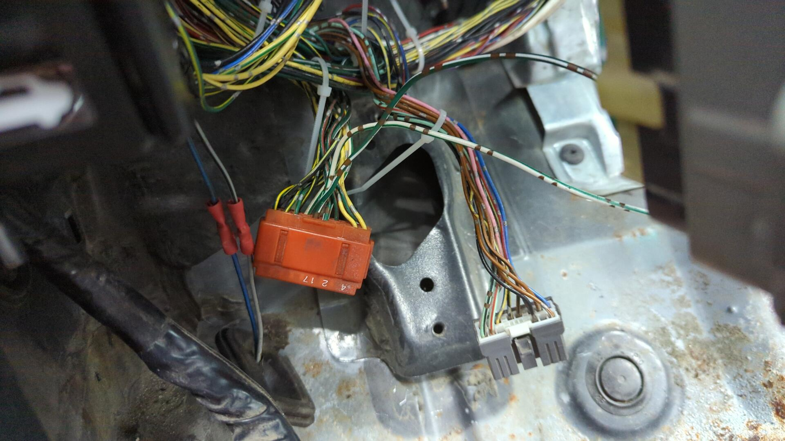

I did a quick test with the wiring before finalizing everything and was happy to see the 3rd brake light finally worked!

As a finishing touch I removed those damn crimp connectors and replaced them with properly soldered connections.
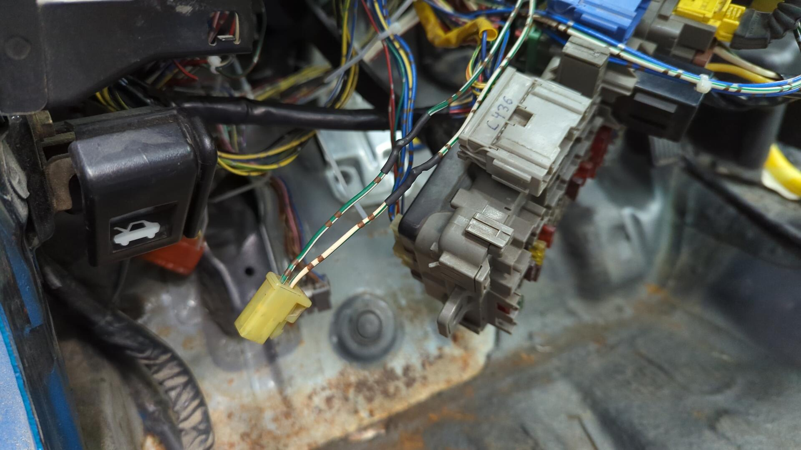

# Hooking up the Clutch Pedal

With both the throttle and brake pedals fully operational all that was left was to hook up the clutch pedal.

I decided to go with an S2K master cylinder since they look a little cleaner under the hood.

I ordered the master cylinder as a kit from [Valex Racing](https://valexracing.com/products/copy-of-bolt-in-s2000-clutch-master-cylinder-slave-clutch-line-for-92-00-honda-civic) and picked up an OEM firewall gasket too (the black gasket on the MC).

It was pretty easy to install.

The only thing that was somewhat tricky was bleeding the clutch since my header completely blocks the bleeder screw on the slave cylinder from being reached. I ended up using my vacuum pump to bleed it.

All done.
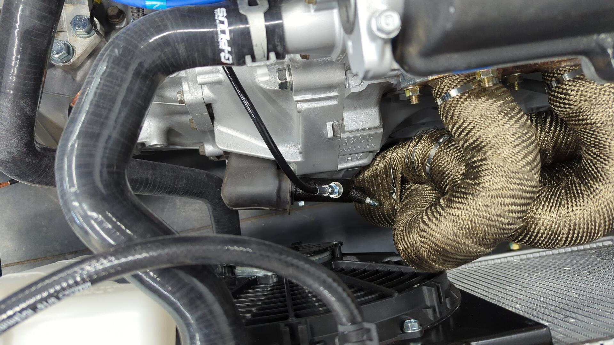

# Can't Forget a Set of Proper Wheels

Since the Integra stole the LS meshes I used to run on the EG, it hasn't had it's own set of wheels for awhile now.

I figured it was time to pick up a proper set of wheels for the hatch and I ended up settling on some 15x7+38 Kosei K1s wrapped in 225/45/15 Falken RT660s.

They're basically the widest tire you can fit on an EG without having to do any major modifications. I _may_ end up having to do some fender rolling as things look super close.
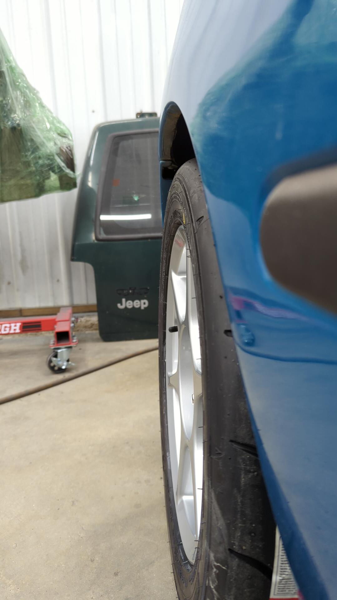

# The First Interior Pieces Go Back In

The EG project is nearing the finish line and I'm finally ready to start installing more of the interior back in it.

Now that it's sitting on it's own wheels it felt like it was time to hook up the steering wheel so I can actually roll it around the garage if needed.
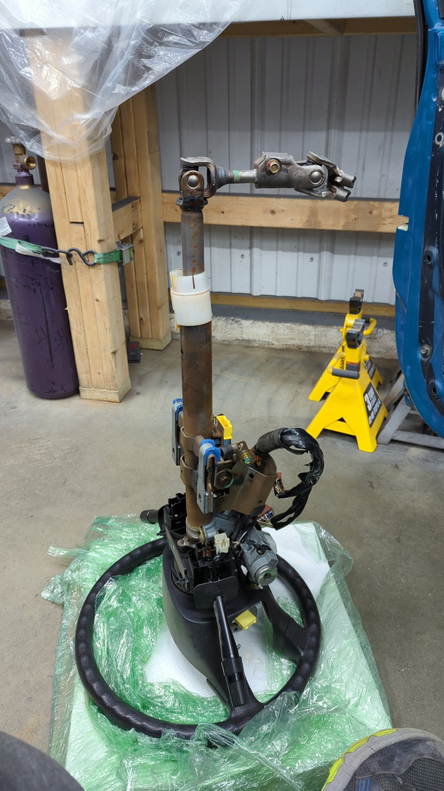

While it wasn't necessary for the install, I decided to address the stripped airbag bolt I had stripped out years ago since it would be easier to fix while still out of the car.

Using my dremel I cut a slot into the bolt so I could use a flat head on it. It completely destroyed the bolt but eventually I was able to break it free.
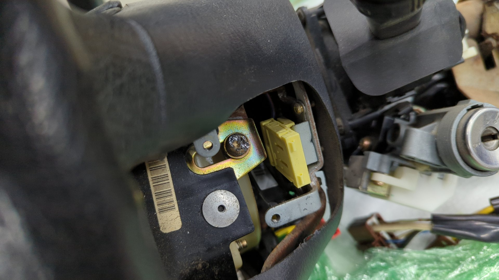

After that adventure was resolved I was able to install the steering wheel back in the car.

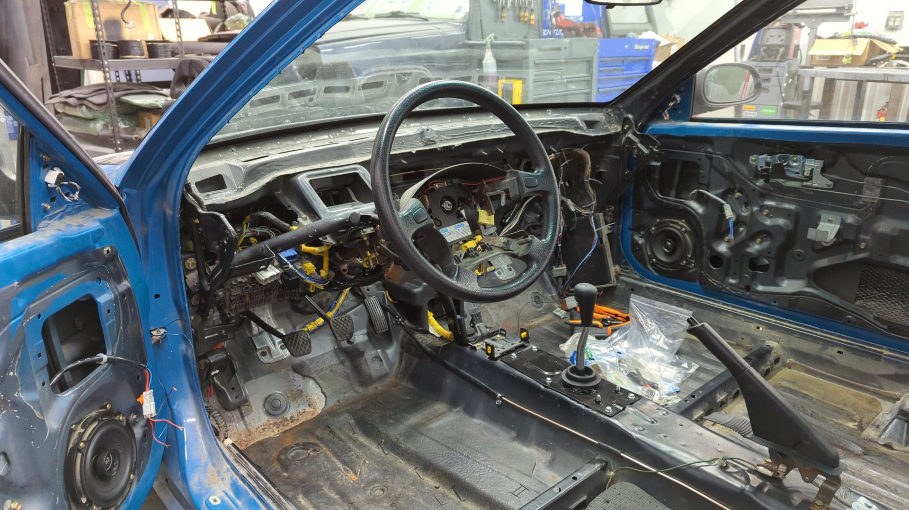

On top of that I popped the upper interior back in too. The pictures don't do it justice as the lighting makes the panels look all beat but it's really exciting to see the interior come together.
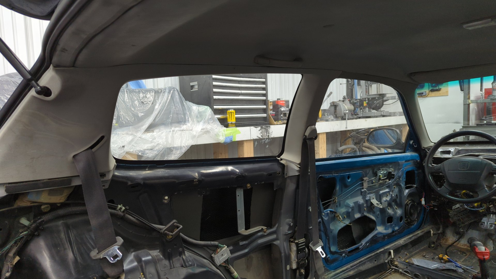

[Continue on to Part 20]()
