Planning out how to wire up the headlights and radiator fan took some time as my new fan had a higher amp rating which meant I couldn't use the stock wiring, and the Denji headlights also required beefier wiring since the low beam bulbs are 55 watt.

While the Denji's came with a relay harness I didn't like the idea of using it because it looked cheap and the wiring would clutter up the engine bay. Even worse I'd still have to get a second relay harness for the radiator fan that would add yet even more wiring to the bay.

Knowing I could probably come up with a better solution I decided to try and design my own custom relay harness that could run both the headlights and radiator.

I wanted to make sure the wiring was nice and compact so after drawing up my circuit diagram I decided to go with a mini power distribution block to hold all the relays and fuses so everything would be all tidy.
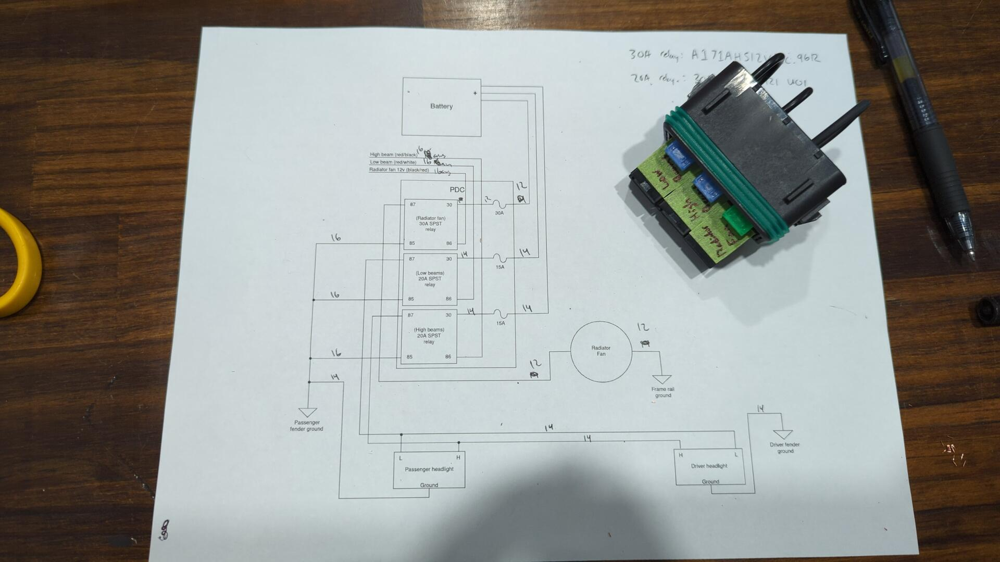

The power distribution block is an 18 position block from [CE Electric Supply](https://ceautoelectricsupply.com/waterproof-power-distribution-centers/) and it has just enough space to hold 3 relays and fuses which is perfect for my needs.

For relays I'm running 1 30amp relay for the radiator fan, and 2 20 amp relays for the headlights (one for lows, one for highs).

The relays I'm running are a bit overkill for my needs, but there's no real harm in that. I calculated that each low beam will draw 4.58 amps (55watt bulbs) so if we round up a bit that'd be about 10 amps total. The high beam bulbs are only 35 watts but I used the same size relay as the lows in case I ever needed to step up to 55 watt high beam bulbs for some reason.

Long term I plan on doing an HID retrofit with some RX330 projectors I've had laying around for years so in the future I'll most likely be dropping down to 35 watt low beams but it's nice having options.

Here's a copy of the wiring diagram I made.
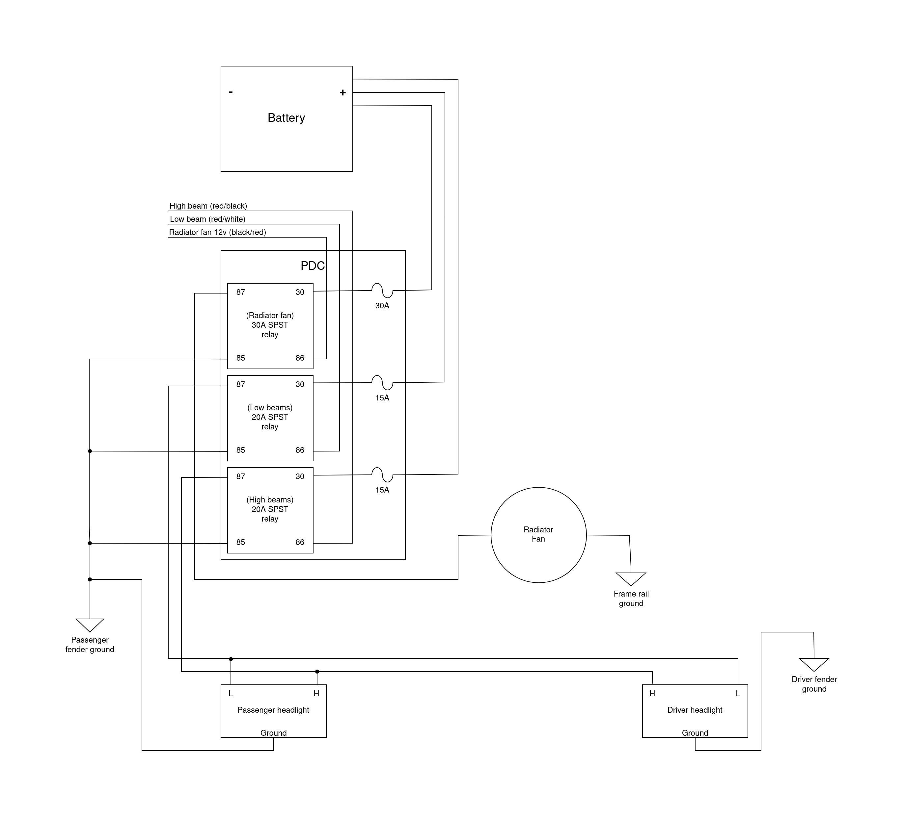

One thing I liked about the power block is that it takes Metri-Pack 280 terminals which are fairly easy to crimp.

All wired up.

Test fit. I had to bend the mounting bracket it came with as it is designed to mount the block at an outward angle but I wanted it closer to parallel with the mounting surface.

I hid the driver headlight wiring on the backside of the radiator support.

And added a zip tie to the wiring to ensure it never gets too friendly with the PS belt.

All loomed up.
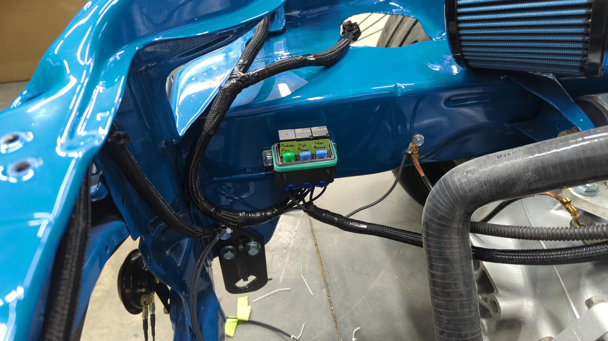

The three relays need to be hooked up the OEM wiring so I ran their signal wires out to the fender so they could be routed into the cabin with the rest of the passenger harness.

I couldn't resist double checking my work with a quick test and was happy to see everything worked perfectly.

Radiator and headlights re-installed.
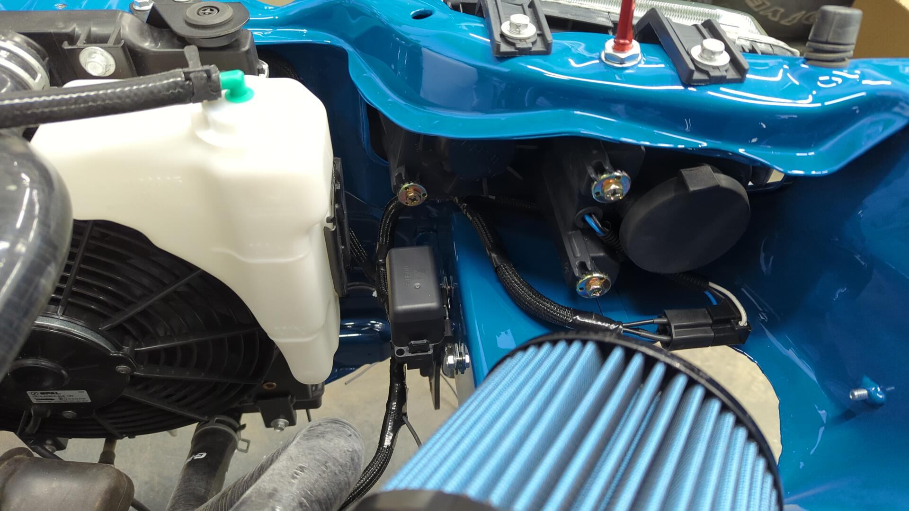

As a finishing touch I swapped the connector on my SPAL fan to the OEM one.
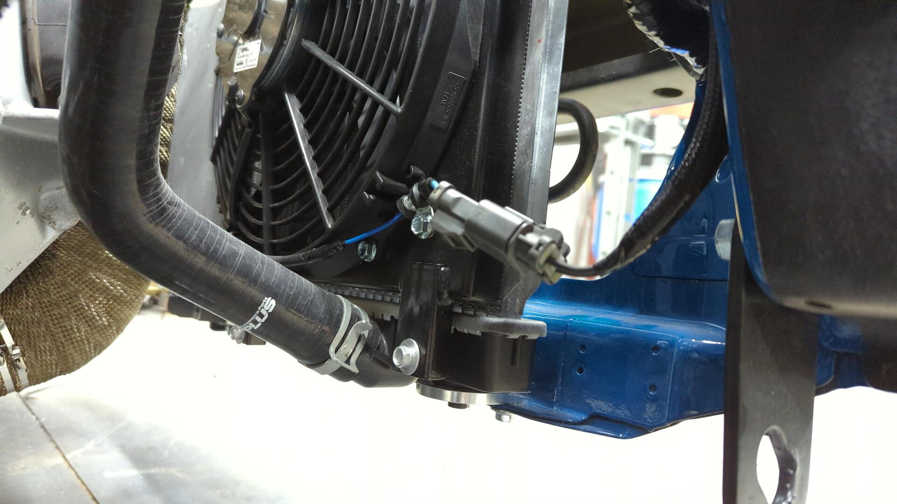

# Moving on to the Fender Harnesses

With the headlights and radiator fan all wired up in the engine bay I was ready to start making the new fender harnesses. I opted to start with the passenger side since it looked to be the easier of the two.

Since I had already ran the low beam, high beam, and radiator fan wires all that was left was to run wiring for the horn, and side marker bulb.

After that I just needed to wire up the ground junction that sits behind the passenger headlight (G201). I don't have the proper terminals for the junction on hand so I had to pilfer them off spare wiring I had and solder them on.

All done.

A bit of loom later and the passenger side harness was almost done.
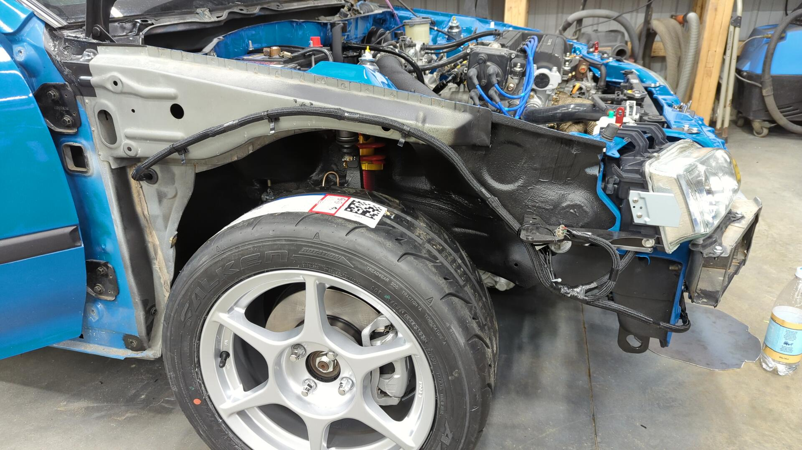

All that was left was to clean up the wiring inside the cabin by terminating it to a connector and then hooking them up the cabin harness.
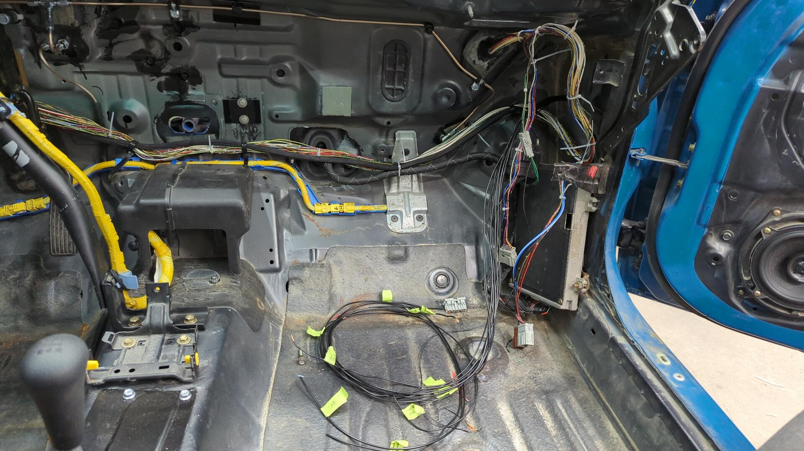

Terminated and carefully labeled.

New connector installed (the grayish Sumitomo one).

Even though the harness will be hidden behind the fender I like how clean it came out.
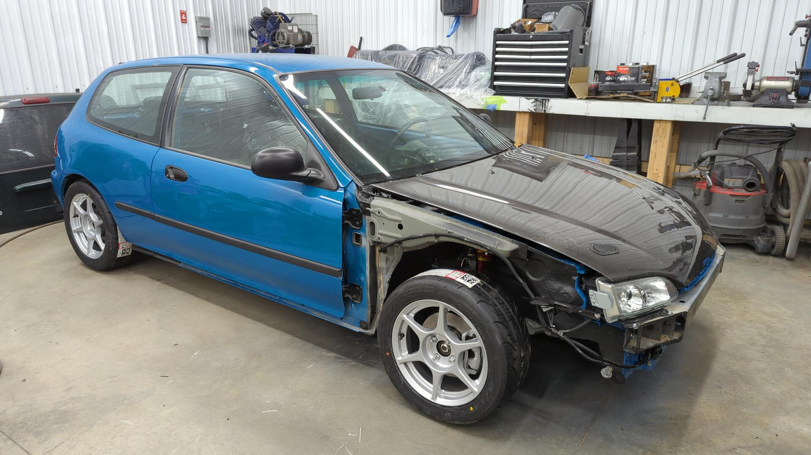

## Wiring up the Wipers and Wideband and the Rest of the Driver Side

On the driver side, the harness is more complex because it needs to include the wiring for the wipers, wideband o2, evap purge solenoid, and power steering pressure switch.

Normally the power steering pressure switch and evap purge solenoid wires runs through the engine harness but since I have a tuck harness that doesn't have wiring for them I felt it'd be easier to route the wiring through the fender instead of hacking up my engine harness.
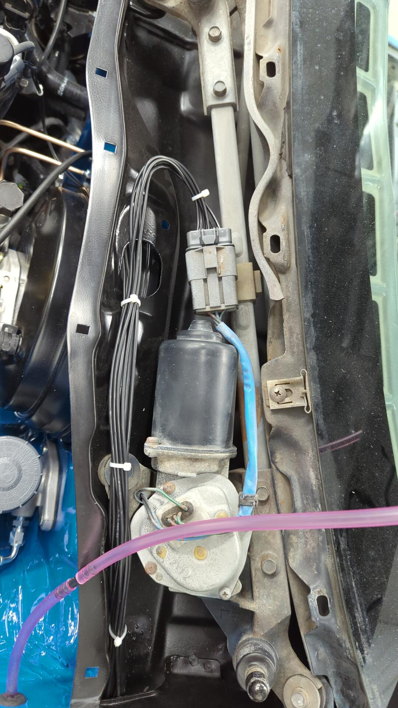

At first the harness looked pretty messy but it slowly took shape as I kept working on it.

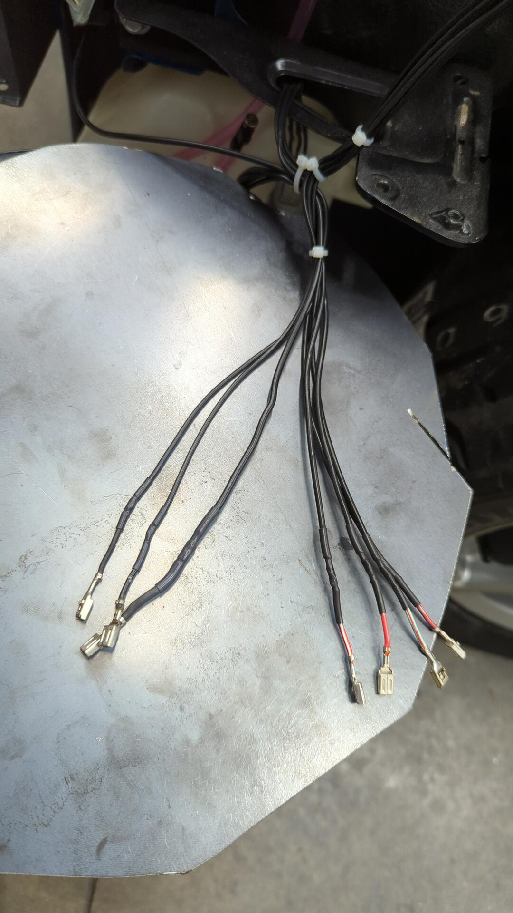

I ended up using crimp connectors on the washer fluid pumps because the wiring was so corroded that my solder wouldn't stick to it. I really need to source better pigtails for the pumps but they'll work for now.

Getting closer.

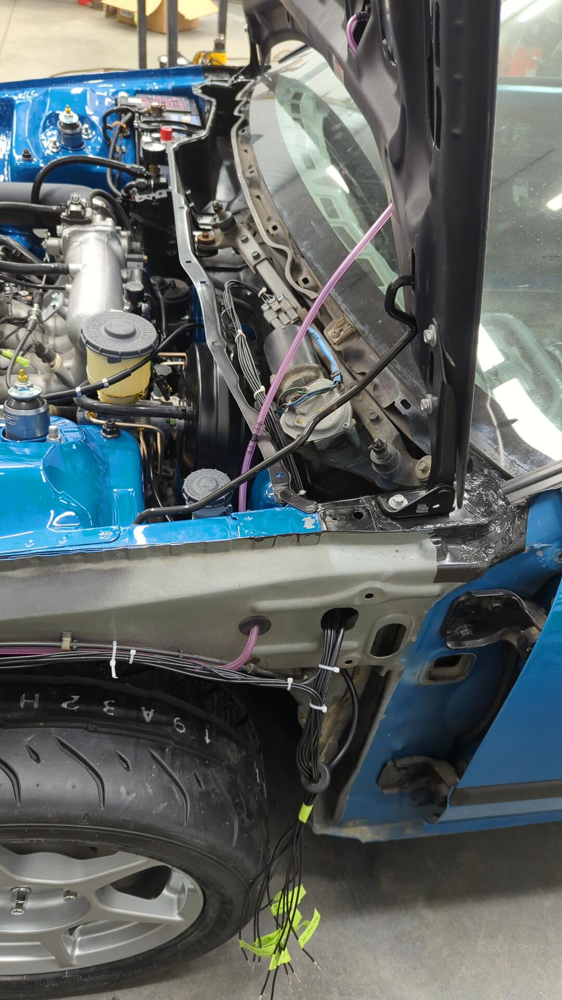

The wiring for the wideband, evap solenoid and ps switch is ran down the firewall on the side of the brake booster.

It's hard to get a good picture of everything back there because it's tight.

Loomed up.
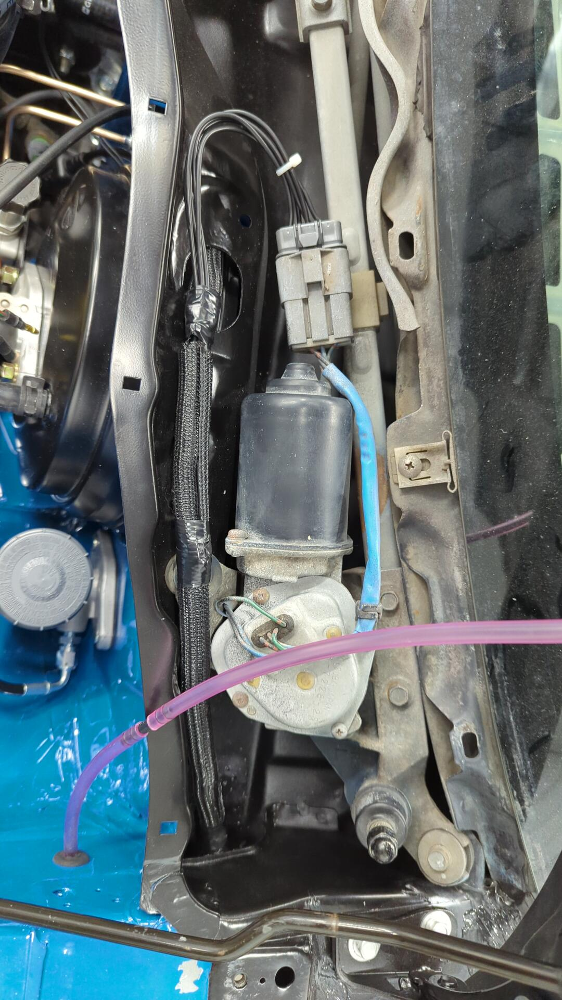

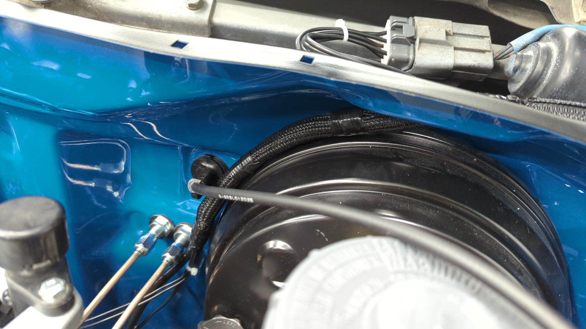

And with the wiring all done in the cowl area I was safe to finally mount up my wiper cowl and wiper arms.

I don't have the best picture of how I terminated the driver side harness, but it just runs to C301 within the cabin.
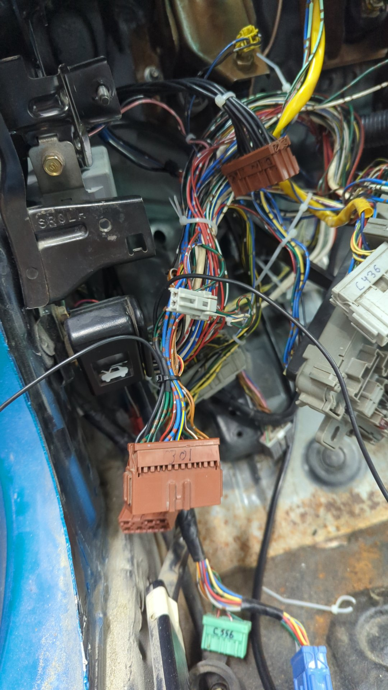

I pinned the evap solenoid wire and PS switch wire to two unused terminals on C301 so I could run new wires through the cabin harness over to the ECU on the passenger side of the car.

# Going for Broke and Wiring up the Power Doors

Planning out how to wire up the power doors took me multiple nights of digging through the electrical troubleshooting manual slowly tracing wires through the various diagrams of each sub-system until I was able to draw up one complete diagram.

It was far more work than I imagined, and I had to double check all of my work several times but I'm pretty proud of how it came out.

Of course drawing up the diagram was only the first step. Now I actually had to run the wires!

I decided to start with the passenger door since it has less wiring, and began by running the power mirror wires as they are the longest and it gave me a good sense of how to route the wiring. Then I added more and more wires while slowly repositioning things until the harness took shape.

I also did my best to secure the harness to the inner door with clips so it wouldn't be all loose and banging around.
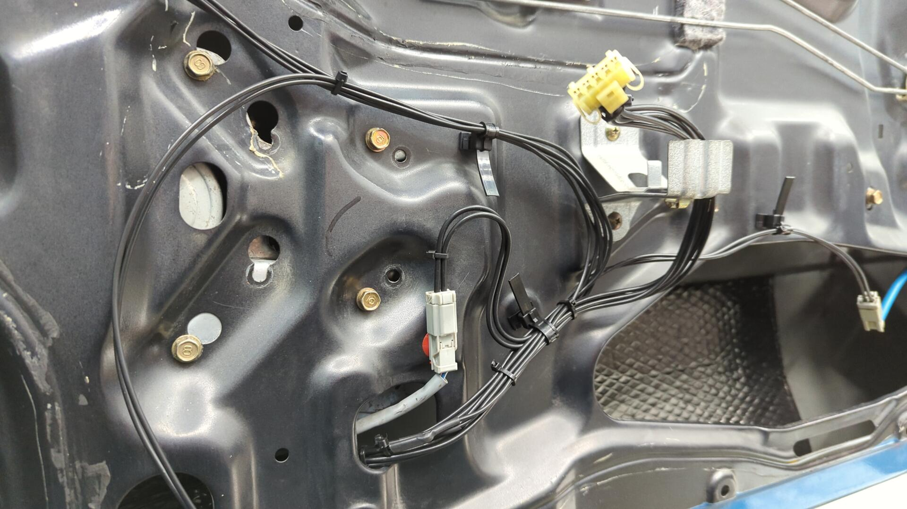

For passing the wiring through the door I had to settle on using a round grommet because I couldn't find anyone selling a 25mm x 45mm rectangular grommet. Using a round grommet doesn't quite cover the opening, but it does fits nice and snug. I may explore 3d printing an adapter plate to improve this.

Getting the wiring ready to pass into the cabin.
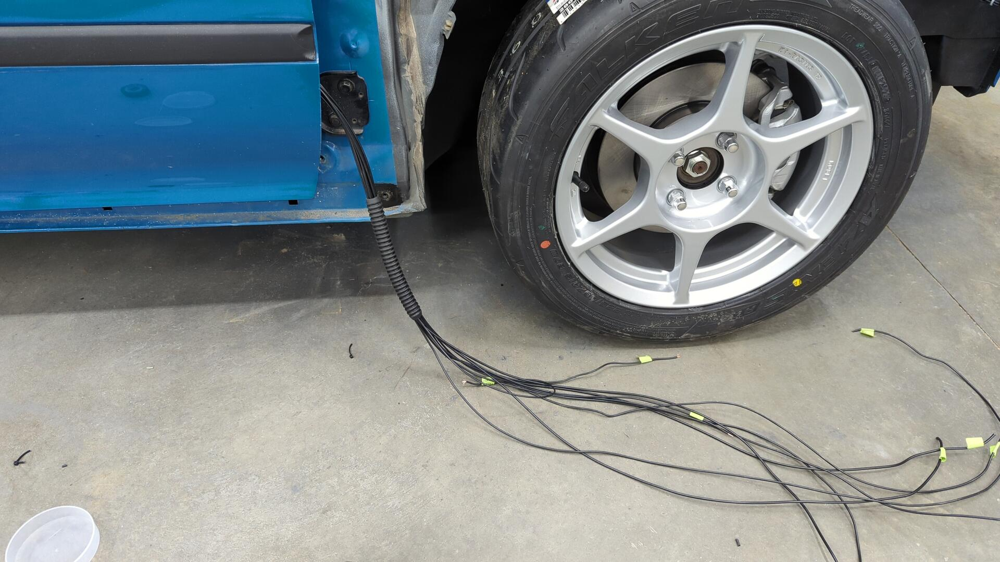

All done. I used a power door grommet from an EK for the cabin side. (EG / EK grommets are the same, but no one was selling an EG one)

On the inside I terminated the wiring to another 14 pin Sumitomo connector.

And of course I can't forget to mention the speaker. My car never had the OEM speakers nor connectors since I've owned it so I made some new connector adapters using 2 pin Sumitomo connectors I had laying around.
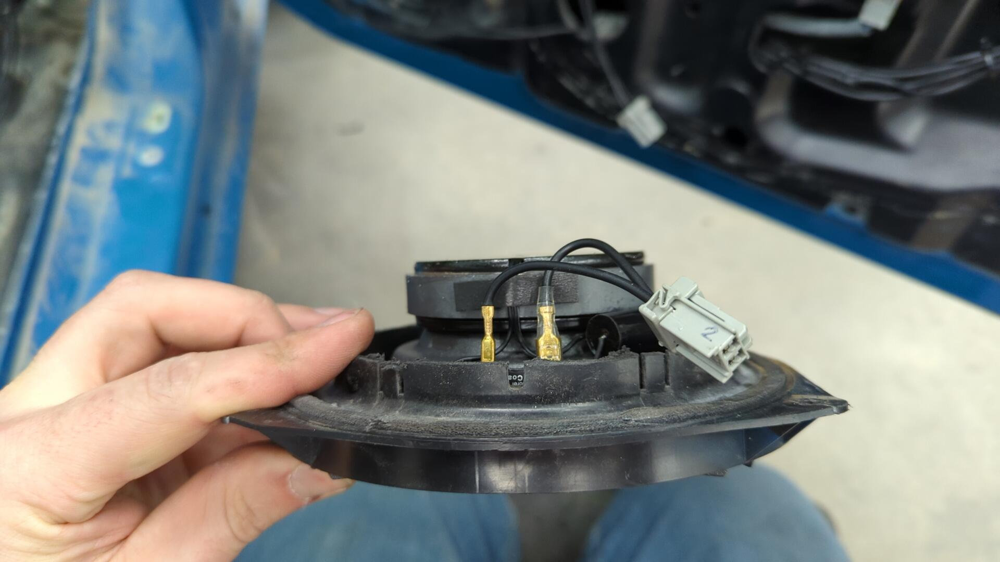

Passenger door basically ready for testing at this point.
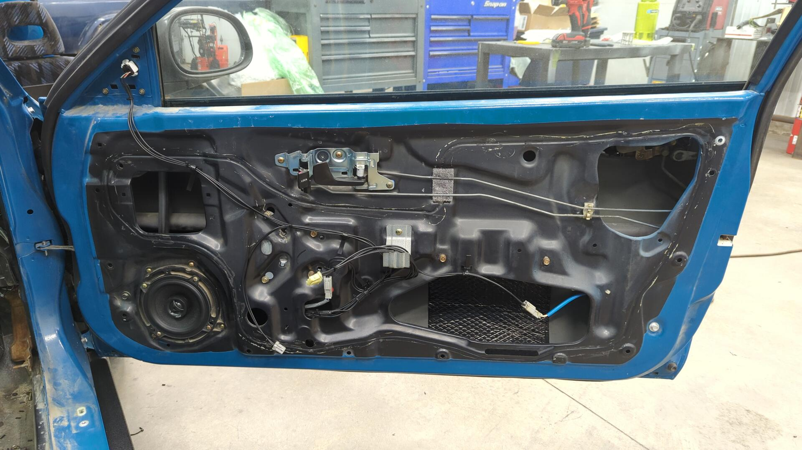

I popped on the door panel to ensure my wiring wasn't hitting anything. Plus I just wanted to see how it looked.

With the passenger door all done, it was time to move over to the driver door. Once again I started by running the mirror wiring to get an idea of where to route the harness.

A bunch of work later and the harness was looking pretty respectable.

There's a lot of ground wires that need to be joined together within the door so I used a junction connector (the blue thingy) that I cut off a spare dash harness.

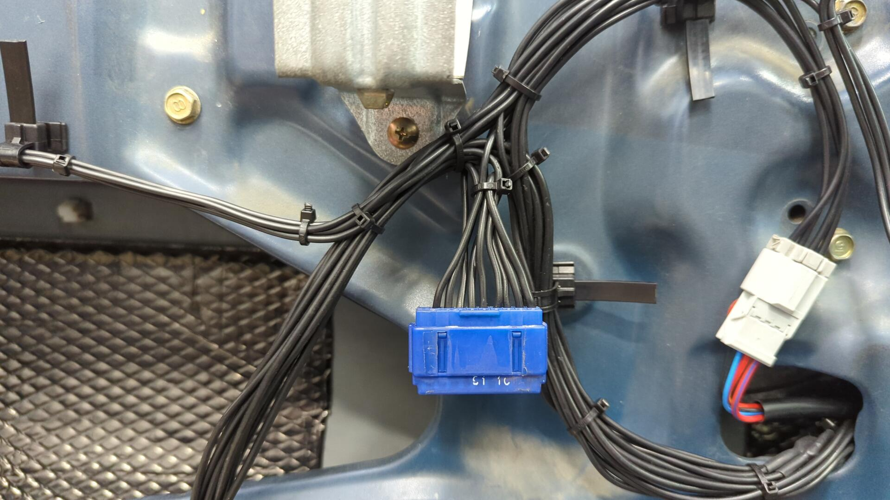

Even though there's only 3 more wires that run from the driver door to the cabin than the passenger door it sure felt like a lot more wiring.

It was a pain trying to finagle the wiring through both grommets.
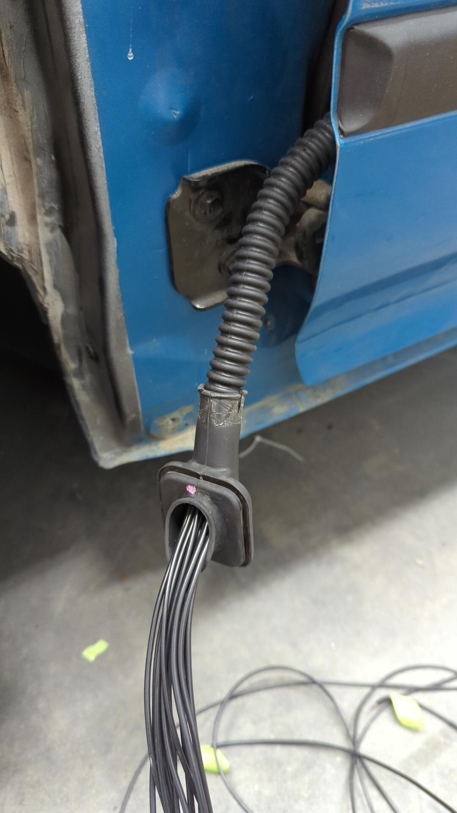
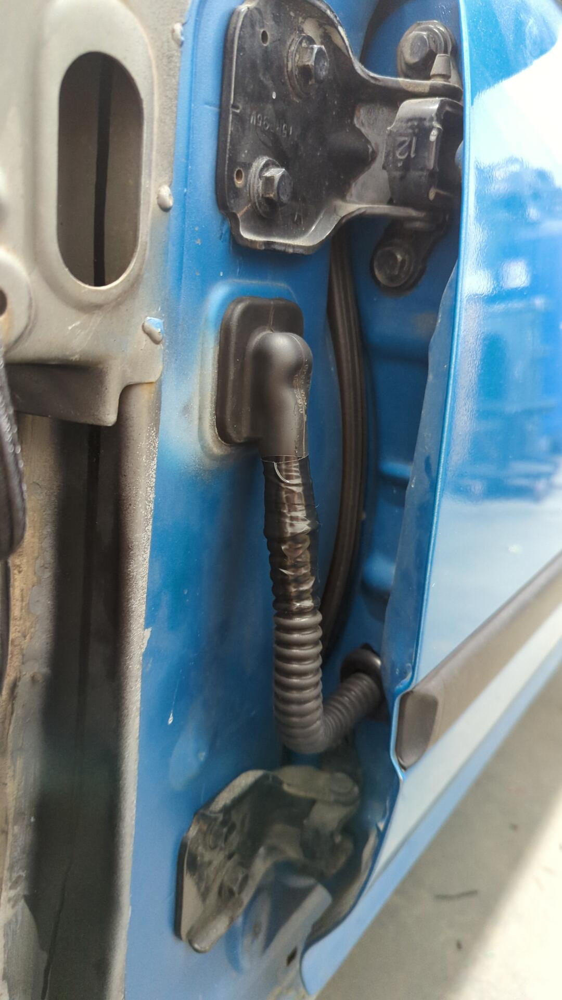

But once I got it into the cabin all that was left was to pin up a new connector.

Test fitting the driver door panel.
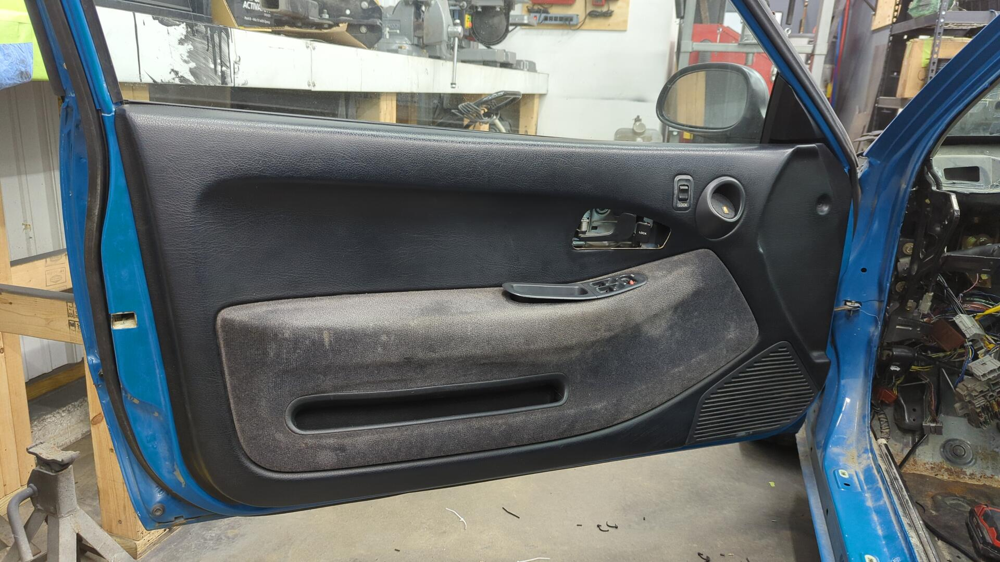

# Popping the Fenders Back On

With the doors all wired up I was finally able to put my fenders back on.

I still have a ton of more wiring to do for the doors, but I don't need to work in the door jambs anymore since all the wiring has been routed into the cabin.

# Making a New License Plate Bracket and "Fixing" the Crack in the Bumper

Needing a break from all the wiring I decided to pivot over to fixing up the front bumper.

It's had a crack in it for several years now and since I don't have the desire or time to fix it properly I opted to make a brace to secure it in the mean time.
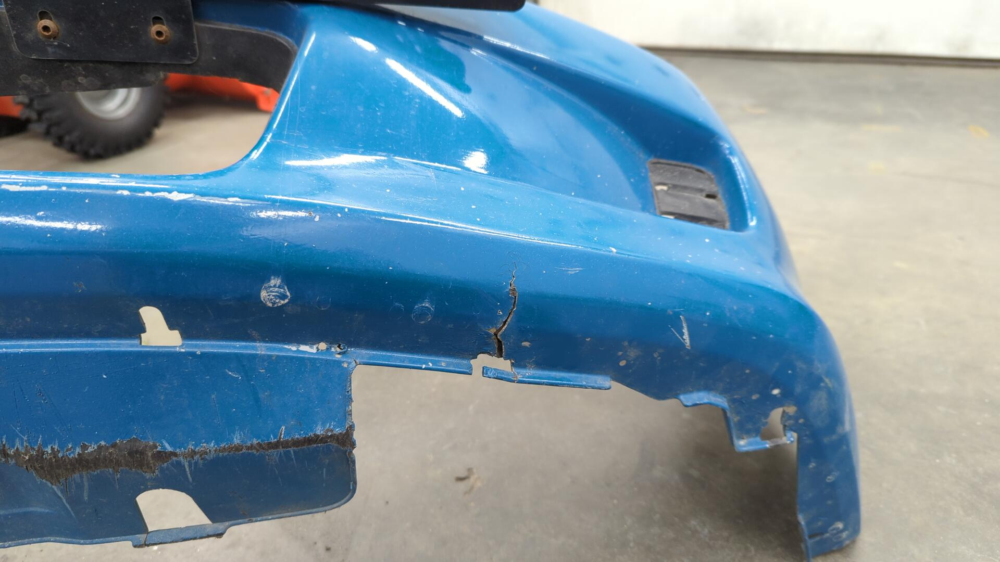

The bolts have large fender washers on the backside so they shouldn't rip through the bumper.
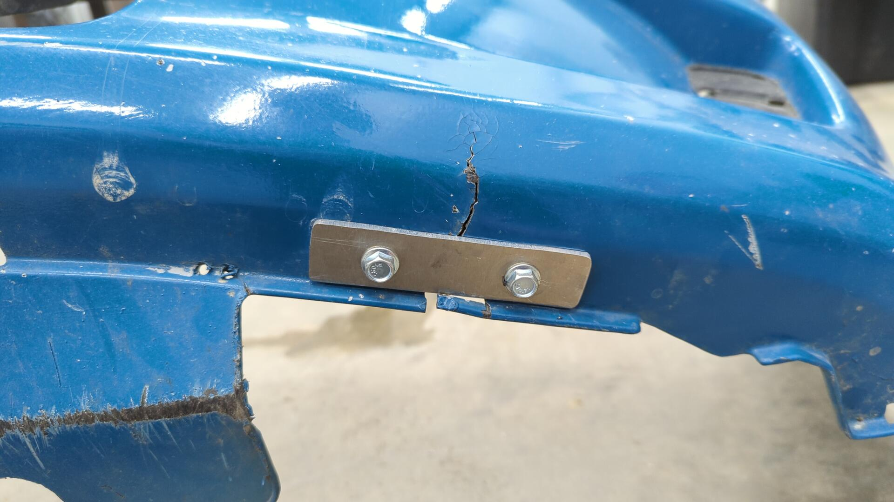

I also decided to remake my cheap license plate bracket as the current one on the car was plastic and I worried one good cone hit and it'd shatter.

Using some 1/8 aluminum plate I mimicked the design and made my new bracket a little beefier just to be safe.

Mounted up. There's a backing plate on the other side of the bumper where the two bolts pass through so it should be nice and secure.
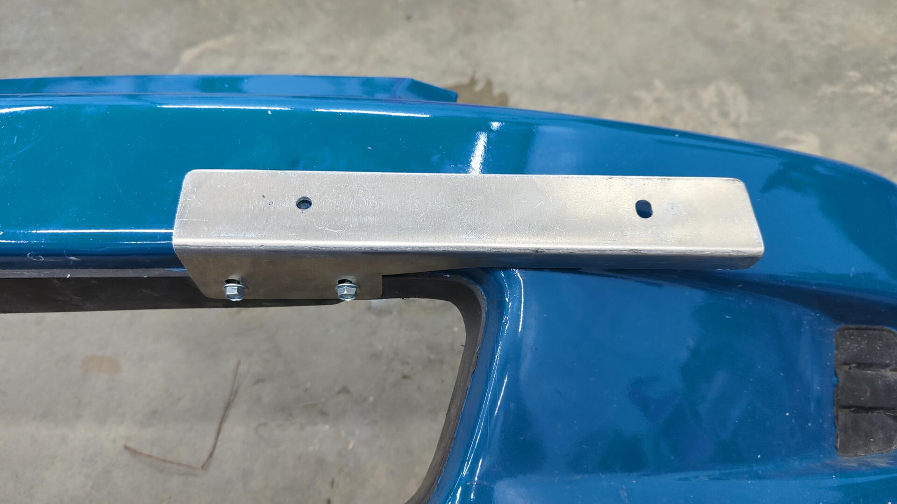

With the bumper all set I couldn't resist bolting it back up to see how the car looked.

I think it looks pretty awesome.

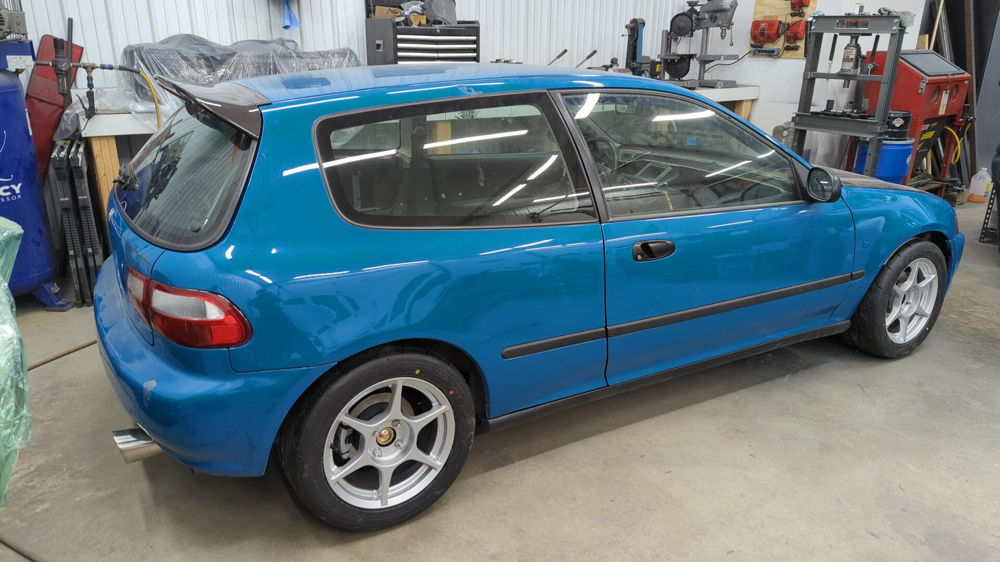

[Continue on to Part 21]()
