The two biggest lessons I've learned from all the wiring I've been doing on the Civic are to always double check your work at each step, and try to wire at a desk whenever possible instead of kneeling next to, or inside a car.

I've been working on the wiring each evening after work and even though I'd be kneeling on a foam pad my knees would be hurting pretty bad after about 2 hours. Maybe it's just me or I need to take more breaks but my knees will be much happier once I finish all the damn wiring.

# Cleaning Up the ECU Wiring Even More

Before I dived into the ECU wiring I realized I needed to clean up the passenger fender wiring harness some more. The wiring for the connector on the cabin side was about 2' too long and was taking up too much space.

A little extra wiring isn't a big deal, but space is kinda tight by the ECU due to the heater blower motor so I felt it was necessary to cut down on the excess wiring even though this meant I had to re-pin the connector all over.

Before.

After.
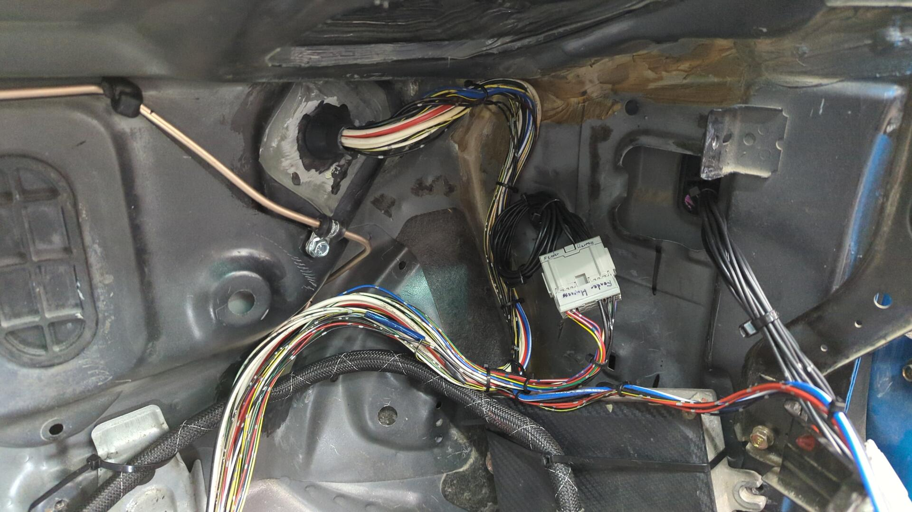

Moving on to the ECU jumper harness I decided I wanted to repin the connectors on the ECU side. It had a massive 16 pin connector and a 2 pin connector I added on, but this didn't work for my needs anymore because I needed to add some wiring for the wideband 02, PS pressure switch sensor, and evap solenoid.

Tucked engine harnesses have to add a jumper harness that runs from C302 on the driver side because the OEM engine harness connects to the cabin on both sides of the engine bay but tuck harnesses don't so they run a jumper harness across the cabin so all the wiring can be routed through a single hole in the firewall.

Unfortunately this one is custom and I don't have a wiring diagram for it so I had to trace each and every wire with my multimeter to figure out what they were connecting to. But once I figured out that, I cut off the old connector and wired up a smaller 14 pin connector.

With the new connector installed I popped the jumper harness back into the cabin so I could swap the connector on the engine harness.

The long green and brown wires going down towards the center console are the wires for the fuel pump relay, and CEL that used to go to the small 2 pin connector on the jumper harness.

Each wire was labelled to ensure I wouldn't mess up swapping them to the new connector.
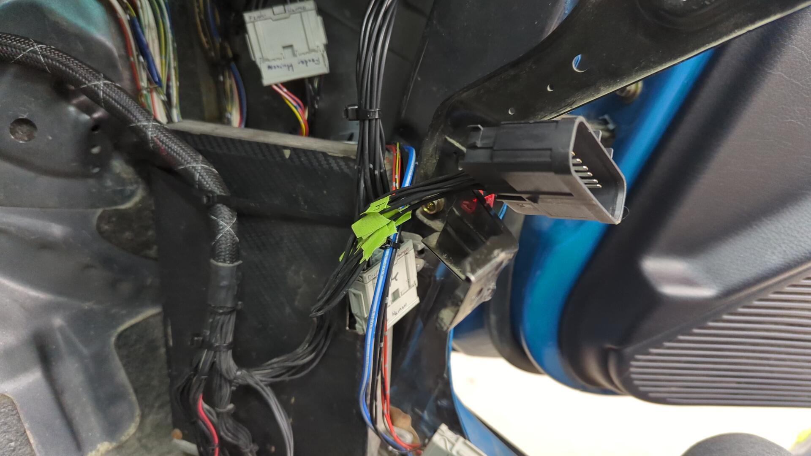

All done.
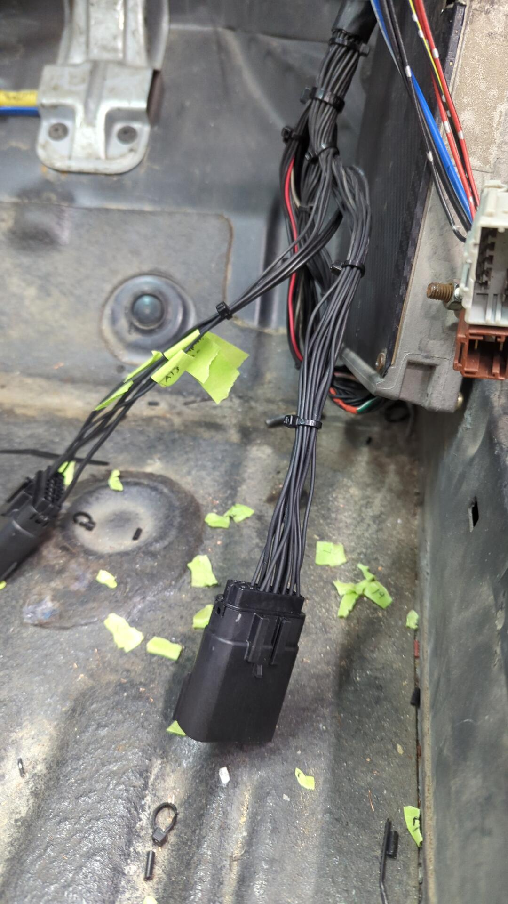

You probably noticed there's 2 14 pin connectors on the engine harness now. I added the second connector for all my custom wiring. It's going to hold the wires for the fuel pump relay, CEL, PS pressure switch, evap solenoid, wideband 02, and even a diag wire so I can flip a switch to have the ECU give me CEL codes.

Over on the driver side I started running two new wires for the PS pressure switch and evap solenoid that I routed into C301 from my custom driver side fender harness.
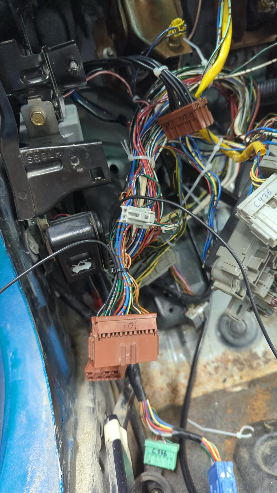

Skipping ahead several steps as wiring is pretty boring to photograph I finally had my ECU wires all done (minus the wideband 02).
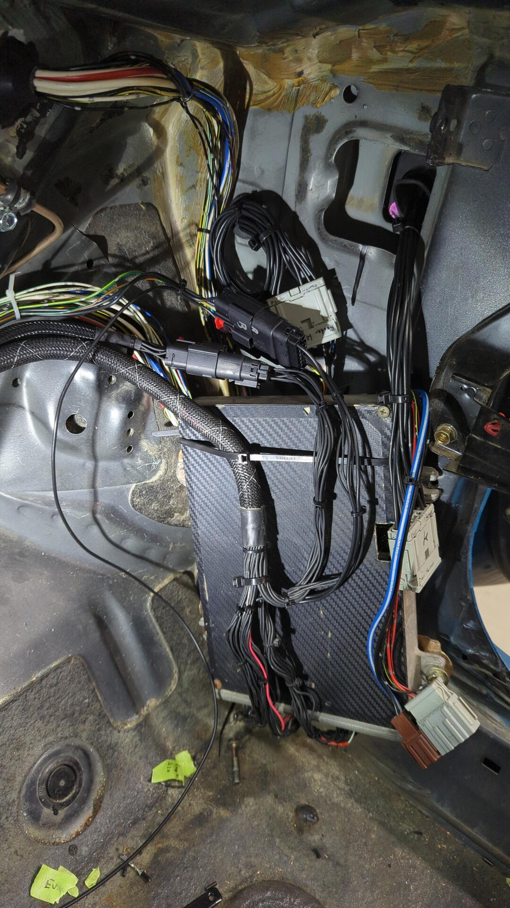

# Making a Jumper Harness for the Passenger Door

Continuing on the power door conversion work from the [previous post]() I figured it was time to run all the cabin side wiring for them.

I started off by turning a jumble of wires into a new jumper harness that would run the 10 wires from the passenger door to the driver side.

Routing it wasn't too bad since the dash isn't in the way but it was pretty tricky trying to get it into the wire shield thing behind the pedals.

Now I just had to connect the wires to their destinations on the driver side.
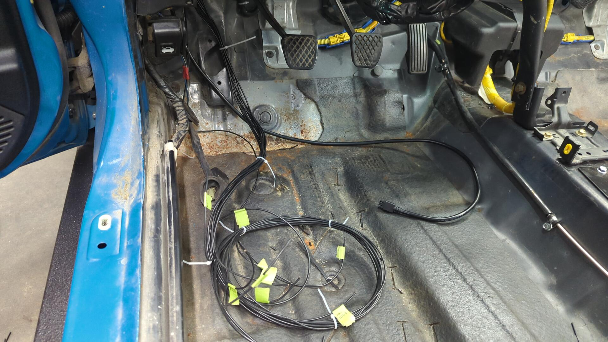

I figured I'd start off with C555 on the backside of the fuse box but it turns out my Civic didn't have a plug so I had to make one.

C555 is how the power doors get their power. It only has four wires and connects to fuses 5, 6, 8, and 13.
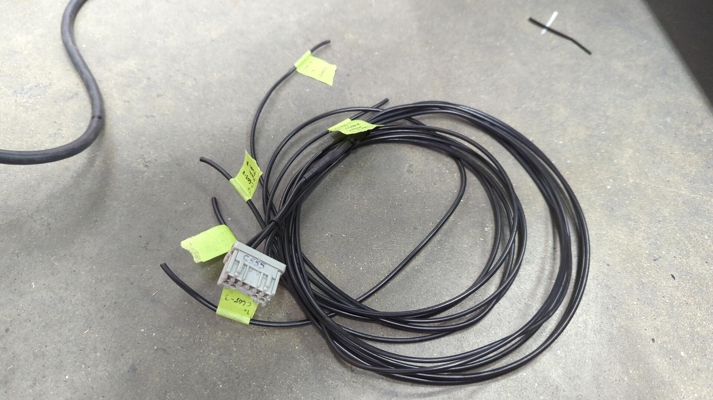

Then I started making my new connector that would connect to the driver door harness by running the 3 power wires it needed from C555.
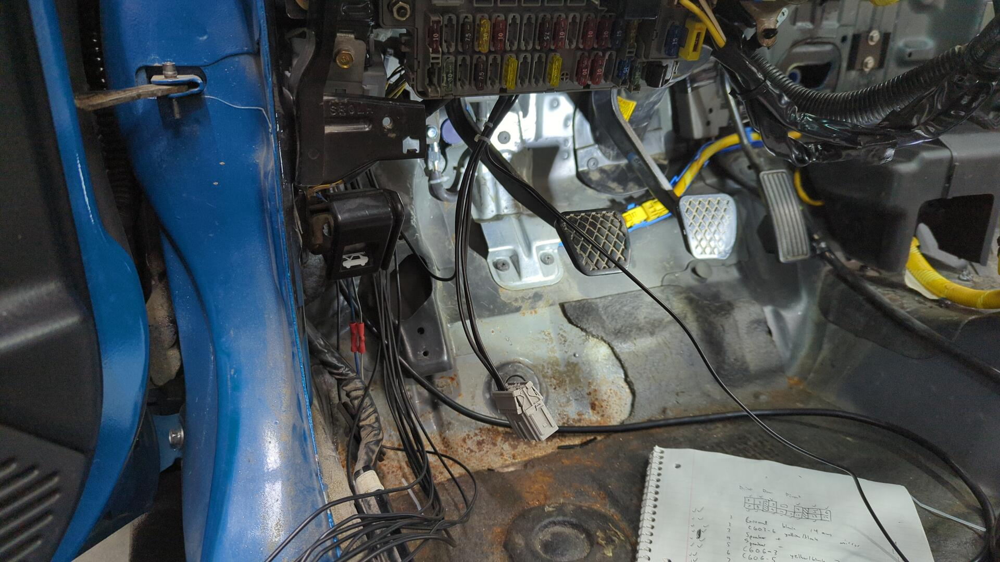

After that I ran the two speaker wires from the passenger door into C436.

(The two black wires)
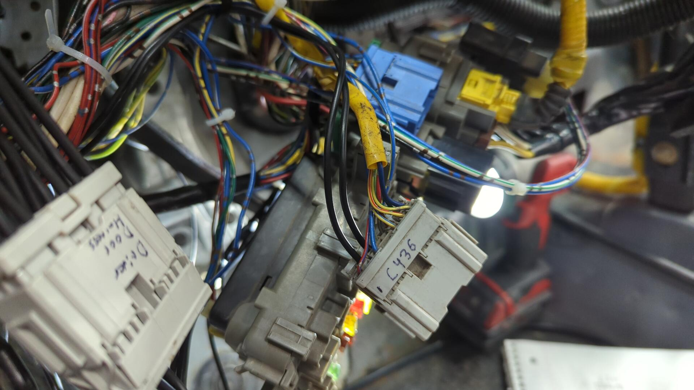

Continuing on with the speaker wires I routed two more wires into C502 for the driver side door.
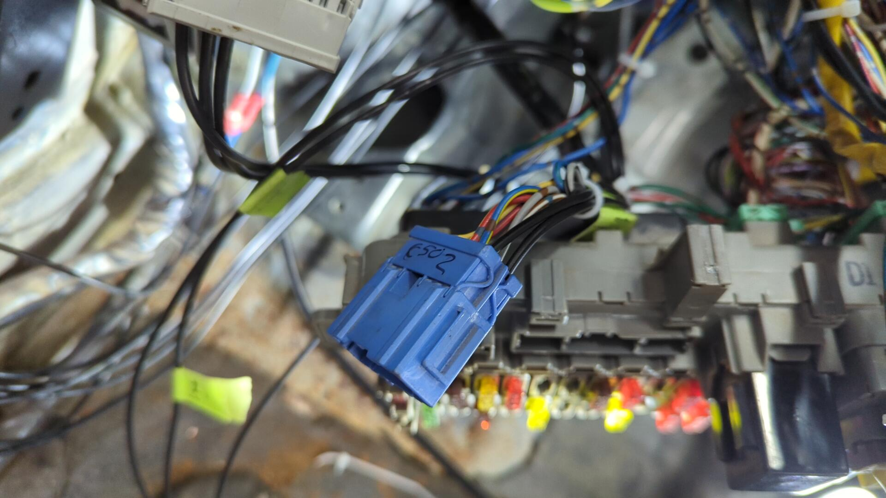

A lot more wiring later I had routed every wire from the passenger door to where it needed to go, and even made a new connector for the dash power mirror switch (the green connector hanging down).

I did my best to tie all my custom wiring into the OEM wiring so it'd look OEMish. The only thing that really gives it away is all the wires are black.
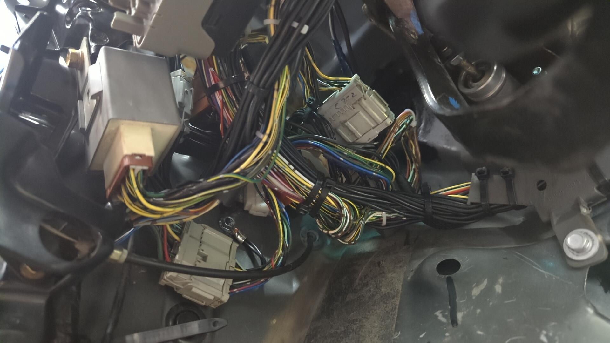

All done.
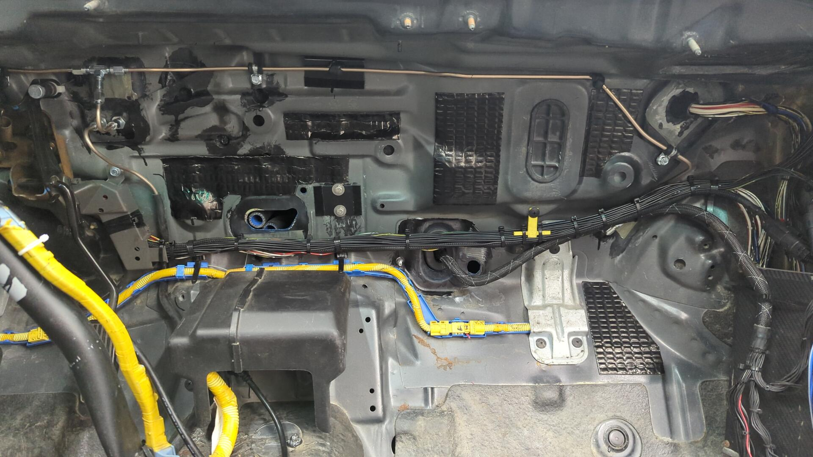
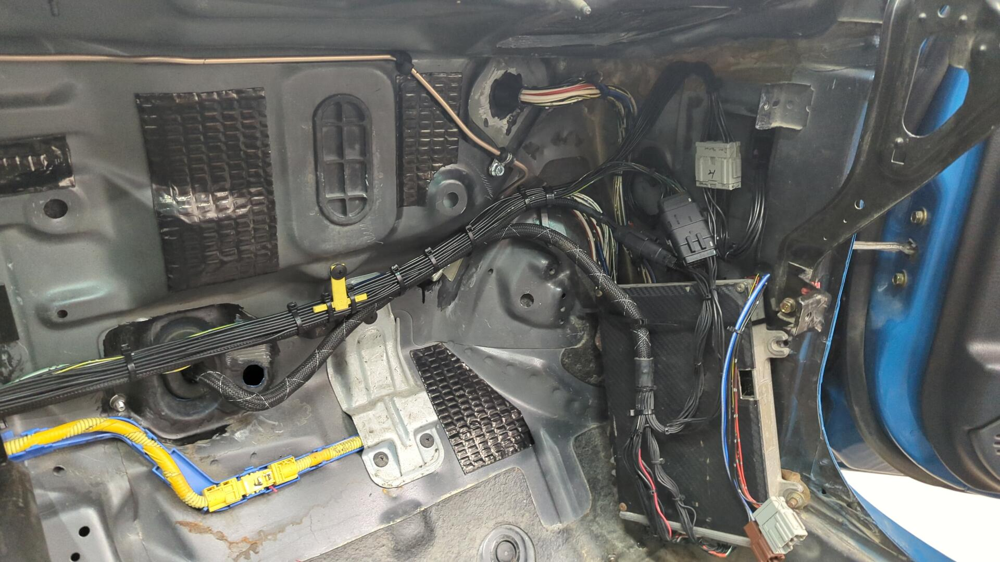

At this point my power doors were mostly working and I could roll my windows up and down! I had to do a bit of debugging though as I found two issues with my new wiring:

- When moving the mirrors left or right both mirrors would move regardless of the selected mirror on the switch
- When locking the driver door the passenger door would unlock.

The door lock issue was easy to resolve as I had just wired the polarity of the passenger door lock actuator backwards and flipping the wires at the connector fixed that.

The power mirror issue was more concerning as I was afraid it'd be hard to debug but it turned out I had just mixed up pin 3 and pin 4 on the mirror switch. Once I flipped the wires everything worked perfectly.

Not bad at all for my first major wiring project.

# Dyeing the OEM Gray Carpet

With my knees begging for a break from all the wiring I decided to switch gears to something a little simpler and work on dyeing my carpet.

The OEM carpet for my Civic was gray since the interior used to be gray but I decided I wanted a darker gray to match the OEM color that comes with the black interior cars.
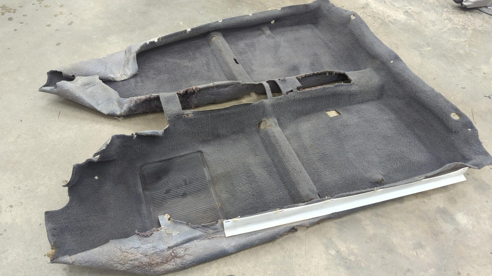

I ended up using 2 cans of SEM color coat in 15303 graphite gray which was basically a perfect match.
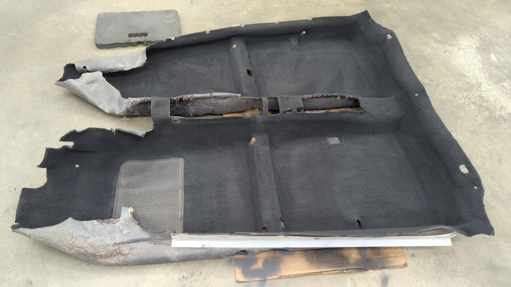

After letting the carpet dry for a day I mounted up my new black door sills.

One last look at the bare floor.

I decided to hold off on doing anything with the rust on the driver footwell area since the car isn't going to see any winter driving and the rust isn't at a concerning point yet. Eventually I'll scrape all the sound deadening off around there and sandblast the rust.

Carpet re-installed along with my center console and new arm rest.

The interior was starting to feel like a normal car again.

# New Vapor Barriers for the Doors

With the door wiring all done I was ready to install new vapor barriers.

The Civic hasn't had any ever since the paint job and it was kind annoying because it'd let water in through the speaker hole when raining, and while driving down the highway with all the windows shut you could feel the wind coming in through the door if a strong side gust hit the car.

For butyl tape I used some 1/4 Fabral butyl tape from Home Depot since someone in the review used it for their Miata's doors.

The plastic sheeting is just generic 2 mil plastic sheeting.

Passenger door all done.

Repeated all the same steps on the driver side.

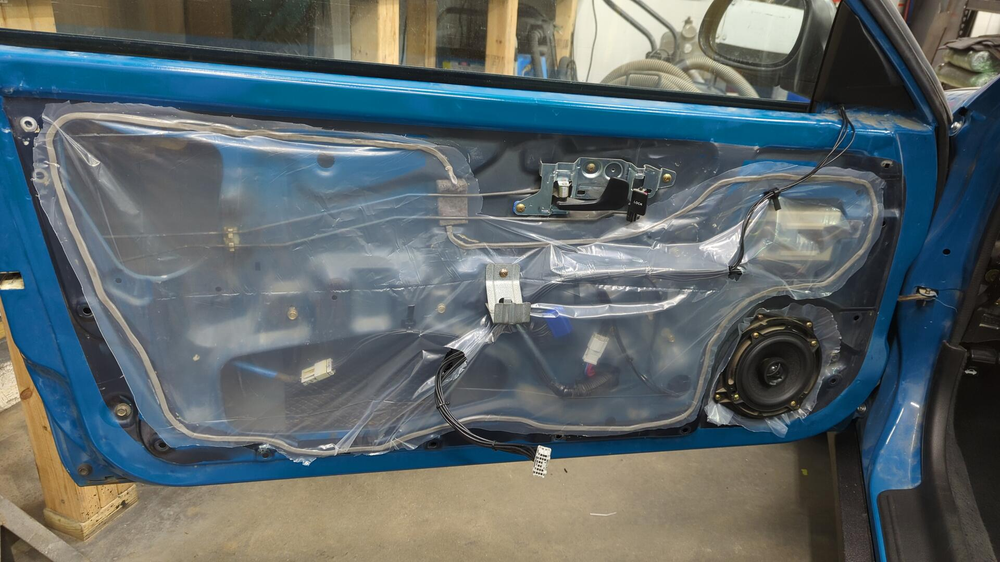

Done.

# It's Finally Time to Put the Dash In

At this point I was basically ready to prep the dash for install but I had one last issue to address.

I noticed one of the brake lines had a small drop of fluid hanging off it, and I tried tightening it to close up the leak but no matter what I did I wasn't able to stop it from slowly weeping.

Since it seemed like I had a bad flare I figured my best bet was to remake the line. My hunch was that the angle of the old line was preventing a good connection so I made the new line with 2 90 bends.

The photo is deceiving as the bottom bend looks kinked but I used my bending tool for it so it's all proper.

With that all taken care of I was ready to pull the dash out of storage. We'll actually just off my workbench where it had been sitting since last year.

This is the OEM gray dash my car came with but I dyed it years ago with SEM color coat. It's held up surprisingly well.

This is also why the glove box is gray because I never dyed it.
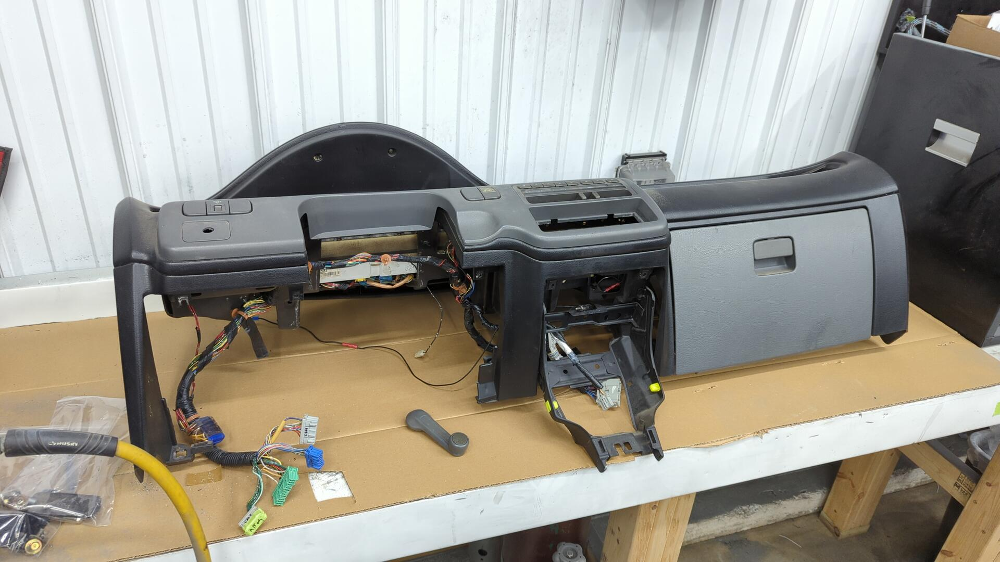

I had to do a bit of wiring to prep it for the new radio and I also swapped out the face plate to a darker gray one that I had laying around.

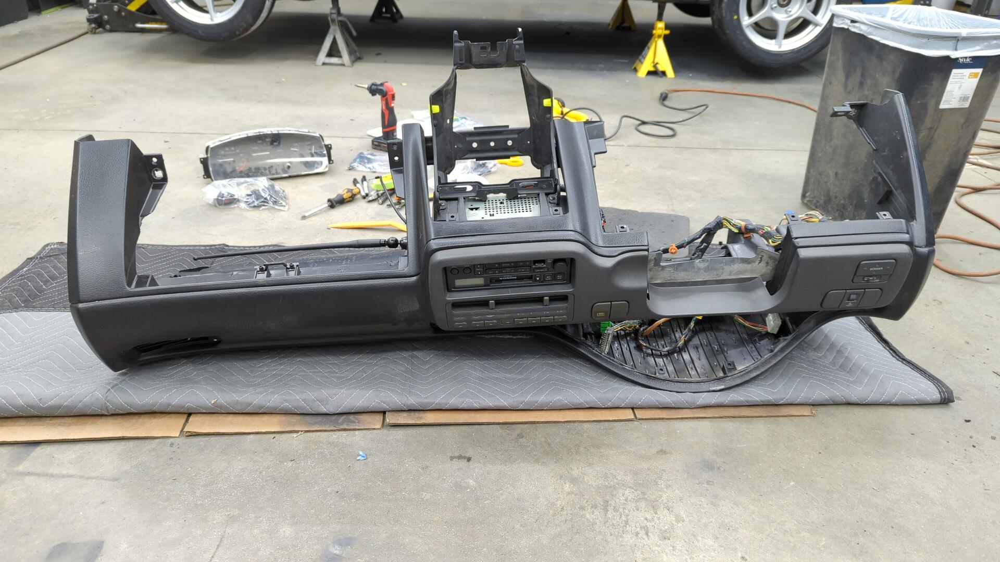

The new radio is out of a 98-02 Accord. I bought it in unknown condition and had to do some work on it as it had a bad solder joint so the audio would randomly cut out, and the tape drive also had a snapped belt.

With the wiring all ready I was safe to pop the dash back in.
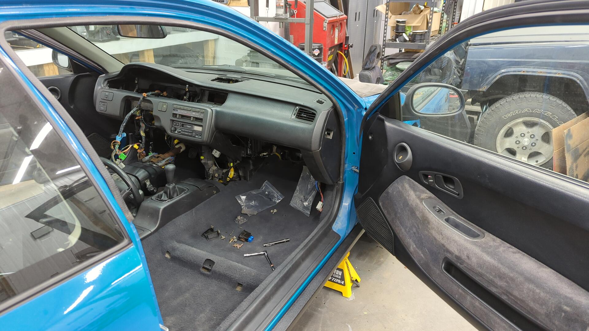
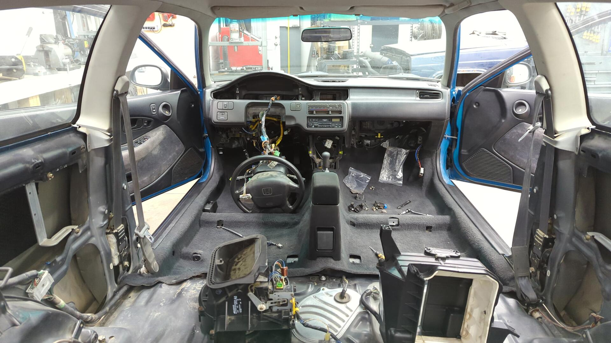

A bit of assembly later and it was looking pretty legit.

I tucked my diag switch down by the hood latch.
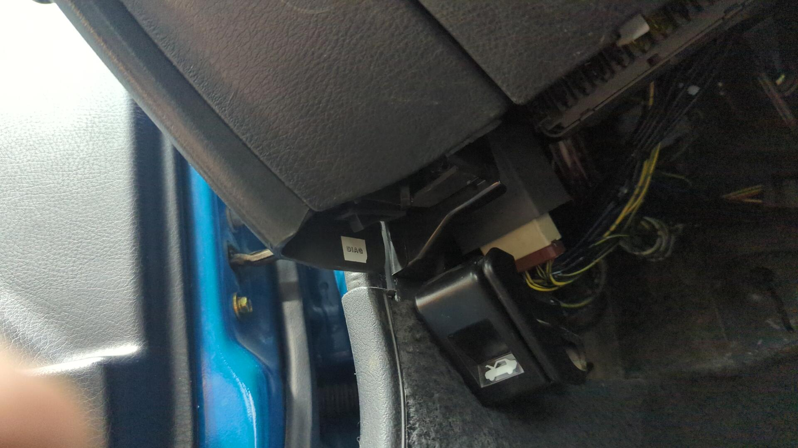

The cable coming out from behind the center console is what will connect to the wideband controller.
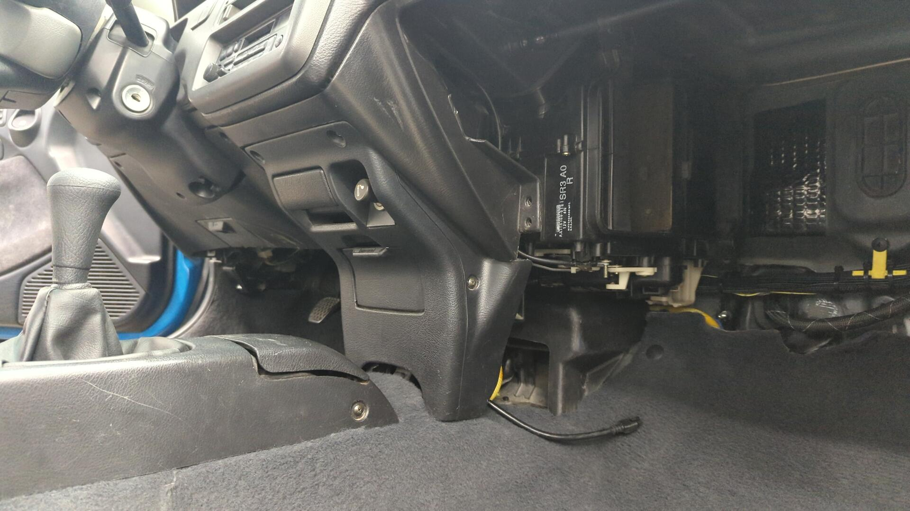

# The ECU Wiring Strikes Again

And just when I thought I was done wiring up the ECU I realized I had a lot more work left to do.
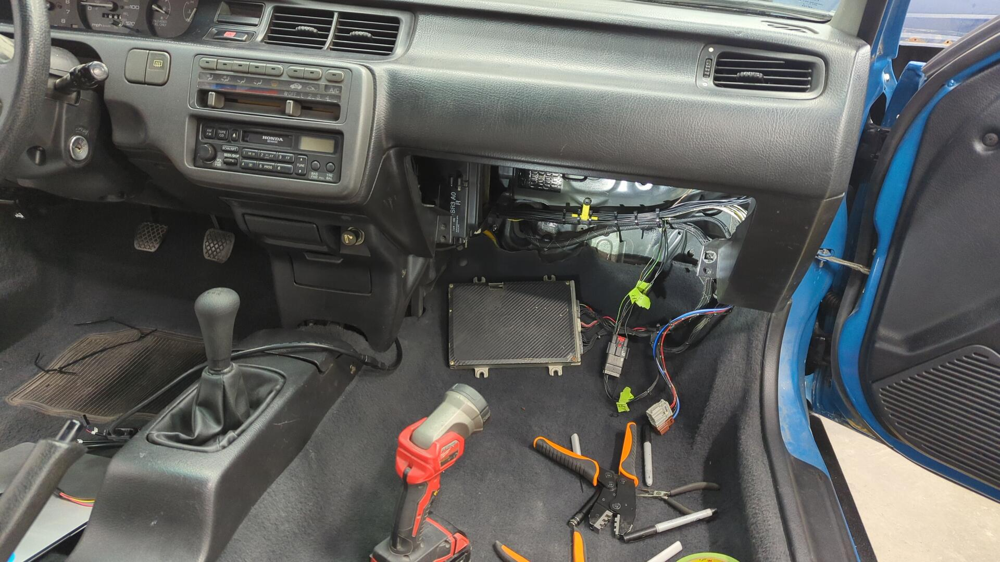

While fiddling with the ECU I noticed one of the wires was improperly crimped and could be pulled out from it's slot with ease.

That wire is super important too as it's the wire for injector 1. Back when the car used to be on the road it had a very intermittent misfire and I think this explains why.

Unfortunately this isn't even the first loose wire I found on the ECU connectors with this harness as years ago the car had a stalling issue which ended up being a loose MAP sensor wire. Not wanting to mess around I decided my best bet was to swap all the pins. Unfortunately though I didn't have any of these pins so I opted to solder on OEM wires so I could atleast get OEM color back as well.

I actually had a spare set of ECU connectors laying around.

And after way more soldering that I wanted to do and double checking all my wiring I was able to swap over every wire.
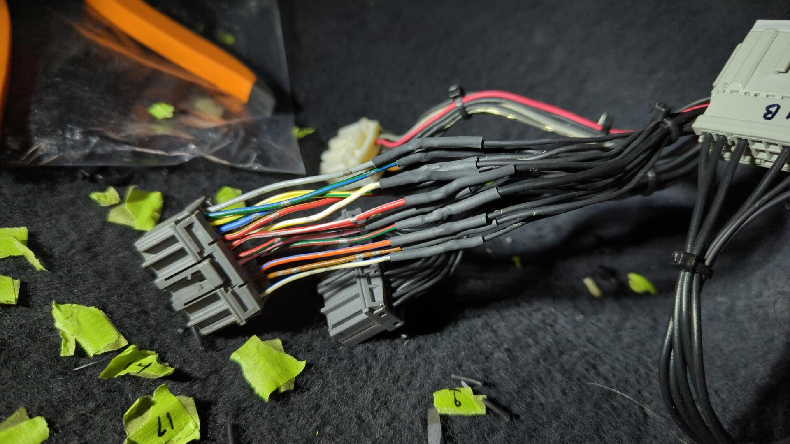

While I was at it I decided I didn't like the Molex MX150 connectors I had used for the engine harness connectors that ran all the wiring over to the driver side and decided to switch those out for Sumitomo 14 pin connectors.

ECU connectors all done.

The wiring above the ECU was starting to add up but it was basically complete at this point.
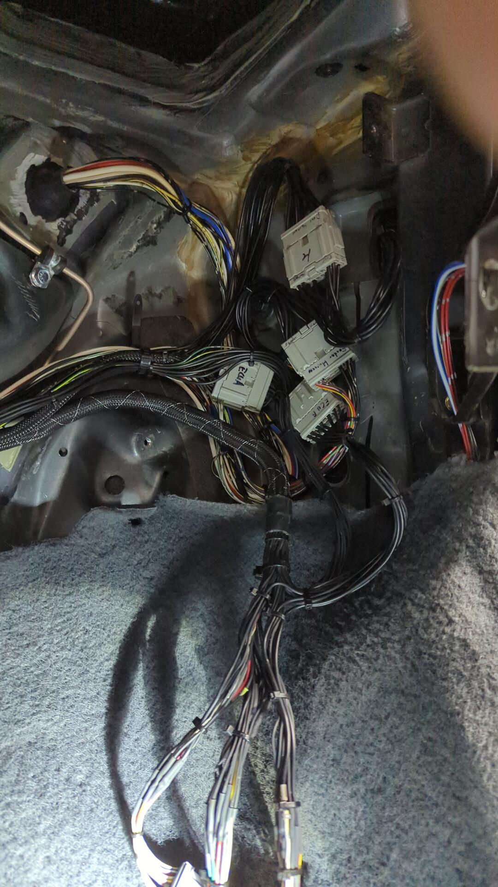

## Can't Forget the Wideband Controller

I had to run 4 more wires for the wideband controller to the ECU. I opted to go with the Innovate LC2 because it has a second wire that can simulate a narrow band 02 which meant I wouldn't have to run a second o2 sensor or switch back and forth between them.

I hid the controller down behind the center console so I could see the LED to make it easier to calibrate / check for errors.

The four wires are ran to the ECU and routed through my cabin harness.

I wired it as follows:

| Wideband wire | Function                 | ECU pin                         |
| ------------- | ------------------------ | ------------------------------- |
| Red           | 12v                      | A25                             |
| Yellow        | Wideband analog signal   | D10 (repurposing the ELD pin)   |
| Brown         | Narrowband analog signal | D14 (OEM o2 sensor signal wire) |
| Black         | Ground                   | A26                             |

Innovate recommends wiring the grounds for the controller to the ECU grounds because it ensures they are working with the same reference voltage.

If you choose to use an Innovate LC2 make sure you disable the o2 heater in your tuning software otherwise you'll get a CEL for it.

# Putting the Heater Blower Back In

Once the wiring was all squared away and I had successfully calibrated the o2 sensor I felt I was pretty safe to mount up the heater blower. This was pretty easy to do and the blower motor fit perfectly without an issue.

New to me glove box installed.

The dash came out great.
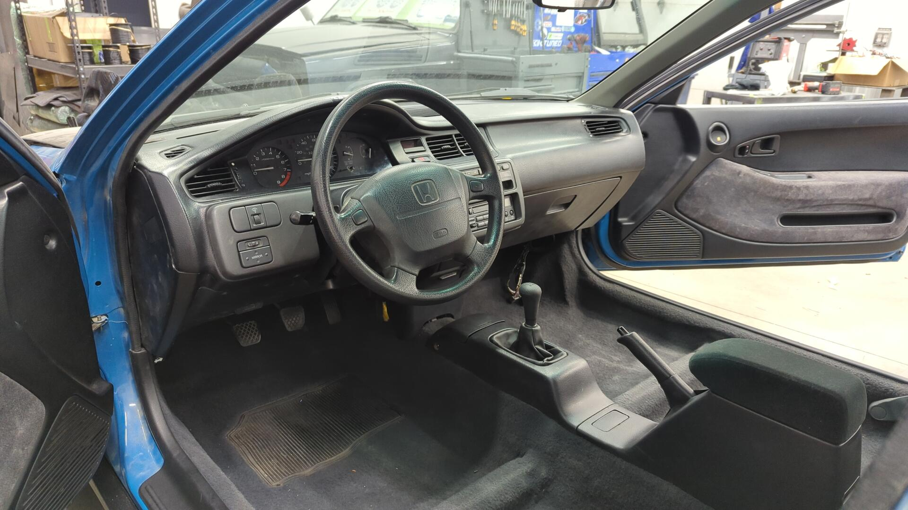

# Last But Not Least, New Seat Rails

All that was left at this point to finish up the front interior was to install my seats.

I had been holding off on this because my OEM seat rails were super rusty and I wanted to source some new rails first.

I was lucky enough to snag a set from Arizona that looked like new.
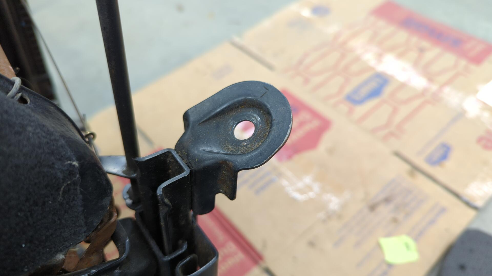

Swapping them over was actually pretty easy at it's 3 bolts per rail and once that was done I was safe to install the seats in the car.
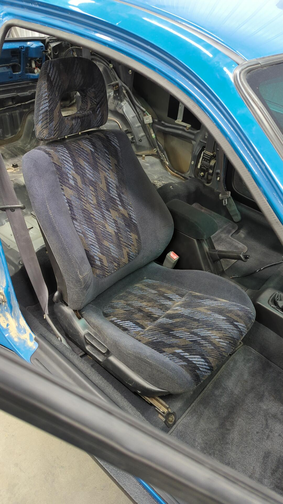
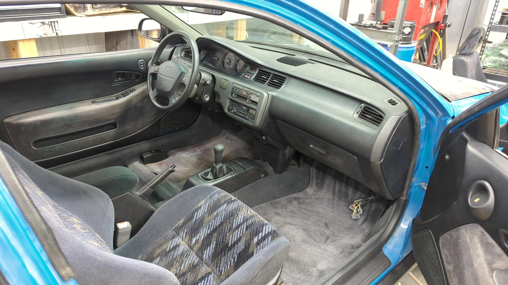

Both seats installed.
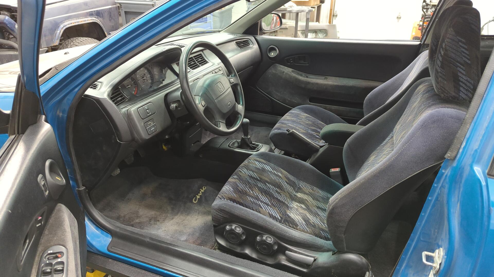

[Continue on to Part 21]()
