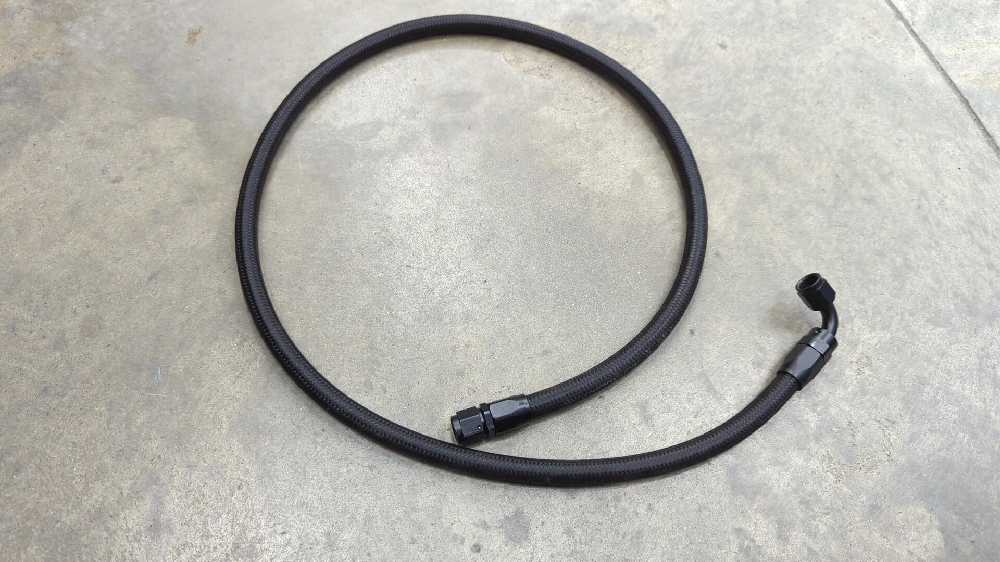
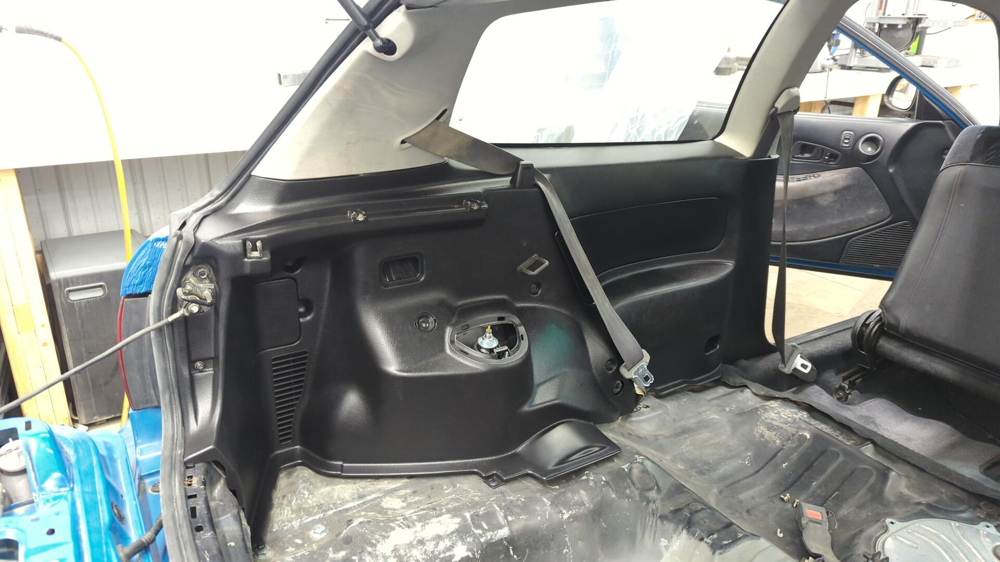
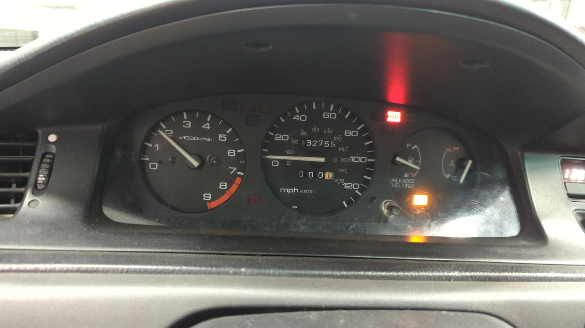

After 9 months of work the Civic is just about done! It feels pretty weird knowing I'll be shifting focus to another project after spending so much time on it. I'm not 100% sure what I'll pivot to next, but I'm most likely going to work on the Integra next as it needs a major tune up to be ready for the 2024 autocross season.

# I Should Have Bought Rear Helper Springs

Back when I ordered my new coilovers I didn't really know if I'd need helper springs or not. I figured since I wasn't going super low I wouldn't need them, but even at the modest height I left the car at it turns out I did at least need them in the rear.

People will argue that you don't need helper springs as they only hold the spring in place at full droop, but I anticipate the car three wheeling on the autocross course quite often so I'd rather have the springs secure.

Helper spring / coupler installed.

The springs are super easy to pop in, just make sure you have the coupler oriented correctly and not backwards like mine is in the photo.

Back in the car.

Parts:

- (2) [2.5" ERS couplers](https://groundcontrolstore.com/products/ers-coupler-2-50-springs-each?_pos=1&_sid=ed7260427&_ss=r)
- (2) [2.5" Eibach helper springs](https://groundcontrolstore.com/products/eibach-springs-helper-250-spring?_pos=1&_sid=14d40b7ce&_ss=r)

# New Fuel Lines

The Civic has been missing fuel lines ever since I tore it down. When I first planned out this project I didn't intend to replace the fuel lines as they were still in decent shape, but while removing the rear brake lines I accidentally cut the wrong line and left myself no choice.

Looking around online I couldn't find anyone selling pre-made fuel lines that weren't braided line. I've got nothing against braided line but on the EG the fuel lines are held to the bottom of the car via 3 brackets and I worried that using braided line would result in the fuel lines sagging down from the car between the brackets and potentially get snagged or hit.

On the EKs they have a full length plastic tray that seems to make this a non-issue.

Since I couldn't find any decent off the shelf solutions I decided to go custom.

This is my lovely diagram I drew up.

I decided I wanted to do a mix of hardline and braided line for my fuel lines. I figured I'd make hardlines for the portion that runs under the floor and then use braided line by the tank and firewall to avoid having to make complex bends on the lines. Kinda like a best of both worlds.

To secure the lines I made some custom brackets from 1 1/4" steel tube that attach where the OEM plastic brackets used to.

I forgot to take a in progress picture but after making the hardline portions I ran a rubber fuel line for the charcoal canister to the tank valve.

Then I tried my hand at making my first braided line that would connect the fuel tank to the supply line.

Installed.

For the return line I decided to simplify things a bit and just run regular 1/4" rubber fuel hose for it instead of making braided lines. My thinking was it'd save some money and also the return line doesn't see much pressure (maybe ~5 psi) so the rubber hose would be more than sufficient.

Then on the engine bay side I made another 6an fuel line that would connect the supply hardline to the fuel filter, and one more line to connect the fuel filter to the fuel rail.

Installed.

Underneath the car everything looks pretty legit. The vapor line for the charcoal canister is only ziptied in place but the supply / return hard lines are secured with clamps.

# Dyeing the Last Pieces of the Interior

Dyeing the rear interior was super exciting for me because it's something I've been wanting to do for years. The Civic's interior has always been in a half done state where half of it was gray and half of it was black so it felt nice finally finishing things up.

Wanting to make sure I did the best job possible I opted to go with SEM color coat and spray it from my HVLP spray gun.

To start off I degreased all of the parts to get the years worth of dust off them, and then once dried I wet sanded them with a gray scuff pad and soapy water.

Once prepped I sprayed two light coats of SEM 39863 adhesion promoter (Honda interior panels are polypropylene) followed by 3 light coats of Landeau black.

Landeau black is actually a little too black when fresh but after it sits in the sun for awhile it fades out a bit and matches up with the stock interior nicely.

Dyeing all of the rear interior bits took me 3 nights as I sprayed 6 - 8 pieces at a time.

The results were well worth it.

The OEM rear seat looks out of place now. Part of me wants to try and hunt down a confetti rear seat from an Integra to match the fronts but they're awfully expensive.

I don't have any carpet for the rear cargo area yet. I'd like to explore building a small platform that can fit a fuel size spare / tools underneath it.

The Civic officially has a full interior again.

# A Leaky First Start

With the fuel lines all set the only thing holding me back from starting the Civic was a lack of fuel injectors. About a week prior, I had sent out my OEM injectors to be professionally cleaned and was waiting for them to return but the wait was getting to me and I couldn't resist slapping in a second set of unknown injectors I had laying around to see if the car would start.

To my amazement it started easily. I primed the fuel pump a couple times to try and get some fuel into the new lines and after that I let the engine crank over. I was pleasantly surprised when the old girl fired up. It ran a little rough for about 30 seconds but I believe it was just misfiring from the remaining air in the fuel rail / line.

I wasn't ready to bleed the coolant or anything yet so I shut off the car pretty quick to check for leaks. Everything in the engine bay looked solid but underneath the car I was dripping fuel at both ends of the supply hard line. Turns out I had a crack in one of the flares, and the other flare was just poorly made.

Flaring stainless lines is actually pretty hard as SS is way less forgiving than copper nickle. I did a couple practice flares with some bits of tubing and once I felt absolutely confident I whipped up a new supply line.

This time I remembered to snap a picture before installing it in the car. It's not a fancy line by any means as it's a 49" straight line.

With the new line installed I started up the car again to check for leaks. The CEL is on because I'm using the wrong ECU and it thinks the o2 sensor has a bad heater since it's not setup to work with the Innovate wideband.

At this point I couldn't resist moving the car around a bit to see how the clutch felt and see if the transmission could shift into 1st and reverse okay. I can happily report no issues there although the brake pedal was super firm.

I was worried I had picked out too large of a master cylinder at first but then I realized it was something even simpler and I had just installed the check valve on the brake booster backwards lol.

So close to it's first drive.

[Continue on to Part 23]()
