Wrapping up the Civic has not been an easy task. The to-do list is basically finished at this point, but since I've started taking it on short test drives I've uncovered a few issues that need to be fixed.

Most of the issues that have popped up so far have been fairly minor things such as a moderate oil leak, and a large exhaust leak but I did learn the hard way that my brake booster wasn't compatible with my master cylinder and it was causing the front brakes to drag.

# Taping up the Radio

The tape drive in the radio I bought for the Civic didn't work, and upon opening it up I discovered the drive belt had snapped. A snapped belt isn't an uncommon issue for tapes but there's no listed part number for it so it made things difficult to find a replacement.

Taking some measurements I found the original belt is a 1.2mm x 1.2mm square belt with a 130mm diameter. I wasn't able to find a 130mm diameter belt so I had to settle for a slightly smaller one with a 124mm diameter. I don't anticipate the smaller diameter causing any problems as it's very likely the old belt had stretched from age.

Old vs new.

I had to wait about 3 weeks for the new belt to arrive so I did my best to label all the parts of the torn down radio as I knew I'd forget how everything went back together.
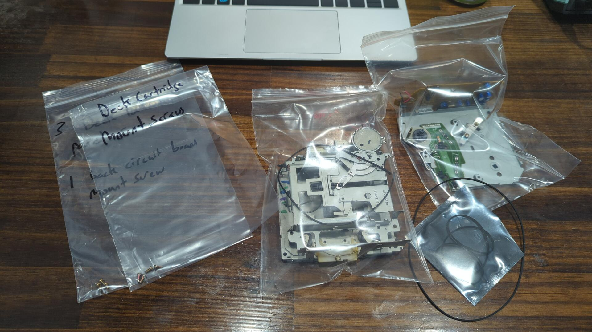

With a bit of experimentation I was able to figure out how the belt was suppose to be routed.
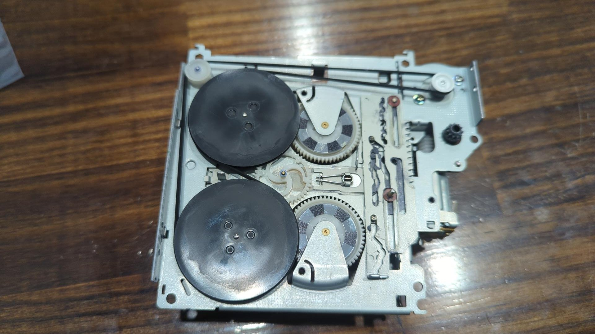

When I first tore down the radio the belt fell out of the bottom so I didn't have any reference for how it used to be routed.

Beginning re-assembly.

Getting the tape head back into position was somewhat tricky as it has a spring to hold it in place.

Radio ready for the tape drive.

Tape drive popped back in. It's only held in via a couple screws.
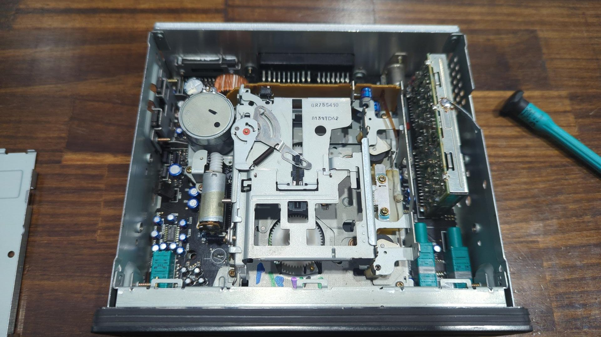

Just to play it safe before re-installing the radio I popped in a cassette to see if things worked.

Success!

The radio can load / eject cassettes without issue and fast forward, rewind, and play them too.

All done.

# The Direct Bolt up Cat Was a Bad Idea

Back when I was working out how to setup my new exhaust I decided to buy a direct bolt up cat to save some time vs fabricating my own setup.

This ended up being a mistake for two reasons:

1. The pipe diameter is too small since it's meant for a 1.5L engine
2. The front flange didn't work well with my B series header flange and was leaking

I figured my best bet was to ditch the cat and go with a custom setup instead of hacking it up to make it work.

To make the new setup I settled on a Magnaflow 53956, a 2.5" v-band, a 2.25" v-band and some spare 2.25" pipe I had.

I started off by welding the cat to the mid pipe. The welds aren't the prettiest but I used 409L wire so nothing will rust.
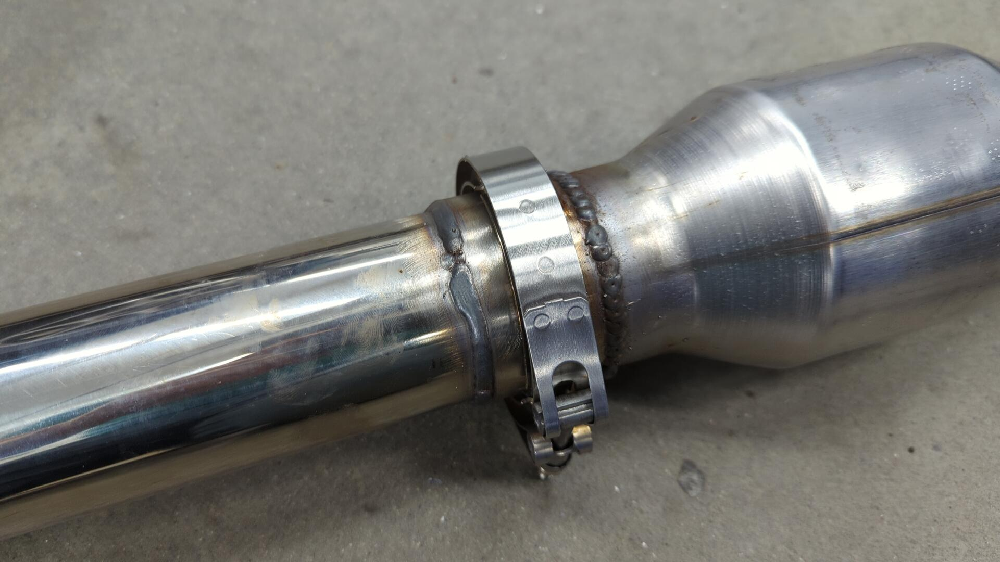

Then the midpipe / cat were installed back in the car so I could work out the final missing piece.

A bit of cutting and welding later it was done.

Re-installed and officially no leaks.

# A Proper Set of Injectors

A month ago when I decided to try and do a first start with the Civic I had installed a beat up set of injectors as the set I had planned on using were out being professionally serviced.

The beat up injectors worked fine for a first start but I'm not sure of their condition since they've likely never been cleaned and 3 were missing pintle caps which is why I wanted to swap them out.

Refurbished ones on the bottom.
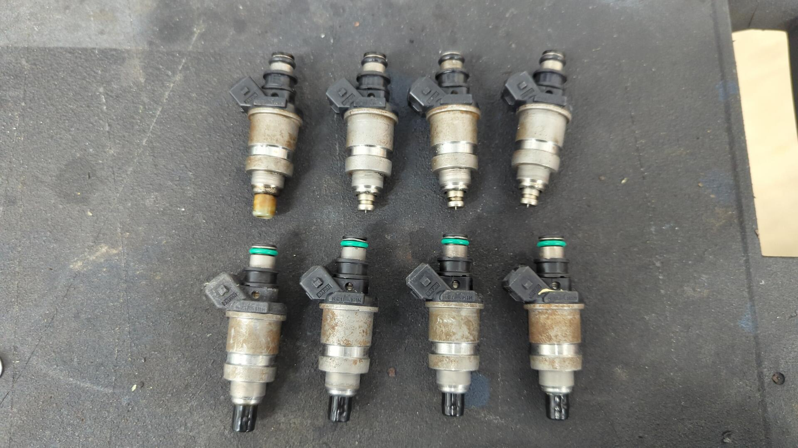

Swapping injectors on these cars is pretty easy. The main thing to be careful of is the o-ring on the top end of the injector can slip out of place if you're not careful. I lightly lubbed them with a little oil so they wouldn't snag during install.

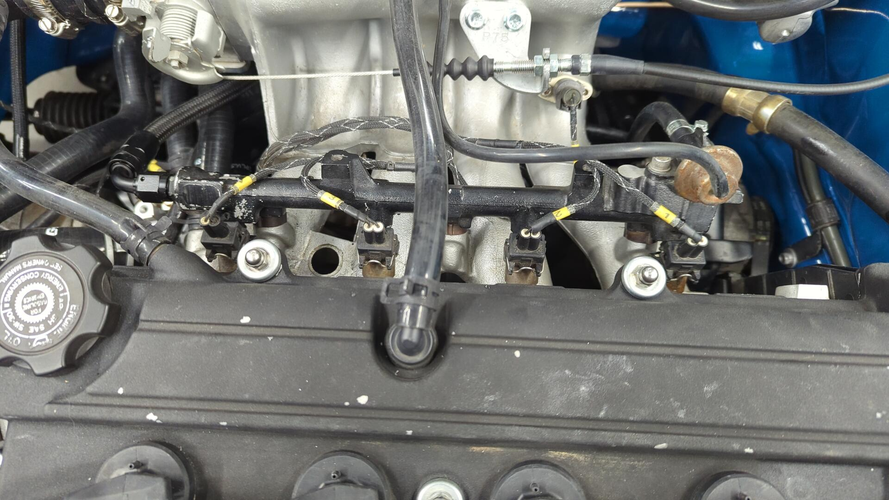

It's hard to tell if they'll actually make a difference or not but the car started right up with the new ones and it's nice having peace of mind that I shouldn't have to worry about them.

# Learning How to DIY Alignments

I'm going to need a lot of alignments over the summer between my two cars as I continue to tweak things so I decided to bite the bullet and order a set of alignment hubstands. The most popular hubstands out there are made by Paco Motorsports but they were out of stock due to their recent Black Friday sale that I had missed so I decided to order the DIY kit from Turtle Laboratories.

All in all the Turtle Lab hubstands weren't bad but they've required some modifications to get them fully functional which was a bit obnoxious.
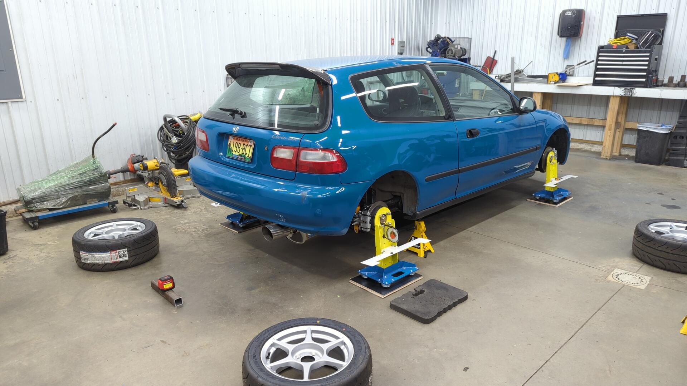

Setting toe, camber, and the rear thrust angle wasn't overly difficult but trying to center the steering wheel was an arduous task. It took me 4 tries before I got the steering wheel reasonably centered.
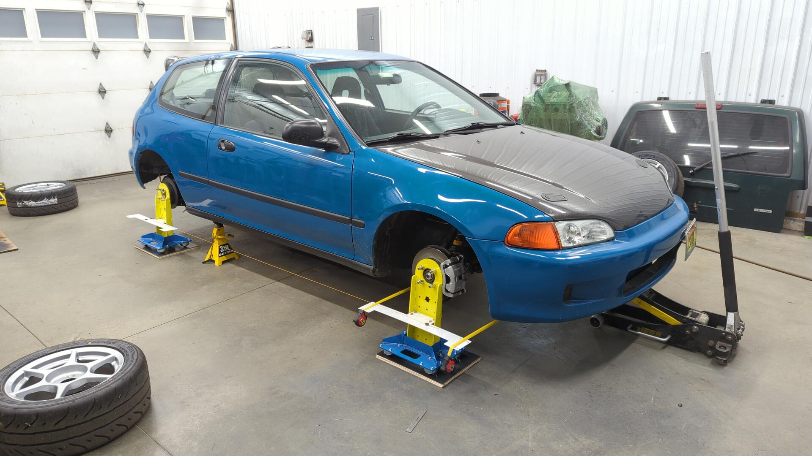

The struggle is worth it though because as I get more practice with doing alignments I suspect I'll get faster at them plus I think I can make some modifications to my equipment to make life easier too.

# I Should Have Bought a Nicer Shifter the First Time

The Megan Racing dual bend shifter I was running didn't feel great. For some reason it was easy to miss shifting into third and get stuck between 1 / 3 and the shifter also took a lot of force since it's a short throw.

I couldn't find any normal shifters on the market that weren't short throws so I settled on ordering a K-Tuned shifter. It's a bit too flashy for my taste but I liked that it was fully adjustable so I could set it up to feel like the OEM shifter.

Center console removed to pop out the old shifter.

New shifter installed in the linkage.

New shifter back in the car.

Center console back on.

All done.
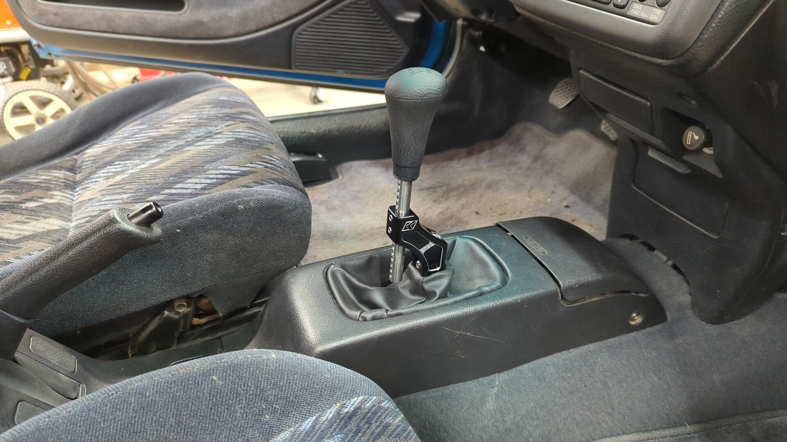

Overall the new shifter feels pretty nice. It's got a decent amount of throw which I like and it doesn't require too much effort to move around. It's a nice touch having the shift knob sit a little higher than OEM too.

# The Mysterious Oil Leak

The day after the second test drive I noticed there was a small puddle of oil underneath the motor.

This was pretty unexpected as most of the seals on the motor were new, but looking up from underneath I could see the lower PS bracket was covered in oil and there was a drop hanging off the bottom of the PS pump.
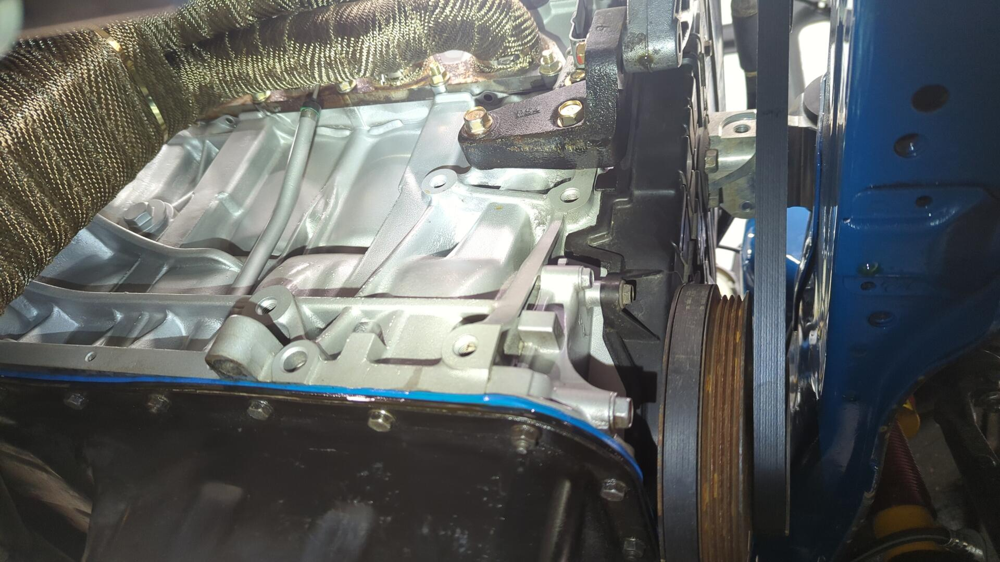

Initially I suspect it was the PS pump so I wiped down all the oil and took a photo of the PS reservoir so I could keep track of how full the reservoir was.

A couple days / few more test drives later I once again checked the PS reservoir but found the fluid level hadn't dropped at all. The car was still leaking though so I figured at this point it had to be motor oil.

Popping off the valve cover I noticed I hadn't added any RTV on the corners by the cam caps like the FSM calls for so I tried adding small blobs and re-installing the gasket.
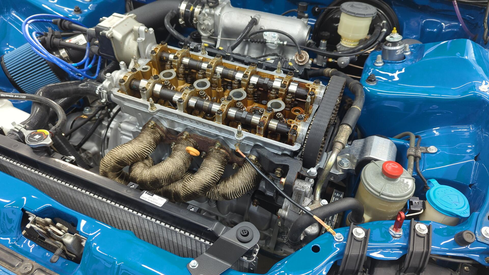

But after letting the RTV cure overnight the leak came back after another test drive.

Unwilling to admit defeat I once again popped the valve cover off and this time peeked down between the inner timing cover and the head to see if I could see any oil leaking from the cam seals.

Yup, the cam seals were definitely leaking.

Getting at the cam seals is actually somewhat tricky as you have to remove the crank pulley, timing belt, and cam gears.

For replacements I ordered 2 new 91203-PFB-013 seals.
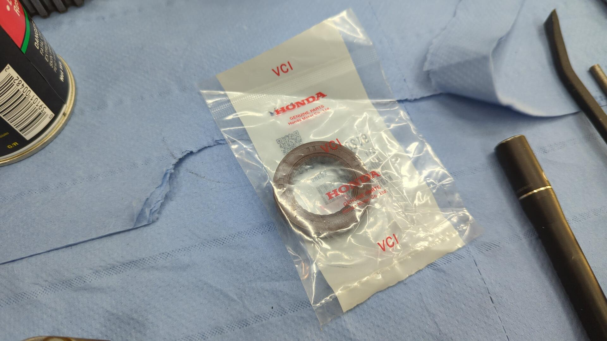

I also popped the cam caps off so I could reapply RTV on their mating surfaces to the head just in case.
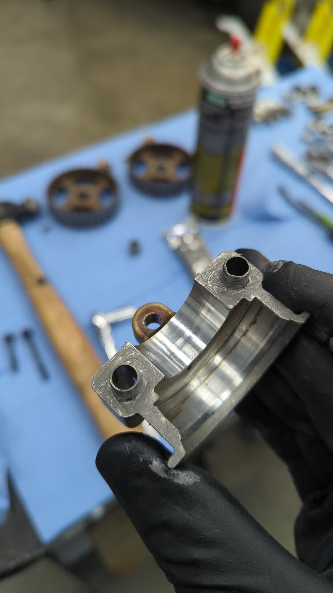

New exhaust cam seal in place.
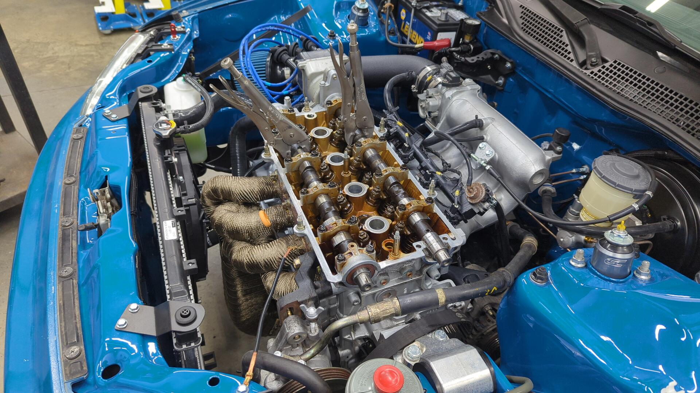

New intake cam seal done.

I gave the inner timing belt cover a quick cleaning since it had some oil residue on it.

Motor timed back up.

Everything all buttoned back up.
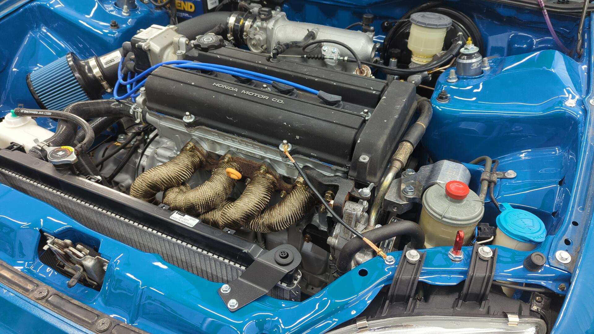

Three days later and the leak still hasn't returned. I'd call that a success.

# Why My Front Brakes Were Dragging

It turns out the brake booster and master cylinder I had installed weren't compatible with each other. I had bought the Integra brake booster used and it had initially came with a 1" MC but I swapped that out for a 15/16" Integra MC as 1" seemed like overkill.

Unfortunately what I didn't realize though was that my brake booster had come off a car with ABS and my 15/16 MC was a non-ABS unit. You can't mix ABS / non-ABS because the brake boosters have different length push rods on them and if you install an ABS BB with a non-ABS MC it'll cause the brakes to drag.

I figured this out the hard way when I took the car on a longer test drive down the highway and noticed it was struggling to hold speed up hills and I could smell something burning.

I wasn't far from home though and was able to limp the car back without needing a tow. My front rotors got hot enough to turn bluish but nothing warped so I'd consider myself lucky.

Tearing everything down wasn't fun.
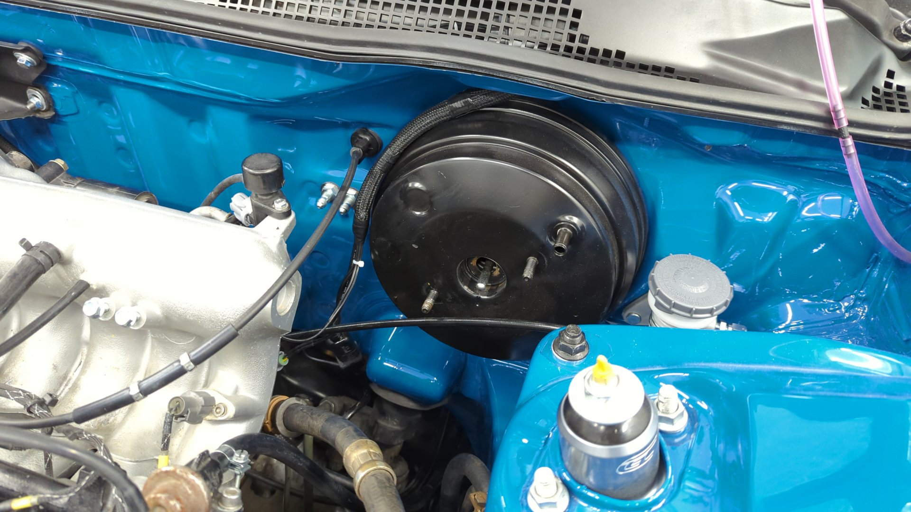
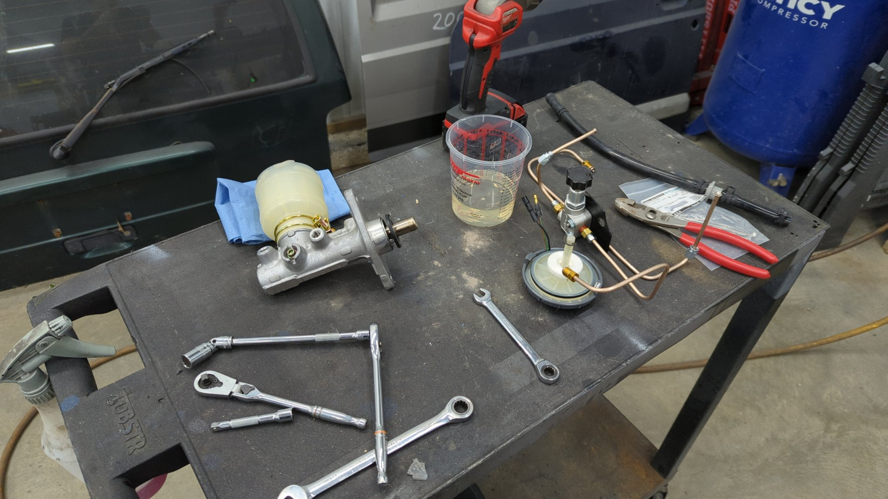

Comparison of the non-ABS vs ABs brake booster. Non-ABS (Integra RS) is on the left, ABS (Integra GS / LS / GSR) on the right.

New booster installed.
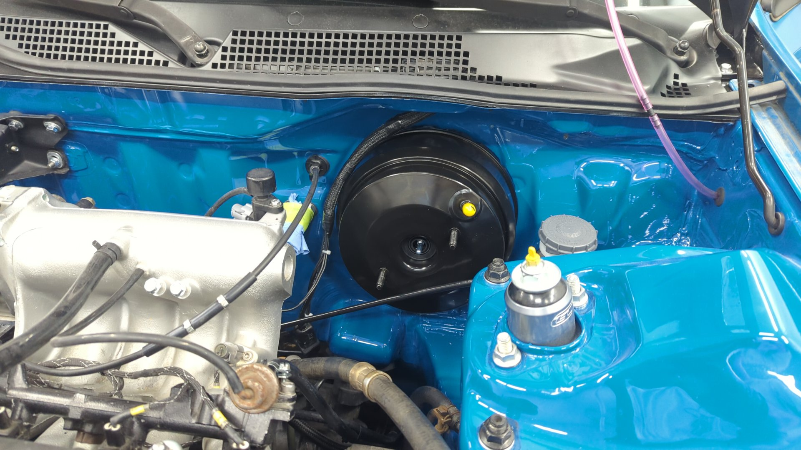

I made sure to adjust the pushrod before installing the MC since this unit didn't come preadjusted.
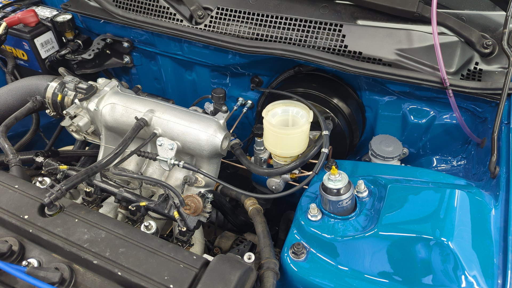

Bleeding the brakes was a nice leg workout since I had to bleed all 4 calipers all over.
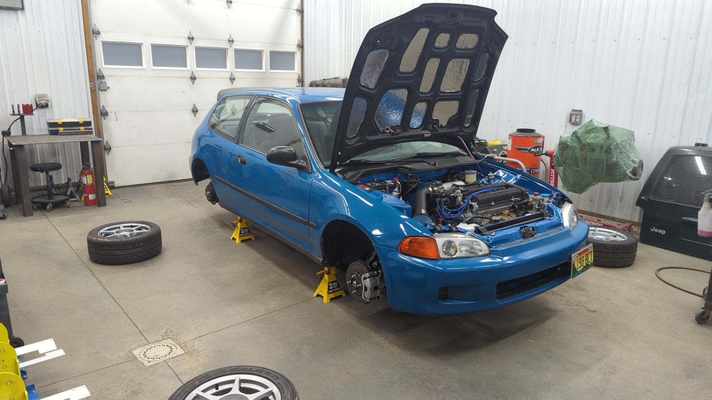

But at least it was done and the brakes didn't drag anymore.

# The Civic is Officially "Done"

While no project car is actually ever done, this is going to be the last post of the revival series. The Civic is registered and passed it's yearly safety inspection so it's fully road legal again for the first time since 2020.

Now I just need to wait for the first race of the season to really give it a test.

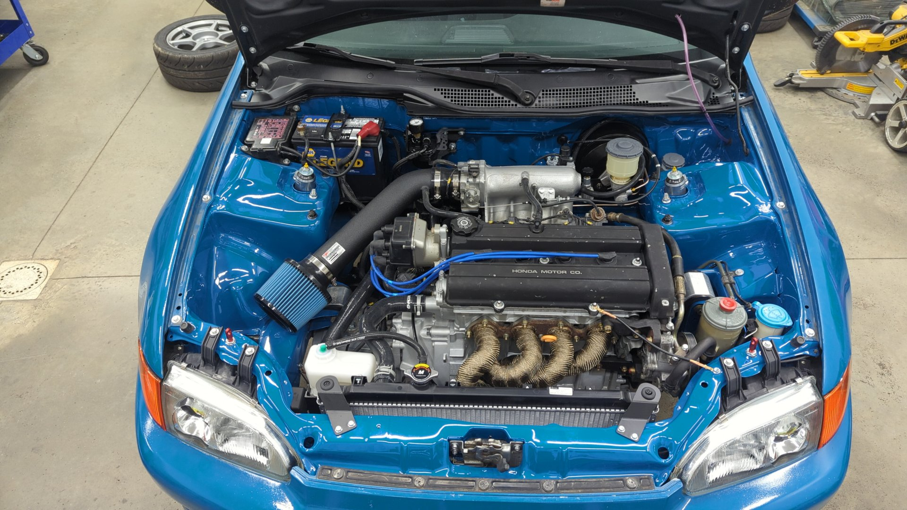
