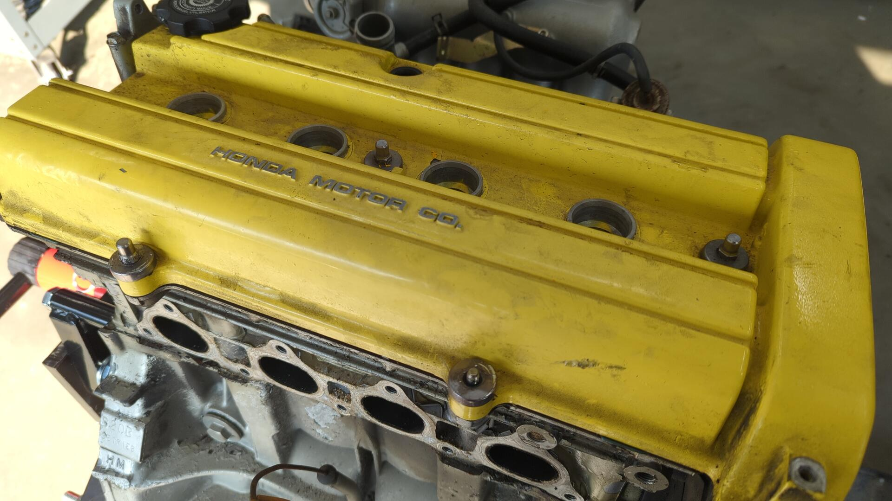
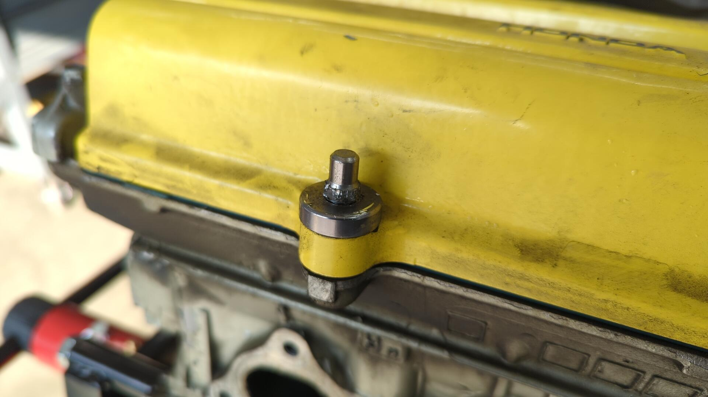
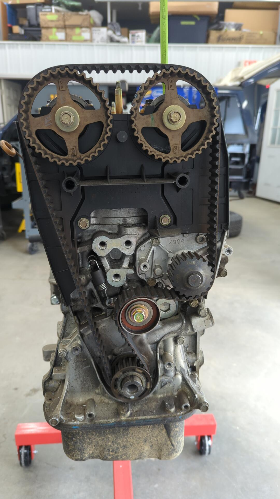
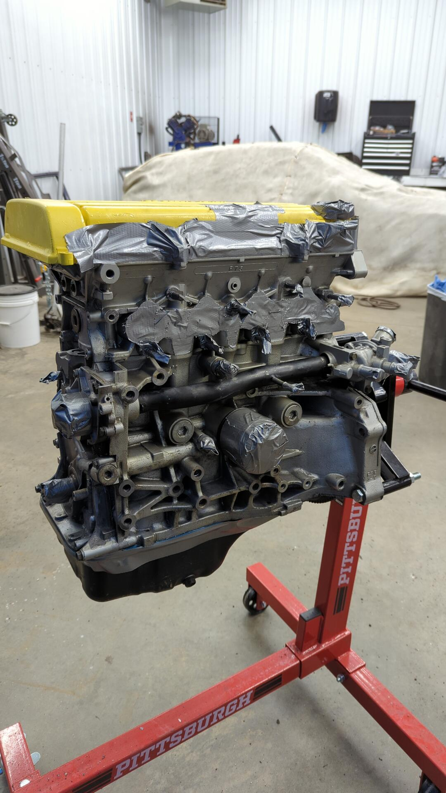
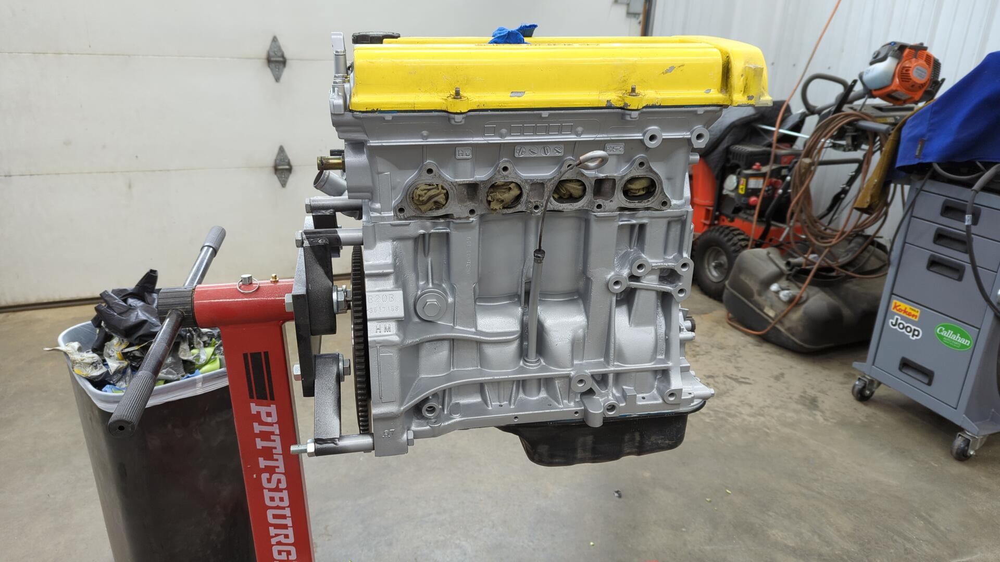
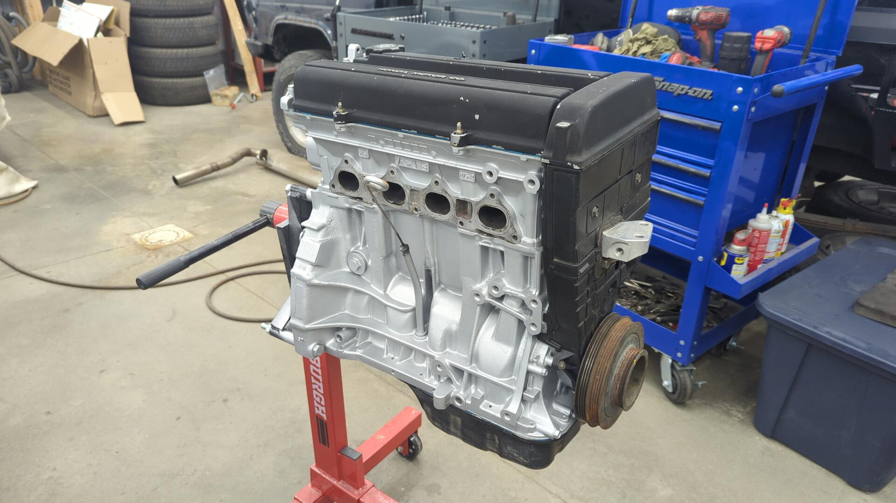
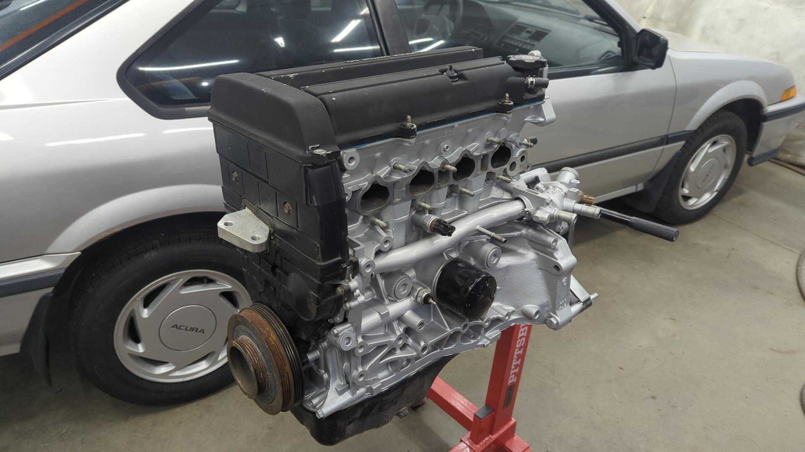
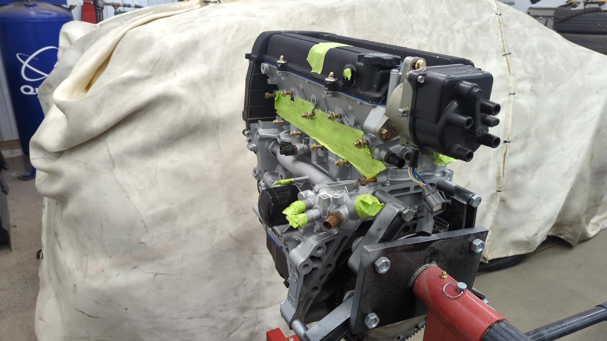
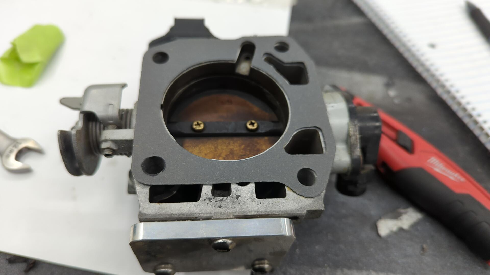

The B20B I pulled out of the Civic was still perfectly healthy and didn't really need much.

But I figured why not go the extra mile and repaint it with some proper enamel since the original paint I sprayed had just about burnt off it, and I also wanted to replace a couple gaskets while I was at it.

Valve cover leaking all around.

The valve cover itself has seen better days too. I powder coated it with Harbor Freight powder coat as a test and it hasn't held up great. I plan on switching to another valve cover that still has the OEM paint on it.

Really not a fan of the aluminum hardware I bought way back when. I plan on swapping this for OEM hardware.

While tearning down the motor I noticed the cylinder 4 spark plug had a lot more rust on it than the others. This is the one closest to the custom hood scope in my old hood so I suspect some rain had found it's way down into the spark plug tube.

After popping off the valve cover, all that was left was to remove the timing belt + inner cover.

# Prep for Paint

All torn down and ready for sand blasting.

I wanted to be extra careful and ensure no sand would find it's way down into the intake / exhaust ports so I covered them with duct tape and stuffed rags down into the ports as a backup measure.

All cleaned up. The duct tape worked great and no sand found it's way into the motor!

Re-taped up to prep for paint. I switched over to painters tape instead of leaving the duct tape on it because painters tape will leave a much better edge.

Fresh paint. Just like the transmission I used Bill Hirsch engine enamel. It should hold up significantly better than the previous stuff I used.

# Reassembly

After letting the block sit for a couple days so the enamel could harden I was finally able to begin re-assembly. Up first was to time the motor.

Driver side mount post reinstalled.

All buttoned up. I cleaned up the timing cover using some all purpose cleaner and a small brush since it had collected a ton of dust.

I also installed all new exhaust and intake manifold studs since I had previously removed the exhaust studs.

The intake was still in pretty good shape so I opted to reinstall it as is. Unfortunately I forgot to take a post install picture.

New studs for the throttle body too.

And I was just about ready to install the throttle body when I realized I had ordered the wrong throttle body gasket.

I could have sworn it said for the LS when this is clearly for a B16 so maybe it was just incorrectly listed. I'll eventually order the correct one so I can install the throttle body but for now I'm gonna move on to other parts of the project.

[Continue on to Part 4]()
