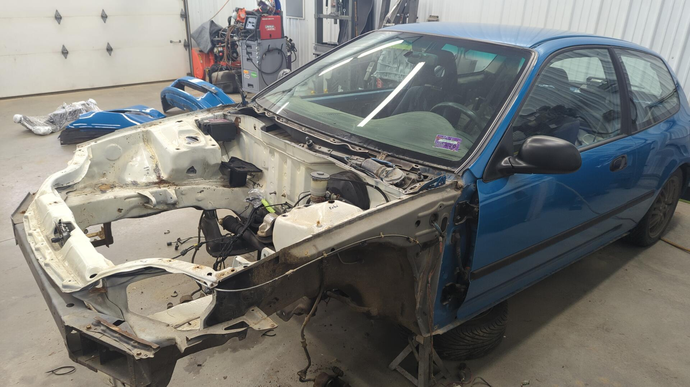
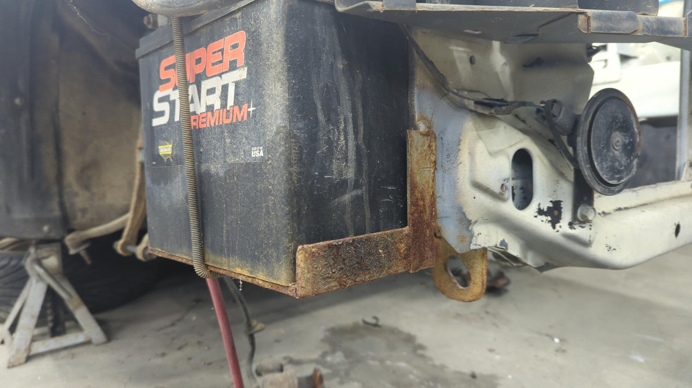
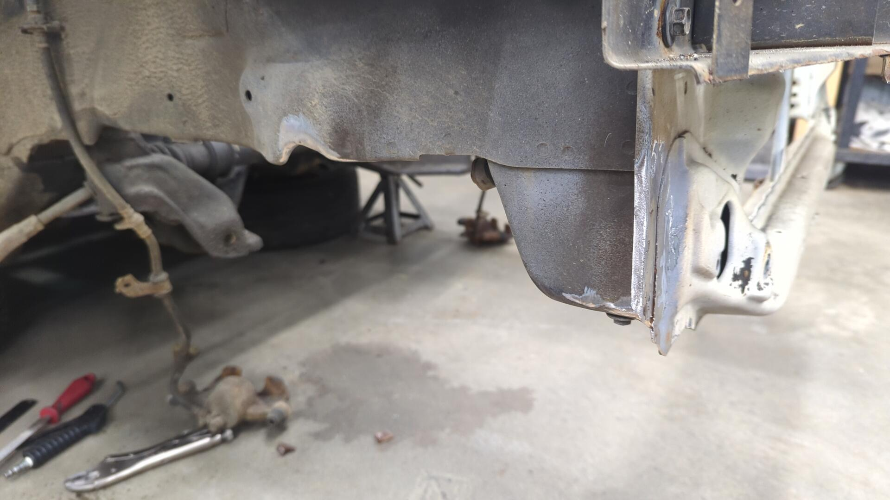
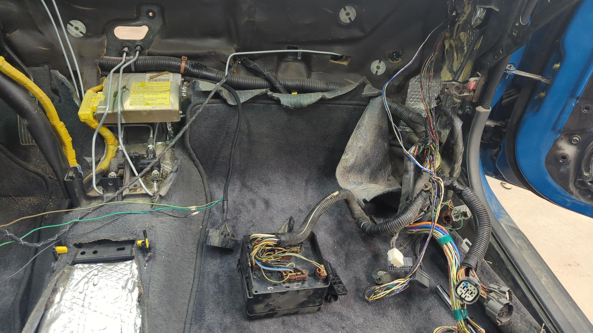
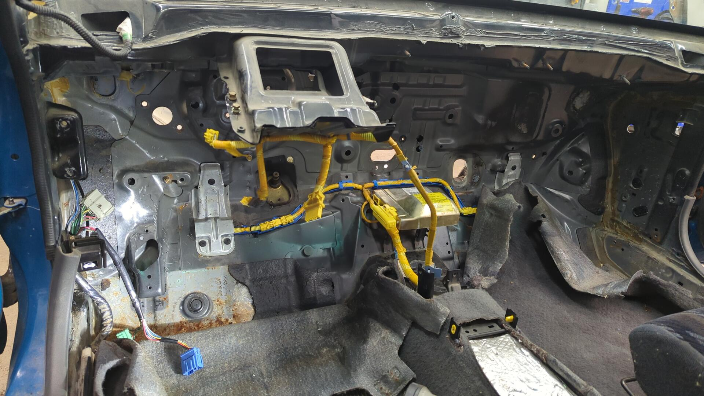
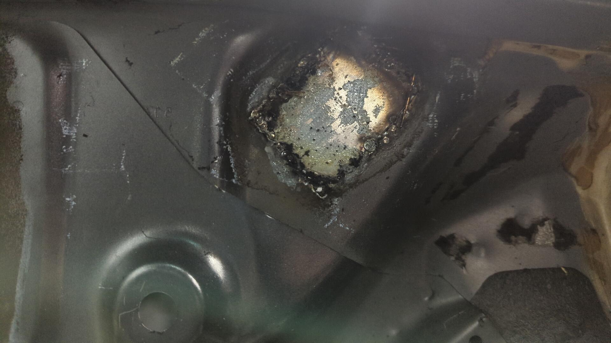
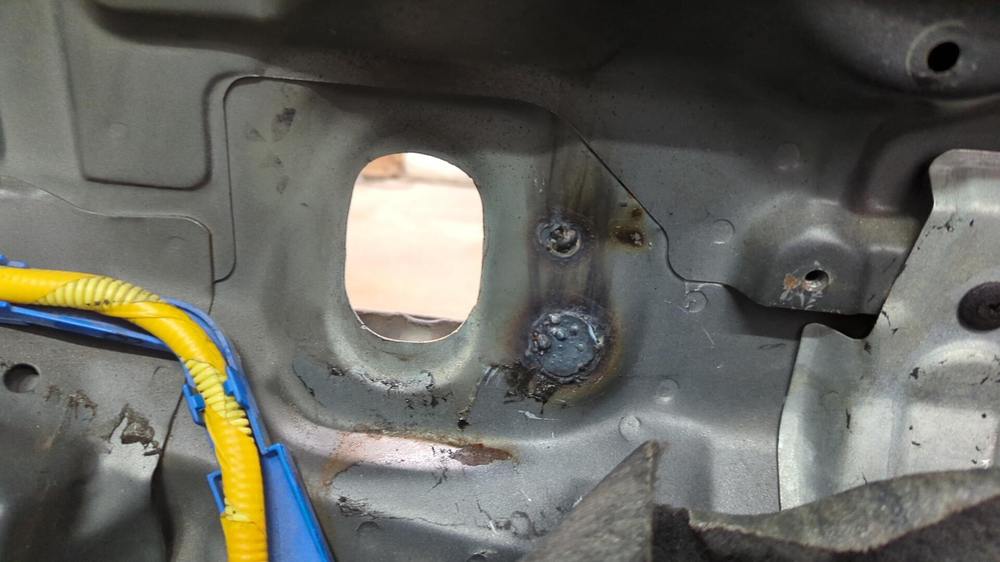
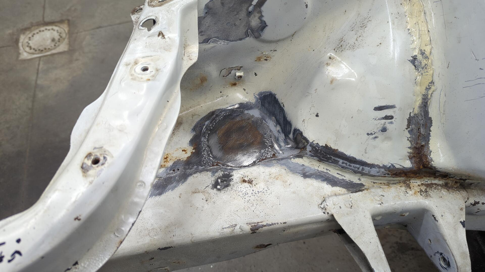
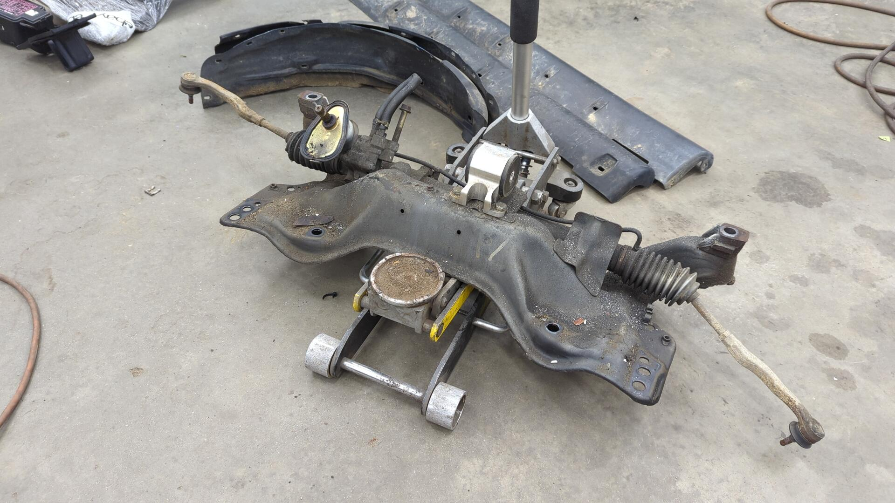
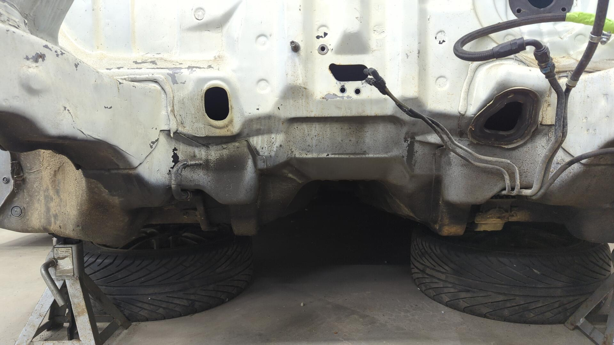

Even with the motor and transmission already pulled there was still a good chunk of parts that needed to be removed from the chassis.

The ever growing parts pile.

# Undoing the Battery Tuck

The battery tuck I did years ago hasn't held up well. Back then no one sold a tuck kit for the stock sized battery so I DIYed my own solution using some 1/8 angle. It used to be painted but it seems all the paint has rusted off at this point.

Removing it didn't look easy due to how much weld was holding it in place.

Working very carefully with the grinder I was able to eventually remove all traces of the old battery tray.

I did my best to salvage the parts of the body where it was welded to, but with how thin the OEM metal is this was pretty difficult.

# Stripping the Inside of the Firewall

Alongside removing everything in the engine bay, I wanted to remove the entire HVAC system and more from the inside so I could fully expose the inner firewall.

Of course I forgot to take a picture prior to removing the dash, so here's the mid progress pic.

All this wiring needs to find a better home. I've had the engine bay fusebox sitting in the glovebox for years. It looks super cool being able to hide the fusebox, but it's also made the glovebox just about useless for storage.

After removing the HVAC system I started to remove the brake lines / prop valve.

Then I decided to remove all of the sound deadening I had added years ago.

Everything fully removed.

A lot of the patches I made on the firewall aren't pretty. Back when I welded up the electrical harness hole by the engine bay fusebox I didn't have any magnets to hold the patch while welding so I used some duct tape lol.

At least the AC evaporator patch was a little more proper.

I left some nice jagged edges around where the brake lines used to pass through the firewall by the master cylinder. There's even a hole in the firewall on the right side where I cut too deep with the angle grinder. I didn't even know that was there.

One of the big regrets I've had on this car was closing off the fresh air input for the heater. I can't remember why I did it but I believe at the time I wanted to delete the heater. That never ended up happening, and just ended up making the fresh air option of the heater useless.

# More Engine Bay Prep

Another mod that never panned out was welding up the hole in the engine bay below the intake box. My goal at the time was to shave the hole but I ended up just seam sealing the edge and it never looked pretty.

I ended up having to make the hole a little larger than the OEM one to get to the good metal.

The subframe was also dropped. This was surprisingly easy as all of the bolts came out without a hitch.

The engine bay's looking super empty now.

