With so many spots that needed to be addressed in the engine bay it was hard to pick where to start. To break the ice I decided to start with a small first step of unshaving the headlight adjuster holes that I had accidentally shaved.

Back when I shaved the bay I didn't plan out which holes to save very well other than the headlight mounting holes and this resulted in me shaving a few too many holes.

The original holes weren't salvageable so I up cut out a small patch out so I could weld in some new metal.
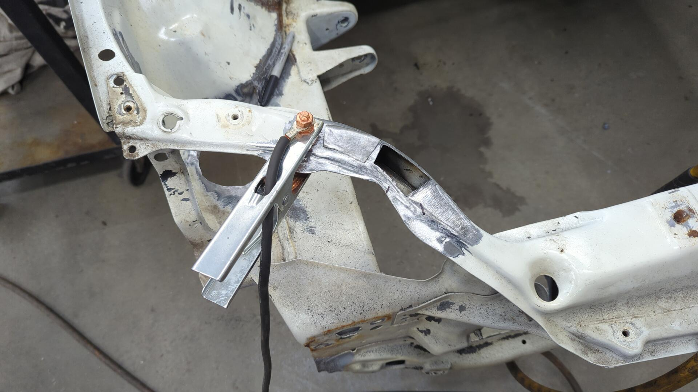

The new holes don't look OEM but they'll work perfect.

# Prepping the Passenger Side

From there I started on the passenger side and the first step was to strip off all the old paint. This ended up taking a mixture of several tools including my sandblaster, DA, and a chisel / wirewheel to complete.

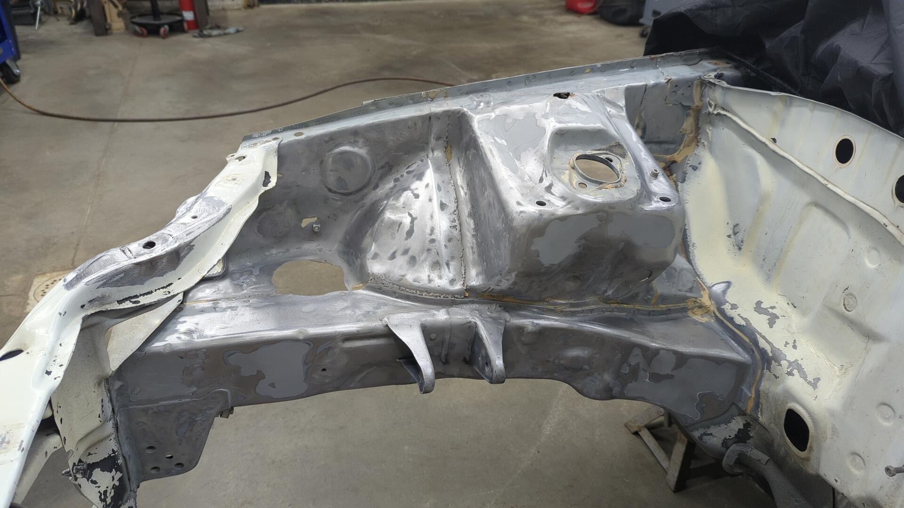

Removing the OEM tar undercoating was my least favorite part. The stuff stays sticky and clogs up sanding discs and wire wheels like no tomorrow.
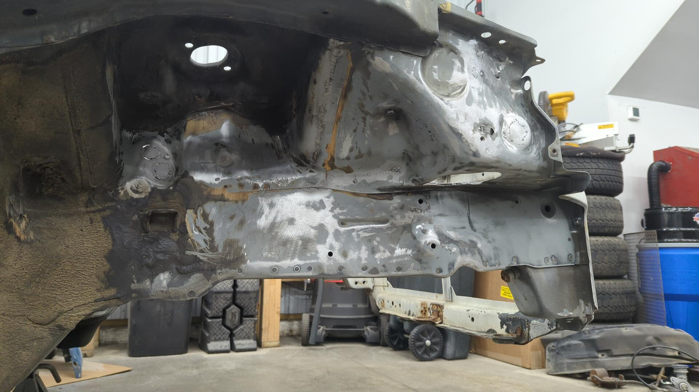

My old patches weren't the best lol.

After going through and replacing all the bad patches or thin spots with new metal the fender area was ready for epoxy.
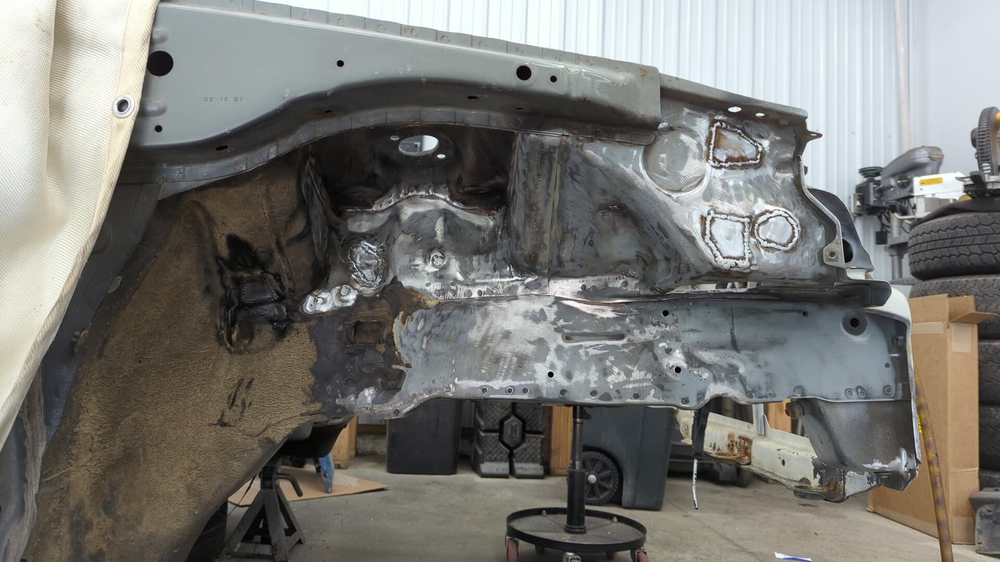
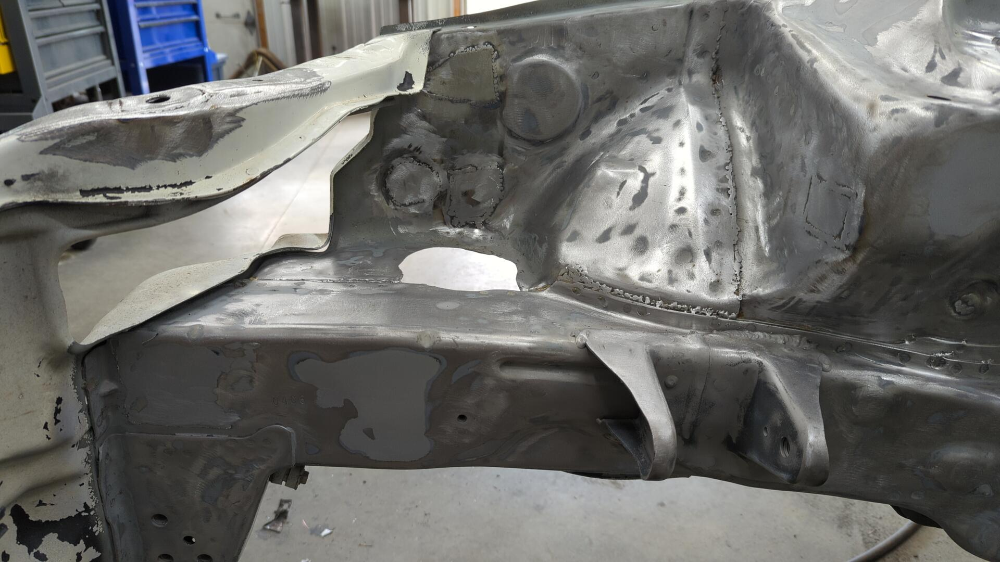

There was a thin spot on the side of the strut tower that I had to patch.
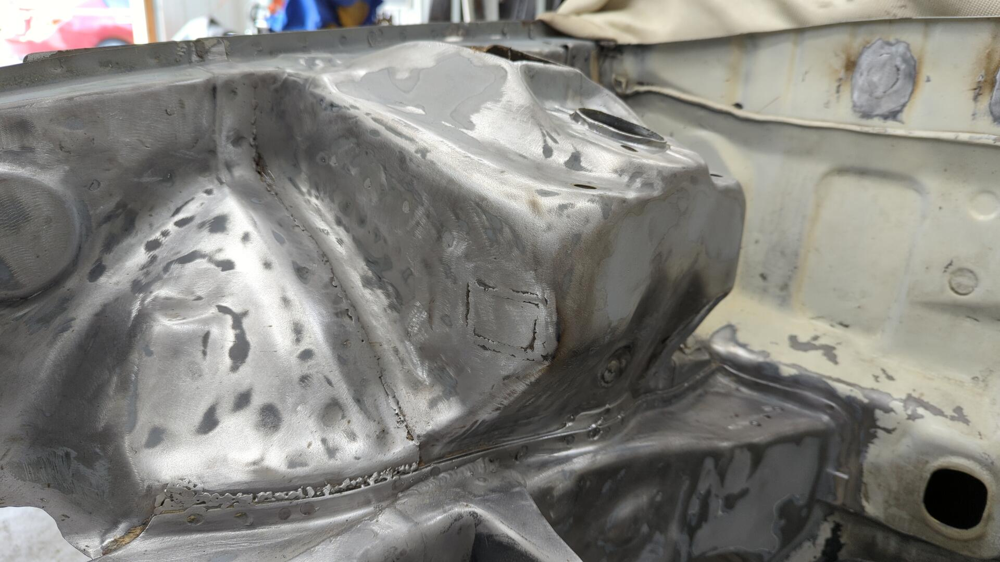

I was even able to unshave the OEM battery holes. I thankfully only welded over the tops of them vs the full nut so the threads are still good!

I'm planning on putting my battery back in the OEM spot so this saves a lot of work.

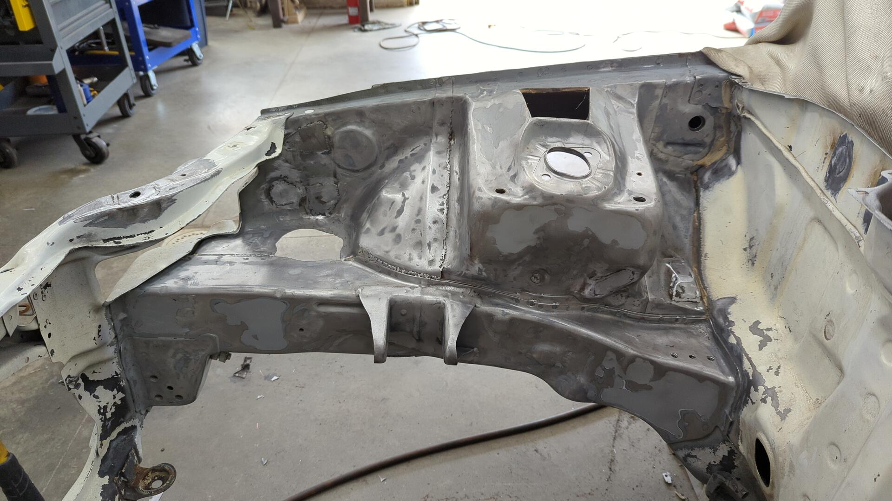

Some epoxy later.

The engine bay already looks so much better.

Alongside replacing patches I also had to replace several nuts. Some of them were too rusty, and others had previously been deleted.

I couldn't source the square OEM style nuts so I ended up using stainless nuts.

New battery tray upper nut.
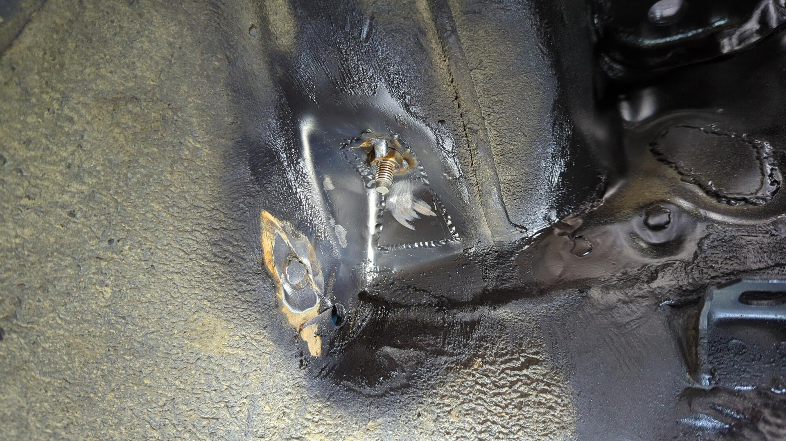

New fuse box mounting nut. (I'll be most likely using push clips for the other two mounts)
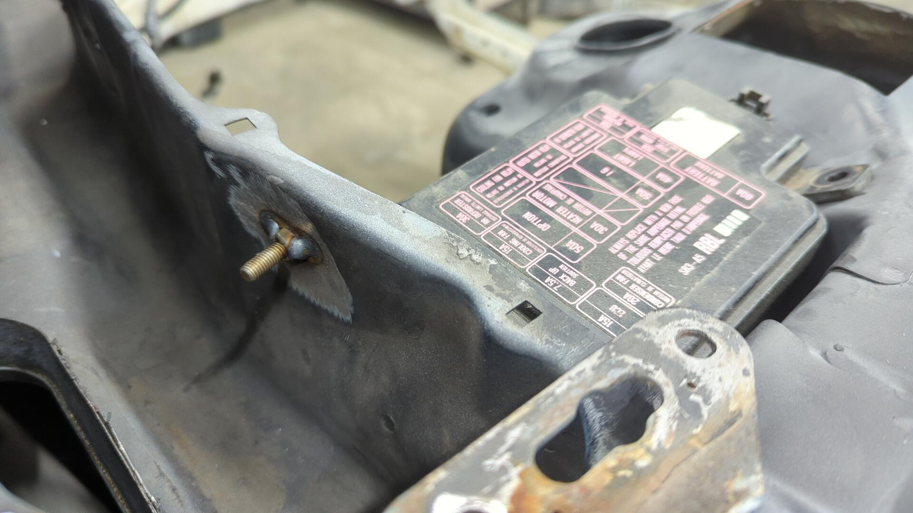

Battery tray and fuse box test fit.

Last but not least, a new nut for the fender bracket.

# Moving on to the Firewall

I'm not 100% certain if I'll re-add AC to this car or not, but I wanted to bring back the possibility for AC so I unshaved the AC evaporator hole.

I roughed in the hole with a body saw and then used a hand file to dial in the shape.

The job was a success as an OEM delete plate fit perfectly.
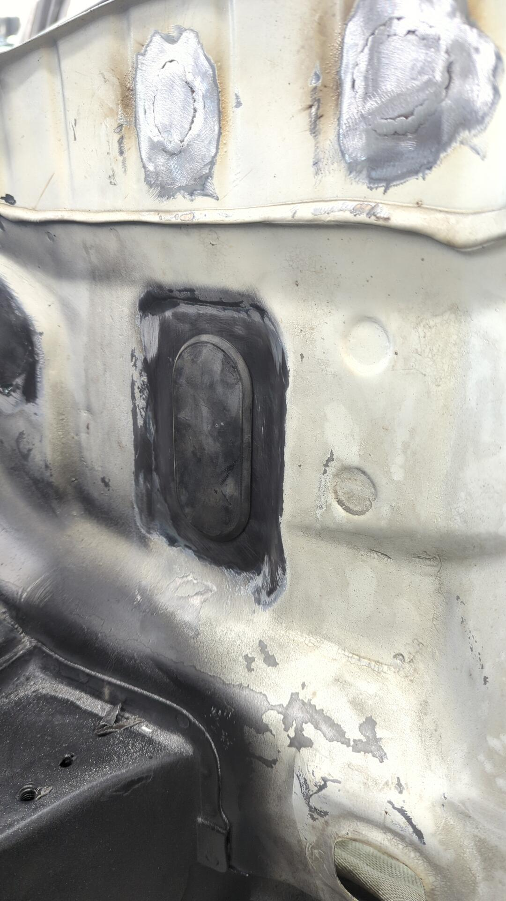

After that, I replaced the old patch to the left of it that was super thin and had burnt on duct tape residue.
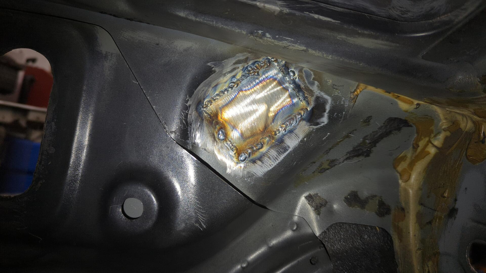

Looking over the rest of the firewall I noticed there was a hole from the angle grinder next to where I ran the brake likes. I didn't even know that was there so I did my best to patch it.

Some sandblasting later.

Fresh epoxy primer.
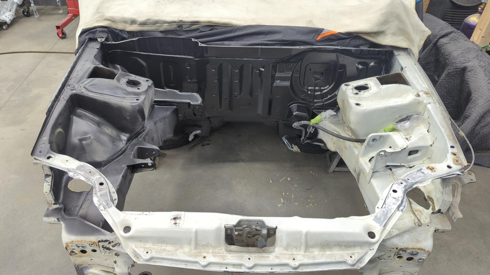

# The Radiator Support

Of all the holes I mistakenly shaved way back when, the silliest one was the upper mount for the radiator because it's such an obvious hole.

My solution at the time had been to drill a hole and run a bolt + nut through it as a temporary fix that eventually turned permanent.

At least I could finally fix it right years later.

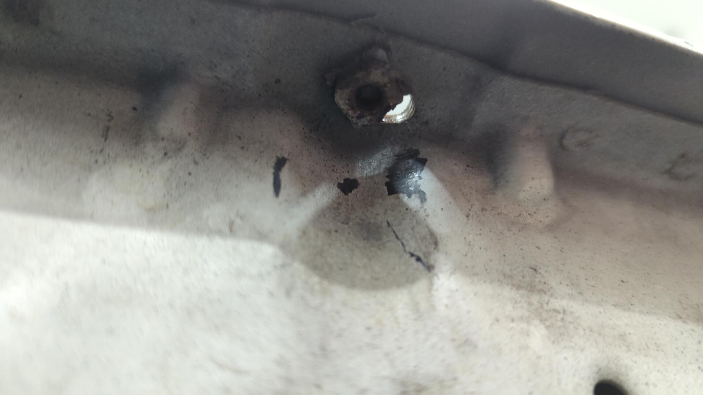

Drilling out a hole with a small hole saw, a new patch was made and welded in.

Then it was drilled and a new nut was welded to the bottom.

After taking care of the upper mount it was time to deal with the lowers.

I haven't picked out what radiator I plan on running yet, but the bottoms were so rusted I was better off just removing them and finding new ones.

One last look of the radiator support before sandblasting.

All clean.

Even the backside is all clean.
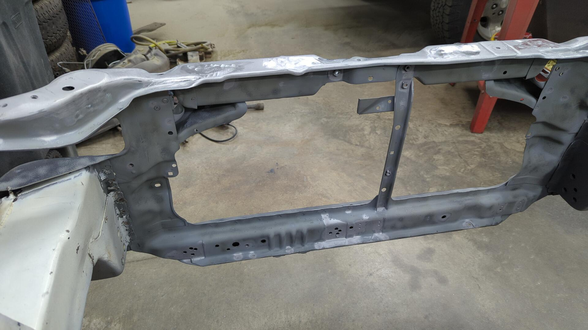

And 2 coats of epoxy it was all safe and protected.

# Last But Not Least, the Driver Side

With 3/4 of the engine bay all done I was starting to lose steam. It had taken me about 25 hours of work to reach this point and I was pretty tired of all the metal work.

I had initially paused on my XJ project because I wanted a break from all the metal work and to be thrown right back into it on this build wasn't very exciting.

With the end of the engine bay so closed I managed to slog through it and make it through the driver side.

First up was removing the OEM mounting point so I could fix it / address rust behind part of it.
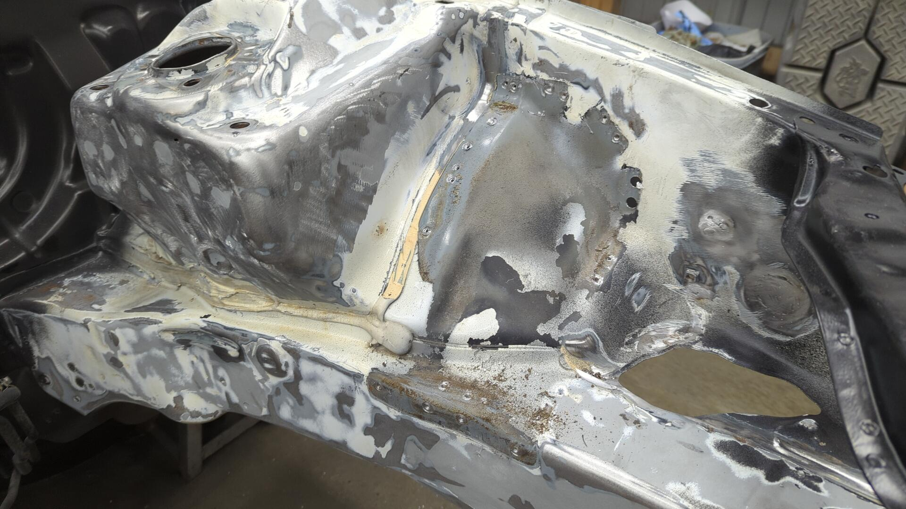

The mount itself isn't in bad shape.

But I completely ruined the threads of the nut years ago using the wrong bolt.

There was also some rust starting on the underside due to nuts I welded up.

With the bracket out of the way it made life so much easier for prepping the driver fender.

The patches on this side were in better shape so I ended up keeping a few of them.
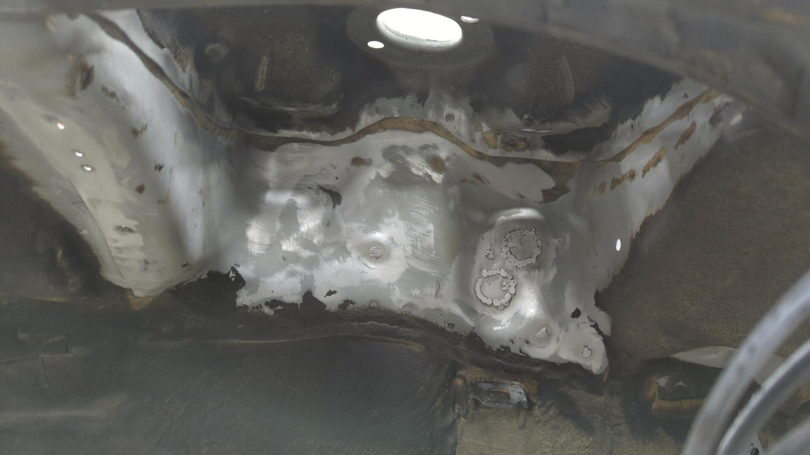

I had to make a big patch on this side due to some rust getting between that inner fender structure and the fender itself.

It was super relieving spraying this section with epoxy knowing I was finally done with all the metal work for now.
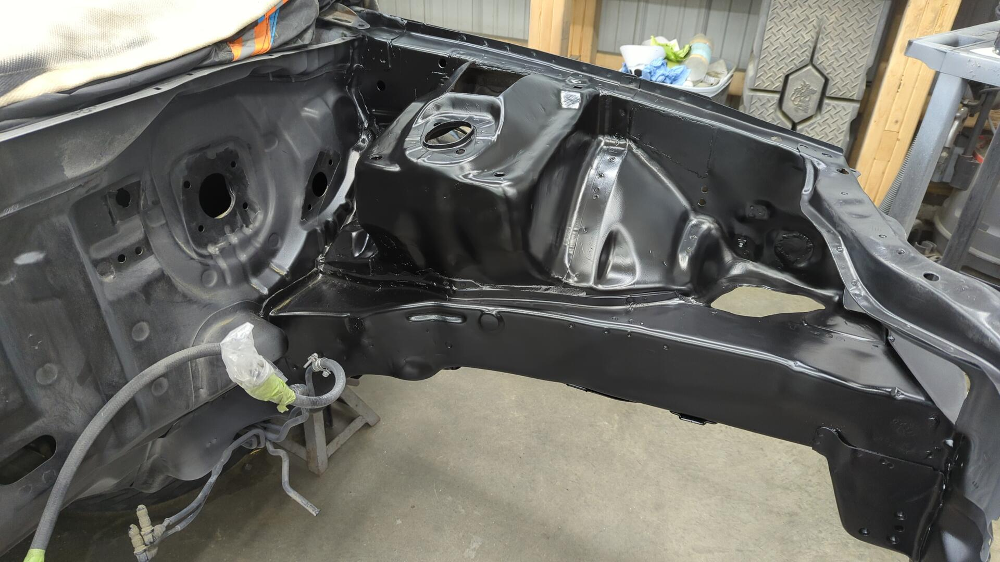

I'm glad it's done, but I really hope I never have to paint this engine bay again once it's painted LSB.

[Continue on to Part 6]()
