I made a mistake in the wheel wells. I had initially planned to leave portions of the OEM undercoating since it was so difficult to remove, and would use bed liner to recoat everything else that I had stripped, but I didn't consider how it'd be next to impossible to blend the two together.

Not wanting to do a half-assed job that I wouldn't be happy with, I decided to bite the bullet and remove _all_ of the OEM undercoating from the wheel wells. Of course I didn't decide to do this until I had already seam-sealed and was ready to spray a sealer coat of epoxy.
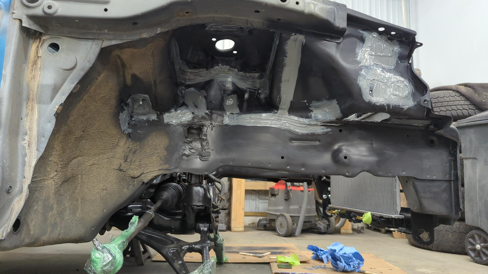
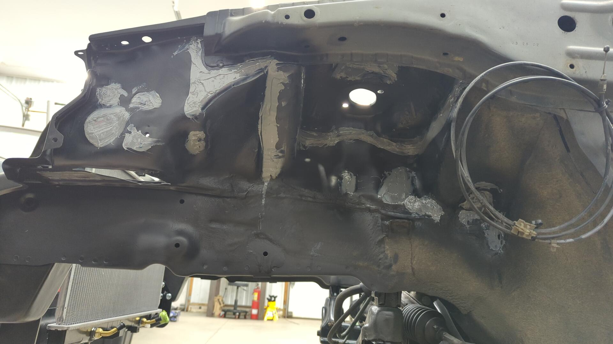

It took roughly 2 hours per side, and about 6 wire wheels but I was able to remove what remained of the OEM undercoating.

The pictures don't make it obvious, but the reason why the original stuff is so hard to remove is because it's tar based. This means it never fully hardens and it likes to gum up wire wheels and sanding discs like nothing.

So while I didn't have a ton of surface area to take care of, the process was super slow.

But with that detour taken care of I was ready to once again start painting.

I'm trying to be better about protecting the car from over spray so I covered everything I could in plastic sheeting.
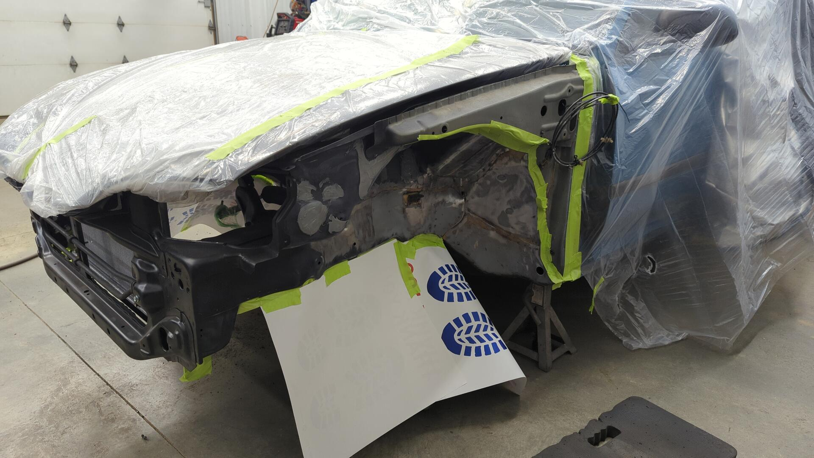

2 coats of epoxy later the wheel wells were looking so much better.
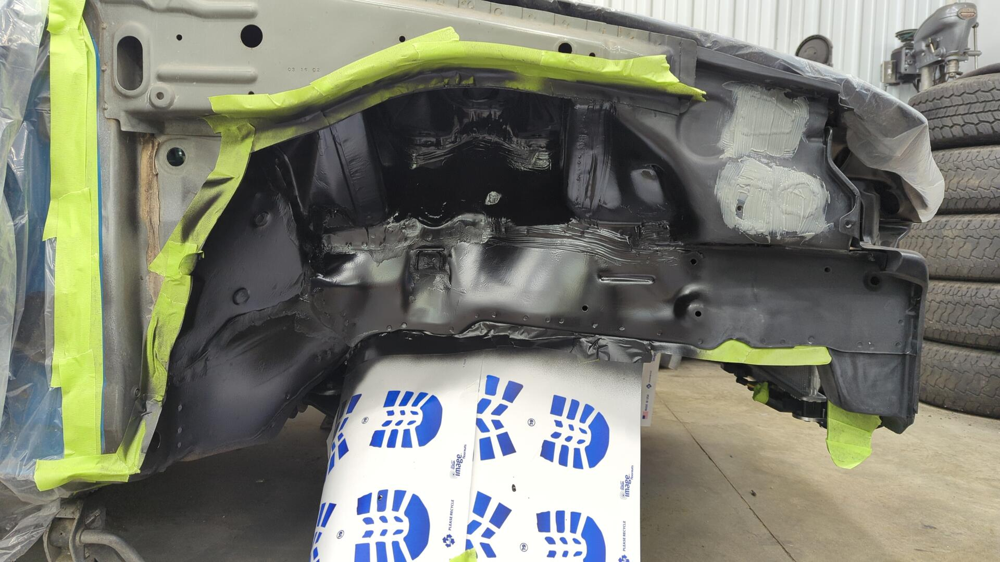

Re-doing the wheel wells gave me a chance to practice seam sealing more. I think things came out a lot neater this time.
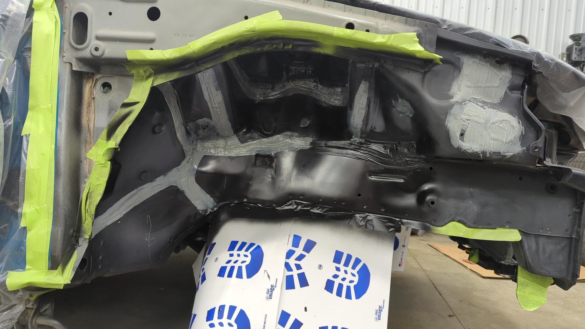

The seam sealer is SEM 39377 which is a 2 part seam sealer. I applied it with the special gun and then ran a 1" paintbrush over it to give it a similar texture to how it looked from the factory.
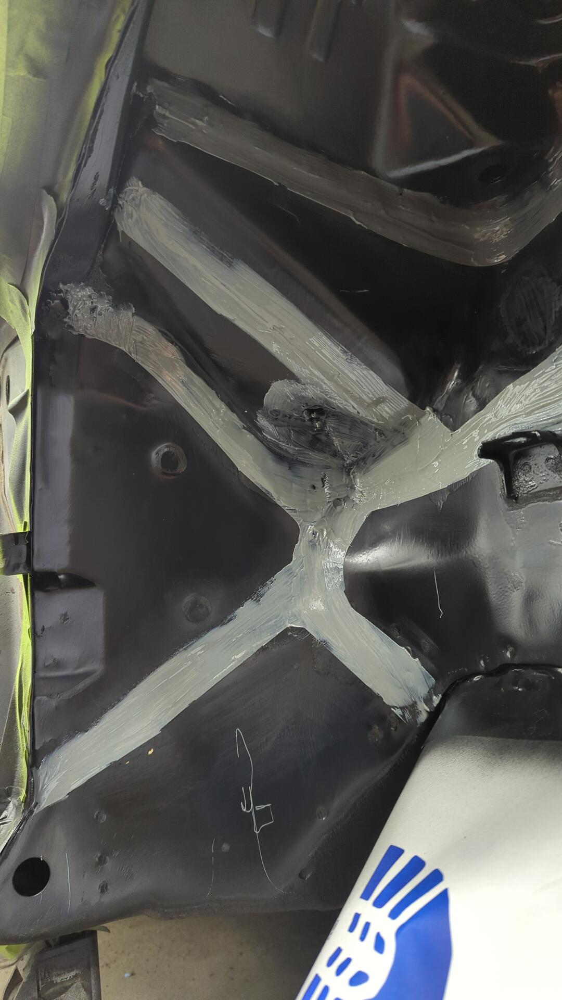
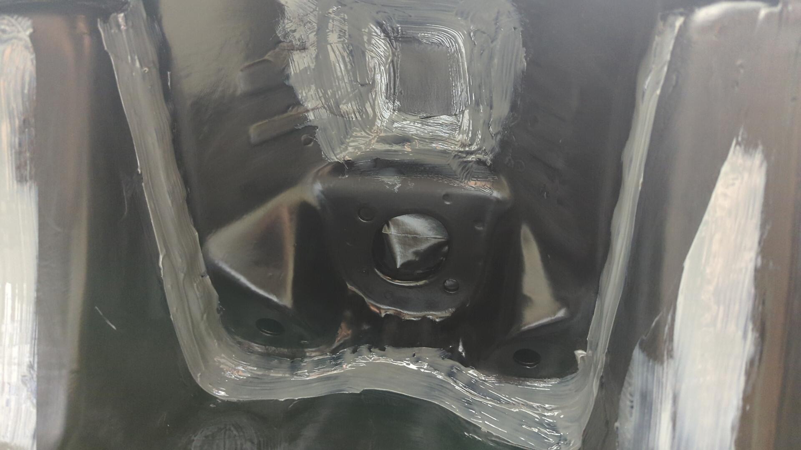

The driver side looks basically the same, but for completeness:
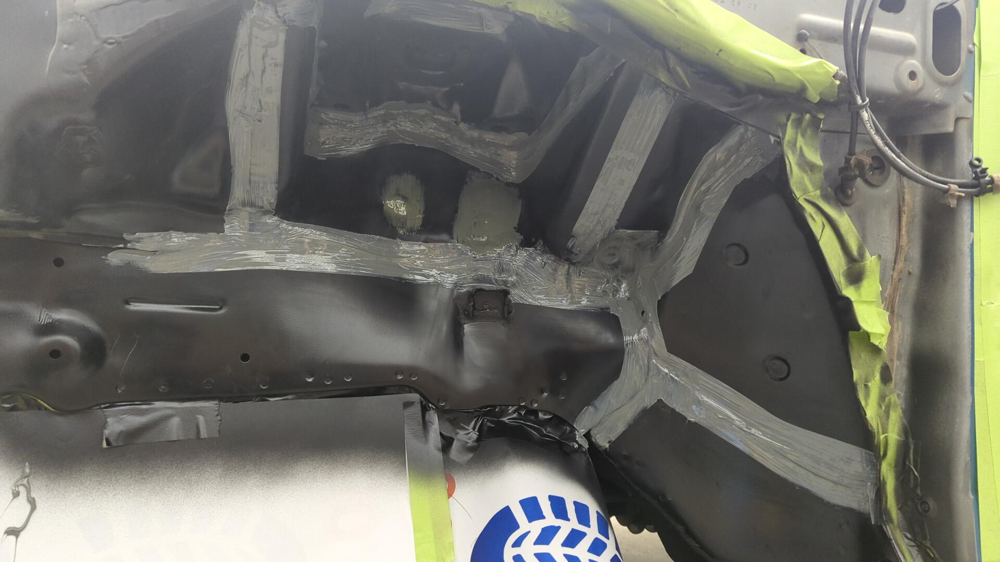

After the seam sealer cured, the wheel wells were given 2 more coats of epoxy. Upol Raptor Liner (the bedliner I used) doesn't adhere well when sprayed directly over seam sealer so the epoxy should help give it something to bite into.

And finally, two coats of bed liner later the wheel wells were done!

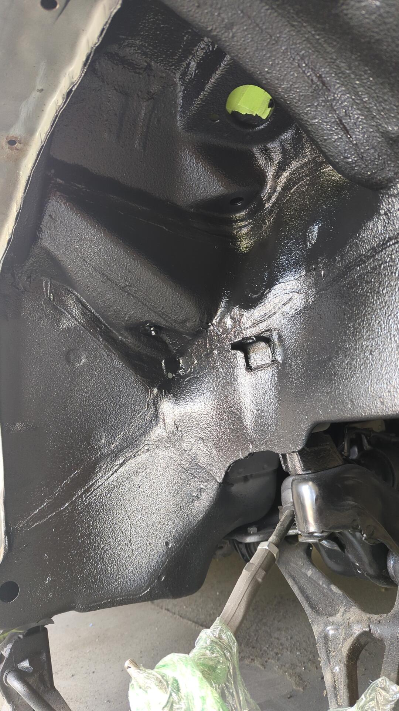

The patches directly behind the headlights don't look the greatest but they'll be covered by the fender + inner wheel well liner so no one will ever see them.
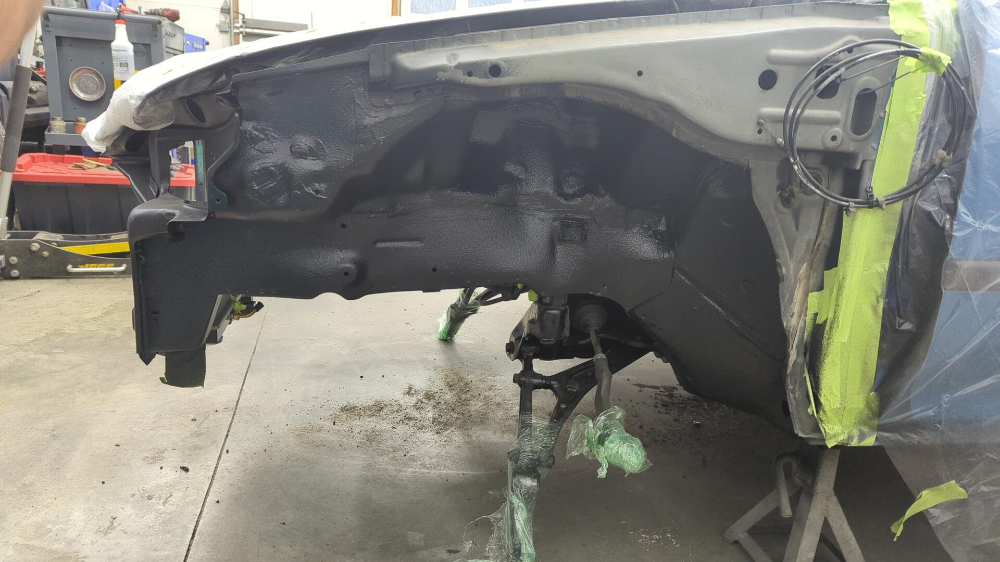

I'm pretty happy with how it came out and am glad I removed all of the OEM undercoating. While it added significantly more work to this portion of the project I think the results speak for themselves.

# Final Touches for the Firewall

With the wheel wells done I just had a few more things to finish up on the firewall before I could finally start the engine bay bodywork.

First up was drilling a new hole to run wires through the firewall to the engine bay fuse box.

After that I decided to paint and seam seal all of the welds on the firewall to ensure water wouldn't be able to find it's way into the cabin.
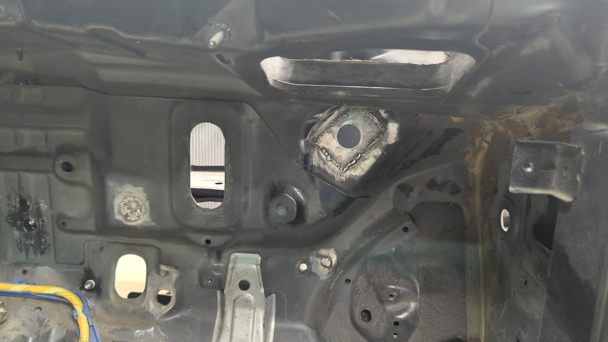
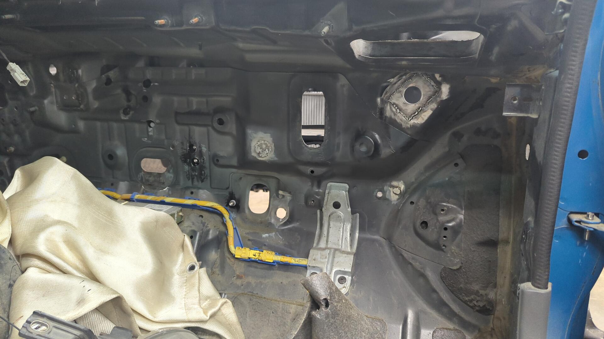

Nothing needs to look pretty back here.
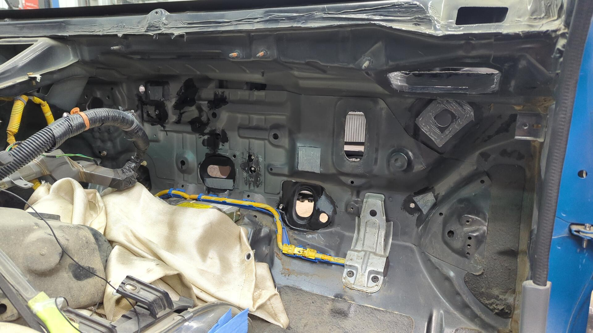

The fresh air inlet for the HVAC system was resealed too.
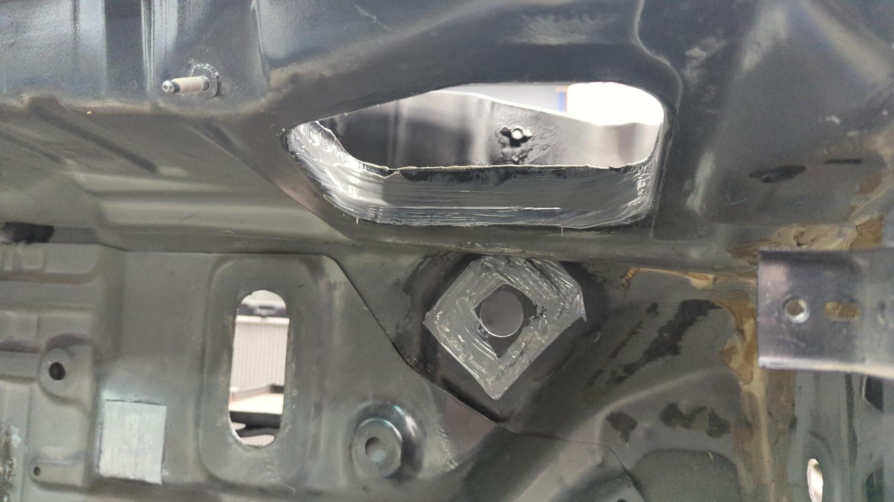

# A New Charcoal Canister Bracket

I was never able to find a 92 - 95 Civic charcoal canister bracket but I was able to hunt down a 96 Civic bracket.
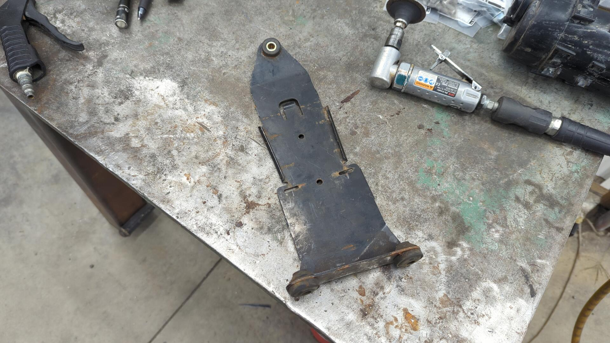

I knew it wouldn't be a direct fit but figured I could cannibalize it for parts.

My bracket doesn't look as professional as the OEM unit, but it works perfectly.

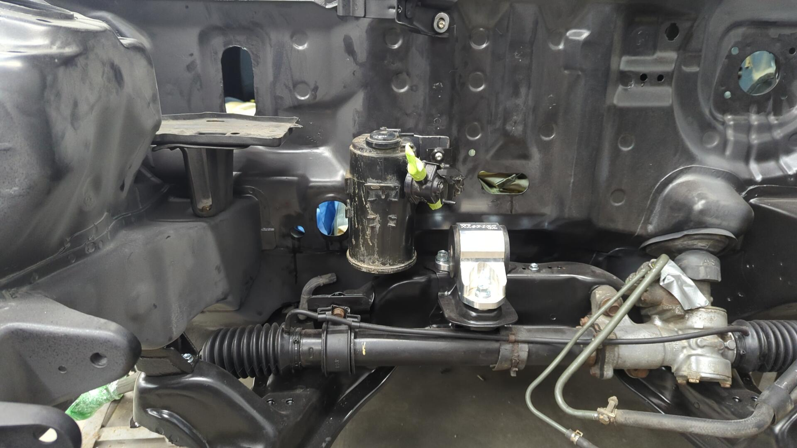

There's still plenty of space for the tuck wire harness to the left of the canister, and the new canister bracket ties in nicely with the heater core valve too.
