The Civic has completed almost two full seasons of auto cross without any major issues and has been an absolute blast to drive. I've been slowly making changes to it so I could see how each change feels and at this point I think it's about perfect for my driving style.

Along side adding a [new rear sway bar last year](), I've made some other tweaks such as lowering it another inch, adding more camber, new wheels, and general maintenance.

First up here's how it looked at the start of the year.

And here's the new wheels.

They're the same spec as the previous wheels (15x7+38 Kosei K1s) but in black. I bought a second set of wheels for it so it'd be easier to get new tires mounted as needed since I could drop off just the wheels / tires at the local tire shop instead of having to bring them the entire car.

The wheels are wrapped in 225/45/15 660+s which overall feel about the same as 660s to me. I'm a fan of the 660s / 660+s because of how long they last and will likely buy another set when these ones wear out.

## Misc Tweaks

At one of the venues I like to go to they have a strict sound ordnance level and my car was just about at the limit so I opted to cut off the Yonaka exhaust tip and weld on a turn down tip in the hopes it'd help.
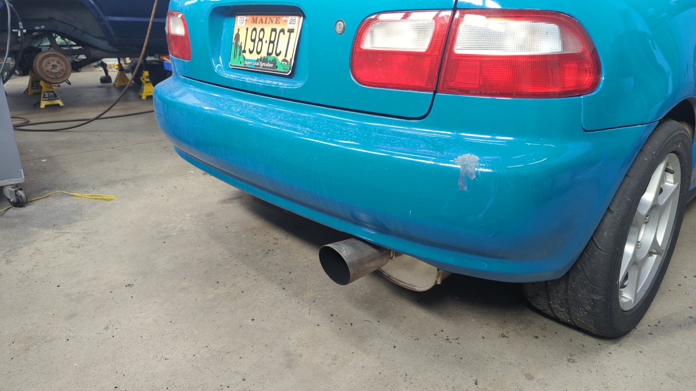

I haven't actually been back to that venue since but I do like how the tip looks because it gives it a more OEM look. The tip is 304 stainless and I used 308L wire so nothing will rust.
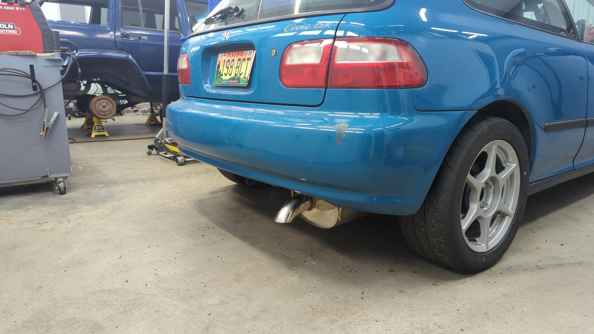

The rear sway bar was adjusted to the stiffest mount point on the rear LCAs. My lower control arms are Function7s which have 3 different mounting points for the sway bar links so you can fine tune how firm the rear bar is. I used to run the middle hole (medium) but decided to most to the outmost hole (stiffest).

## Keeps Eating Rear Wheel Bearings

For some reason the Civic keeps going through rear wheel bearings after just a couple auto cross events. It doesn't really make sense since the rear wheels spend so much time in the air but I've replaced 4 of them now.
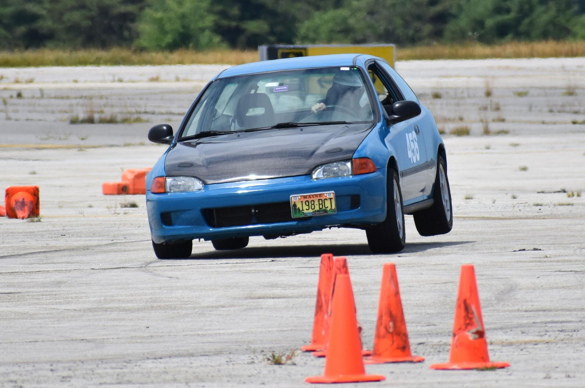

I think some of it may been user error because I used to tighten down the spindle nut with my impact before I knew better but I also found I had to tighten them to a higher torque spec (150ft/lbs) instead of the OEM spec (134 ft/lbs) and also use some blue thread locker to ensure the nut doesn't come loose. My latest set seem to be holding up strong now.

On the plus side I can swap a wheel bearing in ~15 mins and have the torque specs / socket sizes memorized.

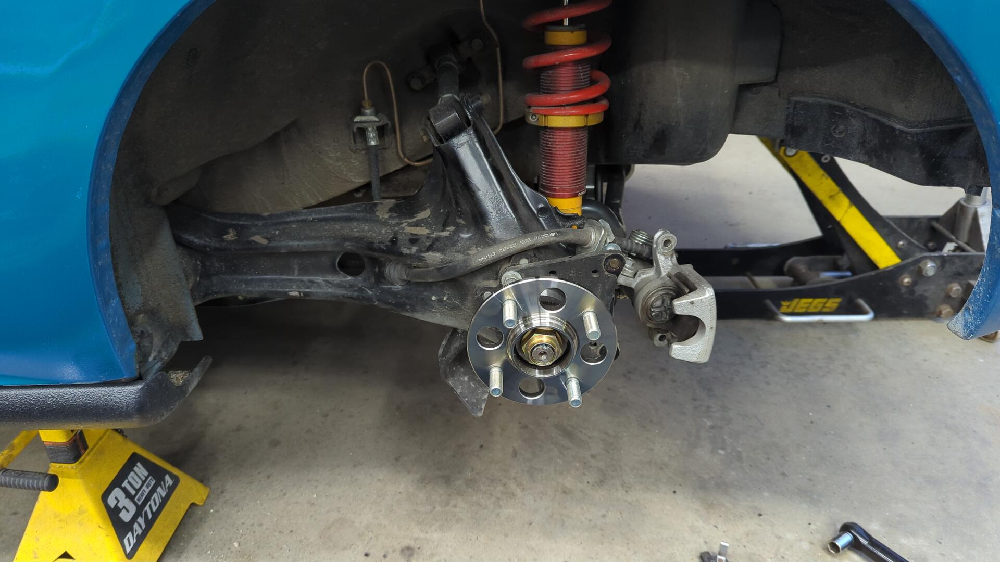

## Goodbye Rusty Fuel Neck

Back when I was working on the rear suspension I couldn't help but notice how rusty the fuel neck was. It wasn't leaking and worked fine but I like to stay ahead of issues and decided to replace it with a new to me unit from the southwest where rust just isn't a thing.

Old vs new (used)
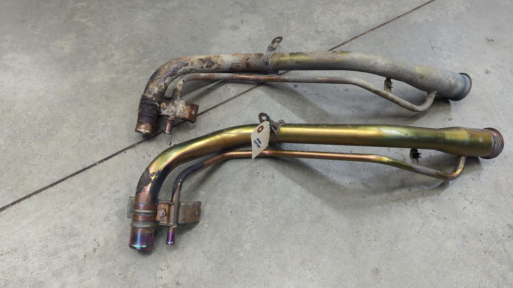

New neck installed.
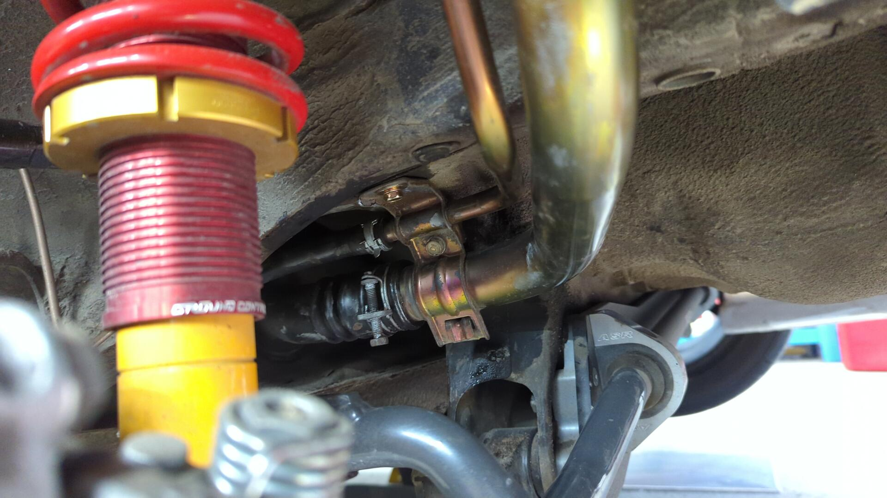

Much better. (plastic cover was reinstalled after the photo)
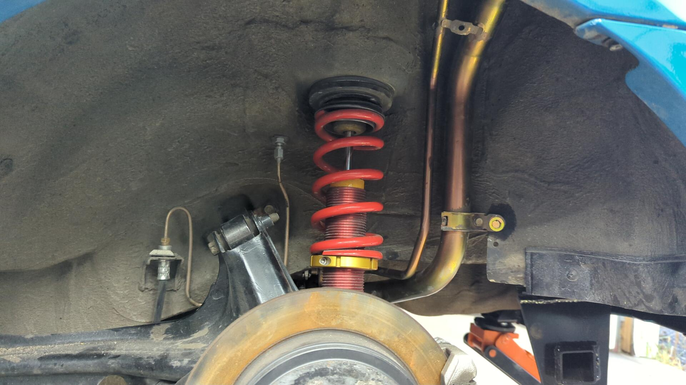

## New Front Upper Control Arms

Whenever I hit a good bump on the course or road I could hear my front upper control arms hitting the shock towers. This is a common issue on lowered Honda's but [I already made custom extended shock towers](#shock-tower-extensions) so I was surprised I was running into the issue.

Looking inside the shock towers I noticed the hit marks were much closer to the UCA mounting points and it seems to be because the K-Tuned UCAs I was running just aren't meant to be used at my ride height. Since the UCAs weren't giving me enough camber either I decided to try out some Skunk2 UCAs.
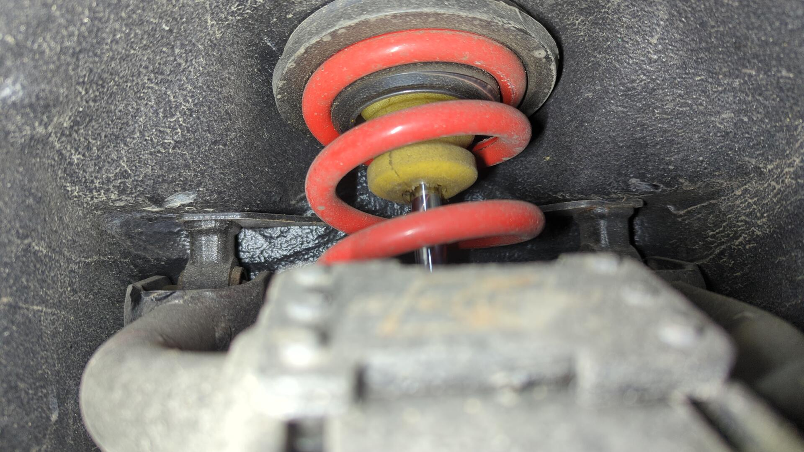

Note how much more the Skunk2 arms curve downwards. This should prevent them from hitting the shock towers.

Installed. I didn't do it intentionally but I guess I have a red / gold theme going on.

## Dropping it Another Inch and Adding Camber

With the new front upper control arms installed I didn't have to worry about hitting the shock towers anymore and could also get more camber in the front so I figured it was time to lower the car another inch and add a bunch of camber. Up until this point my alignment has actually been pretty lousy as each corner had a different amount of camber anywhere from -1* to -2.5*.

I'm not 100% certain what I'll settle on for final values yet but I figured I'd start off running -3.5* in the front and -2.5* in the rear.

This gives the wheels a slightly sloped look and should help with grip while turning. I'm not worried about tire wear while driving on the street.
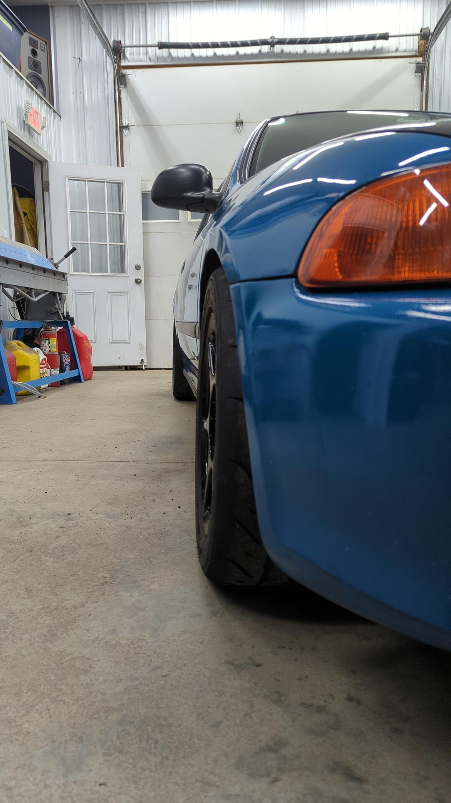

I used my wheel hubs to DIY an alignment. It takes me a couple hours to do one but I'm getting better at them and like that I can fiddle with custom settings.
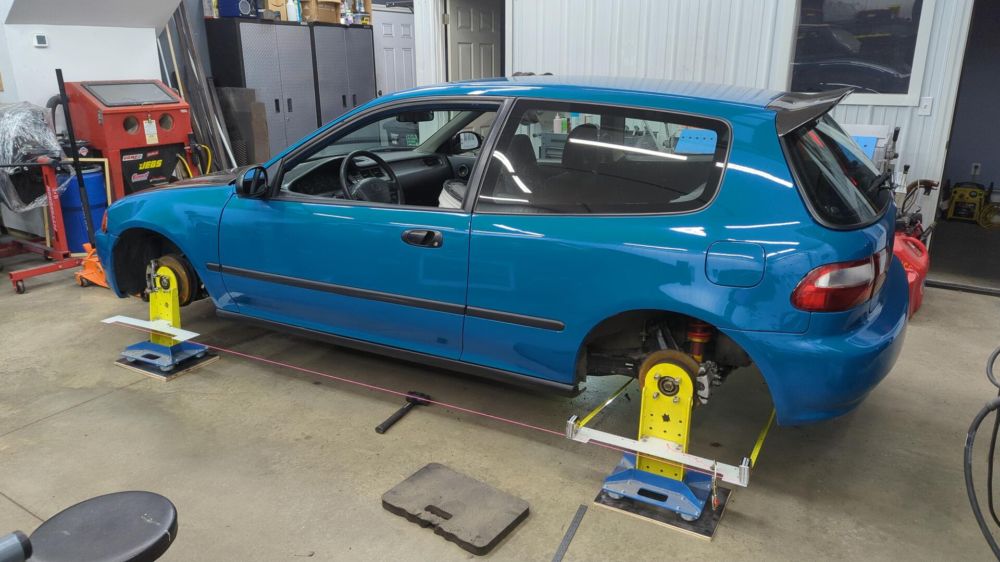

All done.

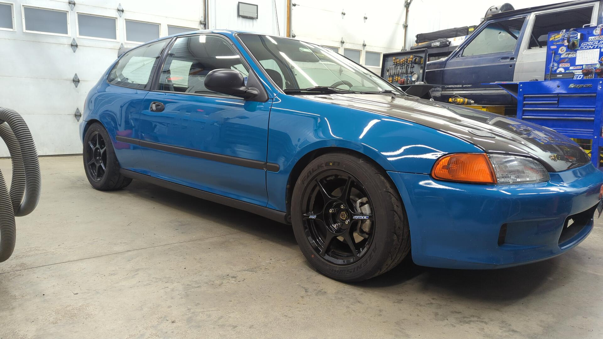

I threw as much weight in the driver seat as I could while doing the alignment to simulate me being in the seat.
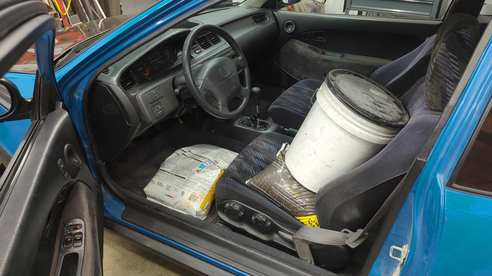

## Looking Ahead

That's about it so far. The car's starting to feel like it could use more power (currently a high comp B20) so I'll likely finally build the B20V I've had laying around this winter. I meant to do it last winter but with how well the car has been running I didn't want to mess with the motor.

I've got a second car that I could race now (more on this soon!) so I'm not as worried about messing with the Civic's motor now because even if it were to blow up I could still race something.
