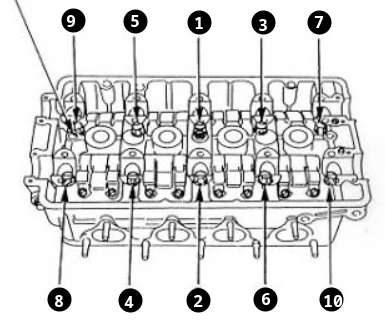
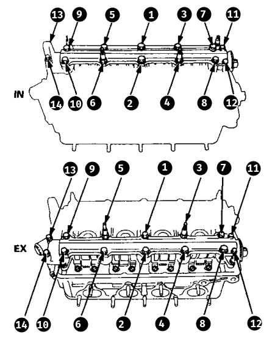
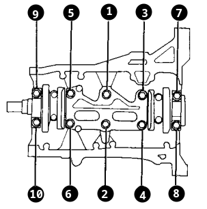

The ultimate list of torque specs for VTEC B-series engines (B16, B18C1, B18C5, B18C, etc...).

**Note**: Non-VTEC engines have different torque specs available [here]().

## Head

- **Cam gears**: 41 ft-lbs
- **Rocker shaft plugs**: 47 ft-lbs
- **Valve lash adjuster**: 14 ft-lbs
- **Valve cover nuts**: 7.2 ft-lbs
- **Spark plug cover nuts**: 7.2 ft-lbs
- **Intake manifold nuts**: 17 ft-lbs
- **Exhaust manifold nuts**: 23 ft-lbs
- **Throttle body**: 14 ft-lbs
- **IACV**: 16 ft-lbs
- **FITV**: 17 ft-lbs
- **Fuel rail**: 9 ft-lbs
- **Distributor**: 17 ft-lbs
- **VTEC Solenoid**: 8.7 ft-lbs
- **Water outlet**: 8 ft-lbs
- **ECT gauge sending unit**: 7 ft-lbs
- **ECT sensor**: 13 ft-lbs

### Head Bolts

Head bolts are torqued in two steps, and must be done in the correct sequence. Bolts should have a light coat of oil on the threads to ensure proper torque.

- **1st step**: 22 ft-lbs
- **2nd step**: 60 ft-lbs

See FSM page 6-75 for more info.

### Cam Caps

Cam caps are torqued in one step and the correct sequence must be followed. Torque spec varies depending on the bolt so be sure to use the correct one. The smaller bolts get 7.2 ft-lbs and the larger bolts get 20 ft-lbs.

- **Bolts 1 - 10**: 20 ft-lbs
- **Bolts 11 - 14**: 7.2 ft-lbs

See FSM page 6-77 for more info.

## Block

- **Timing belt tensioner**: 40 ft-lbs
- **Crank pulley**: 130 ft-lbs
- **Timing belt cover bolts**: 7.2 ft-lbs
- **Water pump bolts**: 8.7 ft-lbs
- **Oil pickup**: 8 ft-lbs
- **Oil baffle plate**: 8 ft-lbs
- **Oil pan**: 9 ft-lbs
- **Oil drain plug**: 33 ft-lbs
- **Oil pump m8x1.25 bolts**: 17 ft-lbs
- **Oil pump m6x1.0 bolts**: 8 ft-lbs
- **Oil jet**: 13 ft-lbs
- **Rear main seal**: 8 ft-lbs
- **Thermostat housing**: 8.7 ft-lbs
- **Thermostat cover**: 8 ft-lbs
- **Fan switch**: 16-19 ft-lbs
- **Upper radiator outlet**: 8 ft-lbs
- **Connecting rod bolts**: 33 ft-lbs

### Main Caps

Must be torqued in two steps, in the correct sequence. Threads should have a light coating of oil to ensure proper torque.

- **1st step**: 22 ft-lbs
- **2nd step**:
  - Main 1, 5: 56 ft-lbs
  - Main 2, 3, 4: 49 ft-lbs

See FSM page 7-23 for more info.

## Accessories

- **PS pump**: 17 ft-lbs
- **PS pump bracket**: 33 ft-lbs
- **Alternator bracket**: 33 ft-lbs
- **Alternator top bolt**: 17 ft-lbs
- **Alternator bottom bolt**: 33 ft-lbs
- **AC compressor**: 17 ft-lbs
- **AC compressor bracket bolts**: 33 ft-lbs

## Transmission

- **Bell housing bolts**: 47 ft-lbs
- **Shift linkage bolt**: 16 ft-lbs
- **Flywheel**: 76 ft-lbs (Don't use this if you have ARP bolts)
- **Pressure plate**: 19 ft-lbs (Don't use this if you have ARP bolts)
- **Slave cylinder**: 16 ft-lbs
- **Starter**: 33 ft-lb
- **Half shaft**: 28 ft-lbs

## ARP Bolts

- **Flywheel**: 95 ft-lbs https://tech.arp-bolts.com/instructions/208-2802.pdf
- **Pressure plate**: 25 ft-lbs https://tech.arp-bolts.com/instructions/108-2202.pdf

## References

94-01 Integra Factory Service Manual

- Page 5-18 (Engine accessories)
- Page 6-53 (Cam caps, cam gears)
- Page 6-75 (Head bolts, intake manifold)
- Page 6-76 (Exhaust manifold)
- Page 6-77 (Cam caps)
- Page 7-3 (Oil pan, oil pump, pickup tube, baffle plate)
- Page 7-5 (Crankshaft, rod bearing caps, rear main seal)
- Page 7-6 (Connecting rod bolts)
- Page 7-23 (Main caps)
- Page 10-5 (Thermostat)
- Page 10-9 (Water outlet, water pump)
- Page 11-105 (Fuel rail)
- Page 12-3 (Flywheel, pressure plate)
- Page 23-92 (Distributor)
