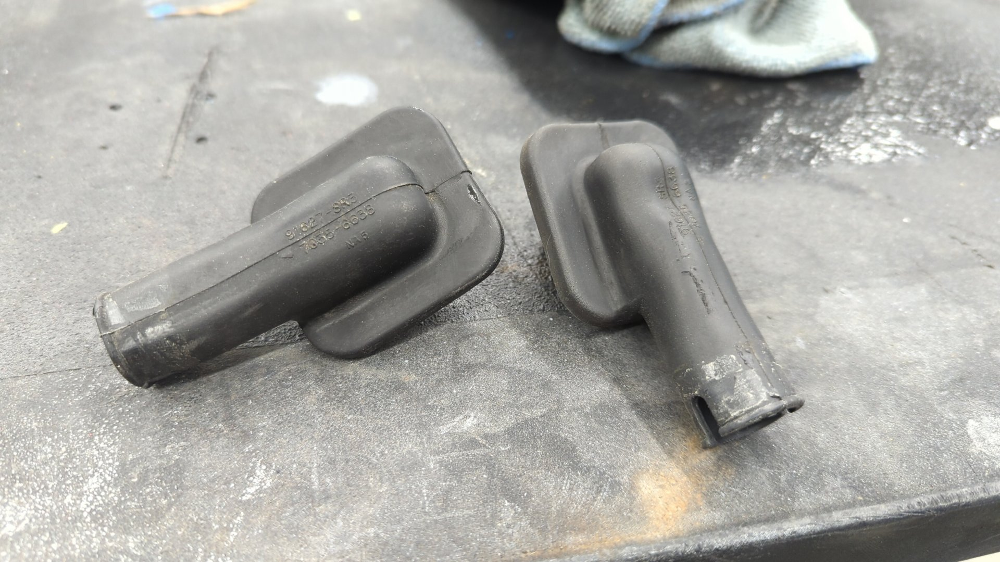

Converting an EG Civic from manual to power windows, locks, and mirrors by building your own wiring harnesses is a moderately challenging task as it'll require you to pull the dash, gut the doors, remove the fenders, dig into the main cabin harness, and get overly familiar with the wiring of the car, but it's definitely doable and the results are well worth it.

If doing all of the above sounds daunting to you, there are [easier options such as sourcing all the OEM harnesses and using them as donors for the wiring.](https://honda-tech.com/forums/honda-civic-del-sol-1992-2000-1/92-95-civic-power-door-conversion-right-way-tons-pics-end-all-swap-2337026/) but it's getting harder to find the OEM harnesses so this might not be feasible forever.

I was not able to source them which is why I wired things from scratch.

# Parts and Supplies Needed

**Heads up this DIY is for coupes and hatchbacks only!** Sedans require different parts and also have different pinouts for the front window switches so this DIY will not work for sedans.

Coupes and hatchbacks share the same parts for the doors so parts can safely be interchanged between them.

## OEM Parts to Source

- Driver and passenger power door panels
- Driver and passenger window switches
- Driver and passenger window regulators
- Driver and passenger lock actuators \*\*
- Driver and passenger power mirrors
- Driver and passenger power mirror interior covers (the little triangle panels on the inside of the door)
- Power mirror switch for the dash
- Power lock control unit (38380-SR3-A01)
- Power window relay (Denso 056700-7250 plugs into the dash fusebox)

\*\* If you can't source power lock assemblies you can buy just the actuators and install them on your manual lock assemblies.

## Wiring Supplies

These will vary based on your personal preferences. I bought the following:

- 14, 16, 18, and 20 AWG wire from Waytek
- Lots of heat-shrink. Size will vary based on your wire insulation but I used 0.09" ID, 0.13" ID, and 0.19" ID
- (3) 20 amp fuses and (1) 7.5 amp fuse
- Various sizes of wire loom
- Lots of clips and zip ties

### Grommets to Protect the Door Jamb Wiring

Finding grommets to use in the door jambs can be tricky. I settled on using 3 separate pieces per door to fully protect the wiring in the jambs.

- (2) EG or EK power door grommets (cabin side)
- [(2) Smaller grommets (for door side)](https://ceautoelectricsupply.com/product/firewall-grommets/)
- [(2) Rubber door loom thingies](https://www.johnnylawmotors.com/catalog/frame-body-parts/shaved-doors/shaved-door-accessories/KICDLOOM/rubber-door-loom)

The EG / EK grommets are these guys:

Manual EG / EK door grommets won't work because they have a smaller ID and there's not enough space to run all the wiring through them.

### Various Connectors and Terminals / Pins

Sourcing connectors for all the door components is a pain. The easiest option here is to try and buy the OEM parts above from junkyards that include the connector pigtails that way you can re-use the pigtails for you new harnesses.

The other option is to source new connectors and/or terminals for everything. Most of the door connectors are [Sumitomo HD 090 connectors](https://www.corsa-technic.com/category.php?category_id=172).

I personally went with a mix of new connectors, and old connectors and bought a bunch of new terminals so I could repin them. I found out the hard way that some of the connectors had very difficult to crimp terminals that my [wire crimpers](https://wirefyshop.com/products/crimping-tool-set-8-pcs?pr_prod_strat=e5_desc&pr_rec_id=cf811a641&pr_rec_pid=4477565796431&pr_ref_pid=1392288858224&pr_seq=uniform) didn't like so I had to re-use a couple old pigtails.

### Door Harness Connectors

No one sells the OEM door harness connectors (C401 and C554) so you'll have to come up with your own solution for them.

Honda designed the door harnesses so the connector is where the wiring goes into the door, but it's hard to find a connector that clips into the OEM hole so I decided to relocate my door harness connectors to be inside the cabin.

Doing it this way makes life a little easier since the connector doesn't have to be waterproof, and it's size doesn't matter as much although you do need to ensure it can fit through the grommet body hole otherwise you'll never be able to remove your door harnesses without de-pinning the connector.

The driver door has 13 wires and the passenger door has 10 wires so any connectors that can hold that many wires should work fine.

I went with (2) [Sumitomo HD-090-14P](https://www.corsa-technic.com/item.php?item_id=743&category_id=174) and (2) [Sumitomo HD-090-14S](https://www.corsa-technic.com/item.php?item_id=744) for this.

## Buy a Factory Electrical Troubleshooting Manual

I **highly recommend** picking up a physical copy of the factory electrical troubleshooting manual if you can. Most of the info in it is the same as the factory service manual, but it's much smaller in size since it only focuses on wiring and this makes it super easy to quickly navigate.

If you don't want to find a copy of the electrical troubleshooting manual the factory service manual can be used.

# References

All of the information in this DIY was taken from the factory electrical troubleshooting manual / factory service manual. Below is a list of the pages I found most helpful.

| Topic               | Service manual  | Electrical troubleshooting manual |
| ------------------- | --------------- | --------------------------------- |
| Dash fuse box       | 23-48, 23-49    | 6                                 |
| G552                | 23-29, 23-64    | 14-7                              |
| Power mirrors       | 23-212 - 23-215 | 141                               |
| Power windows       | 23-223 - 23-232 | 120                               |
| Power locks         | 23-234 - 23-240 | 130                               |
| Sound system        | 23-195 - 23-198 | 150                               |
| Connector Locations | 23-22 - 23-43   | 203-14 - 203-26                   |

# Swap the Door Guts

You'll need to start off by removing the inner door panels.

Once the door panels are off, pick a door (I recommend passenger side first) and start swapping the mirror, lock assembly, window regulator, and power door lock control unit (if working on the driver door). The mirror and lock assembly are fairly straightforward but the window regulator can be difficult.

To remove the manual regulator you'll also need to remove the glass from the door. Be careful while doing this and set it aside somewhere safe.

If you're power window regulators are used, now is a good time to lubricate the tracks with fresh grease before installation.

Also double check they have the spring properly installed. One of mine was missing the spring so I had to remove it off my old manual window regulator and swap it on.

One last look of the old manual window regulator

Power window regulator installed.

The power regulator mounts slightly differently than the manual one but it's bolts right up since the door already has all the mounting holes.

Once your regulator is secured, you can put the glass back in. You may need to power up the window regulator to move it up or down so you can reach the bolts that hold the glass in place. This is pretty easy as all you need to do is give it 12v (I used a jumpbox).

## Test The Window

With the glass in place it's good to double check the alignment of the regulator by powering up the motor so the glass goes all the way up and back down. If you find the glass is loose and/or jams up, or is angled wrong there's two bolts that you can try adjusting.

The left bolt holds the window rail in place and can be moved inwards to tighten things up. The right bolt controls the angle of the glass.

Now repeat these steps for the other door.

# Prep for Wiring

Now's a good time to start pulling parts off the car so you can get access to all the wiring.

## Remove the Fenders, or At Least the Wheel Well Liners

On the outside you'll want to either pull your fenders, or remove just the inner wheel well liners. Completely removing the fenders makes life a lot easier for working the wires in the jambs, but it's probably doable if you wanted to leave the fenders on and work from the wheel well.

My fenders were already removed because I was redoing my engine bay at the time.

The square opening below the upper door hinge is where the door wires pass into the cabin.

## Pull the Dash and HVAC

On the inside you'll need to pull your dash, and the HVAC system. You may be able to leave the heater core in place and just remove the ac evaporator housing / blower motor.

Depending on how OEM you want to make your wiring look you can either pull the cabin harness so you can remove all the loom, or leave it in place in the cabin and run the power window wiring as a secondary harness. I'd suggest pulling the harness and remove all the loom because then you can run it through the wire guide behind the pedals.

All the loom removed. The wires are going to be sticky from the old electrical tape so I'd recommend wiping them down with a solvent to clean them up.

At this point you can pop the harness back in the car for mocking up the new wiring.

# Wiring Everything Up

If you've made it this far you're probably wondering what you've gotten yourself into as your car is now a big pile of parts but it's finally time to start running the new wiring.

This is all of the wiring you'll need to add:

Simple right? We'll it's not actually that bad if you break it down by sections.

I'd recommend focusing on the passenger door first and running all of the wires within the door and into the cabin where it'll terminate into the new passenger door harness connector that the cabin harness will connect to.

## The Passenger Door Harness

I found starting with the power mirror wiring to be the best bet because it has the longest wires in the door and if you pick where to route them first it makes it easy to route the rest of the wiring. Your wiring doesn't have to perfectly match the OEM wiring since there's a good amount of space between the inner door and door panel.

Here's what I came up with.

All of the wires are routed through the door and out into the door jamb but not into the cabin yet. I also labelled where each one goes (ex: C629 pin 1) that way when it came time to pin up the new harness connector I could document the pinout.

Once all the wiring is ran through the door you can install the grommets.

Then it's just a matter of wiring the loose wires to a connector inside the cabin.

Don't forget to document your connector's pinout! Here's mine for reference.

Now's also a good time to double check your work with a multimeter by testing each of the connectors pins against the connectors in the door to ensure everything matches up.

If things look good, you're safe to move on to the driver door.

## The Driver Door Harness

The driver door is definitely the trickier of the two to wire up which is why it's better to start with the passenger door. It's mostly because the driver door window switch has more wires, and the lock control unit also lives in the driver door.

Just like the passenger door I recommend starting with the mirror wiring. Then add the other smaller connectors like the lock switch, speakers, and lock actuator. After that it's just down to the driver window switch and lock control unit.

One thing that's different about the driver door is there's 7 ground wires that have to be combined before the ground wire is ran into the cabin. You could solder those together or go for a more professional look by using a junction connector. I nabbed this guy off a spare dash harness I had laying around.

Once all the door wiring is ran it's just a matter of passing the wires into the cabin.

Hopefully you didn't forget to label them!

Pin them up to a connector and then document your work. It also doesn't hurt to double check all the wire by testing them with a multimeter to ensure each one goes where you expect it to.

Once again for references here's my pinout.

If you've made it this far you deserve a beer.

## Cabin Wiring

Believe it or not but the cabin wiring isn't as difficult to do as the doors. It's mostly running wires from the passenger side to the driver side and connecting them to a few connectors on the driver side by the fusebox.

I'd suggest you start off by making a jumper harness that will run the 10 wires from the passenger door to the driver footwell so it'll be easier to hook up all the connectors at once.

Then you just need to integrate the wires into the cabin harness. This is pretty easy other than trying to get the wires into the wire guide behind the pedals.

With your passenger wires ran over to the driver side you're on the home stretch now as it's just a matter of hooking up a few connectors now.

### C502

C502 is the easiest of the cabin connectors to wire up (not that any of them are that bad) as it's only needs 2 wires ran for the driver door speakers.

It's located above the dash fusebox and is super easy to spot as it's the blue 12 pin connector. Every Civic has this one since it's also used for running wires from the dash to the rear cabin harness.

C502 will already have the speaker wires from the factory but I decided to replace them with new wires as my OEM speaker wires were hacked up. You can also re-use the OEM speaker wires if you prefer.

### C436

Next up is C436 which is the 14 pin gray connector above the fusebox. Run your speaker wires from the passenger door into it.

It'll also already have OEM wires for the speakers so it's your choice if you want to re-use them or completely replace them.

### C555

C555 is a little trickier as your Civic likely won't have this plug. It's an 8 pin connector that plugs into the back of the fusebox that provides 12v to the power door harness.

You can make a little jumper harness which should be pretty easy since it's just 4 wires.

Then you just need to run each wire to it's destination. Don't forget that pin 2 goes to both doors!

### C558

This is power mirror switch. Since the switch is on the dash you won't have anything to plug it into yet so make sure you leave enough slack that it can reach the dash.

### G552

G552 is where both ground wires (one from each door) get grounded to.

I don't have the best picture of it, but the chassis should already have a threaded hole for the ground behind the main relay so all you need is a ring terminal and a m6x1.0 bolt for it.

### The Remaining Door Wires

At this point ou should only have a few loose wires from the passenger side left. These are the wires that need to be ran to the driver door plug. I don't have a picture of them but they are needed so the driver lock switch and window switch can control the passenger door. Go ahead and hook them up.

Once the last few wires are done and everything's been tidied up your ready for testing.

# Testing and Troubleshooting

Before you start testing your wires you'll want to add some of the missing fuses to your fuse box. You'll need to add a 20amp fuse in spot 5, 6, 8, and a 7.5amp fuse in spot 13.

Also don't forget to plug in your power window relay to the fusebox otherwise the driver / passenger door fuses won't have any power.

If you experience any odd behavior I'd recommend double checking wires with a multimeter to confirm they go where expected.

Some helpful tips:

- If your windows don't work at first, double check the fuses. Then double check you installed the power window relay otherwise the driver / passenger power window fuses won't be getting any power.
- If your windows struggle to move up or down, check that the window guides are properly adjusted. If that doesn't help double check you have the helper spring on the regulator. If everything looks good and you bought a used regulator it may be worn out and needs to be replaced.
- If lock actuators work backwards, try flipping the wires on one of them.
- If the lock actuators unlock but then relock right after you may have one of them wired backwards.
- If your power mirrors are acting weird, double check the wiring at the switch.

Once everything is working perfectly all that's left is to loom up your wiring to protect it and re-assemble your car.

Enjoy!
