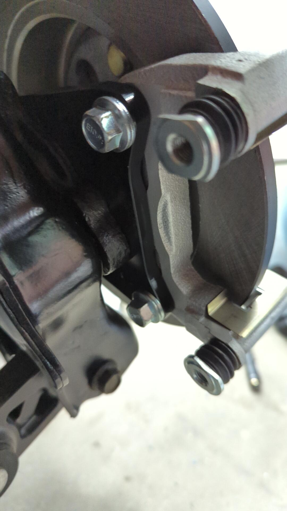
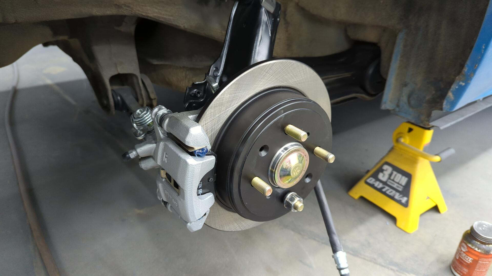

Tired of looking at the rusty rear drums of your 92 - 95 Civic but don't want to dish out the cash for disk trailing arms because of how expensive they are? Depending on which style rear spindles your Civic has, you may be able to convert them to disk on the cheap by repurposing brackets made by Wilwood.

There are companies out there such as Scarebird that used to sell custom conversion brackets for converting rear drum brakes to disks. As far as I can tell though Scarebird is no longer selling these brackets. The companie was sold to and the new management team is working on getting production going for their products but it's unclear when/if they'll produce them again.

# CIV vs HON Spindles

I'm borrowing the CIV / HON terminology from Scarebird as there's no OEM part numbers available for the spindles since Honda never sold these parts separately.

All rear trailing arms for 92-95 Civics are the same. The only actual difference between a disk and drum trailing arm is the spindle bolted up to it.

Unfortunately Honda used two different style spindles for the drum trailing arms and it's super important you check which style you have before attempting this DIY.

If your rear spindles look like the following it means you have CIV spindles and this guide is for you.

If your spindles look slightly different and some of the bolt holes are recessed, you likely have the HON style spindles and cannot follow this guide.

If you're not certain which style spindles you have you can measure from the mating surface of the wheel hub to the front of the spindle.

A measurement of 2.71" means you have CIV spindles and are good to go!

# Wilwood 250-10201 Brackets

Wilwood makes three different big brake kits for the rear of these Civics. The calipers and rotors are all the same but the brackets used to mount the calipers are different between the kits.

If you look close at their 2.71" wheel hub kit and the 2.46" wheel hub kit you'll notice the only difference between the two is these brackets:

Wilwood uses these adapter brackets to make the drum spindles match up perfectly with the disk spindles so the same caliper bracket can be used between the two kits.

What's even better is sites like Summit allow you to buy just these brackets for about ~$90 a pair shipped.

Then if you pick up 3 m10x1.25x20mm bolts (per side) you can mount them right up to your spindles. Torque spec is 40ft/lbs and thread locker is recommended

Drum wheel hub mounted back up.

Test fitting the rotor.

To attach the caliper bracket you'll need 2 m10x1.25x25mm bolts and 2 m10 washers per side. 20mm bolts are too short for this, and 25mm bolts are slightly too long so the washer helps make them the perfect length.

This is the same size bolt recommended by Wilwood.

After that follow the normal procedure for installing your calipers and pads.

# Parking Brake Cables

You can use regular 92-95 Civic disk parking brake cables. The cheapest option would be to grab a set from the local junkyard because you can grab the pins that attaches them to the caliper at the same time.

Otherwise if you buy brand new OE cables (I bought new Dorman ones) you'll need to order the OEM pins which comes out to about $20 for the pair.

# Brake Lines

It's up to you in terms of which brake lines you want to run. Some people prefer braided stainless lines, and others are content with the OEM style rubber lines.

# Parts List

Here's the parts list I used for my conversion:

- 94-01 Integra rear calipers\*\*
- 94-01 Integra rear rotors + pads\*\*
- 94-01 Integra rear brake hoses (not pictured)
- 92-95 EX / SI parking brake cables
- 2x 43471-SD2-930 OEM parking brake pin
- 2x 90705-SD2-931 parking brake cotter pin
- 2x Wilwood 250-10201 Brackets from Summit
- 6x m10x1.25x20mm bolts
- 4x m10x1.25x25mm bolts
- 2x m10 washers
- 4x DORMAN HW1457 brake hose clips. 1 for the parking brake cable, 1 for the brake line per side.

\*\* Trim doesn't matter. LS, GSR, etc are all the same.
