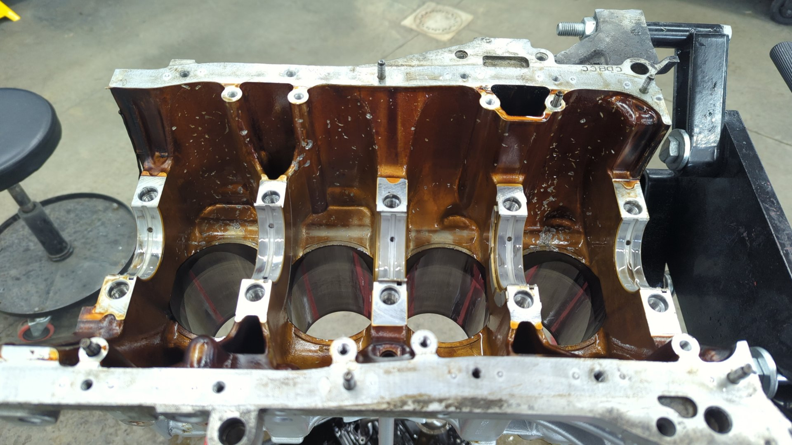

Building a B20 VTEC (aka B20V, aka CRVTEC) isn't much more difficult than building a normal B20 but it can be daunting to figure out what you'll need for parts with so many different options out there. You can do anything from slapping a VTEC head on a stock B20 block and sending it, to going all out with high comp pistons, big cams, and a bunch of headwork.

I figured I'd write up a blog series on building my B20V and the reasoning behind all of the decisions to try and help out others with building their own B20V.

# Background

I recently had my first engine failure and decided to make the best of things by bringing the block back to life as a B20V. The motor was originally a high comp B20B but due to a valve lash adjuster nut getting loose while the engine was running the engine was in need of a rebuild.

The nut left a bunch of dings and scratches inside of the block and even managed to crack a piston.

I brought the block to a local machinist and they said the block was still usable and only needed a bore due to out of round cylinders. I consider myself lucky that none of the metal bits banging around down there damaged the cylinder walls.

# Setting Goals and Making Sure a B20V is a Good Choice

Before diving into building a B20V I spent a lot of time defining what my goals were, and thinking of the different ways I could accomplish them. For one, it's really important to know what the end goals are so you can follow them as your north star, but secondly it's important to know the path you're taking can actually get you there.

My goals for the motor were:

- 200 - 225whp
- Maximize the area under the curve
- Street drivable
- $5,000 budget

**Goal 1: 200 - 225WHP**

It cost money to add hp and the faster you try to make a motor than it was stock the more expensive it'll get. 200 - 225whp isn't a crazy high power goal but it's nearing the end of what a _reasonable_ n/a B20V can do.

I say _reasonable_ because it's been proven you can push an n/a B20V past 250whp but at that point you've likely had to sacrifice some driveability and could have spent less with other build options (aka k-swap, boost, etc...) due to the prices of b-series parts nowadays.

I'm happy with 200 - 225whp though as I plan on using this motor for autocross / weekend fun and you don't really need big numbers for that.

**Goal 2: Low End Torque over High End Power**

I prefer low end over high end because low end tends to be more helpful while out on the autocross course and also makes for a better experience while driving on the streets.

**Goal 3: Street Drivable**

The car it's going in will be used for more than just racing so I needed the motor to have a normal idle, run on easy to acquire fuel, and be reasonable to drive in traffic. This ruled out things like no insane cams with a lopey idle, or no hard to source fuels like e85. (not available where I live)

**Goal 4: $5,000 budget**

While b series stuff isn't cheap like it used to be and the price of other options like k-swaps has gone way down, a proper k-swap could easily run double my budget after accounting for all the extra bits I'd need to complete the swap.

The car I plan on swapping the B20V into is already prepped for a VTEC motor with a VTEC engine harness and a chipped P28 so staying b series let's me put all of the budget into the motor vs accessories.

## A B20V Meets All My Goals

Based on all of the above I'm fairly confident a mildly built B20V would be perfect for me.

200 - 225whp should (hopefully) be achievable if I bump up the compression, pop in some stage 2 cams along with upgraded valve springs so I can rev it out, and a good intake manifold / exhaust header to let the engine breath.

I'll have to keep the compression to a max of 11.5:1 since 91 octane is the best fuel I'll be able to source without having to be selective of gast stations but that should be more than enough for stage 2 cams.

In terms of cams I'll aim to find a set of cams that focuses on low end power since I'm interested in as much area under the curve as possible.

[Continue on to part 2]()

# Resources

- [High compression daily driven?](https://honda-tech.com/forums/all-motor-naturally-aspirated-44/high-compression-daily-driven-2804592/#post43014749)
