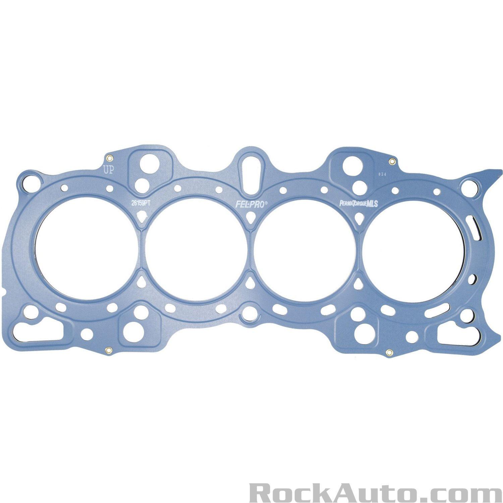
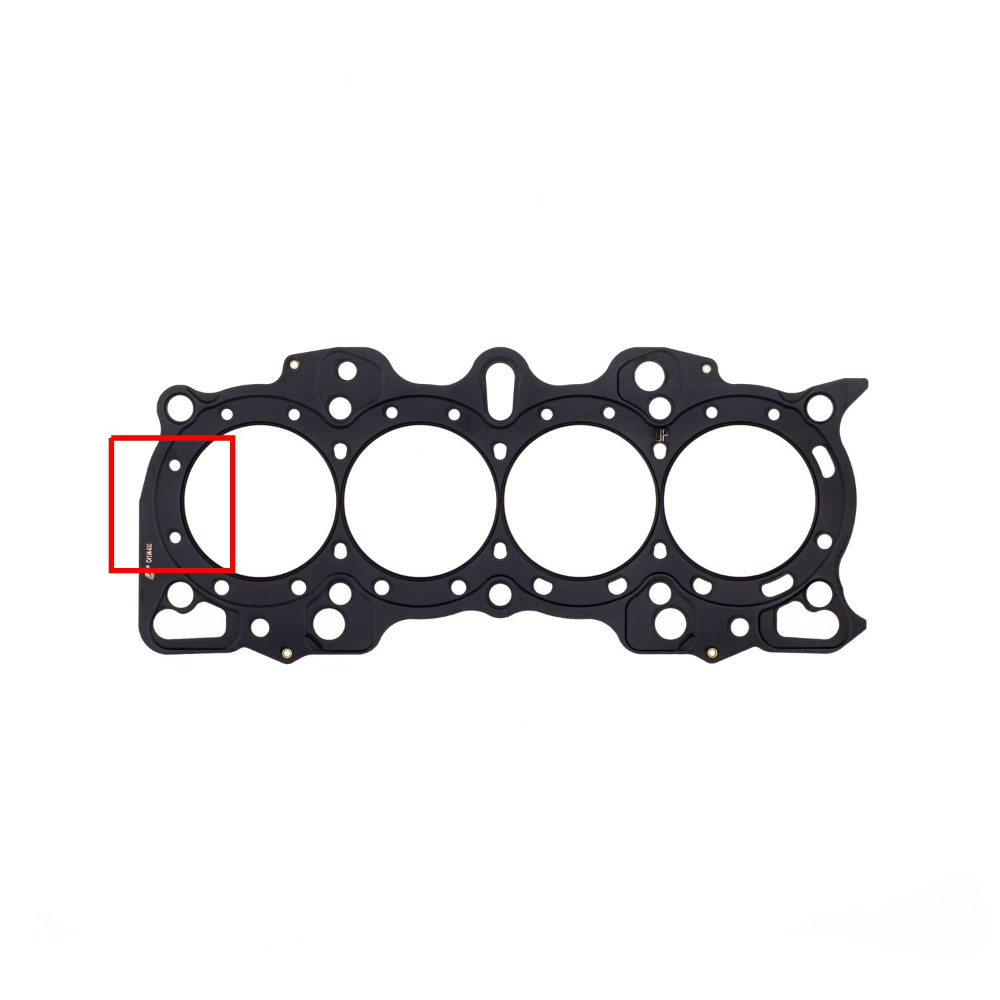

In order to hit my power goals of 200 - 225whp, the B20V I'm building will need some mods to get there. Originally my block was a high compression B20B that had [the better PHK pistons]() but the cylinders were out of round and had to be bored 0.5mm over (not to mention 1 piston was cracked) so I can't use the stock internals.

For the cylinder head I'll be using a GSR head. I initially settled on the GSR head over a B16 head because it was cheaper and I didn't think there'd be any major differences.

That was a little shortsighted as I later found out that GSR heads have different intake manifold bolt patterns so they are limited on IM options, and have smaller combustion chambers which make it harder to find pistons that'll achieve reasonable compression ratios. Neither of these issues were deal breakers though.

# Parts List

I'll go over the reasoning behind some of the parts picked below, but here's the list of everything I used.

- **Block**: B20B bored 0.5mm over (84.5mm bore)
- **Head**: 1999 GSR head
- **Cams**: Skunk2 Tuner 2s 305-05-0145
- **Cam gears**: Golden Eagle B series cam gears
- **Springs / retainers**: Skunk2 alpha spring / Ti retainers 344-05-1300
- **Distributor**: OBD1 GSR TD-68U
- **Head gasket**: Cometic 85mm .040" thick head gasket C4194-040
- **Head studs**: ARP 208-4303
- **VTEC Kit**: Golden Eagle VTEC Kit
- **Timing belt / water pump / tensioner**: Gates TCKWP247
- **Pistons**: Supertech 84.5mm bore pistons P4-H845-P1
- **Rods**: SCAT pro sport H-beam connecting rods 65394 (aka 2-5394-1771-935-827)
- **Main bearings**: ACL 5M1959H-STD
- **Rod bearings**: ACL 4B1946H-STD
- **Thrust washers**: ACL 1T1957-STD
- **Oil pump**: ACL OPHD1194HP
- **Intake manifold**: Skunk2 pro series 307-05-0270
- **Throttle body**: Blox 68mm tuner series
- **Timing belt covers**: 11820-P72-000, 11840-P72-010, 11832-P72-000
- **Power steering**: P73 upper bracket, LS bottom bracket, LS pump
- **Alternator**: B20 alternator brackets with B20 alternator
- **Thermostat housing**: OEM B20

I also had to order the following for seals, gaskets, and hardware:

- **Cam seals**: (2) Timken 1989
- **VTEC solenoid gasket**: Dorman 917-172
- **Valve cover gasket**: Fel-Pro VS50498R
- **Rear main seal**: Fel-Pro BS40430
- **Crank seal**: Fel-Pro TCS45904
- **Oil pan gasket**: Fel-Pro OS30630R
- **Water pump tube o-rings**: (2) OEM 91314-PH7-003
- **Valve cover nuts**: (4) m6x1.0 acorn nuts, (4) m6x1.0 hex nuts
- **Spark plugs**: (4) NGK BKR7E-11

## Cams

I focused on picking out the cams first because I figured the cams would influence other choices such as pistons, intake manifold / throttle body, and more. I knew I wanted to target 11.5:1 compression (it's a fairly high comp ratio but also about the reasonable limit to run on pump gas) so I explored cams that were spicier than the ITR / CTR cams but also not crazy wild.

Cams I considered:

- Skunk2 tuner 2s
- Skunk2 pro 1s
- Brian Crower stage 2 NAs
- Toda spec Bs

I didn't consider ITR cams because the prices for them have gone too high IMO. A used set on Ebay runs about $600 now and puts you into the same price range as aftermarket cams. If I had stayed stock internals I would have likely gone with them since they're known to clear the stock pistons.

Of the four aftermarket options listed above I ended up settling on the Skunk2 tuner 2s. I felt they were the best option due to price, availability, and that they've been proven to make good gains in similar builds while also maintaining a normal idle.

It was a tough choice deciding between the tuner 2s or the pro 1s but I settled on the tuner 2s because they were cheaper by about ~$200 and also didn't require as much head work to support them. I've also read the tuner 2s tend to be easier to tune since they use stock-ish non-VTEC lobes where-as the pro 1s can be hard to get a good idle with.

**Links**

- [206whp GSR](https://www.youtube.com/watch?v=tCPEw3lVUh0)
- [Skunk2 stage 2 vs pro 1s](https://honda-tech.com/forums/all-motor-naturally-aspirated-44/skunk2-stage-2-vs-skunk2-pro-1-a-2130357/)
- [Some help needed selection cams](https://honda-tech.com/forums/all-motor-naturally-aspirated-44/some-help-needed-selection-cams-2596836/#post39095399)

## Pistons

Even if the original pistons from my block had been re-usable I don't think I would have used them. There's nothing wrong with using the stock internals but for what I want out of the motor I felt like they would have been too limiting.

The main drawbacks to the stock internals are:

- The rod bolts are notorious for failing if revved beyond 8k RPM
- The non-VTEC pistons have bad valve clearance and will limit cam choices because the valve reliefs weren't designed for the larger VTEC valves

It's easy to address the rod bolt issue as you can have a machine shop install ARP rod bolts, but the valve clearance issue is trickier to fix unless you're not afraid to cut the valve reliefs larger by hand.

### Finding the Perfect Set of Pistons

Picking out pistons for the GSR head that could achieve my target compression ratio of 11.5:1 was trickier than I anticipated. The GSR head has the smallest combustion chambers (41.6cc) when compared to the B16 / Type R (42.7cc) and B18/B20 (45cc) heads which causes it to have a higher compression ratio.

For reference, a low comp B20B with P3F pistons has a compression ratio of 8.8:1 but when the stock B20 head is swapped for a GSR head the compression ratio bumps up to 9.54:1. Do the same for a high comp B20B with PHK pistons and you've gone from 9.6:1 to 10.5:1.

That free bump in CR is cool if you're doing a budget build or going high CR but it ruled out a lot of piston options for me.

I ended up comparing a lot of different pistons by putting their specs into the [Zeal Autoworks compression calculator](https://zealautowerks.com/bseries.html) to see what compression ratio I'd get until I finally narrowed my choices down to either the Wiseco K623M845s or Supertech P4-H845-P1s.

Of the two I settled on the Supertechs because they offered a slightly higher comp ratio 11.6:1 vs the Wiseco's at 11:1 and the price was a little better.

11.6:1 compression is slightly higher than I want but I can easily drop it down using a slightly thicker than stock head gasket.

## Rods

The Supertech pistons I chose have floating wrist pins which won't work with the OEM rods as OEM pistons have press fit wrist pins. This isn't a big deal since most aftermarket rods are designed for floating wrist pins, but it does add extra cost to the budget.

My power goals are on the low side for forged pistons and rods so I felt pretty comfortable going with any of the reputable brands. I was initially going to go with a set of Eagle CRS5394A3Ds but ended up going with a set of SCAT 2-5394-1771-935-827 rods as they were more budget friendly and had lots of solid reviews.

**Links**

- [scat rods?](https://honda-tech.com/forums/all-motor-naturally-aspirated-44/scat-rods-1398781/)
- [Scat rods? anyone running these or know anything about them?](https://honda-tech.com/forums/forced-induction-16/scat-rods-anyone-running-these-know-anytihng-about-them-2577011/)

## Head gasket

I went with the Cometic C4194-040 B20V head gasket because it's slightly thicker than the OEM gasket at .04" thick vs .036". The extra thickness helps drop my compression ratio from 11.6:1 to 11.44:1 which gets me about as close to my target goal as I can get.

If you're not in need of a custom thickness head gasket you can easily run an OEM head gasket but you should really consider using an aftermarket head gasket designed for a B20V. OEM head gaskets are missing two coolant holes for GSR heads and by running an OEM one you risk part of the head not getting enough coolant.

B20 OEM Fel-Pro:

Cometic B20V:

This probably doesn't matter for most daily drivers as there's an abundance of posts on the forums about running an OEM head gasket without an issue but it never hurts to play it safe.

**Links**

- [B20vtec head gasket help](https://honda-tech.com/forums/all-motor-naturally-aspirated-44/b20vtec-head-gasket-help-2910359/#post44876834)

## Head Studs

There was a lot of debate about what the correct head studs to use for a B20V so I ended up falling back to the OEM parts catalog to double check things. I found that while B series studs do vary in length depending on the engine (B181, B18B, B20, B16, etc...) it's due to the head and all the blocks are the same. This means you should buy the head stud kit that matches your head.

For a GSR head this would be ARP-208-4303, and for a B16 head it'd be ARP ARP 208-4306.

**OEM head bolt lengths**

- **GSR**: 164mm
  - Part #: 90006-P72-003
- **B16**: 155mm
  - Part #: 90006-PG6-003
- **B18/B20**: 158mm and 188mm (The center 2 head bolts are longer as the head is thicker in center)
  - 158mm part #:90006-PR4-A01
  - 188mm part #: 90005-PR4-A01

Other companies like [Skunk2](https://skunk2.com/engine/pro-head-studs-bvtec-kseries-661-05-0001.html) sell a universal head stud kit that works with any VTEC B-series engine so if I had to guess they probably make them to GSR spec and the extra length is fine on a B16. I wouldn't dare run a B16 head stud kit with a GSR head though.

## VTEC Kit

Non-vtec blocks are missing the oil passage that supplies the VTEC head with oil. This is an easy to solve problem though as there's multiple companies out there that sell conversion kits. I went with the [Golden Eagle kit](https://goldeneaglemfg.com/products/golden-eagle-vtec-full-conversion-kit) since I already bought rods from them.

## Timing Belt / Water Pump

Whichever water pump you decide to use will dictate which timing belt to use. VTEC water pumps have a larger pulley (22 teeth vs 19 teeth) so if you attempt to use a B20 timing belt with a VTEC water pump it'll be too small.

I'd recommend going with a VTEC kit though as the VTEC water pump perform better at higher RPM and the price difference between a VTEC and LS timing kit is negligible.

**Links**

- [What timing belt for a B20 with a B16 head](https://honda-tech.com/forums/tech-misc-15/what-timing-belt-b20-b16-head-1373589/)
- [Why VTEC water pump](https://honda-tech.com/forums/all-motor-naturally-aspirated-44/why-vtec-water-pump-1465034/#post19082642)

## VTEC Kit

There's two reasons why you need a VTEC conversion kit when building a B20V.

The first reason is because the head alignment dowels on VTEC heads are opposite of the LS head dowels. This means you either need to drill out the opposite side holes on the block to accept the dowels or use custom sized dowels (included in the VTEC kit).

The second reason is to provide the head with oil as VTEC blocks supply it through a port that the B20 block doesn't have so you need to run an external line.

One extra benefit to using the Golden Eagle kit is that the oil filter sandwich adapter they use to supply oil to the head has an additional port that can be used for an oil pressure sensor. I'm planning on adding an oil pressure gauge to the car this motor is going in so that was a nice plus for me.

## Oil Pump

Regarding oil pumps the OEM B20 oil pump is perfectly fine to use because the B20, OBD2 GSR, and Type-R all share the same oil pump. OEM part #: 15100-p72-a01

I only opted to replace my oil pump because my block had a bunch of metal bits in the bottom end and I was worried small debris may have made it past the oil pickup filter into the pump. OEM is always best but there's nothing wrong with an ACL oil pump too.

**Links**

- [Honda B Series Oil Pumps: Good, Better, Best](https://ipgparts.com/blogs/blog/honda-b-series-oil-pumps-good-better-best)

## Distributor

You can use any VTEC B series distributor. (GSR dizzy on a B16 head, or vice-versa) The man thing to focus on is matching it to your ECU so if you're running an OBD1 ECU you should get an OBD1 dizzy.

Used OEM distributors have gotten obnoxiously expensive though so if you do find a good price on an OEM dizzy that isn't the correct OBD for you car you should consider getting a conversion harness since they're cheap and OBD1 / OBD2 distributors only differ via the plugs.

If you need an OBD1 distributor try searching for the following:

- TD-68U (1994 - 1995 GSR)
- TD-44U (1994 - 1995 Del Sol Si VTEC)

If you need an OBD2 distributor try searching for the following:

- TD-84U (1996 - 2001 Integra Type R)
- TC-08A (1996 - 2001 Integra Type R)
- TD-84U (1996 - 2001 Integra GSR)

I went with an OBD1 GSR distributor since I'm putting the motor into an EG civic with a chipped P28 ECU.

**Links**

- [OEM distributor codes](https://honda-tech.com/forums/acura-integra-6/help-me-identify-dizzy-2569508/#post38551971)
- [OBD1 vs OBD2](https://honda-tech.com/forums/acura-integra-6/help-me-identify-dizzy-2569508/#post38551882)

## Intake Manifold

GSR heads have a different intake manifold bolt pattern so they don't have as many OEM options that will work with them. The OEM GSR intake has butterfly valves that get opened at higher RPM but unless you have a GSR ECU with the necessary electronics to control them you won't be able to utilize them and the IM won't live up to it's full potential.

Since I don't have a GSR ECU I opted to go with an aftermarket option and settled on the Skunk2 pro series intake because it's modeled after the Integra Type R intake. The ITR IM is known for optimizing low end power but since it won't bolt up to a GSR head I figured the pro series intake would be the next best choice.

**Links**

- [Skunk2 Intake vs. B18C Stock Intake](https://www.ek9.org/index.php?threads/skunk2-intake-vs-b18c-stock-intake.38067/)
- [Type R intake manifold vs SKUNK2](https://www.team-integra.net/threads/type-r-intake-manifold-vs-skunk2.31104/)

## Timing Belt Cover

If you don't want to leave your cam gears / timing belt exposed then you'll need to pick up both halves of the GSR upper timing belt covers. The B20, LS, and GSR all share the same lower timing belt cover so you can re-use the lower one off your B20 block.

Part #s:

- **GSR upper outer cover**: 11820-P72-000
- **GSR upper inner cover**: 11840-P72-010
- **GSR upper cover seal**: 11832-P72-000

The B20 and GSR use the same timing cover bolts so there's no need to buy new ones.

## Power Steering

I've found mixed info on how to retain power steering. Assuming you already have a B series power steering pump you should be able to use any lower power steering bracket (LS, GSR, B16, Type R) as they are all the same. The upper bracket is the tricky bit.

The safest option is to match the upper bracket to the head you're using but I've also read that the upper Type R bracket can be used on a GSR head even though the Type R bracket matches the B16 bracket. I've also seen companies selling generic billet ones that work on B16 / GSR / Type R heads so I wager they're probably all swappable.

Part #s:

- **GSR upper**: 56997-P72-000
- **B16 upper**: 56997-P30-010
- **Type R upper**: 56997-p73-000

**Links**

- [FAQ retaining power steering EK B series Swap](https://honda-tech.com/forums/honda-civic-del-sol-1992-2000-1/faq-retaining-power-steering-ek-b-series-swap-1822781/)
- [P73 upper power steering bracket](https://honda-tech.com/forums/honda-civic-del-sol-1992-2000-1/p73-upper-power-steering-bracket-3341740/)

## Alternator

You can use the stock B20 alternator without having to change anything.

## Thermostat Housing

The OEM B20 thermostat housing should work fine as long as you're not running an OEM GSR intake. If you are planning on running a GSR head with an OEM GSR intake then you'll need to swap the thermostat housing with a GSR one otherwise the intake manifold will hit the housing.

The B20 and LS share the same thermostat housing so either can be used.

## Seals, Gaskets, and More

It's not necessary for me to go into detail on all of the seals and gaskets needed since you match them to the head or block your using. Please refer to the parts list above for all of the ones I used.

## Fuel Injectors

I haven't settled on the injectors I plan on using yet but am currently exploring RDX or K series injectors. All I'm certain of so far is that I can't use the stock 240cc B20 injectors because they'll start the motor for fuel at higher RPM.

# Assembly Time

If you've made it this far it means you've got all the parts needed to start assembling the new engine.

(Part 3 in the works!)

# Additional Resources

- [How to build a "reliable" lsvtec/b20vtec](https://honda-tech.com/forums/all-motor-naturally-aspirated-44/how-build-%22reliable%22-lsvtec-b20vtec-1676914/)
