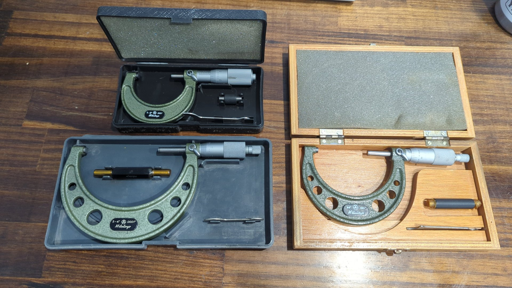

Measuring bearing clearances isn't what I'd call the most exciting step when it comes to building an engine but it's an important one that can catch issues that will dramatically shorten your engine's life. Simply put, bearing clearance is how much space exists between your crank journals and the main / rod bearings.

Bearing clearance is important because too little clearance will result in not enough oil lubricating the bearings and that'll lead to premature engine failure such as spinning a bearing. On the flip side too much clearance can cause poor oil pressure, or worse issues like rod knock.

Engine manufacturer's like Honda provide optimal clearance ranges (usually one for mains, one for rods) for each engine they make and when building a stock spec engine the goal would be to try and get the bearing clearances within those oem ranges. Given the B20V is a frankenstein of different motors slapped together and this one will be ran hard I'll be deviating by going slightly looser on my bearings.

Before we get into setting clearances it's important to know how to measure them.

## Measuring Clearances

The two main techniques for measuring bearing clearances are with plastigage or using a set of micrometers and a dial bore gauge. Plastigage is the more budget friendly option and it does work good but it's also less precise.

When I first started building this motor I had planned on using plastigage but I recently learned you can buy used name brand micrometers for reasonable prices and decided to go that route.

For micrometers and a dial bore gauge you'll need:

- 1-2" micrometer (crank rod journals, and rod big ends)
- 2-3" micrometer (crank main journals, and main caps)
- 3-4" micrometer (pistons and cylinder walls. More on this later)
- A ~1.5"-4" dial bore gauge\*\*

\*\*Dial bore gauge ranges aren't as standardized as micrometers so try to find something that can do 1.7" - 4" at a minimum. I saw a lot of dial bore gauges that would do 2" - 4" or 2" - 6" but for the B20 you need to be able to measure sub 2" measurements (crank rod journals) so those won't work.

Some good brands to look into are [Mitutoyo, or Starrett as they are basically the gold standard](https://www.garagejournal.com/forum/threads/quality-micrometer-brands.516436/). You can go cheaper on the dial bore gauge since you'll be zeroing it out with the micrometer but don't go too cheap.

When buying used micrometers try to find ones that come with the parts necessary to calibrate it so you can ensure you're measurements are accurate.

Here's what I bought:

Top left is a 1-2" Mitutoyo 103-136, bottom right is a 2-3" Mitutoyo 103-217, and bottom left is a 3-4" Mitutoyo 103-218. I paid $200 for these in total.

The dial bore gauge set is a 1.4" - 6" Fowler 72-646-400 that I bought for $170.

### Learning How to Use Them

There's a lot of great tutorials out there on how to use micrometers and dial bore gauges. I particularly liked the following:

- [How To Read A Micrometer](https://solutions.travers.com/metalworking-machining/measuring-inspection/how-to-read-a-micrometer)
- [How to measure rod bearing oil clearance for ANY engine. Pontiac short block re-build, Part 3](https://www.youtube.com/watch?v=q0-2ULbc7qw&t=1s)
- [BEARING CLEARANCE - How to MEASURE and PREVENT engine damage](https://www.youtube.com/watch?v=WEuedVJJgIA)

## Measuring The Main Bearings

The OEM Honda B20 main bearing clearance specs are as follows:

| Main | Clearance       |
| ---- | --------------- |
| 1    | .0009" - .0017" |
| 2    | .0009" - .0017" |
| 3    | .0012" - .0019" |
| 4    | .0009" - .0017" |
| 5    | .0009" - .0017" |

**Source**: 1997 - 2000 Honda CRV factory service manual page 2-3

But for my build [I plan on targeting .0018" - .0020" for the mains](https://honda-tech.com/forums/forced-induction-16/bearing-clearance-choice-measurement-discussion-3129922/#post48543553). This is slightly looser than what the factory recommends but the engine will see plenty of high RPM and also be pushing above stock power so I want them on the looser side.

With the main bearings installed in the block ([I'm using a set of ACL 5M1959H-STD main bearings](https://www.aclperformance.com.au/details/5M1959H)) and torqued down to spec I obtained the following measurements:
| Main | Main Cap Diameter | Crank Journal Diameter | Bearing Clearance |
|------|------------------|-------------------|-|
| 1 | 2.1667 | 2.1649" | .0018" |
| 2 | 2.1668 | 2.1648" | .0019" |
| 3 | 2.1663 | 2.1645" | .0018" |
| 4 | 2.1666 | 2.1648" | .0018" |
| 5 | 2.1664 | 2.1648" | .0016" |

Overall I think that's just about perfect. I kinda wish main 5 was a little looser to match the other journals better but at the same time it may not be a bad thing to have main 5 a little tight. It's the furthest from the oil pump so maybe that'll help keep oil pressure high back there.

## Measuring the Rod Bearings

For rod clearances the OEM B20 specs are .0008" - .0015" but I want somewhere around .0020". This is still in spec for the GSR (B18C1) as Honda allows .0013" - .0020" (page 3-5 of the 94-01 Integra FSM) so that feels perfectly reasonable.

Just like the main bearings I'll be running ACL race bearings. Initially I had purchased a set of [ACL 4B1946H-STD](https://www.aclperformance.com.au/details/4B1946H) but ended up having to order a second set of [ACL 4B1946HX-STD](https://www.aclperformance.com.au/details/4B1946HX) bearings afterwards because my clearances were too tight. I suspect this was because of my aftermarket rods.

Bearing clearances with the H series bearings:
| Rod | Rod End Diameter | Crank Journal Diameter | Bearing Clearance |
| --- | ---------------- | ---------------------- | ----------------- |
| 1 | 1.77245 | 1.7712" | .00125" |
| 2 | 1.7725 | 1.7710" | .0015" |
| 3 | 1.77245 | 1.7712" | .00125" |
| 4 | 1.77245 | 1.7712" | .00125" |

A little too tight, especially rod 3 and 4. Once I swapped one H half with a HX half I was able to increase my clearances to:
| Rod | Rod End Diameter | Crank Journal Diameter | Bearing Clearance |
| --- | ---------------- | ---------------------- | ----------------- |
| 1 | 1.7 | 1.7712" | .00" |
| 2 | 1.7 | 1.7710" | .00" |
| 3 | 1.7 | 1.7712" | .00" |
| 4 | 1.7 | 1.7712" | .00" |

TODO: FINISH TABLE!

Which is much better.

## Thrust Washers

There's not much to mention for the thrust washers since they prevent the crank from walking and there's no reason not to use the OEM range.

The GSR and CRV allow similar amounts of crank end play (lol) with the GSR allowing up to .0008" and the CRV allowing up to .001".

[Be sure to give this a quick check to make sure your motor is all good](https://www.k1technologies.com/k1-blog/how-to-check-crankshaft-end-play/) and also double check that you don't install your thrust washers backwards.

TODO: Mention cheap dial indicator I bought and what my specs were.

## Summary

All in all I think these bearing clearances look great. Now that OEM bearings have gotten hard to source with various colors being discontinued it can be harder to really dial in your clearances but it's definitely still doable.

The next part will be over P2W clearance and ring gaps. Stay tuned!
