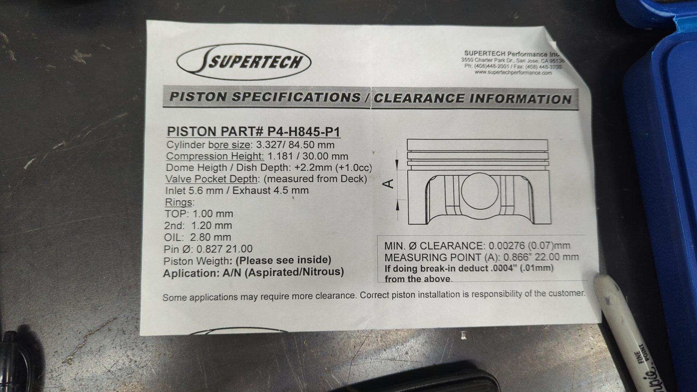

With the bearing clearances dialed in, all that's left to prep for installing the crank, pistons, and rods in the block is double checking the piston to wall clearance and setting the ring gaps.

## Piston To Wall Clearance

Piston to wall clearance (aka p2w) is how much space there is between the piston and cylinder wall. P2W is important because too little clearance and your pistons could contact the cylinder wall when the engine is running which will ruin the cylinders, and too much clearance can result in piston slap when the engine is first started up that can lead to premature wear.

Setting piston to wall clearance is difficult because the only way to change it is typically via machining and you need to have your pistons picked out before you can even measure it.

But before buying your pistons you should either have a machine shop check the cylinders to ensure they are within the service range and are still in round, [or check them yourself using a 3 - 4" micrometer and a dial bore gauge](https://www.youtube.com/watch?v=VXiN1lNZ7TY). If your cylinders are out of round or beyond the factory allowed service range you'll need to have them bored out otherwise you'll never be able to properly set p2w.

For a B20, the standard cylinder range is 84mm - 84.02mm (3.307" - 3.308") with a service limit of 84.07mm (3.310"). Source: 97-00 Honda CRV factory service manual page 2-3

## The Ideal P2W Depends On Your Build

There's a few factors to keep in mind when figuring out what your ideal pw2 will be. Things like:

- Block material
- Piston type (ie cast or forged)
- Piston material (what alloy)
- Target power level

But the best place to start would be the spec sheet for your pistons (assuming your not running OEM).

For my pistons the manufacturer recommends a minimum p2w of .00276" and from measuring my cylinders the machine shop I used targeted .0035" which gives me a bit of a nice safety margin. (I didn't explicitly request a p2w clearance when they had the block)

Good reads:

- [Forged pistons Vs. Cast pistons](https://honda-tech.com/forums/all-motor-naturally-aspirated-44/forged-pistons-vs-cast-pistons-2721867/)
- [Piston to Wall Clearance on Wiseco pistons](https://honda-tech.com/forums/forced-induction-16/piston-wall-clearance-wiseco-pistons-1135995/)
- [How much Piston to Wall Clearance for 600-700whp](https://honda-tech.com/forums/forced-induction-16/how-much-piston-wall-clearance-600-700whp-823346/#post10814282)
- [wiseco 84.5mm b20 piston clearance??](https://honda-tech.com/forums/all-motor-naturally-aspirated-44/wiseco-84-5mm-b20-piston-clearence-1860425/#post25798485)

## How to Measure P2W

Measuring piston to wall clearance is pretty similar to measuring bearing clearances. You'll need a 3 - 4" micrometer and a dial bore gauge.

There's lot of good videos out there like [this one](https://www.youtube.com/watch?v=oBmrGro0MhM).

Just be careful and make sure you measure your pistons in the correct spot. The spec sheet should explain where to measure from.

My measurements were as follows:
| Position | Piston Diameter | P2W |
| - | - | - |
| 1 | 3.32375" | .003275" |
| 2 | 3.32350" | .003525" |
| 3 | 3.32325" | .003775" |
| 4 | 3.32325" | .003771" |

## Piston Ring Gaps

Piston ring gap is how far apart each end of the piston ring are from each other where they meet. It's important to have just enough ring gap to prevent the ring ends from touching because when that happens the ring will warp and no longer hold compression.

On the other hand too much ring gap will negatively impact cylinder compression but to be fair you have to run a lot of gap before it becomes non-negligible.

Each piston has 3 rings. The top one is responsible for compression, the 2nd ring is responsible for helping with some compression but it's main focus is removing oil from the cylinder walls, and lastly the oil ring on the bottom focus on lubricating the cylinder walls.

The top and 2nd ring gaps are the most important ones to get right.

## Optimal Ring Gaps

Just like bearing clearance, and p2w, the ideal range for ring gaps depends on your application.

For an OEM B20 Honda recommends:

- .008" - .012" for the top ring
- .016" - .024" for the 2nd ring
- .008" - .020" for the oil ring

Source: 97-00 Honda CRV factory service manual page 2-3

Those gaps are a little tight for a custom motor though. Instead I opted to follow Supertech's guidelines for ring gap based on motor usage.

Their approach is to multiply the cylinder bore in inches by a factor and that'll dictate your top ring gap.

| Application               | Factor |
| ------------------------- | ------ |
| Street Performance        | .0045  |
| Moderate Turbo            | .0050  |
| Drag / Oval               | .0055  |
| Turbo / Nitrous Race only | .0065  |

Then you take the top ring gap and multiply it by 1.25 to determine the 2nd ring gap. (You want your 2nd ring to be larger than the first to prevent ring flutter)

My motor is going to see a lot of autocross and some track days so to play it safe I'll go with the turbo factor instead of street performance. For my 84.5mm (3.3267") this would put my ring gaps at:

- Top: .0166" (3.3267 \* .0050)
- 2nd: .020" (.0166 \* 1.25)
- Oil rings: 0.15" (Min recommended value that doesn't change)

Since I don't have a .0166" feeler gauge I'll round up my top ring gap to .017".

## Setting Ring Gaps

In order to set ring gap you'll need some tools.

- A piston ring filer ([Good budget option](https://www.summitracing.com/parts/pro-66785))
- A set of feeler gauges. Straight ones work best for this ([Harbor Freight](https://www.harborfreight.com/feeler-gauge-32-piece-63665.html))
- (Optional) A piston ring squaring tool ([I designed a simple 3d printed one](https://www.printables.com/model/1447489-honda-b20-845mm-piston-squaring-tool))

The piston ring squaring tool is optional because it's perfectly acceptable to push the ring down into the cylinder using the piston. I just wanted to try something a little more precise.

[Once you've got all the tools it's just a game of inserting the ring into the cylinder, checking the gap, and filing more as needed until gaps are good](https://www.youtube.com/watch?v=Io5PFReqvYw)

Some misc tips I found helpful:

- Only file the ring on one side. I used the side with the up marking to make it easy to keep track of
- Aim for a slightly undersized gap at first then slow down as you get closer to your target. This helps prevent over shooting the gap.
- The second ring will file much faster than the top ring

## My Actual Ring Gaps Were Larger Than Planned

I took my time and was able to get my ring gaps sorted out in about 1 hour of filing. I was able to dial in my top ring gaps without issue but both the 2nd ring and oil rings ended up having larger gaps than I had planned for. This wasn't because I made a mistake, but instead just how the rings came from the manufacturer (NPR).

| Cylinder | Top Ring | 2nd Ring | Oil Ring A | Oil Ring B |
| -------- | -------- | -------- | ---------- | ---------- |
| 1        | .017"    | .025"    | .018"      | .018"      |
| 2        | .017"    | .025"    | .028"      | .025"      |
| 3        | .017"    | .025"    | .019"      | .019"      |
| 4        | .017"    | .025"    | .017"      | .017"      |

.025" may sound like a large gap for the 2nd ring but I'm not worried about it. I ran into a similar issue when I rebuilt my other B20 and have had zero problems with blow by or oil consumption so I'm confident this will be fine.
