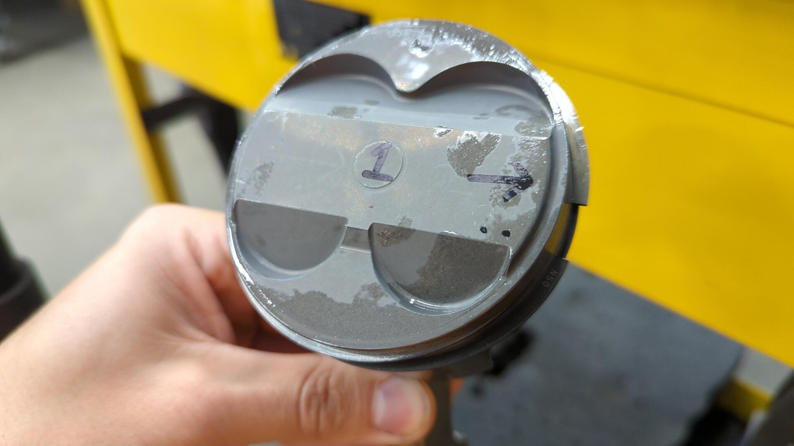

Enough measuring for now, it's time to do some assembly and get the pistons and rods installed in the block. Overall this shouldn't be too difficult of a step but it's one you need to be careful with.

There's a lot of easy to make small mistakes that can lead to trouble during assembly. Small things like mixing up a piston and installing it in the wrong cylinder causing your P2W to be off, or forgetting to torque a rod bolt.

- TODO: Installing the rods
  - Explain the difference between press pin and free floating
  - Link to video on how to install clips
  - Ensure pistons are oriented so intake valves are on the opposite side of the bearing tang
    - Not every aftermarket piston has an arrow pointing to the crank pulley like the OEM ones so this is next best
    - Intake valves are the larger valve

- TODO: Installing the rings
  - Add diagram of side profiles from FSM
  - Explain that you can tell the top of the ring by a marking (show image 4)
  - This only applies to top and 2nd ring. Oil rings don't really have an up / down

- TODO: Install pistons / rods in block
  - Mention tools needed
    - Expensive ones are super nice but cheap ones can be good enough for a hobbyist
    - Install piston 1 / 4 or 2 / 3 first then rotate crank and do other two
    - Ensure crank can freely spin after each rod is installed to ensure no binding
    - Make sure your pistons are oriented correctly. This means intake valves on backside of motor and bearing tangs on front
    - Don't forget thread lubricant if required

- TODO: Checking rod play and crank play
  - Crank play requires a dial indicator to check
  - Mention allowance
  - Mention what I got (.004")
  - Rod play requires a set of feeler gauges. Can be cheapos
  - Mention my results (rod 1: .011", rod 2: .012", rod 3: .012", rod 4: .012")

- TODO: Finishing it up
  - Install baffle
  - Install oil pump pickup
    - Make sure it's clean inside
    - Don't forget the pickup tube gasket
  - Install oil pan

