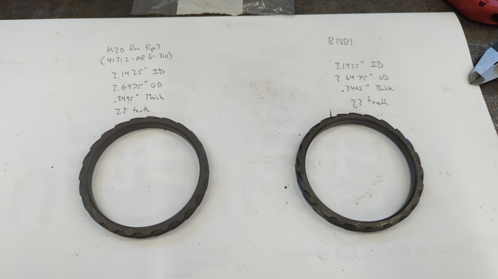
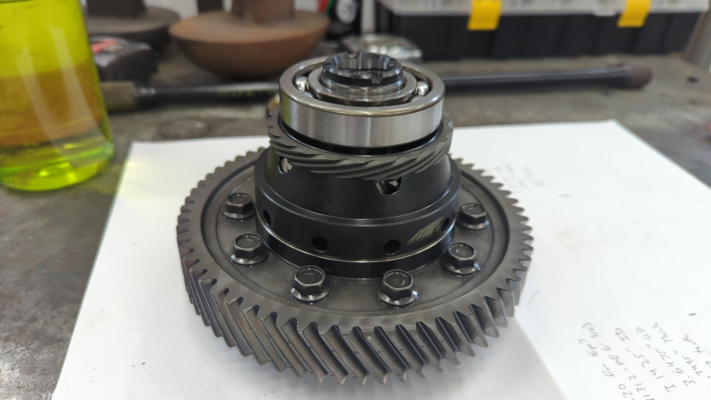
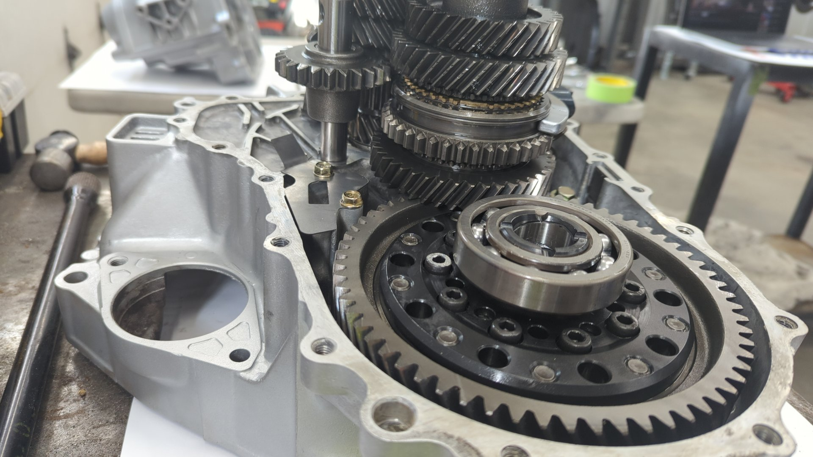

While installing an M-Factory LSD into my B18B1 (LS) transmission I made the dreaded mistake of damaging several teeth on the speedometer gear ring that sits on the differential.

It's a super common mistake to make as the gear is fragile and it has to be pulled off the original differential and pressed onto the new LSD because nearly every aftermarket differential out there doesn't include it.

What's worse though is Honda never sold the VSS gear ring separately and in order to get a replacement for a B series transmission you had to order the complete differential. While super expensive at somewhere north of $600, it's not even an option anymore as the differentials have long been discontinued.

If your lucky you can find an Integra to pull the differential from at a local junkyard but given how old these golden era Honda's are now there's not many left in the junkyards.

# K Series to the Rescue

The situation isn't as bad as it sounds though, as it turns out K series differential speedometer gears will fit!

I stumbled across this after breaking my ring gear because I spent several hours looking at other series transmissions to see if any parts were compatible trying to figure out some alternatives.

I never found anyone that could confirm fitment, but I did see some wild stories such as [B series differentials working in K series transmissions](https://www.k20a.org/threads/b-series-lsd-into-k-tranny.74320/) and also noticed they shared some parts such as the differential bearings.

Willing to take a gamble I decided to order a new VSS gear ring for a 2002 - 2003 Civic EP3. Part Number: 41312-PE6-310

And as it would turn out, it's a perfect match for the B series differential speedometer gear. It even has the exact same number of teeth (23) and the same dimensions!

K-series ring on left, damaged B-series ring on right.

Best of all Honda still sells them for roughly $70 bucks each.
https://www.hondapartsnow.com/genuine/honda~gear~speedometer~drive~41312-pe6-310.html

## Not all K Series Speedometer Gear Rings are the Same

Be careful if you order a K-series speedometer gear ring to use in your B-series trans as depending on the model it will mostly likely have a different number of teeth.

The 2002 - 2003 Civic EP3 Speedometer ring is the **only** other K-series speedometer gear with 23 teeth.

[The RSX has 26 teeth on the gear ring, and the CRV has 29 teeth](https://www.k20a.org/threads/vss-for-jdm-type-r-speed-gear-on-differential.54342/#post-3279538)

So unless you want to mess with your speedometer due to a mismatched gear ratio I'd recommend sticking with the EP3.

# Install Pictures

The new EP3 ring pressed on nicely to the M-Factory LSD.

All buttoned up.

# TLDR

Order a 2002 - 2003 Civic EP3 Speedometer gear ring (part number: 41312-PE6-310) as it's a perfect fit with the same number of teeth\*\* as a B-series speedometer ring gear.

\*\*I've only confirmed the number of teeth on a B18B1 hydro trans speedometer gear. Please double check yours if using a different model transmission.
