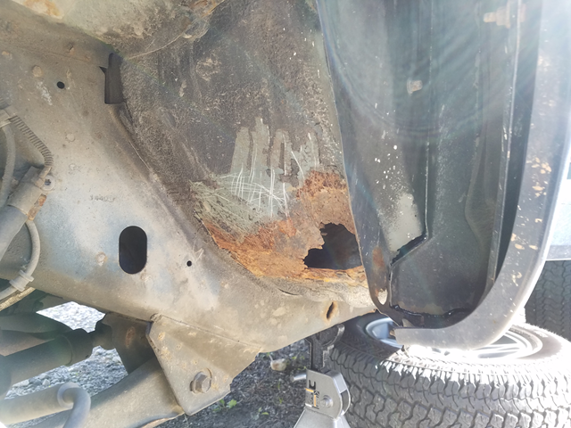
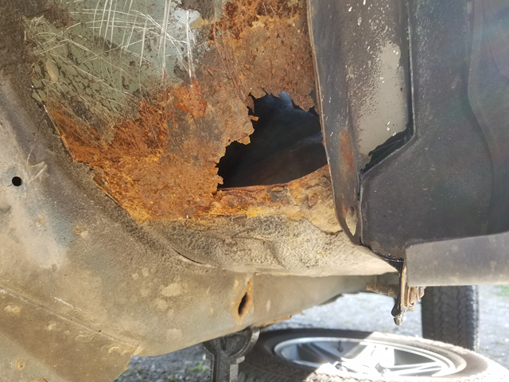
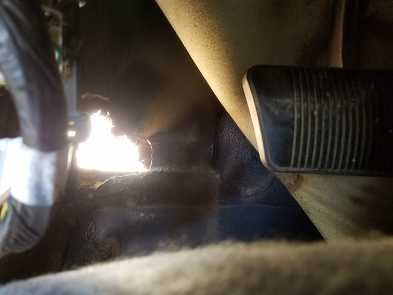
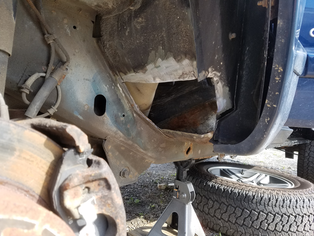
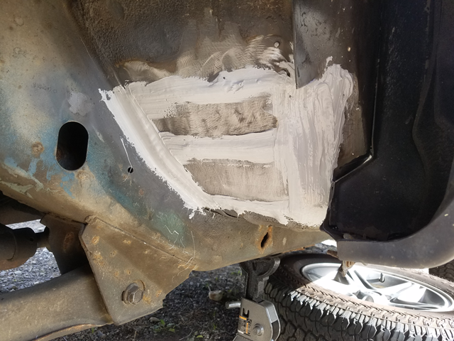
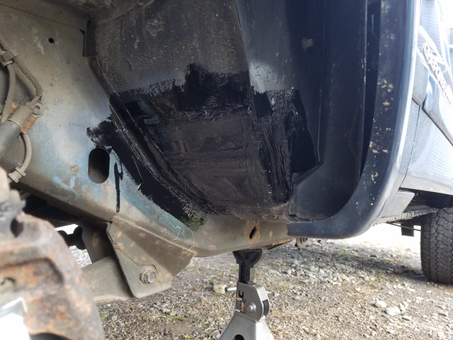

# Patching Holes

This post is a continuation of the mini series about restoring my old XJ cherokee. In the previous post I talked about [cutting out and welding in a new rocker panel]( ).

Initially the plan for this weekend was to finish welding in the new driver side rocker panel. However, I managed to screw up trimming it to fit and had to order another replacement which wont be in for about a week. To help keep progress moving I decided to finally tackle the "little" rust hole I spotted in the driver wheel well.

I first noticed this hole when I removed the inner fender liner to replace my dead wiper fluid pumps. I really didn't expect it to be so large, as just the previous summer I had pulled the carpet and cleaned up the inner floor pan and didn't spot any rust that was too horrible.

This is directly after pulling back the carpet and seeing how much metal I could break off by hand. The hole ended up being quite a bit larger than I was expecting, but it wasn't the end of the world.

It looks as if the rust started in the body seam below it. On the inside there was a lot of seam sealer covering it. Perhaps some water managed to work it's way under the seam sealer and rusted out the metal over the years.

Like a diseased limb, there's only one way to prevent rust from spreading and that's by chopping it off. A 4" disc on the grinder made quick work of the thin metal. The only thing that I had to be careful about was the interior wire harness which was only inches away from the hole.

I didn't realize it at the time but the metal I bought was too thick and a total pain to work with. The patch ended up looking not so great, but it's water proof and solid metal.

The light gray stuff is SEM seam sealer. It's the same stuff that I used on my passenger rocker panel, and it dries in just 10 minutes which is hard to beat!

To finish it off I threw some POR15 over it. I don't really care about the finish since this is going to be hidden behind the plastic fender liner. If I had to do it again (which I do on the passenger side), I would use slightly thinner metal so I could at least work the patch into a more presentable shape before welding it in.
