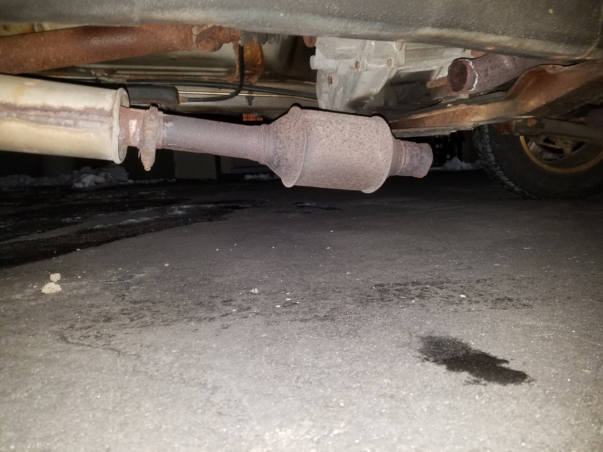

I've honestly been very lucky with my Jeep. My previous daily driver was a 2009 Subaru Legacy, and while it may have been excellent in the snow it had a very high cost of ownership. I figured out that it was costing me on average \$100 in maintenance per 1000 miles travelled. It may sound silly to have sold the Subaru and bought a Jeep that was 9 years older but I have zero regrets doing so. The Jeep has never left me stranded, and never surprised me with an issues until recently.

About a month ago now, when I was driving home from work and cruising down the highway I noticed a low rumble sound had developed, it was slowly growing in volume as well. At first I thought maybe I got a flat tire but it continued to get louder and louder.

I decided to let off the gas and prepare to pull over but suddenly the sound went away. That's when I realized my exhaust had blown a leak. I was actually pretty relieved to figure this out since I knew it would be safe to keep driving. Sure, it was quite loud but nothing I couldn't live with until the weekend.

When I finally made it home however, I took a peek underneath and this is what I found. Great.

The pipe coming down from the top right is the exhaust pipe that connects the exhaust headers to the rest of the system. The piping hanging down from the left was the remainder of said exhaust system. The large chamber in the center of the image is the catalytic converter...

At this point I had no choice but to fix it ASAP. I'm grateful my boss was understanding and allowed me to take a sick day the next day to attend to it. An exhaust leak is one thing, but having a large section of the exhaust hanging on only by a single exhaust hanger wasn't something I wanted to travel down the highway with.

A small adapter piece, and a couple zaps from the mig welder later I managed to reunite the two pieces of my exhaust. It may not be the prettiest but the price was hard to beat, and it meant I could continue driving it.

Jumping forward to present day I decided to splurge a bit and buy a new front bumper for the Jeep. I decided on buying an EAG bumper as the price was reasonable and it included fog lights.

Quality wise I'd say it's pretty good. Some of the paint was scuffed down to bare metal from shipping, but other than that no major complaints.

Installing the push bar took some time as it required 16 bolts to be tightened down. In order to install 6 of the bolts you have to remove the fog lights since they're literally where you need your hand to be to tighten the nuts.

Hooking up the fog lights wasn't too difficult either. My Cherokee used to have factory fog lights so each side already had all of the wiring in place. I decided on soldering the connections together and heat shrinking them instead of using crimp connectors.

The included LED lights are fairly cheap quality however. They are nice and bright but they don't have the best cut-off and I fear this may be causing some discomfort for other drivers. I'm sure their not blinding others as their fairly low in height but I do plan on replacing them with proper lights later on.

