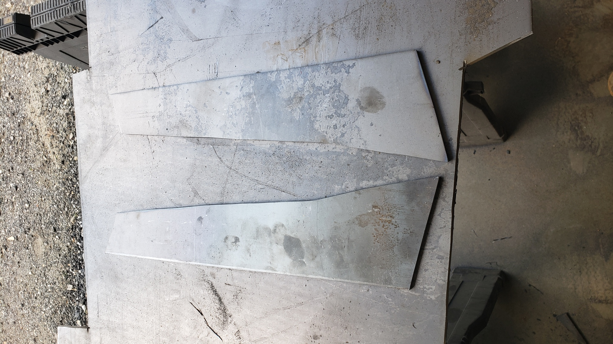
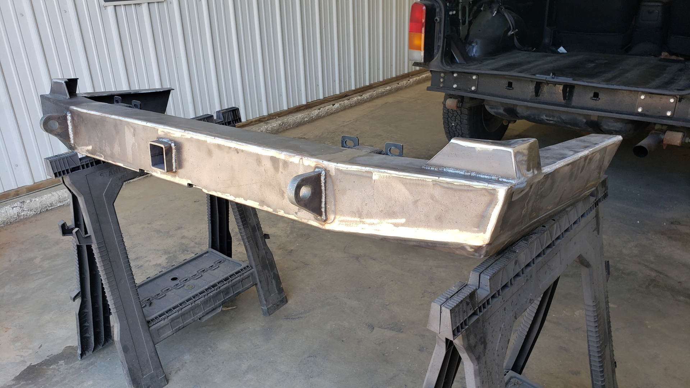
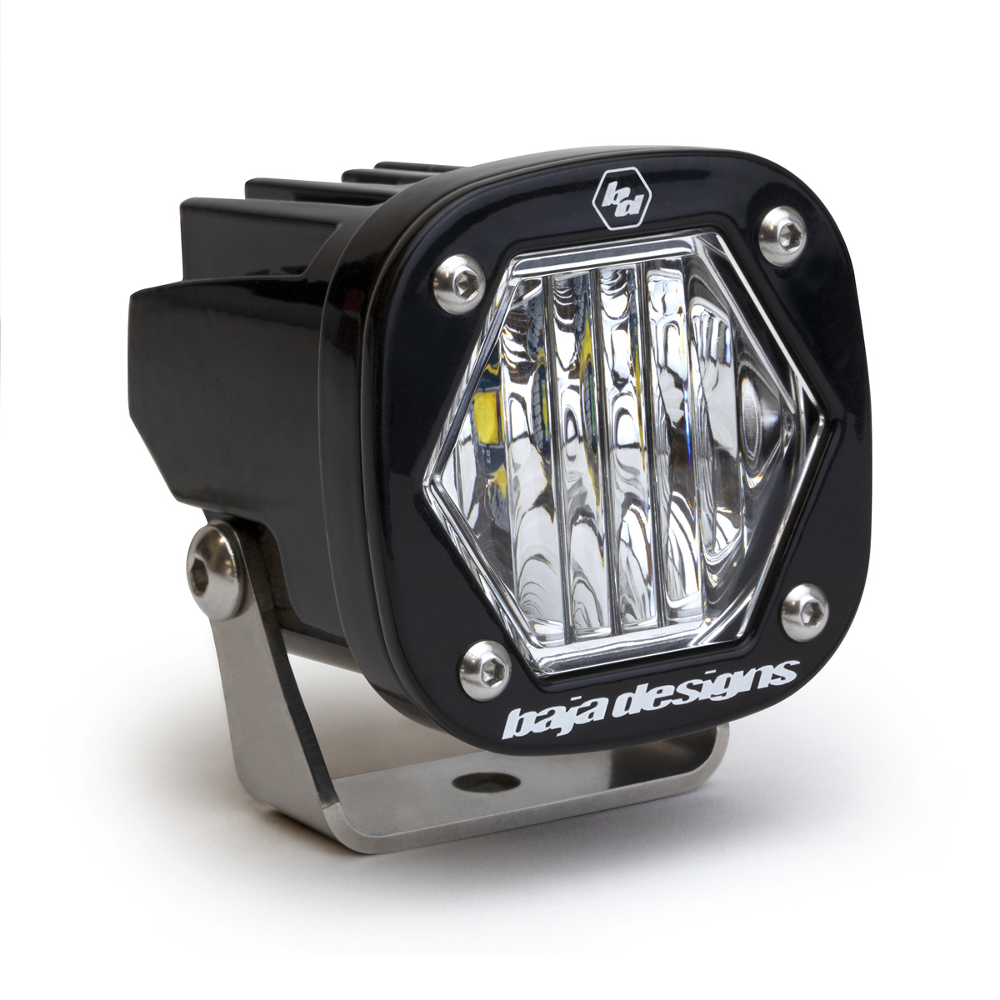
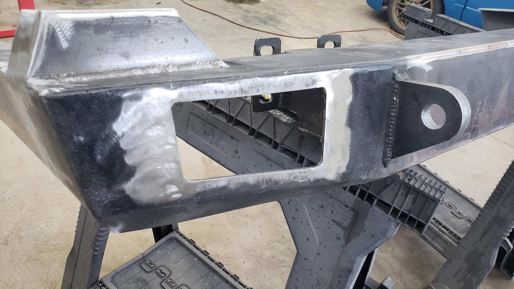
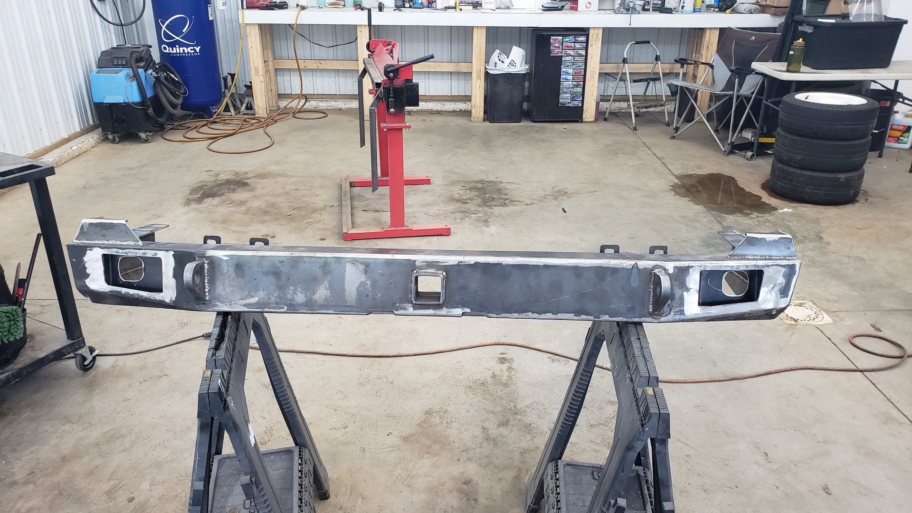
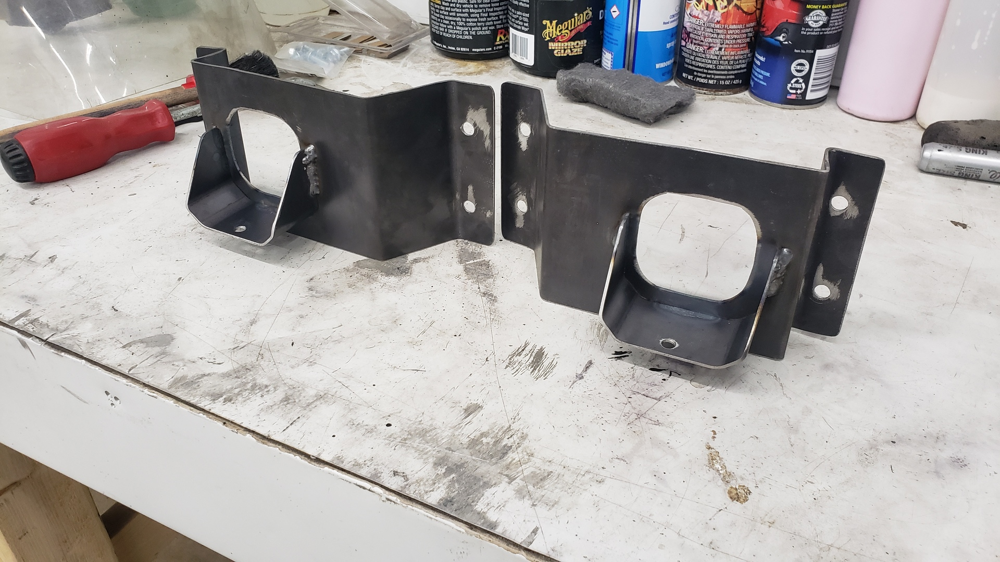
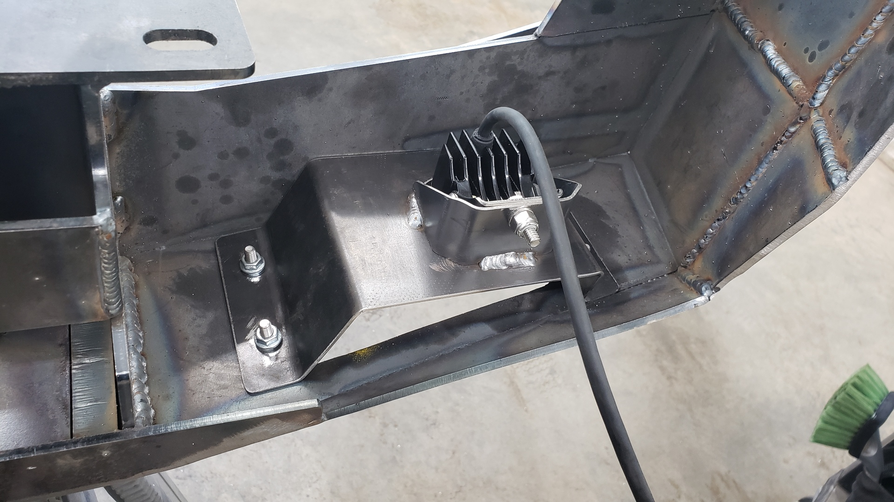
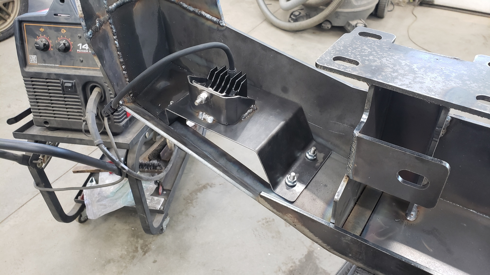
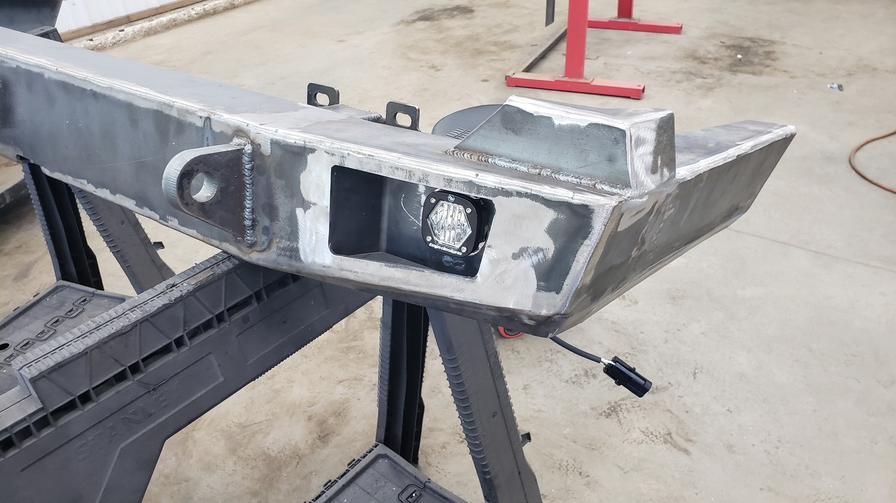
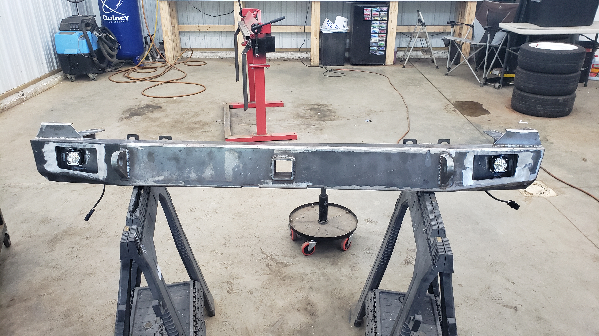

I've been driving my Jeep around for almost 6 months now with no rear bumper. I know, I know, not the safest choice but I don't drive far. Why? Because 6 months ago I wrapped up an **extensive** rust repair project on my XJ where [I cut out and replaced the entire/images/thumbnail.jpg" rear floor along with the unibody frame rails and crossmember.]().

In order for me to perform those rust repairs I needed to remove the rear bumper to get at everything behind it. Unfortunately, the bumper had rusted itself into place over the course of 20 years and wasn't keen to the idea of moving. As I was already planning on upgrading the rear bumper to an aftermarket steel one,I opted to remove the bumper via force.

My plan was that right after finishing up the crazy rust repairs I would jam out the rear bumper in a weekend. But by the time I finished up my repairs and got the Jeep back on the road I was so burnt out from working 40+ hours a week (not exaggerating) I needed to take a break.

Which brings us to the past month or so when I finally felt motivated to start the new bumper.

# Starting With a DIY Kit

Since I don't happen to have a CNC plasma cutter laying around (yet) I opted to buy a DIY rear bumper kit off Ebay. The kit itself was extremely reasonably priced and appears to be a knock off JCR.

I was a little too excited to remember to take pictures before starting to bend / weld things up.

Funny enough, the listing I purchased the kit from didn't have any pictures of the bumper assembled, nor did it come with any instructions. I had to watch a Youtube video tutorial.

The kit itself is actually really high quality. The cuts are clean and crisp, and everything fitted together nicely.

The only thing I didn't like was the little spacers that mount below the taillight. They didn't seem to be quite tall enough to fill the space as they left just a bit too much gap below the taillight for my liking. Because of that, I decided to make my own taller ones later on.

# Extending it Into a Cut n Fold Bumper

Since my Jeep is missing the lower portions of it's quarter panels due to them being cut n folded, I wanted to extend the edges of the bumper to help it flow into Jeep's body better.

I used some 3/16 steel I had laying around.

All of my cuts are made with an angle grinder. The best trick I've learned is to go slow and really take your time. If you rush, you're more likely to go crooked and you'll burn up your cutting discs much faster.

The cuts aren't 100% perfect but you can't tell from 5 feet away.

I've mounted and unmounted this bumper so many times now.

# Finishing the Taillight Spacers

The last parts I welded on were the new and slightly taller taillight spacers I made.

# Auxillary Reverse Lights

Something I've always wanted to install ony my Jeep was brighter reverse lights. I figured now would be the perfect time to integrate them with the bumper that way I wouldn't have to repaint anything later on.

I opted to go with Baja Design S1 lights with wide/cornering lenses. The cool thing about these lights is that you can swap the lens and their built to last. I think both lights combined cost more than the diy bumper kit so interpret that how you will.

I didn't want to mount the lights externally to the bumper because I was worried they'd be easy to damage. Not that I've ever really wheeled the Jeep, but who knows when the next rogue shopping cart will strike.

I also wanted to try to give the bumper some depth

Using a paper stencil of a shape that I thought looked cool, along with my trusty angle grinder, die grinder, and a file I was able to come up with this.

The cuts aren't 100% perfect, but the bumper itself will be bedlined and I estimate that should just about hide all the imperfections.

Using my metal brake, I bent up some 16ga steel I had laying around to make some inserts for the holes.

## Impromptu Studs

I was hesistant to weld in the light inserts I bent up in case I ever needed to switch to different lights that would require modifications to fit.

I figured the next best bet would be to drill and tap 4 holes so I could run bolts through them to create mounting studs.

The bolts are stainless M6x1.00x20mm.

I countersunk the holes because I wanted to cut off the bolt heads and weld them flush. By countersinking the holes I was able to ensure the weld got good penetration deep down into the bumper.

These inserts also allow us to install our lights at a straigher angle so they line up with the direction the rear of the xj is facing.

To make the holes that the lights would sit through I first drilled them out with a large drill bit several times then filed them into shape.

I purposely offset the lights to help make the inserts look larger

The gap between the bottom of the inserts and the bumper serves a purpose. It's there so debris (salt, dirt, etc) can't get trapped in the light area and cause the bumper to rust.

To mount the lights to the inserts I needed to make 2 little brackets.

The secret trick to making brackets look fancy is to very slightly round the edges.

Mounting them like this lets us align the light horizontally, and vertically.

