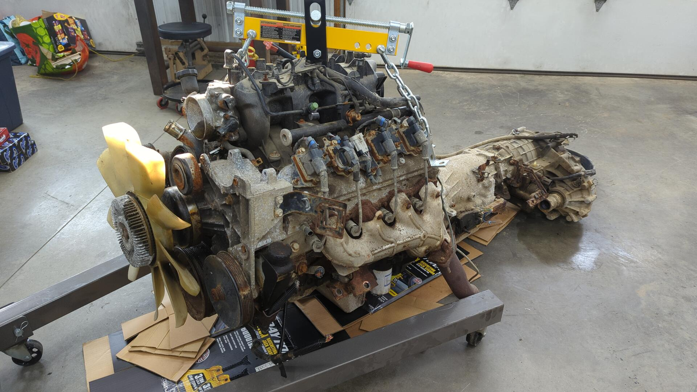
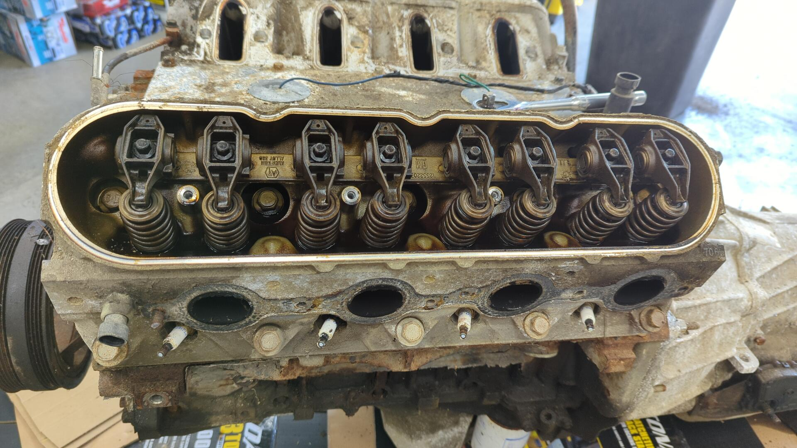
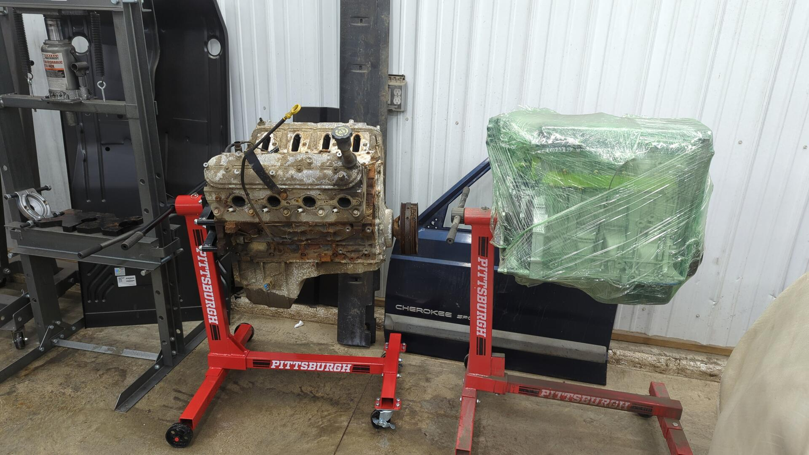
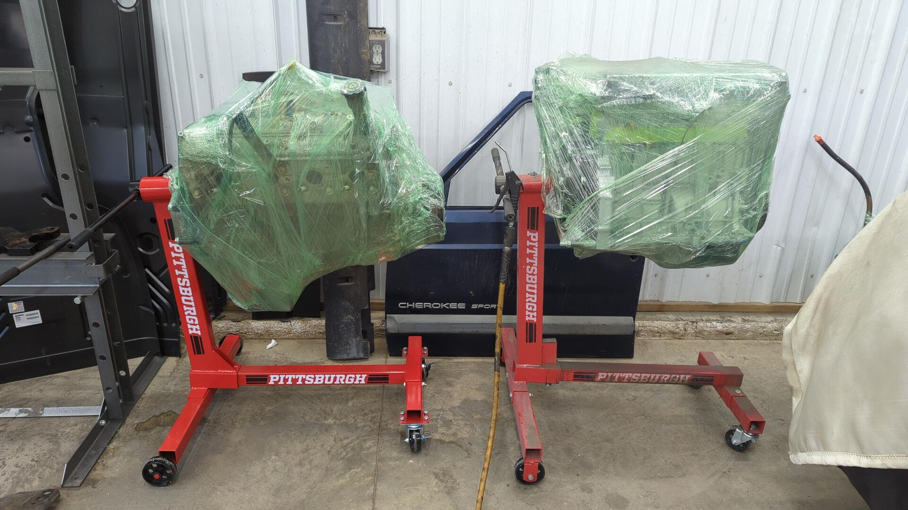

For the past year I've been daydreaming about a 6.0 LQ4 + 4L60E build but after seeing the prices of LQ4s I (the 6.0 tax is real) I decided to go with it's little brother the 5.3 LM7.

I wasn't actually in the market for an LS yet but my buddy had a couple trucks that were going to the junkyard the next day and offered to trade me an LS since he knew I wanted one. I couldn't resist a deal like that so we ended up pulling the motor.

The motor was pulled from a 2002 Chevy Silverado 1500 and I've confirmed it's a 5.3 by checking for dished pistons via a borescope down one of the spark plug holes.

As soon as I got it home I began removing all the parts I didn't want. All of the accessories were pulled since the truck brackets won't fit in my XJs engine bay. The crank pulley will likely need to be swapped as well but I left it for ease of rotating the motor in the meantime.

The truck didn't have a hood so some leaves and debris got in the engine bay.

Two of the exhaust manifold studs came pre-snapped. Looks like someone's worked on the exhaust at some point.

With the transfer case still attached this is one crazy long drivetrain.

All bare.

While removing the exhaust headers I managed to snap one bolt so that puts the total at 3 snapped bolts. Two of the snapped bolts are sticking out but one snapped about halfway down the hole and may be tricky to remove.

Passenger side.

The brackets on the transmission have seen better days. Good thing I won't need then.

I found out the hard way how much fluid was still in the transmission after removing the transfer case. The transmission drain bolt was stripped and I figured there wasn't much fluid in the transmission but that turned out to be a mistake.

It took 20lbs of kitty litter to clean up all the fluid.

While prepping to split the motor from the trans I couldn't resist peeking under the valve cover. I was very surprised to see how clean it was.

Several bell housing bolts and fly wheel bolts later the motor was finally free from it's transmission.

Officially mounted on the engine stand. I used 4 m10x1.5x90mm bolts.

It's gonna sit next to my B20B for awhile.

Since I won't be ready for this motor for about 6 months I wanted to give it a quick cleaning before setting it aside.

Using a screw driver and vacuum I removed all of the loose paint, dirt, and grime from the block.

I also removed all 3 of the snapped exhaust studs. The two that were protruding from the block were able to be removed using vice grips, and the one that snapped halfway in the hole was [removed by welding on it until enough weld was sticking out to grab it with vice grips](https://www.youtube.com/watch?v=1bZyw3OSIgk).

With the motor all cleaned up I wrapped it up so nothing would get in the exposed ports while it sits for the next 6 months or so.

I don't have a great spot to leave the transmission yet so it's sitting behind my Civic for now.

In terms of plans for the motor I'm not going to go too wild.

I'm thinking a mild cam (212/218 low lift) to try and bump it up to the 300hp mark and a LS6 intake so it'll fit underneath the hood of my XJ. Beyond that I'll be replacing all of the seals + gaskets and giving the block a fresh paint job. I want something that looks OEM-ish in the Jeep so I'm imaging silver paint on the block + heads and wrinkle black valve covers.

[Continue on to Part 2]()
