There's several options for transfer cases when LS swapping an XJ. Two of the more popular options are running the stock NP231 / NP242 with an adapter so it'll mate up to the GM transmission or use a GM transfer case such as the NP241 that can be adapted to work with the XJ's driveshafts.

Each choice has it's own sets of pros and cons and for my build I settled on a GM transfer case because I don't intend to run the stock Jeep gauges so it didn't matter if I still had the Jeep VSS (vehicle speed sensor).

# A New to Me NP241C

The engine and transmission (LM7 / 4L60E) I'm using for my LS swap came with a transfer case but it was a NP246 and that wouldn't work for my build since they're electronically shifted.

I needed something mechanically shifted like the stock Jeep transfer case and while perusing Craigslist I stumbled upon a seller with a NP241C out of a 92 Yukon that was exactly what I needed. A couple days later we met up and I was the new proud owner of a NP241C.

The NP241C came in multiple variations as they were made with 27 or 32 spline input shafts, short or long front output shafts, and driver side / passenger side drops. Most of the parts will swap between them so you can mix and match as needed but it's crucial you get a driver side drop case if it's going in an XJ.

The easiest way to identify the transfer case will be via it's tag.
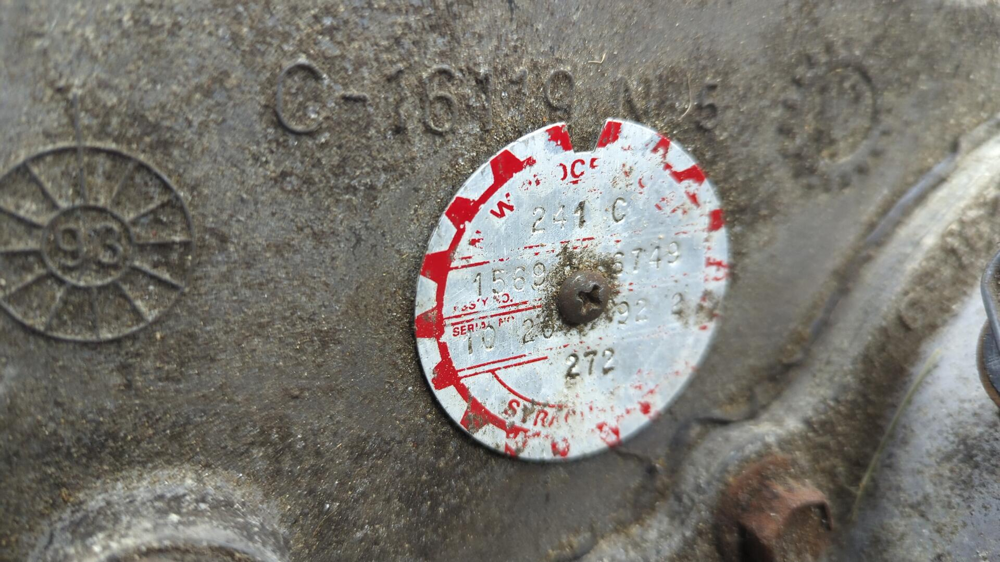

My NP241C came out of a half ton so it has the 27 spline input that works with the 4L60E transmission. It also has the goofy front yoke flange which means I have to convert it to a short yoke / short output shaft.

# Parts List

I'm not doing a full rebuild so this list shouldn't be considered complete but it's everything I used for my transfer case.

- Slip yoke eliminator (JB Conversions #16-1207-1945)
- Short front output shaft from a NP243 (used)
- Front output shaft seal (National 3946)
- Front output shaft bearing (National 207)
- Front input shaft seal (National 710928)
- Shift fork inserts (Transtar Industries 321840K)
- 32 spline 1310 CV Yoke (Crown 4856142)

## SYE

The NP241C comes with a rear slip yoke from the factory but it's way to long to fit in an XJ without destroying the rear driveshaft angle so you pretty much have to replace it with a SYE. Both JB conversions and Tom Wood's offer a SYE kit for the NP241C but I went with JB conversion because they offer the kit with a 1310 CV yoke.

## Short Front Output Shaft / CV Yoke

If you want to run a short yoke on the NP241C you need to have the short front output shaft to go with it. Mine had the long shaft so I bought a short shaft off Ebay. You can use [any short output shaft from the NP241C (driver or pass drop)](https://www.pirate4x4.com/threads/np241c-front-output-question.1583786/) or NP243.

Comparison of the short shaft (top) vs long (bottom)
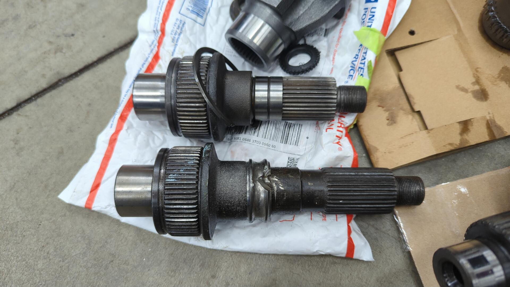

From there you can run a 32 spline CV yoke to work with the XJ driveshaft. The main thing to be careful about is ensuring the yoke's diameter matches your output seal. Some other options besides the Crown part # listed above: Spicer #2-4-5341, Advance Adapters 300475, JB Conversions #1942

## Misc Parts

The rest of the parts used are nothing special and were intended to replace worn out parts. The easiest option is to buy a master rebuild kit (RockAuto has some) but I wasn't interested in replacing everything since my transfer case was a known good unit.

# Teardown

I started off by removing the front yoke. The nut is a 1-1/8" and mine came off pretty easy using a stubby Milwaukee impact. The yoke on the other hand was completely stuck. I had to repurpose my harmonic balancer puller to put tension on it while I smacked the yoke with a hammer until it popped.

The rear output shaft looks silly long without the slip yoke housing.

Split apart.
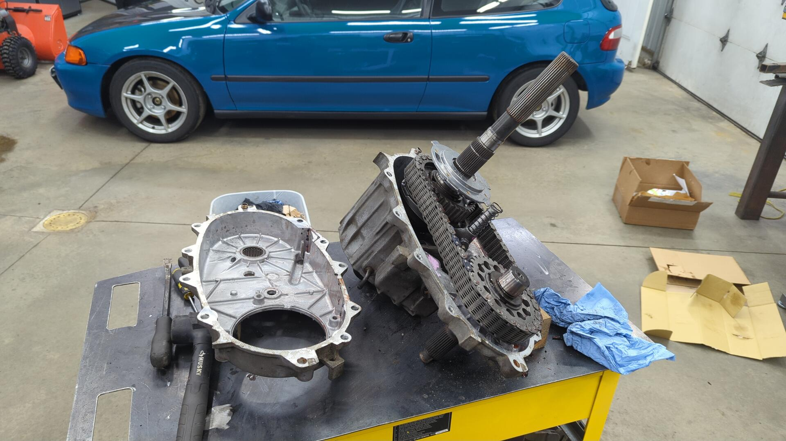

I ran into a snag trying to remove the front output shaft. For some reason mine was stuck and wouldn't budge even after a ton of hammering.
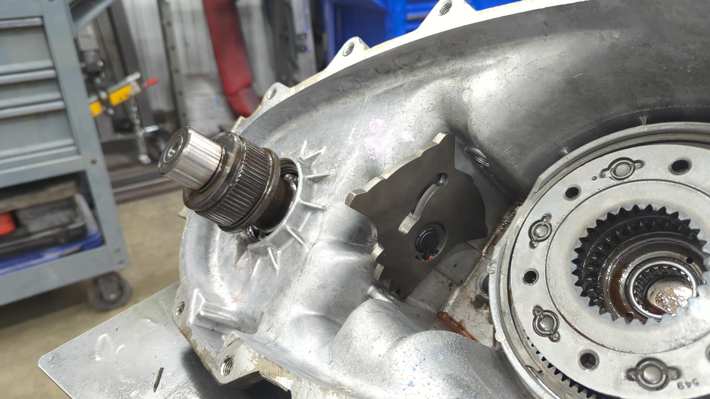

This isn't normal since the shaft isn't pressed onto the bearing and it should have just slid right out.

I ended up having to use a carbide burr on my die grinder to grind a notch into the bearing races so I could remove some of the ball bearing to free up the shaft.

It was a little sketchy grinding near the soft aluminum case but the only other option I had would have been to try and press out the shaft but I was worried I could crack the case doing that.

In the end I was able to remove the bearing and I gave the case a good cleaning to ensure there wasn't any debris left behind.

# Re-assembly

Prior to re-assembling everything I couldn't resist giving the exterior a fresh coat of paint.

I'm not building a show car by any means but I like painting things because it helps slow down corrosion.

New front output shaft bearing and seal installed. The bearing is held in place via a c clip and can be tapped into position with a hammer and bearing driver.
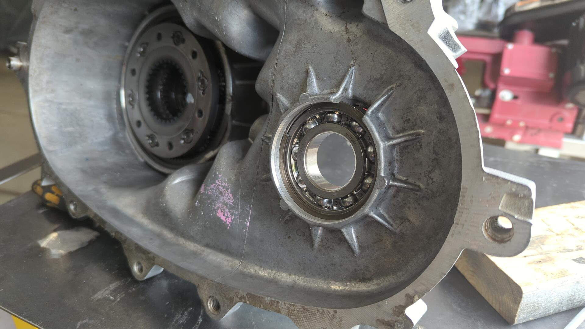

New (short) output shaft slides right in.

Then I had to take the gears off the main shaft so I could press out the bearings inside of them.

You have to do this because the JB conversions shaft is larger in diameter.

Old bearings removed and set aside.
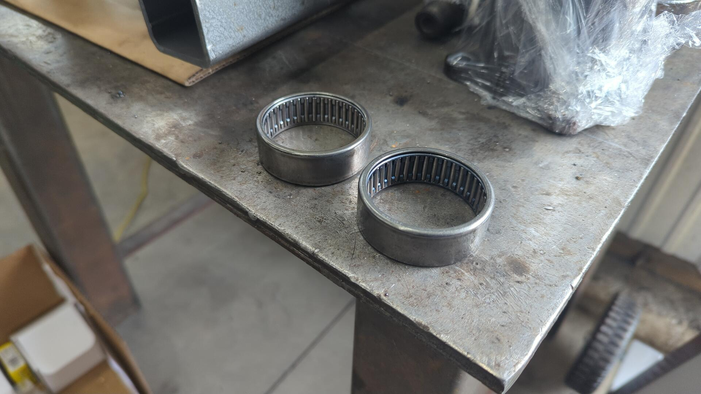

One last comparison of the new shaft (top) vs old shaft (bottom)

Gears installed with c-clip. Make sure you use the c clip that comes with the kit and not the original NP241C clip.
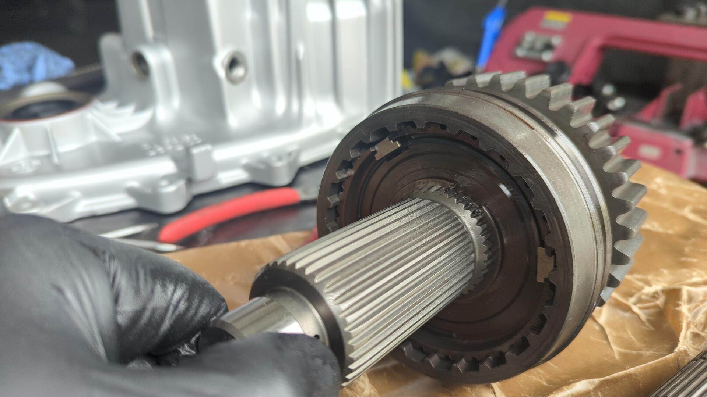

One of my shift fork pads had a crack so I replaced all 4 of them to be safe.
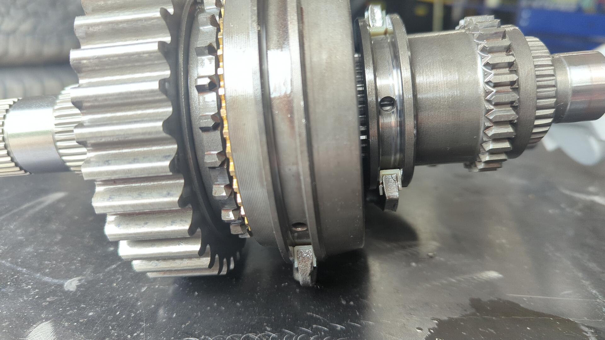

One of them doesn't match (it's curved) so I suspect someone else has been inside this transfer case before.

New inserts installed.
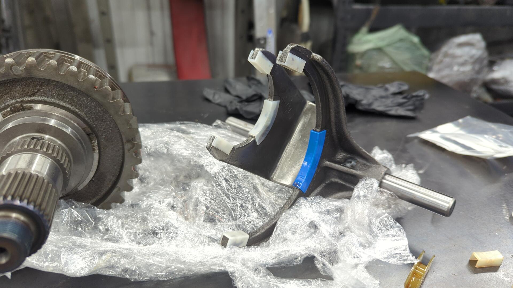

Main shaft and forks installed back into the housing.

Chain and front output gear re-installed. Don't forget the c clip that holds the front output shaft gear in place.
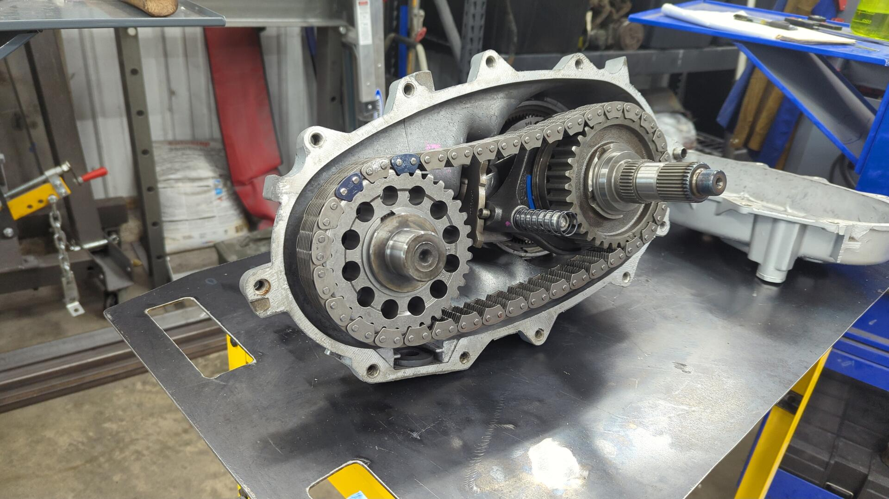

Oil pump and pickup tube in place.

Case all closed up. I torqued the bolts to 23 ft/lbs.

Confirmed the pickup tube was still in place on the oil pump.

While joining the case halves I goofed up and accidentally broke one of the positioning tabs off my oil pump. What had happened was I tried assembling the case with the oil pump on the inside when it was suppose to be on the outside and since there was enough space it caused a tab to snap off.

I've decided to run it as is since the oil pump still has three more tabs and that should be sufficient for ensuring it doesn't spin.

All that was left at this point was to install the speedometer gear / housing and the yokes.
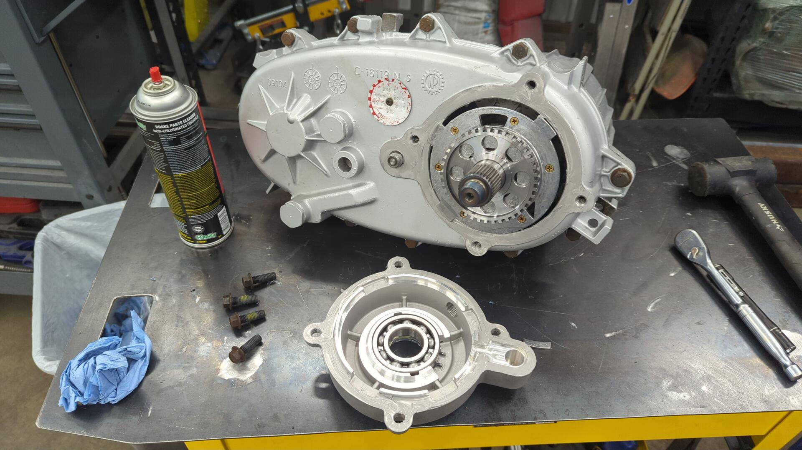

All done.
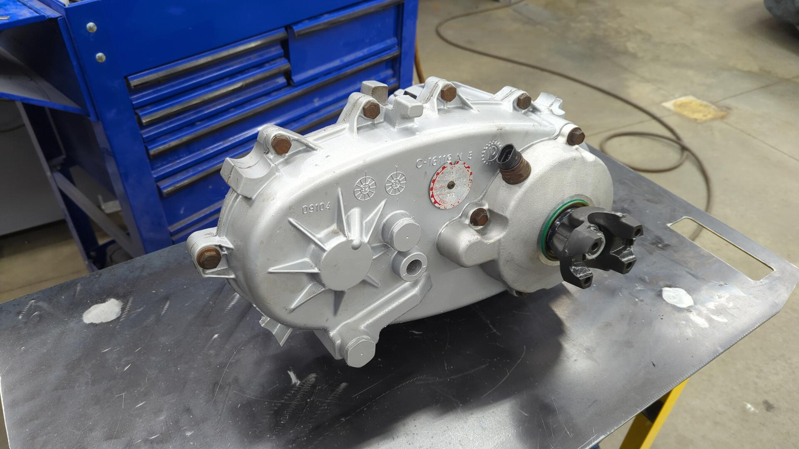

The transfer case is so much shorter now.

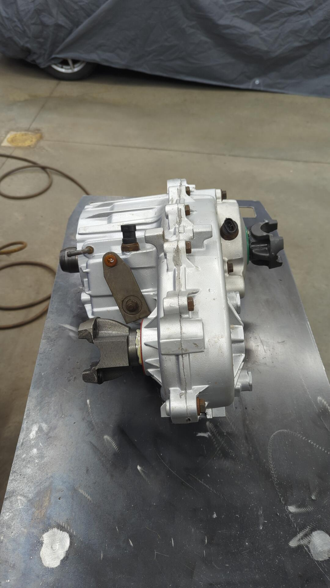

## References

- [LQ4 6.0L/NV4500/NP241c in an XJ - Q's before I waste a bunch of money :)](https://naxja.org/threads/lq4-6-0l-nv4500-np241c-in-an-xj-qs-before-i-waste-a-bunch-of-money.1119261/)
- [5.3L/4L80E/241 swap into 92 cherokee](https://www.pirate4x4.com/threads/5-3l-4l80e-241-swap-into-92-cherokee.809502/)
- [GM 5.3/4L60E/Klune/Stak 300](https://naxja.org/threads/gm-5-3-4l60e-klune-stak-300.945920/)
- [Budget LS Swap with Stock Hood and Truck Intake](https://comancheclub.com/topic/55153-budget-ls-swap-with-stock-hood-and-truck-intake/)
- [04 LJ Ls swap with GM NP241C/4L60E](https://www.rme4x4.com/threads/04-lj-ls-swap-with-gm-np241c-4l60e.121462/page-2)
- [241C disassembly](https://www.youtube.com/watch?v=ln8twrs9HNQ)
- [NP241C / NP231 transferase assembly/rebuild](https://www.youtube.com/watch?v=CEZuZIMk_gY)
