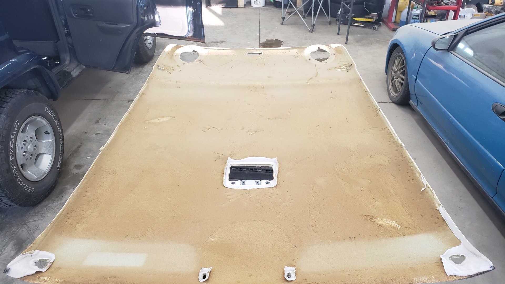
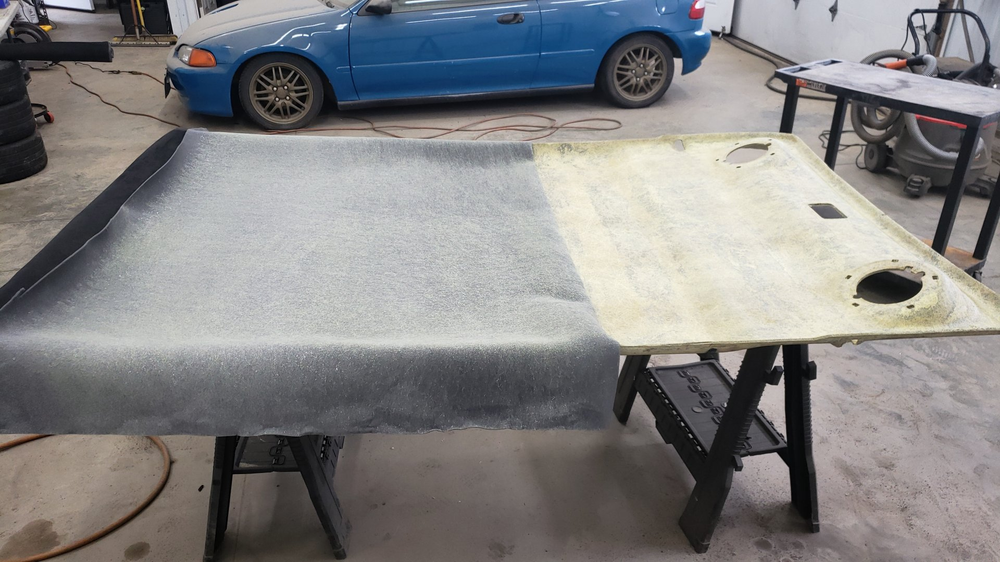
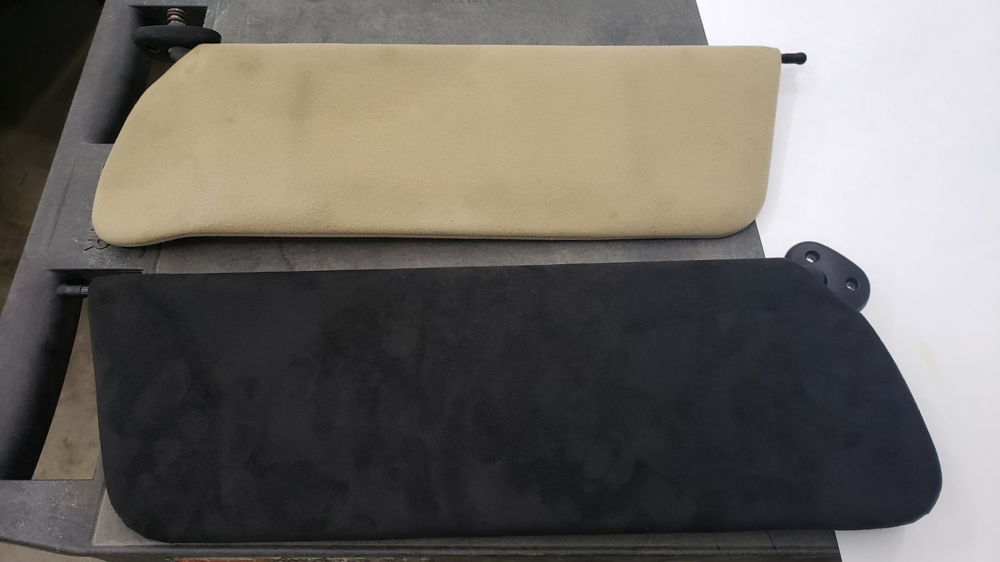
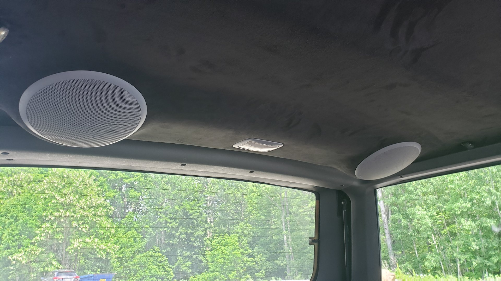

# Delaying the Inevitable

When it comes to my cars, I like to bunch up my repairs / mods into batches where I'll focus on one small sub-category of tasks before moving onto the next. I find this to be a great way to break down massive projects into manageable chunks, and is a technique I learned from my software career.

I've been putting off fixing the headliner for a **long** time now. Okay, well about 18 months give or take.

For my first two years of ownership the headliner was perfectly fine, and it wasn't in too shabby of a shape either. There was noticeable fading from the years, and a few small stains but nothing too crazy. However, during one of my annual interior details to make it not look like I live out of it, I decided to scrub out the stains in the headliner with a brush. The stains came out without a hitch, and the headliner looked nice all cleaned up.

It wasn't until a week later I noticed the headliner was drooping down a bit in several spots that coincided with where the stains used to be. At first it was nothing major, as the largest of the sagging spots was only about 4 inches in diameter, but over the following weeks they slowly grew larger and larger.

By the time the headliner was sagging enough to touch my head while driving I finally admitted to myself that I couldn't ignore the issue anymore. Unfortunately, I didn't really have a lot of spare time to fix the headliner correctly so I opted for a band-aid "fix".

Using a utility knife I cut off all of the fabric I possibly could from the headliner. I'd estimate I was able to remove about 99% of the fabric, except for a few small patches around the sun visors, and dome lights. The headliner looked atrocious as it was nothing but brownish green foam on a fiberglass backing but at least it wouldn't tickle my head while driving

Cue 18 months later when I decided it was time to make the interior more presentable. It was finally time to make a swaggin suede black headliner.

# The Preparation

Removing the headliner from the Jeep wasn't that difficult, and it only took about 1 hour from start to finish. I watched a [Youtube video](https://www.youtube.com/watch?v=weGdaSjK8Rs) to prepare, and the process can be summarized as removing the dome lights, grab handles, and pillar trims. Upon doing so, the headliner should be able to pop right out.

That brown stuff is 20 year old foam that has turned extremely brittle. The original headliner fabric is foam backed to help give it a plush feel, but as time progresses the foam and fabric tend to separate. All of the foam needs to be removed before the new fabric can be glued down, or else our new headliner material will be destined to the same fate.

A carpet scrubbing brush attachment on the drill made quick work of it.

I'd highly recommend wearing gloves when doing the headliner as the backing is made of fiberglass. That is, unless you enjoy itchy hands.

# Sticky Situations

If you have access to an air compressor and are comfortable using a spray gun, stay away from the spray can adhesive. The adhesive in them is prone to failing when exposed to high temps (windows up during the summer), and the cost can add up faster than you expect if you need several cans.

I didn't listen to this advice at first because I was feeling lazy, and I didn't want to get overly complex doing this project, and thought a can or two would be good enough. That wasn't a good move. To make matters worse, I sprayed too much causing the adhesive to soak through the fabric ruining the first batch of fabric. Oops.

## Use What The Pros Use

After messing up my first attempt I spent some time trawling various automotive upholstery forums looking for advice. The most common recommendation I came across was to use [Weldwood Landau Top & Trim High Heat Resistant Contact Cement](https://www.dap.com/products-projects/product-categories/adhesives/contact-cement/landau-top-trim/).

It's a liquid adhesive that needs to be sprayed via a gun but a [Harbor Freight HVLP spray gun](https://www.harborfreight.com/painting/paint-sprayers/20-oz-hvlp-gravity-feed-air-spray-gun-62300.html) is more than sufficient.

Since it's only sold in bulk you'll have buy a gallon of it, but even after buying the gallon, and spray gun your at about the same cost (~75) as 3 cans of the adhesive.

# Finally Making Progress

I broke spraying the adhesive onto the headliner backing and fabric into two parts as I was worried I'd make a mistake trying to do it all at once.

To get things ready I laid the headliner backing on a flat surface, and draped the fabric over the top of it. If you fabric is larger than needed you'll want to cut any excess that hangs more than 6 inches off from the edges of the headliner backing.

Then I folded half of the fabric back such that half the headliner board was exposed, and sprayed both the headliner backing, and the backside of the fabric with adhesive. Contact cement can only properly adhere to itself once tacky so you **must** spray both sides.

Then you need to wait about 5 to 10 minutes or until the cement gets tacky. **This step is essential or else you risk the adhesive soaking through the fabric.** Once the cement is tacky you can begin to join the two surfaces.

Carefully lift the fabric ensuring you don't let it touch against itself or else it'll stick together and gently rest it over the headliner backing. The cement won't form a permanent bond until pressure is applied.

Starting from the center, use a roller or your hand and slowly press the fabric into the backing. This will cause the contact cement to bond and securely attach the fabric to the headliner.

By starting in the center, it lets us pull out any slack from the fabric to prevent creases. It's best to really take your time on this and do it slow because any mistakes left behind will be permanent, and highly noticeable.

If there are any holes in your headliner for speakers, lights, etc you'll want to cut them out with a utility knife. Make sure you leave enough fabric so that it can be wrapped up around the edges of the holes and glued to the backside. This prevents any seams from showing.

Any excess fabric that overhangs the headliner should be trimmed down and glued to the back side of the headliner backing.

# New Sun Visors

The original sun visors in my Jeep had vanity mirrors but I opted to not re-use them because the lights on the mirrors were broken. Petty, but I didn't really use them, and didn't want to leave broken parts on the Jeep.

I picked up the only set of visors without mirrors that I could find on Ebay after watching for two weeks.

Fun fact: the visors can be split apart like a clam by releasing the tabs in them. [BleepinJeep](https://www.youtube.com/watch?v=14jq0tvVSn8) has an excellent video on how to take them apart.

Once they're split, you can take off the fabric and use it as a template for the new fabric. Both sun visors are the same so you can reuse the template from one side as the other.

Comparison shot of the original tan vs my black suede.

Both sides done.

# The Finishing Touches

I ended up turning things up to 11 and bought a new front dome light housing, rear cargo light housing, and rear speaker grills. Originally, my Jeep had a light tan headliner so all of the plastic up there was tan as well. Not wanting things to look off, I picked up all the appropriate pieces in gray.

[The rear view mirror is a GenTex 177 I swapped in from a GM truck]()

## LEDS

I also replaced all of the cargo / dome lights with leds. Some of them were ordered from VLeds, and the others were ordered from SuperBrightLeds.

### Bulb Sizes

| Location             | Size | Quantity |
| -------------------- | ---- | -------- |
| Front dome light     | 561  | 1        |
| Front map lights     | 194  | 2        |
| Rear cargo light\*\* | 211  | 1        |

\*\* The factory service manual recommends a 561 for the rear cargo light but it won't actually fit. You need a 42mm (or shorter) festoon. A 211 fits perfectly.

## Sound Deadening

While the headliner was out, I took the opportunity to add Noico 80mil sound deading to the underside of the roof. I did this to help with highway wind noise as I like to have a roof rack.

# In Summary

Overall, I'm very pleased with how things came out. Even though I messed up a couple tries and wasted some $$$, I'm glad I took the time to redo things as the quality of work severely improved with each attempt.

The LED lights are an _excellent_ touch to the black suede.

Replacing the headliner has also made the interior look substantially better. Once I wrap up a few leaks in the rear, and install new floor pans in the passenger area (oh the life of an XJ owner) I plan on splurging on a new carpet to replace the stained and beat up one currently in it.

## Random Tips

- Be extra careful removing some of the interior panels in order to remove the headliner as they have clips that can break off easily
- 4 yards of fabric is enough to do the headliner, and sun visors
- Stetchy fabric makes your life easier.
- I ordered the suede and adhesive from [YourAutoTrim](https://www.yourautotrim.com/suheobl.html)
