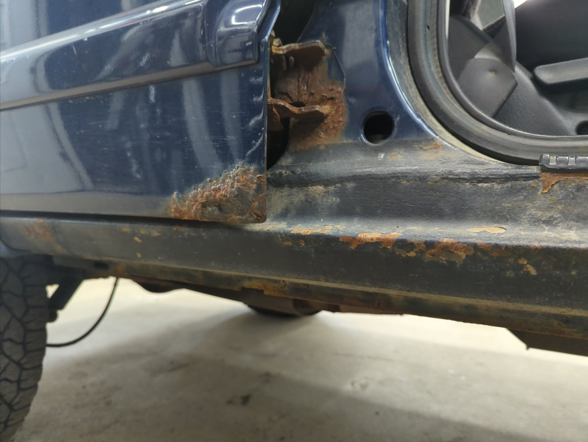
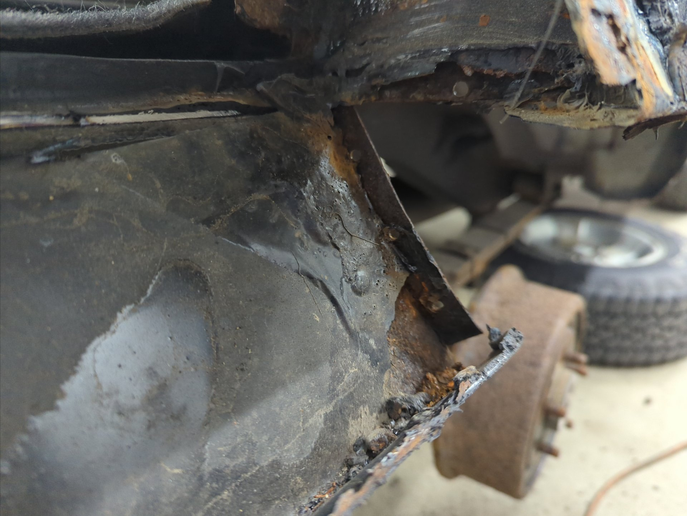
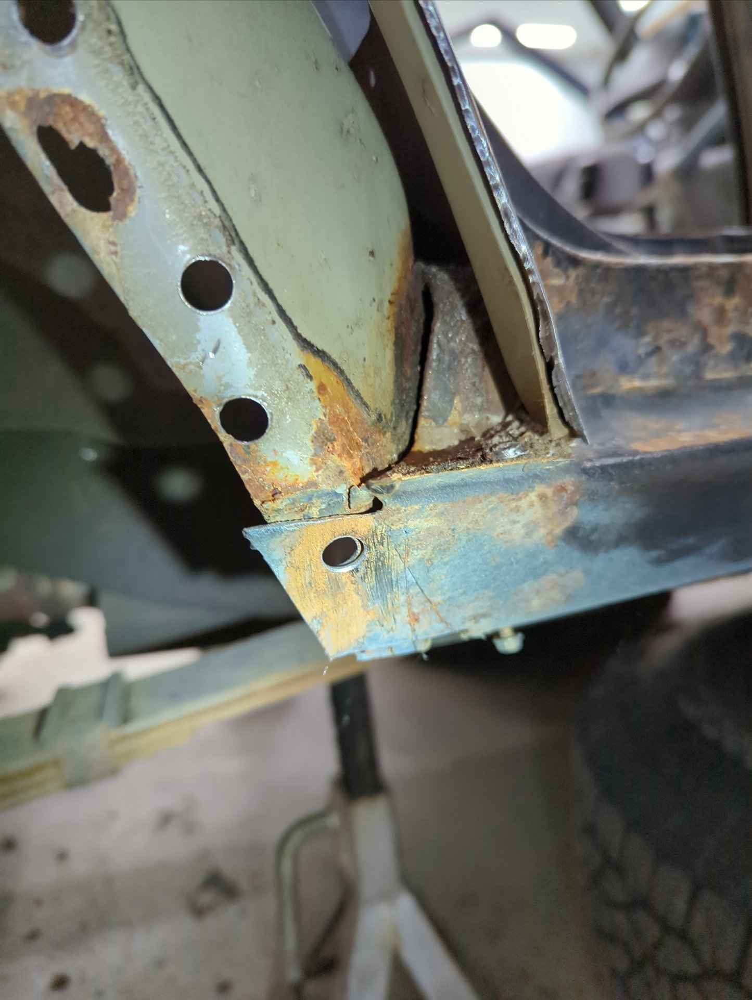
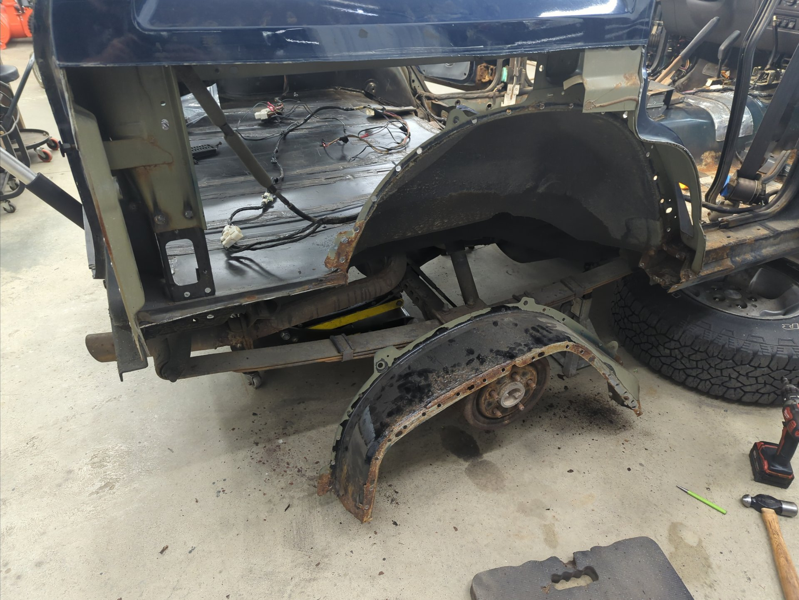
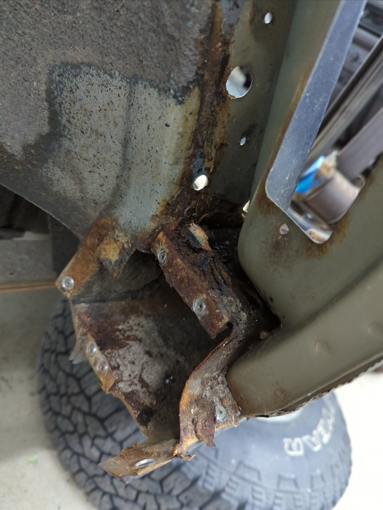
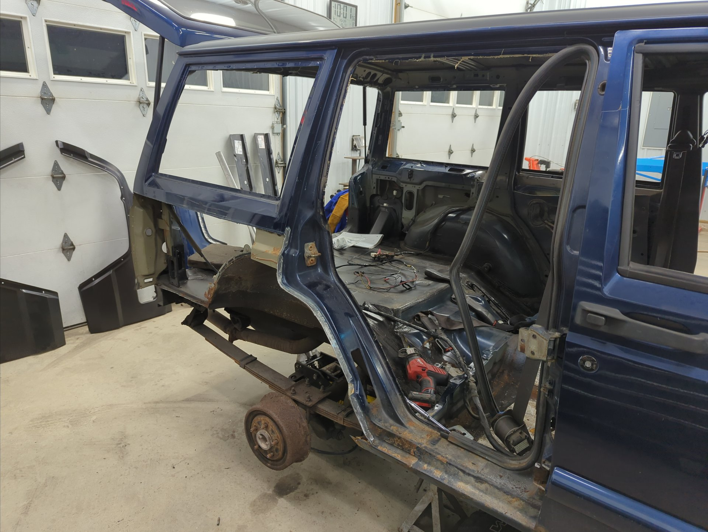
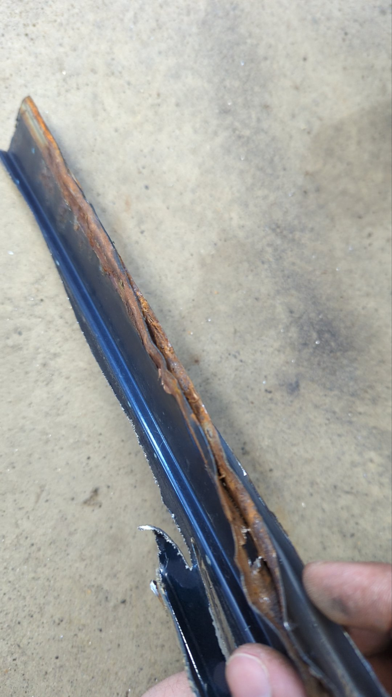
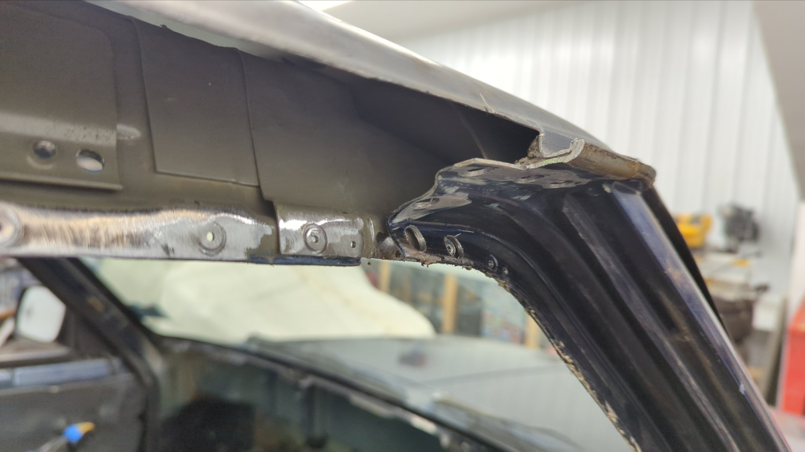
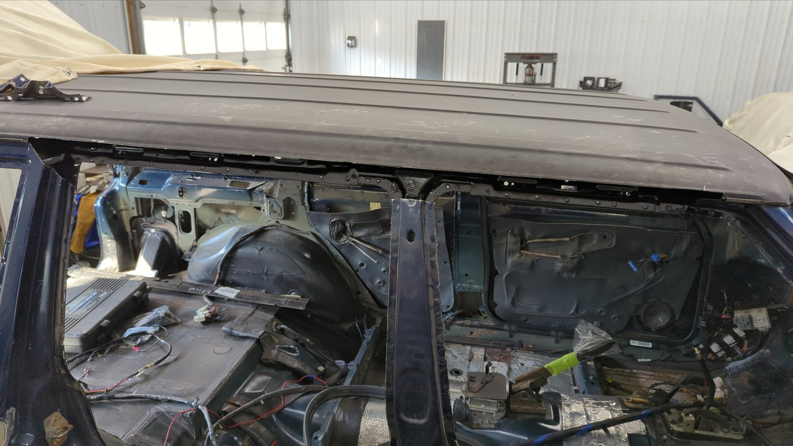
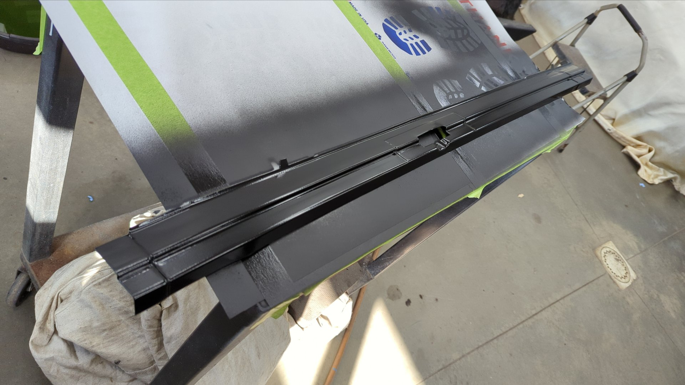

Just shy of two years ago now, [I embarked on the largest rust repair job I've ever done on my XJ.]() It took me several months, but I was able to replace the entire rear cargo floor including the crossmembers, gas tank bracing, and unibody frame rails along with welding in rear frame stiffeners over my newly made frame rails.

While that repair didn't remove all of the rust the Jeep had back then, I had run out of time to continue working on it because I desperately needed to put the Jeep back on the road so I could drive it.

I've been wanting to tear back into the Jeep for awhile now because I've had this project stuck in the back of my mind, and I'm pretty excited that the time has finally come to start on it.

I don't have a solid timeline or plan yet but I've got most of the hard to source parts already on hand.

I fully expect some scope creep to occur and I'll probably add a couple other things but so far I'm hoping to:

- Replace both drip rails above the doors and patch a hole in the roof
- Replace both rear quarters and inner wheel wells
- Replace outer and inner rockers and weld in 2x6 steel for extra strength
- Replace all 4 doors
- Replace rear door hinges
- Replace the rear hatch (mines dented up bad)
- Replace driver / passenger floor pans
- Fix any rust holes in the firewall
- Fabricate a new charcoal canister bracket
- Replace all the brake / fuel lines
- Chrysler 8 1/4 rear axle swap
- Entirely new exhaust from the headers back (will be making a custom 304 stainless setup)
- Repaint the entire Jeep white (since next to none of the original paint will remain)

It'll take awhile to do, and I don't have a solid timeline in place yet, but I'm confident I can do it.

Two weeks ago I drove my Jeep into the shop to get started.

# Rust Rust Rust

There's a ton of rusty spots on this Jeep, and with how it slowly spreads like a disease, I suspect the only proper way to save it, is to bite the bullet and address it all at once.

All 4 doors are rusted pretty heavily on the inside. Given how hard it is to remove rust from a pinch weld I'm not going to bother to save these doors. I've already sourced all 4 doors from 3 different states (two from New York, one from New Jersey, and one from Arizona) and have begun fixing them.

Rocker panels are rusting out again. The first time I replaced them a few years ago I wasn't able to remove all the rust which is why it came back.

The rear door hinges are done for. My plan for these is to cut off the old hinges along with the rusted metal, weld in patches, and weld on new OEM hinges I've already got on hand. I'll also be adding some bracing around the hinges because the XJs unibody is notorious for cracking around the hinges.

I've found it's next to impossible to stop the leaks on the pinch weld where I cut my quarter panels. I've given up trying to save these and figure I'm better off going back to a more stock like setup with new quarter panels.

The drive side quarter panel has two rust spots below the quarter window seal.

Some more rust on the passenger quarter panel.

The passenger quarter panel has a leak on that pinch seam and it's causing the cut n fold panels I made to rust out.

Passenger side rocker panel is even worse.

The rear inner wheel wells are rusting out as well. I covered them with POR15 to buy me some time but I don't think it actually made a difference.

Rust on the inside of the driver side quarter panel is just starting to reach my floor. I'm hoping it didn't get to the new metal yet otherwise my newish floor is gonna have to be patched.

# The Tear Down

Not wanting any of my interior to get damaged from flying sparks while doing any metal work I decided I should completely remove all of it.

The first part of the interior I removed was the headliner.

And after that I removed both rear quarter windows. I normally like to use the string method, but I didn't have any on hand so I ended up using a bunch of flat head screw drivers to hold the gasket and pushed the windows out from the inside.

Rear fender flares removed.

All 10 nuts holding the metal brackets for the fender flares snapped right off when I tried to remove them.

At this point I couldn't resist cutting off the rear quarter panel cover I made because I wanted to see how things looked.

Lots of rust had built up under the paint by the wheel well.

XJ looking pretty bare.

Then I decided I wanted to remove the passenger quarter panel so I could assess how everything looked underneath. Using my grinder I removed the paint on the rear seam behind the taillight to hunt for spot welds.

After drilling out the spot welds and some cutting later I had a bare quarter panel.

Overall the quarter panel itself wasn't too rusty but there was just no way I'd be able to replace the inner wheel well without removing it. Plus I knew there was probably a bunch of rust in the pinch weld that would never come out otherwise.

With no quarter panel this seems like the perfect time to address some rust on the backside of some bracing by the hatch. Those weld marks are from when I spot welded the lower bracket back in place

Yeah, gonna need to replace the entire outer half of the inner wheel well.

With my curiousity satisfied I got back to work removing the interior.

Next up was to remove the carpet, and also the center console.

Looks like the carpet was hiding a ton of rust.

Tearing down isn't very fun so I ended up caving and decided to try to remove the outer wheel well. When drilling out spot welds I like to drill a tiny pilot hole that help keep the spot weld drill bit centered.

I almost missed the bottom spot weld because it was hidden by factory seam sealer. They certainly don't skimp on that stuff!

On the other side of the wheel well down by the rocker panel there's 6 more spot welds.

And one more that connects the other edge of the rocker panel.

And presto!

If I cut out any more structure on the quarter panel I'm gonna need to weld in some bracing to prevent things from getting out of alignment.

It's kinda cool being able to look down the inside of the rocker panel. [You can see the backside of the patch I welded in a few years ago]().

There was a lot of heavy rust hidden behind the wheel well by the rocker panel.

After that I removed the rear door on the passenger side because I wanted to get ready for when I started working on the rocker panel.

The bolts on the bottom hinge wouldn't budge so I ended up having to cut the hinge in half. If you look close you can see that the weld at the top of the hinge has broken free at this point.

Plenty of room to fix the rockers now.

With no more metal to remove I figured it was time to finally remove the dash.

One of several rusted spots on the firewall I need to fix.

I've never had the Jeep this torn down before. I always make sure to bag up any bolts I remove and label them. I also take a ton of pictures for reference later on.

Hey look! More patches I made.

It's hard to photograph because of the lighting but the edges of the roof above the doors are fairly rusted too.

I've had a set of OEM drip rails sitting on my shelf for a few years now. One of them I purchased as NOS (new old stock) off Ebay and the other was the very last unit in stock on mopar.com

Removing the original passenger drip rail ended up being extremely more difficult than I anticipated. There's roughly 40 spot welds holding it in place and the drip rail is sandwiched in place between the pillars and the roof. I really didn't want to cut part of the roof off but I ended up having no other choice.

It most definitely did not come off in one piece!

Lots of rust in the pinch weld.

At least the chassis itself was fairly rust free. A quick pass with the die grinder cleaned everything up quite nicely.

And two coats of epoxy later and we've got things looking good again.

I also scuffed down the backside of the drip rail so I could coat it with epoxy as well. This side is going to be hidden with no way to access it once it's welded back on.

That's it for progress right now. I'm stuck waiting until next week because I need a new metal brake before I can proceed any further. I got tired of fiddling with my Harbor Freight metal brake, and decided it was time to invest in something nicer. It should be perfect for my needs and I'm super excited for it!

[Continue on to Part 12]()
